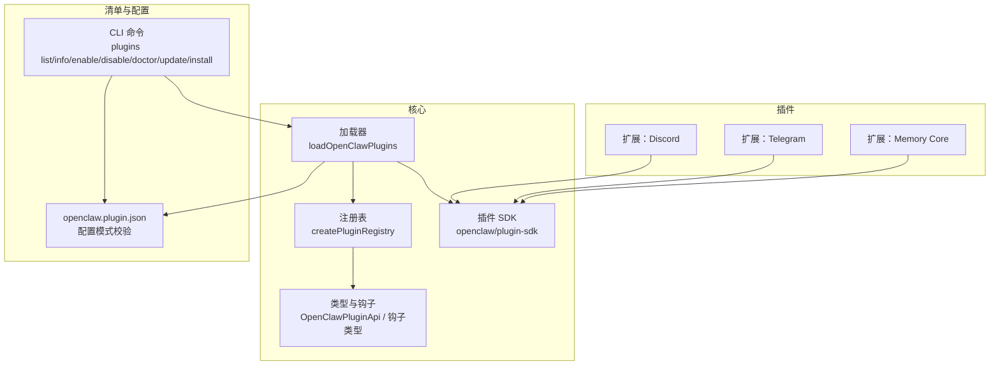
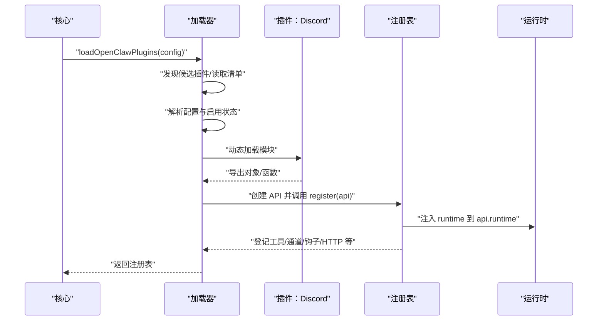
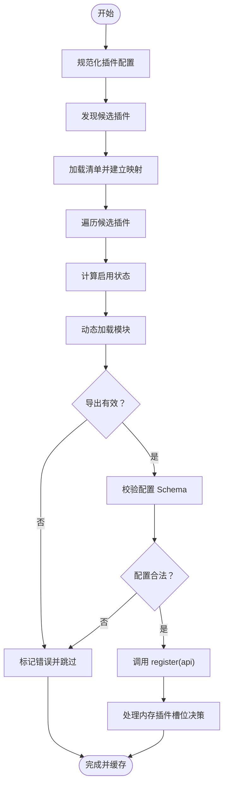
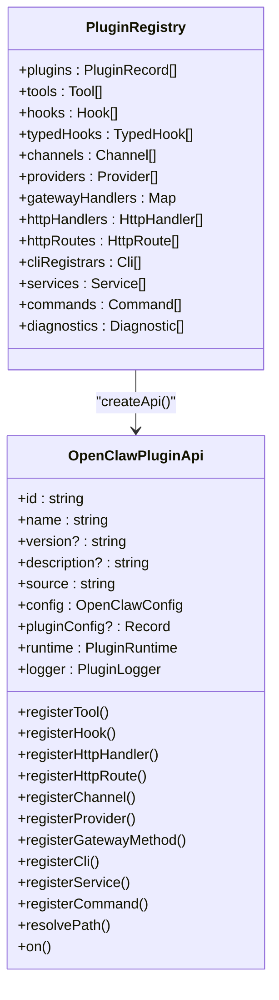
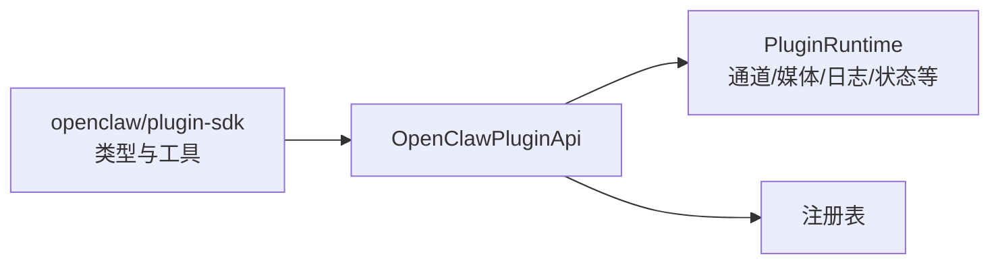
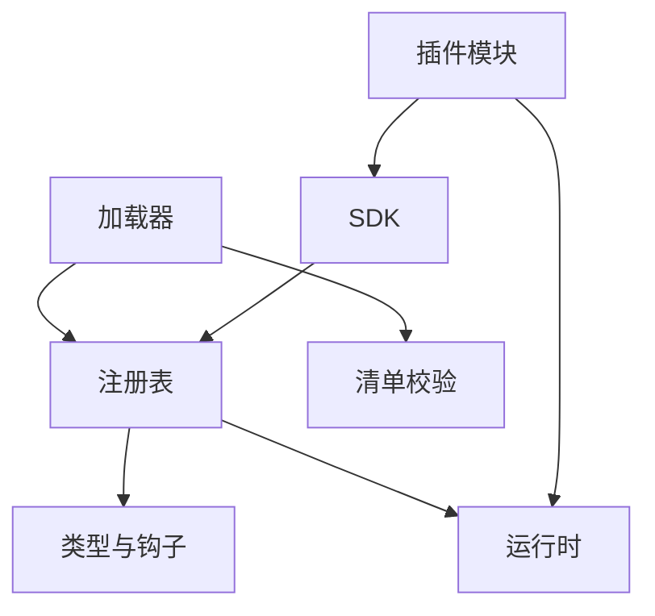

# 插件开发

## 目录
1. [简介](#简介)
2. [项目结构](#项目结构)
3. [核心组件](#核心组件)
4. [架构总览](#架构总览)
5. [详细组件分析](#详细组件分析)
6. [依赖关系分析](#依赖关系分析)
7. [性能考量](#性能考量)
8. [故障排查指南](#故障排查指南)
9. [结论](#结论)
10. [附录](#附录)

## 简介
本指南面向希望为 OpenClaw 开发插件的开发者，系统讲解插件架构设计、开发框架与扩展机制，覆盖插件 API 规范、生命周期管理、事件系统、加载与依赖管理、版本兼容性、最佳实践、开发示例、调试技巧与发布流程，并提供插件模板与脚手架工具的使用说明。

## 项目结构
OpenClaw 的插件体系由“SDK + 运行时 + 加载器 + 注册表 + 清单校验”构成，插件以模块形式存在，通过统一的插件 API 注册能力并由核心加载器按配置进行发现、验证、加载与初始化。

## 核心组件
- 插件加载器：负责发现候选插件、读取清单、解析配置、动态加载模块、调用 `register` 并构建注册表。
- 插件注册表：集中管理插件记录、工具、通道、提供者、网关方法、HTTP 路由、命令、服务、钩子等。
- 插件 API：插件通过该 API 注册各类能力；同时通过 runtime 访问核心运行时能力。
- 插件 SDK：稳定、可发布、无副作用的类型与工具集合，约束插件开发边界。
- 插件清单：每个插件必须提供 `openclaw.plugin.json`，内含 `id`、`configSchema` 等字段，用于严格配置校验。

## 架构总览
下图展示插件从发现到注册的端到端流程，以及与运行时的关系。

## 详细组件分析

### 组件A：插件加载器（Loader）
职责与流程要点：
- 解析配置，构建缓存键，支持缓存命中。
- 发现插件候选（本地路径、工作区、打包目录），读取清单并建立映射。
- 动态加载模块，解析默认导出或具名导出，调用 `register`。
- 对插件导出的 `id`/`kind` 与清单进行一致性校验。
- 验证插件配置（基于清单中的 JSON Schema），失败则记录诊断并标记错误。
- 处理“内存插件槽位”选择逻辑，仅允许一个 `kind=memory` 的插件被启用。
- 初始化全局钩子运行器，设置当前注册表。

### 组件B：插件注册表（Registry）
职责与能力：
- 统一登记插件记录（工具、钩子、通道、提供者、网关方法、HTTP 路由、CLI、服务、命令）。
- 提供 `createApi`，向插件暴露安全的 API 表面（不直接导入核心源码）。
- 校验重复注册（如 HTTP 路由、提供者、命令等），并记录诊断。
- 支持“生命周期钩子”注册（typed hooks），按优先级排序。

### 组件C：插件 API 与运行时（SDK + Runtime）
- SDK：提供类型、配置模式工具、通道适配器、工具参数辅助、文档链接等，确保插件不直接导入核心源码。
- 运行时：通过 `api.runtime` 暴露核心运行时能力（通道文本处理、回复派发、路由、配对、媒体、提及、群组策略、防抖、命令授权、日志、状态目录等），插件只能经由运行时访问核心行为。
- 版本与兼容：SDK 语义化版本，运行时随核心版本发布；插件声明所需运行时范围。

### 组件D：插件清单与配置校验
- 每个插件根目录必须提供 `openclaw.plugin.json`，包含 `id`、`configSchema` 等。
- 即使空配置也必须提供 JSON Schema；缺失或无效将阻止加载并触发 Doctor 报错。
- 清单还用于声明 `kind`、`channels`、`providers`、`skills` 等元信息，便于发现与校验。

### 组件E：插件示例（渠道/内存插件）
- 渠道插件（Discord/Telegram）：在 `register` 中设置运行时并注册通道插件。
- 内存插件（memory-core）：注册工具（搜索/获取）、注册 CLI 子命令，使用 runtime 工具创建器。

### 组件F：运行时注入（以 Signal 插件为例）
- 插件内部通过 `setXxxRuntime` 将 `api.runtime` 注入到自身模块中，供后续使用。
- 若未初始化即使用，会抛出异常提示。

## 依赖关系分析
- 插件对核心的依赖通过 SDK 与运行时解耦，避免直接导入 `src/**`。
- 插件间无直接耦合，能力通过注册表统一管理。
- 插件清单与配置校验在加载前完成，确保运行期稳定性。

## 性能考量
- 缓存：加载器支持基于配置与工作区目录的缓存键，避免重复扫描与加载。
- 异步注册：`register` 返回 Promise 将被忽略，建议同步完成注册逻辑。
- 防抖与批处理：运行时提供入站防抖器，减少高频消息处理开销。
- 路由与配对：运行时提供路由与配对能力，降低插件重复实现成本。
- 建议：插件应尽量延迟初始化重型资源，按需加载；合理使用工具工厂与上下文参数。

## 故障排查指南
常见问题与定位方法：
- 插件未加载/报错
  - 检查 `openclaw.plugin.json` 是否存在且包含有效的 `configSchema`。
  - 查看 Doctor 输出与诊断列表，确认错误级别与插件 ID。
- 启用状态不符
  - 检查 `plugins.entries`、`plugins.allow`、`plugins.deny`、`plugins.slots` 的配置是否正确引用已发现的插件 `id`。
- 内存插件冲突
  - 当多个 `kind=memory` 插件存在时，仅允许一个被选中；检查 `plugins.slots.memory` 的值与实际 `id` 匹配情况。
- 注册重复或冲突
  - HTTP 路由重复、提供者 `id` 重复、命令名称重复均会被拒绝并记录诊断。
- 运行时未初始化
  - 若插件内部使用 `api.runtime`，请确保在 `register` 中已设置运行时（例如 `setXxxRuntime`）。

## 结论
OpenClaw 的插件系统通过“SDK + 运行时 + 统一 API + 清单校验 + 注册表”的设计，实现了稳定的扩展能力与清晰的边界。遵循本文档的规范与最佳实践，开发者可以快速构建高质量的渠道、技能、内存与提供程序插件，并在保持与核心解耦的前提下获得一致的运行体验。

## 附录

### 插件 API 规范与生命周期
- API 表面：插件通过 `OpenClawPluginApi` 注册工具、钩子、HTTP 处理器、通道、提供者、网关方法、CLI、服务与命令。
- 生命周期钩子：支持 `before_agent_start`、`agent_end`、`message_*`、`tool_*`、`session_*`、`gateway_*` 等钩子，按优先级排序执行。
- 运行时访问：所有核心行为通过 `api.runtime` 提供，插件不得直接导入 `src/**`。

### 插件加载机制与依赖管理
- 发现与装载：加载器根据配置与环境变量（如 `OPENCLAW_BUNDLED_PLUGINS_DIR`）发现插件，动态加载模块。
- 依赖与别名：加载器可解析 `openclaw/plugin-sdk` 的别名，确保在不同运行环境下都能正确引用 SDK。
- 依赖管理：插件通过清单声明 `channels`/`providers`/`skills` 等，Doctor 会校验未知引用。

### 版本兼容性与迁移计划
- SDK：语义化版本，发布稳定 API。
- 运行时：随核心版本发布，未来将引入版本范围声明与兼容检查。
- 迁移策略：分阶段替换桥接代码，最终禁止 `extensions/**` 直接导入 `src/**`。

### 不同类型插件的开发方法
- 渠道插件
  - 在 `register` 中设置运行时并调用 `api.registerChannel` 注册 `ChannelPlugin`。
  - 示例参考：Discord、Telegram。
- 技能插件
  - 通过 `openclaw.plugin.json` 的 `skills` 字段声明相对路径，由核心自动加载。
- 内存插件
  - 声明 `kind: "memory"`，在 `register` 中注册工具与 CLI，使用 runtime 工具创建器。
- 提供程序插件
  - 实现 `ProviderPlugin` 接口，注册认证方法与模型配置，通过 `api.registerProvider` 注册。

### 开发示例与调试技巧
- 开发示例
  - 渠道插件：参见 Discord/Telegram 的 `index.ts` 与 `openclaw.plugin.json`。
  - 内存插件：参见 memory-core 的 `index.ts` 与 `openclaw.plugin.json`。
- 调试技巧
  - 使用 `openclaw plugins doctor` 查看诊断与错误。
  - 使用 `openclaw plugins list/info/enable/disable/update` 完成插件生命周期管理。
  - 在 `register` 中打印必要日志，结合运行时日志开关定位问题。

### 发布流程与脚手架工具
- 发布
  - 插件需提供 `openclaw.plugin.json` 与有效的 JSON Schema。
  - 可通过 npm 或归档包安装；支持 `--link` 选项将本地目录加入加载路径。
- 更新
  - 仅对已跟踪的 npm 安装生效；支持单个与批量更新。
- 脚手架
  - 使用 CLI 命令 `openclaw plugins install <path-or-spec>` 安装插件。
  - 使用 `openclaw plugins install -l ./my-plugin` 链接本地目录（不复制）。