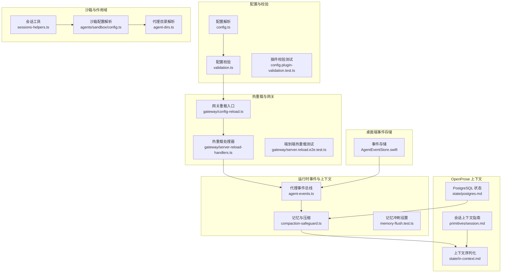
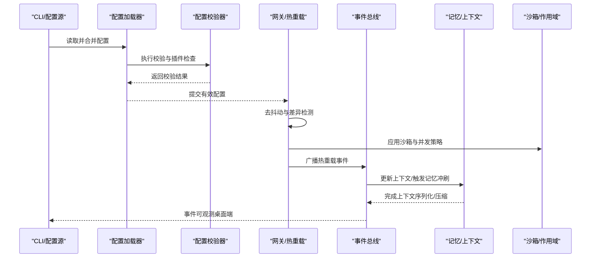
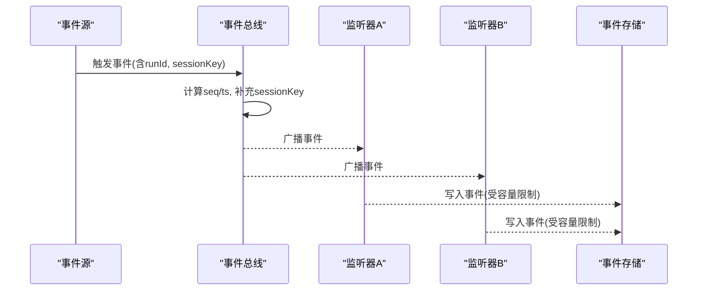
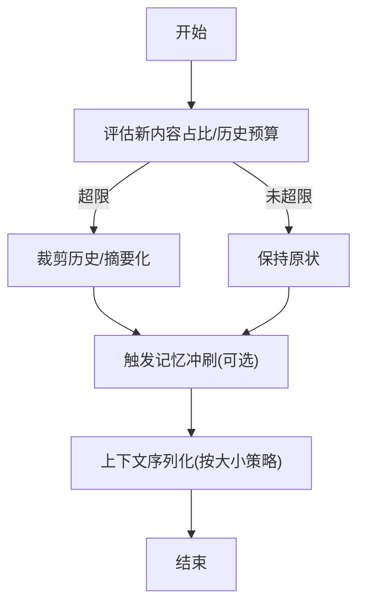
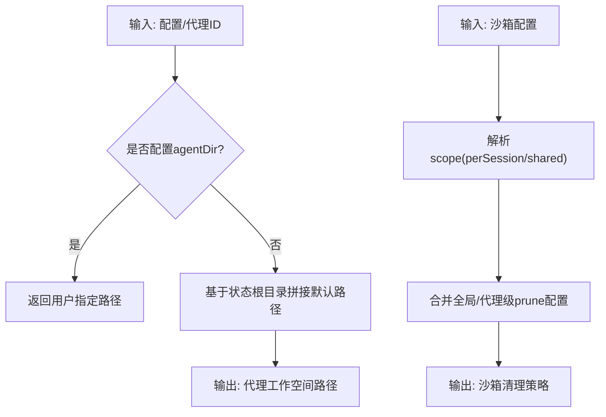
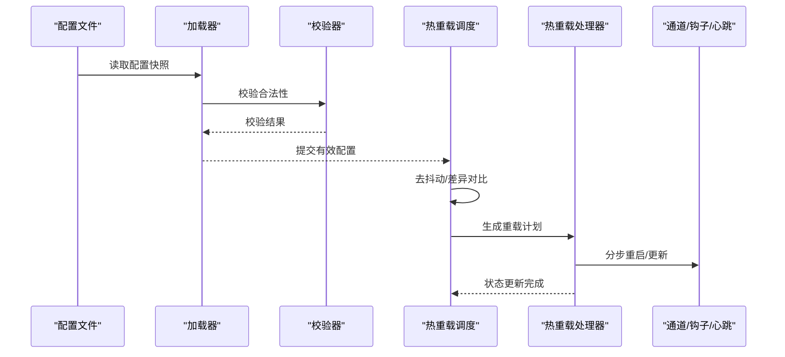
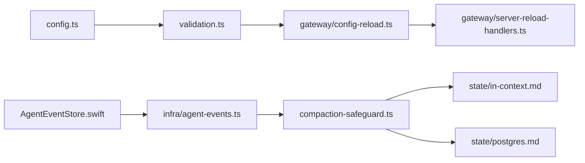

# 代理引擎

## 目录
1. [简介](#简介)
2. [项目结构](#项目结构)
3. [核心组件](#核心组件)
4. [架构总览](#架构总览)
5. [组件详解](#组件详解)
6. [依赖关系分析](#依赖关系分析)
7. [性能考量](#性能考量)
8. [故障排查指南](#故障排查指南)
9. [结论](#结论)
10. [附录](#附录)

## 简介
本文件面向 OpenClaw 代理引擎，系统性阐述代理生命周期管理、状态与上下文维护、路径与作用域隔离、资源分配策略、上下文窗口与记忆处理、配置加载与热重载机制，并给出开发最佳实践、性能优化与调试方法，以及可直接参考的配置示例与使用场景。

## 项目结构
OpenClaw 的代理引擎由“配置与校验”“运行时事件与上下文”“沙箱与作用域”“热重载与网关控制”“记忆与会话”等模块协同组成。下图展示与代理引擎相关的关键子系统及其交互：

## 核心组件
- 配置与校验：负责读取、合并、校验与插件扩展的配置，确保代理运行前的参数正确性与安全性。
- 运行时事件与上下文：提供代理事件总线、上下文序列化与记忆冲刷策略，支撑代理在多轮对话中的状态延续。
- 沙箱与作用域：定义代理运行的作用域（共享/按会话）、容器与工具策略、清理策略，保障资源隔离与回收。
- 热重载与网关：实现配置变更的去抖动、差异检测与分步重启，保证服务连续性与最小中断。
- 记忆与会话：通过 OpenProse 的会话上下文模型，支持持久化记忆、段落记录与数据库状态写入。
- 桌面端事件存储：在 macOS 控制界面中缓存并滚动显示代理事件，便于调试与观测。

## 架构总览
下图展示从配置加载到代理执行、事件广播、上下文维护与热重载的整体流程：

## 组件详解

### 代理生命周期与事件总线
- 事件生成与序列化：每次代理事件发生时，系统计算递增序号与时间戳，并根据运行 ID 维护会话键，随后广播给所有监听者。
- 事件监听与容错：监听器回调被包裹在异常捕获中，避免单个监听器失败影响整体事件流。
- 事件存储：桌面端提供固定容量的事件环形缓冲区，超出上限自动丢弃最旧条目，便于快速回溯最近事件。

### 上下文窗口管理与记忆处理
- 上下文窗口与压缩：当新内容占比过高或历史预算不足时，系统会裁剪历史消息以满足上下文窗口约束，防止溢出。
- 记忆冲刷：默认启用的记忆冲刷会在必要时触发，确保长期记忆被整理为更紧凑的摘要，同时保留“无回复”提示以避免误触发。
- OpenProse 上下文模型：支持“文件系统/内存/PostgreSQL”三种状态后端；在上下文内传递值而非引用，大对象建议使用数据库或文件系统后端。

### 代理路径管理、作用域隔离与资源分配
- 代理目录解析：优先使用用户显式配置的 `agentDir`；否则基于状态根目录生成默认路径，确保每个代理拥有独立工作空间。
- 作用域与清理：沙箱支持“共享/按会话”两种作用域，全局与代理级配置可分别设置空闲与最大存活时间，避免资源泄漏。
- 工具策略与会话判定：提供工具调用策略解析与会话 ID 校验工具，辅助代理间通信与安全路由。

### 配置加载、验证与热重载
- 配置加载：从多个来源读取并合并，形成最终运行配置。
- 验证与插件校验：对字段进行类型与范围校验，插件校验确保目标通道/心跳目标等枚举值合法。
- 热重载：对配置变更进行去抖动与差异检测，仅对受影响部分进行重启或动态更新，同时调整命令并发度与通道重启策略。

### 代理开发最佳实践
- 代理创建与绑定
  - 使用命令接口添加/更新代理条目，确保名称、工作空间、模型等字段符合预期。
  - 通过绑定规则将外部请求路由到具体代理，避免重复与冲突。
- 配置管理
  - 在 `agents.defaults` 中统一设置心跳、并发与沙箱策略；按代理粒度覆盖。
  - 对 `identity.avatar` 等路径类字段进行严格校验，确保不越权访问。
- 错误处理
  - 利用事件总线监听运行期异常，结合桌面端事件存储定位问题。
  - 对热重载失败的分支进行降级处理，保证系统可用性。

## 依赖关系分析
- 配置层：`config.ts` 负责加载与合并；`validation.ts` 与 `config.plugin-validation.test.ts` 共同保证配置正确性。
- 网关层：`config-reload.ts` 与 `server-reload-handlers.ts` 协作，实现热重载的去抖动与分步重启。
- 运行时层：`agent-events.ts` 提供事件总线；`compaction-safeguard.ts` 与 `in-context.md`/`postgres.md` 支持上下文与记忆管理。
- 桌面端：`AgentEventStore.swift` 将事件持久化至本地，便于调试。

## 性能考量
- 上下文窗口与压缩
  - 当新内容占比超过阈值时，优先裁剪历史消息，减少上下文长度，提升推理效率。
  - 记忆冲刷默认启用，避免长期记忆膨胀导致延迟与成本上升。
- 并发与资源
  - 通过热重载处理器动态调整命令并发度（主代理/子代理/定时任务），平衡吞吐与稳定性。
  - 沙箱清理策略（空闲/最大存活）降低资源占用，避免僵尸进程与磁盘膨胀。
- 状态后端选择
  - 小型上下文适合“上下文内”传递；大型中间态建议使用文件系统或 PostgreSQL，以支持持久化与查询。

## 故障排查指南
- 配置校验失败
  - 检查 `agents.defaults` 与 `agents.list` 的字段类型与取值范围；关注 `identity.avatar` 的路径合法性与越权访问提示。
  - 插件校验失败时，确认心跳目标与通道名称是否在允许列表中。
- 热重载异常
  - 查看热重载日志，确认去抖动与差异检测是否生效；若某模块重启失败，系统会降级处理并继续运行。
  - 若需要强制重启网关，可通过信号或环境变量跳过部分模块的重启。
- 事件与调试
  - 使用桌面端事件存储查看最近事件；若事件过多，注意环形缓冲区会自动丢弃最旧条目。
  - 对于代理间通信问题，检查会话 ID 格式与工具策略匹配情况。

## 结论
OpenClaw 代理引擎通过严格的配置校验、稳健的热重载机制、完善的上下文与记忆管理、清晰的沙箱与作用域隔离，构建了可扩展、可观测且易维护的代理运行平台。遵循本文的最佳实践与性能建议，可在复杂场景中稳定地交付高质量的代理能力。

## 附录

### 实际配置示例与使用场景
- 代理绑定与路由
  - 将特定匹配规则绑定到目标代理 ID，避免重复与冲突；对相同匹配项进行跳过，对不同代理的冲突进行报告。
- 心跳与并发
  - 在 `agents.defaults` 中设置心跳周期与最大并发数；按代理粒度覆盖沙箱清理策略与工具策略。
- 记忆与上下文
  - 默认启用记忆冲刷，确保长期记忆被整理；对于大型中间态，使用文件系统或 PostgreSQL 后端以提升可靠性与可查询性。
- 热重载场景
  - 修改 `channels`、`hooks`、`cron` 等配置时，系统自动去抖动并仅重启受影响模块；如需重启网关，可通过信号或环境变量控制。