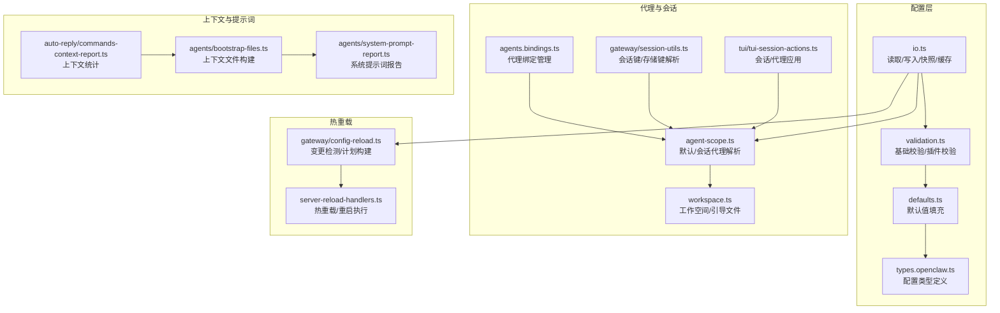
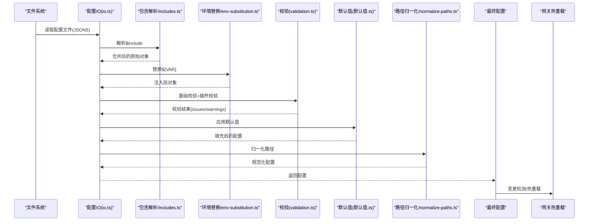
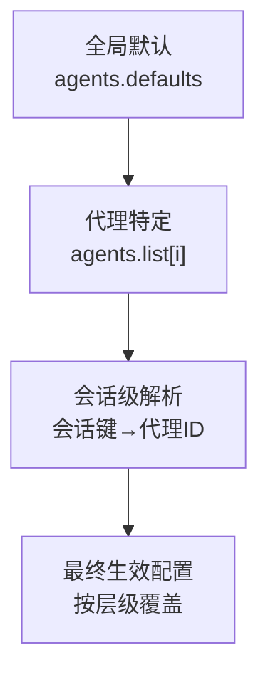
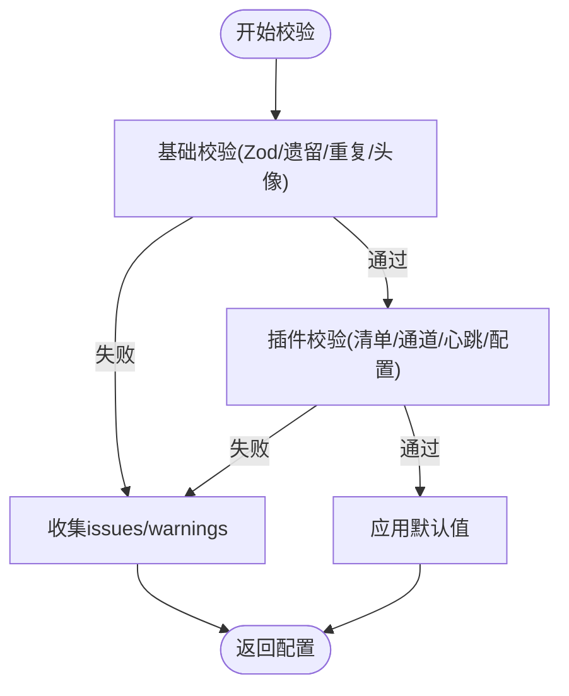
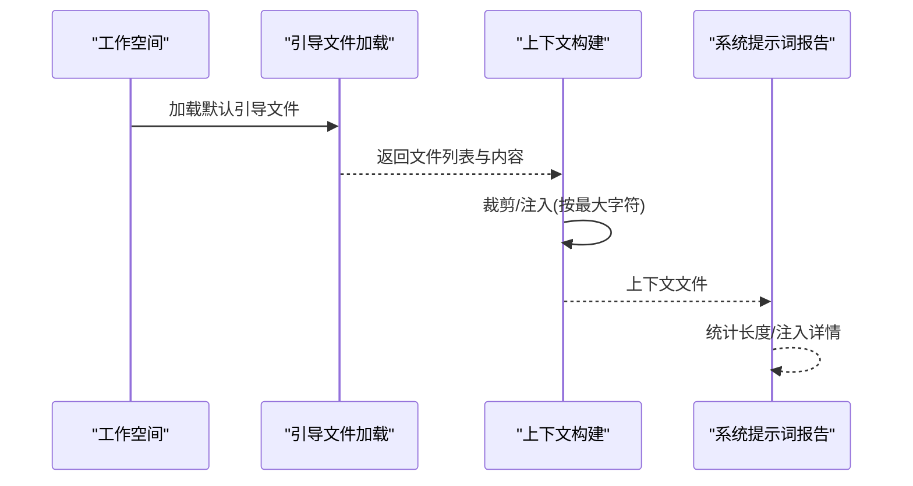
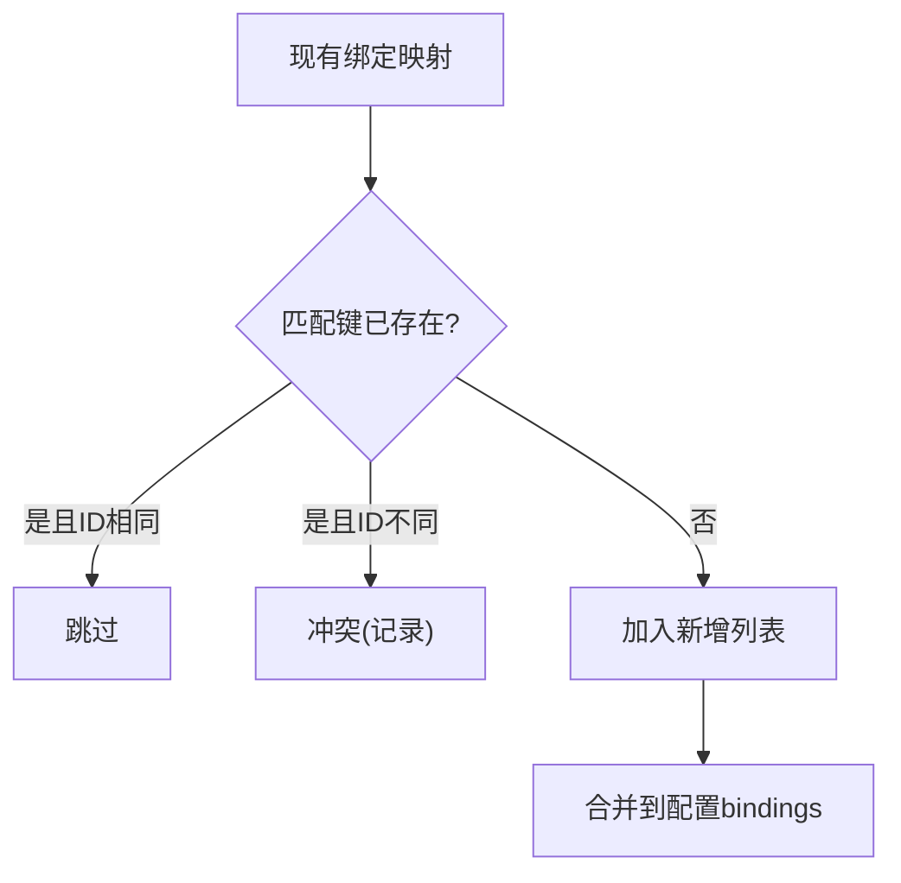
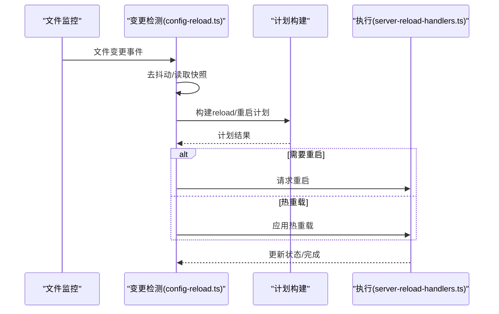
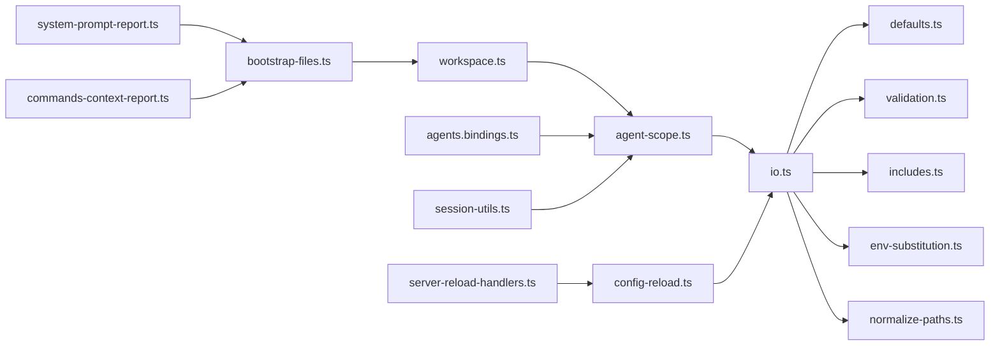

# 代理配置管理

## 目录
1. [简介](#简介)
2. [项目结构](#项目结构)
3. [核心组件](#核心组件)
4. [架构总览](#架构总览)
5. [详细组件分析](#详细组件分析)
6. [依赖关系分析](#依赖关系分析)
7. [性能考量](#性能考量)
8. [故障排查指南](#故障排查指南)
9. [结论](#结论)
10. [附录：配置开发指南与最佳实践](#附录配置开发指南与最佳实践)

## 简介
本文件面向 OpenClaw 的“代理配置管理”子系统，系统性梳理配置的层次结构与继承机制（全局、代理特定、会话级）、默认值管理、验证与冲突处理、工作空间与系统提示词生成、上下文管理、代理绑定与身份权限、以及配置热重载与状态同步。同时提供配置开发指南、性能优化建议与调试方法，并给出可操作的最佳实践。

## 项目结构
围绕配置管理的关键模块分布如下：
- 配置输入与持久化：`io.ts` 负责解析、合并、校验、写回与快照；`types.openclaw.ts` 定义顶层配置结构；`defaults.ts` 提供默认值填充；`validation.ts` 提供严格校验与插件校验。
- 代理作用域与工作空间：`agent-scope.ts` 解析默认/会话代理 ID、代理配置解析、工作空间与目录解析；`workspace.ts` 提供工作空间模板与引导文件加载。
- 绑定与会话：`agents.bindings.ts` 管理代理绑定；`gateway/session-utils.ts` 处理会话键规范化与存储键解析；`tui/tui-session-actions.ts` 展示并应用会话与代理选择。
- 热重载与状态同步：`gateway/config-reload.ts` 与 `server-reload-handlers.ts` 实现配置变更检测、计划构建与热重载/重启执行。
- 上下文与提示词：`agents/bootstrap-files.ts` 与 `agents/system-prompt-report.ts` 生成上下文文件与系统提示词报告；`auto-reply/commands-context-report.ts` 提供上下文统计与诊断输出。

## 核心组件
- 配置读取与写入：支持 JSON5 解析、`$include` 合并、环境变量替换、路径归一化、默认值填充、插件校验、快照与备份、缓存控制。
- 默认值管理：模型、代理并发、日志脱敏、上下文修剪、压缩模式、心跳周期等。
- 验证体系：基础 Zod 校验、遗留问题检测、插件清单与启用状态校验、通道合法性、心跳目标校验、头像路径约束。
- 代理作用域：默认代理解析、会话代理解析、代理配置解析、工作空间与 `agentDir` 解析。
- 工作空间与引导：模板文件生成、引导文件加载、子代理会话白名单过滤。
- 代理绑定：匹配键去重、新增/跳过/冲突判定、去重与冲突报告。
- 会话键与存储键：规范化、主会话别名解析、存储路径解析、跨代理会话键标准化。
- 热重载：变更检测、计划构建、热重载或重启、并发与通道重启、状态同步。
- 上下文与提示词：引导文件内容裁剪与注入、系统提示词统计与报告、上下文诊断输出。

## 架构总览
配置生命周期从磁盘到运行时，经历“读取→包含解析→环境变量替换→校验→默认值填充→路径归一化→写回/快照→热重载/状态同步”。代理作用域贯穿其中，确保“全局默认→代理特定→会话级”的正确优先级。

## 详细组件分析

### 配置层次结构与继承机制
- 全局配置：位于顶层 OpenClawConfig，包含 `agents.defaults`、`models`、`session`、`plugins`、`channels` 等。
- 代理特定配置：`agents.list` 中每个条目可覆盖全局默认值；`resolveAgentConfig` 汇聚代理字段。
- 会话级配置：通过会话键解析决定使用默认代理还是会话绑定代理；`resolveSessionAgentIds` 与 `resolveSessionStoreKey` 决定最终生效项。

### 代理默认值管理
- 模型默认值：默认成本、输入类型、上下文窗口、最大令牌数、模型别名映射。
- 代理并发默认值：主代理与子代理最大并发。
- 日志默认值：敏感信息脱敏策略。
- 上下文修剪与压缩：默认修剪模式、心跳周期、Anthropic API Key/OAuth 下的缓存保留策略。
- 会话默认值：`mainKey` 归一化为固定值，避免用户误配。

### 配置验证与冲突处理
- 基础校验：Zod Schema 校验、遗留问题检测、重复 `agentDir` 检测、头像路径合法性。
- 插件校验：插件清单加载、启用状态、通道允许集、心跳目标合法性、插件配置 Schema 校验。
- 冲突处理：当配置无效时返回 `issues`/`warnings`；对未知通道/心跳目标抛出明确错误；重复 `agentDir` 抛出专用异常。

### 工作空间配置与系统提示词生成
- 工作空间模板：首次创建时写入默认引导文件（如 AGENTS.md、SOUL.md、TOOLS.md、IDENTITY.md、USER.md、HEARTBEAT.md、BOOTSTRAP.md、MEMORY.md）。
- 引导文件加载：按名称集合读取文件，支持内存文件去重；子代理会话仅允许部分文件注入。
- 上下文构建：根据最大字符限制裁剪注入内容，记录截断与缺失情况。
- 系统提示词报告：统计系统提示词长度、项目上下文、技能/工具注入统计。

### 上下文管理与会话键解析
- 会话键规范化：支持 `"global"`/`"unknown"`/`"agent::<alias>"` 等格式；主会话别名解析；存储键解析。
- 存储键与代理：根据 `canonicalKey` 判定是否全局/未知，否则解析代理 ID 并计算存储路径。
- 子代理会话：仅允许 AGENTS/TOOLS 文件注入，其他文件过滤。

### 代理绑定管理与身份配置
- 绑定去重与冲突：基于匹配键去重；相同 `agentId` 则跳过，不同则记录冲突；返回 `added`/`skipped`/`conflicts`。
- UI/CLI 展示：在 UI 中展示默认绑定与当前绑定，支持选择节点进行绑定；TUI 展示并应用代理列表与默认代理。

### 权限设置与心跳目标校验
- 心跳目标校验：支持 `"last"`/`"none"` 与已知通道/插件通道；未知目标报错。
- 通道合法性：`channels` 下的键必须属于允许集合（含默认通道与插件声明通道）。
- 插件配置 Schema 校验：未启用但有配置时产生警告；Schema 缺失时报错。

### 配置热重载、变更传播与状态同步
- 变更检测：监听配置文件变化，去抖动后读取快照，比较差异路径。
- 计划构建：区分需要重启/热重载/动态读取的变更类别。
- 执行策略：禁用/重启/热重载；热重载时更新钩子、心跳、通道、并发度等；必要时请求外部重启。
- 状态同步：更新内部状态并记录日志。

## 依赖关系分析
- 配置 IO 依赖默认值、校验、包含解析、环境替换、路径归一化、运行时覆盖。
- 代理作用域依赖会话键解析、工作空间路径、默认代理 ID。
- 热重载依赖配置快照、差异比较、计划构建与执行处理器。
- 上下文与提示词依赖工作空间引导文件与系统提示词报告。

## 性能考量
- 配置缓存：支持毫秒级缓存时间控制，减少频繁读取开销；缓存失效后重新加载。
- 写入原子性：临时文件+重命名/复制回退，保证写入一致性并降低锁竞争。
- 热重载去抖动：变更聚合，避免频繁重启；仅对必要模块执行重启。
- 路径归一化与重复检查：提前发现重复 `agentDir`，避免后续昂贵操作。
- 上下文裁剪：按最大字符限制注入，避免超长上下文导致性能下降。

## 故障排查指南
- 无效配置：读取/写入时若校验失败，返回 `issues`/`warnings`；注意 `INVALID_CONFIG` 错误码与 `details` 字段。
- 未知心跳目标/通道：校验阶段直接报错，定位到具体路径。
- 重复 `agentDir`：抛出专用异常，需调整配置避免冲突。
- 环境变量缺失：环境替换阶段可能抛出 `MissingEnvVarError`，检查配置 `env` 或进程环境。
- 热重载失败：查看日志中的失败原因；确认是否需要重启而非热重载。

## 结论
OpenClaw 的代理配置管理以“全局默认→代理特定→会话级”三层继承为核心，结合严格的默认值填充、插件与通道校验、工作空间引导与上下文裁剪，形成高可用、可演进的配置体系。配合热重载与状态同步机制，实现配置变更的平滑过渡与可观测性。

## 附录：配置开发指南与最佳实践

### 配置层次与继承最佳实践
- 将通用设置置于 `agents.defaults`，避免在每个代理重复配置。
- 使用会话键 `"agent::<alias>"` 明确绑定代理，避免歧义。
- 通过 `plugins.entries` 与 `allow`/`deny` 控制插件启用范围，保持最小权限。

### 自定义配置项添加与验证
- 新增字段需在类型定义中声明，确保 Zod 校验通过。
- 若涉及插件配置，提供 schema 并在插件清单中注册，避免 `"schema missing"` 错误。
- 对于路径类字段，遵循工作空间相对路径约束，避免越界访问。

### 迁移策略
- 使用 `migrateLegacyConfig`（如存在）进行遗留配置迁移。
- 通过 `findLegacyConfigIssues` 检测并提示迁移点。
- 写回配置时自动打上版本戳与时间戳，便于追踪。

### 配置热重载与状态同步
- 合理设置 `gateway.reload.debounceMs` 与 `reload.mode`；对非关键变更采用热重载，避免频繁重启。
- 关注计划构建中的 `restartReasons`/`hotReasons`，理解变更影响面。
- 在 UI/TUI 中观察代理与会话切换是否生效，必要时强制刷新。

### 性能优化与缓存策略
- 开启配置缓存（`OPENCLAW_CONFIG_CACHE_MS`），减少重复读取。
- 对大体积上下文文件进行裁剪，避免超出模型上下文窗口。
- 合理设置并发度（`agents.defaults.maxConcurrent`/`subagents.maxConcurrent`）与压缩模式，平衡吞吐与成本。

### 调试方法
- 使用 `readConfigFileSnapshot` 获取解析、校验、默认值填充后的完整快照，定位问题字段。
- 查看配置 `warnings` 与 `issues`，逐项修正。
- 在 UI/TUI 中核对代理绑定与会话键解析结果，确认最终生效项。