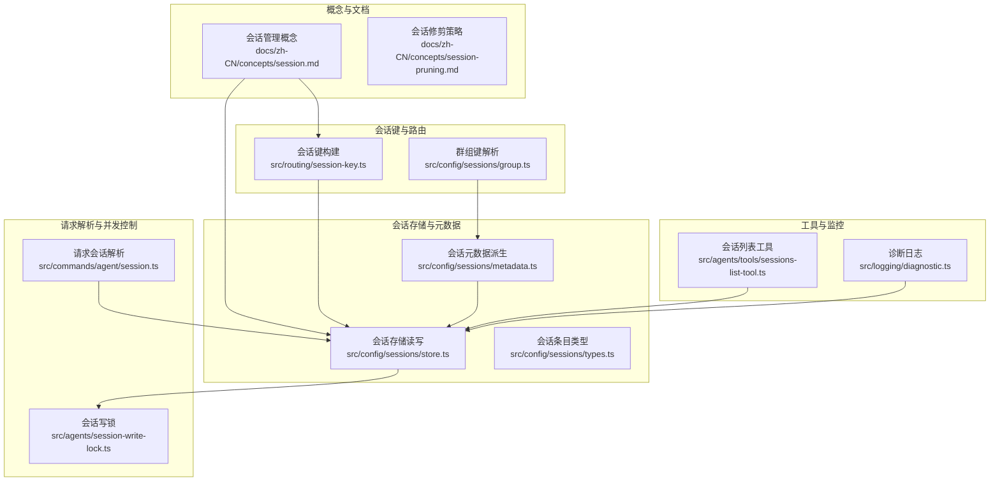
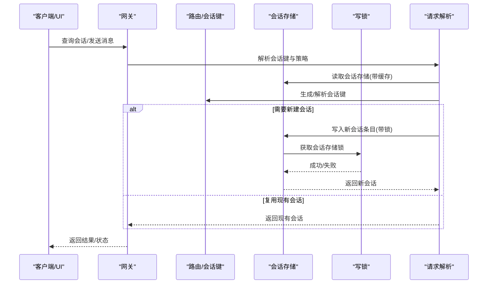
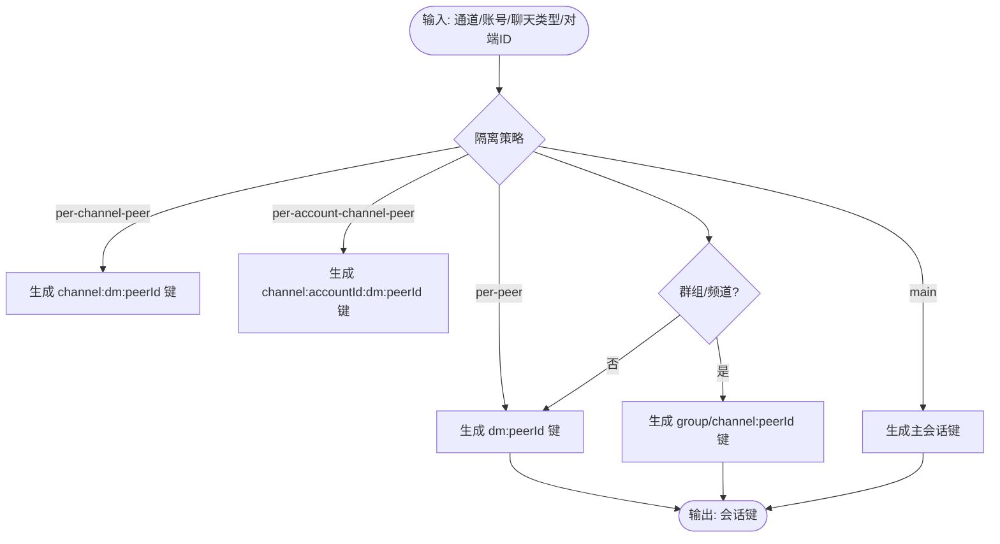
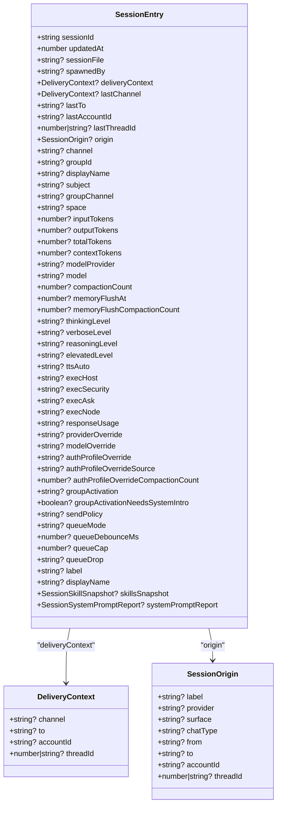
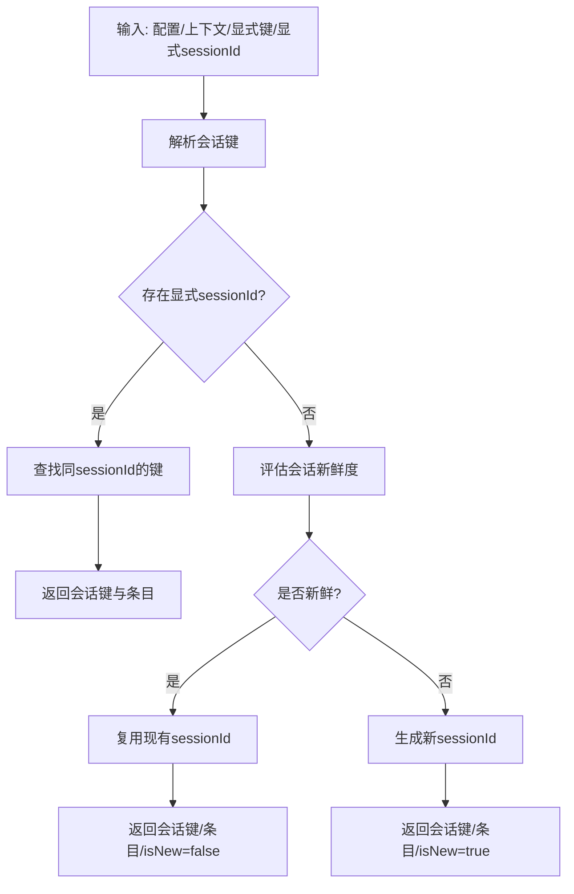
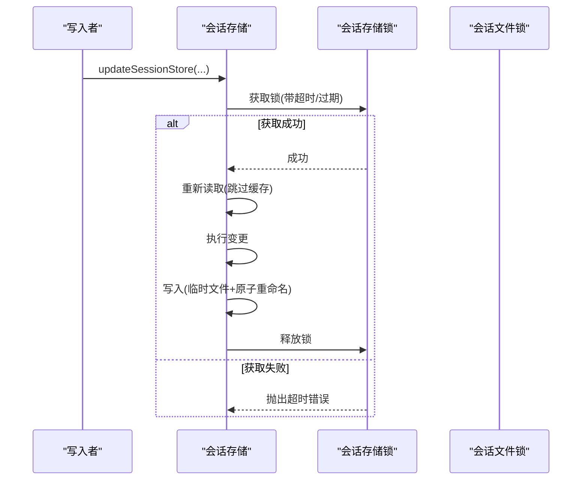
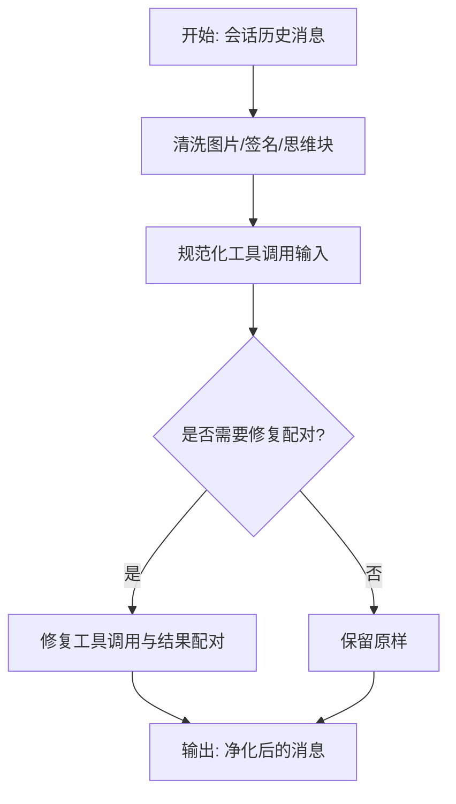
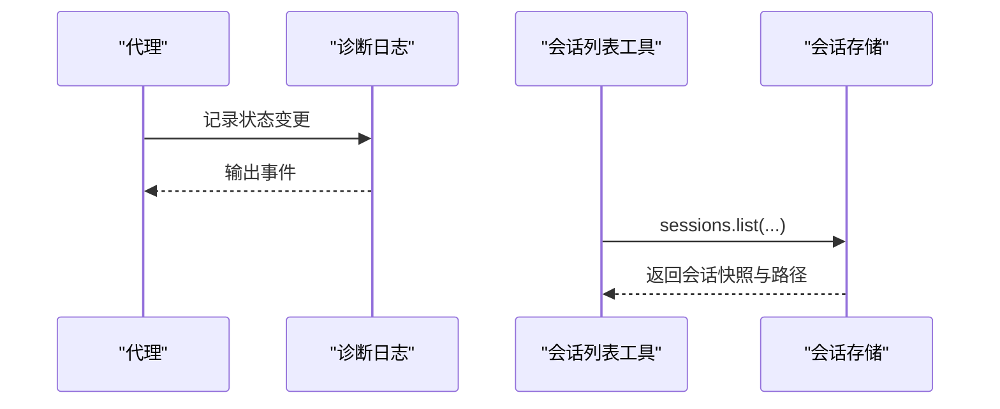
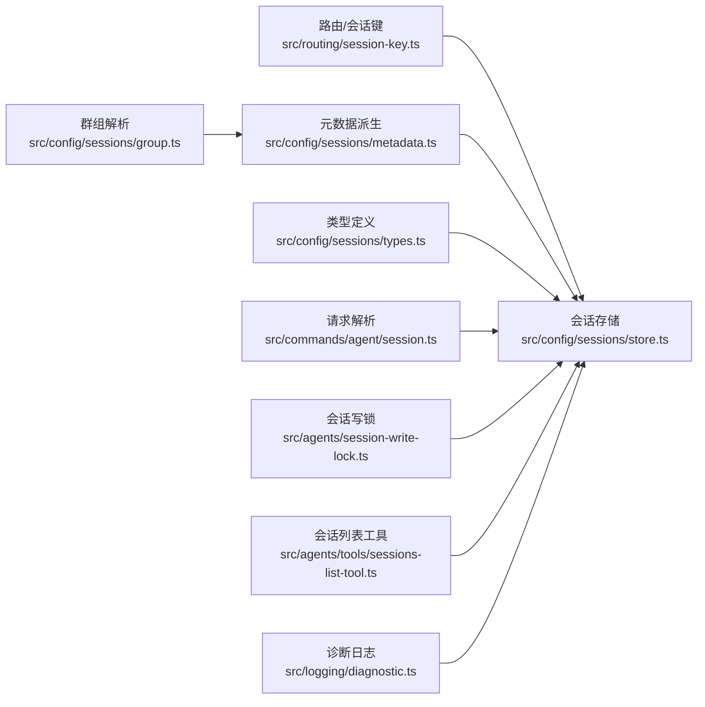

# 会话管理

## 目录
1. [简介](#简介)
2. [项目结构](#项目结构)
3. [核心组件](#核心组件)
4. [架构总览](#架构总览)
5. [详细组件分析](#详细组件分析)
6. [依赖关系分析](#依赖关系分析)
7. [性能考量](#性能考量)
8. [故障排除指南](#故障排除指南)
9. [结论](#结论)
10. [附录](#附录)

## 简介
本文件系统化梳理 OpenClaw 会话管理系统，覆盖会话生命周期（创建、维护、销毁）、状态跟踪、消息路由与上下文保持、会话键生成与解析、会话隔离策略、并发写锁与一致性保障、工具结果保护与消息净化、最佳实践与监控调试等内容。目标读者既包括需要快速上手的使用者，也包括希望深入理解实现细节的工程师。

## 项目结构
OpenClaw 将“会话”定义为一次对话的上下文容器，其状态持久化于网关主机上的 JSON 存储文件，并以会话键进行唯一标识与分组。会话键由路由层根据 `channel`、`accountId`、聊天类型与对端 `id` 构建，支持主键连续、按对端隔离、按通道或 `accountId`+通道隔离等多种策略。会话状态变更通过统一的存储模块进行读写，并在并发场景下通过文件级锁确保一致性。

## 核心组件
- 会话键生成与解析：负责将通道、账号、聊天类型与对端 ID 组合为稳定的会话键，支持多级隔离策略与身份映射。
- 会话存储：提供带缓存的读取、带锁的写入、批量更新、最后路由记录与元数据派生能力。
- 请求会话解析：根据配置与上下文解析当前请求应归属的会话键与会话 `id`，并评估会话新鲜度与是否新建。
- 并发控制：通过会话文件锁与会话存储锁，避免并发写入导致的数据竞争与损坏。
- 工具与监控：提供会话列表查询工具与诊断事件输出，便于运维与问题定位。

## 架构总览
OpenClaw 的会话管理以“网关为主”的权威源，UI 客户端仅从网关查询会话列表与令牌统计。会话键由路由层生成，存储层负责持久化与并发安全，请求解析层决定会话的新建/复用与策略应用，工具与诊断层提供可观测性。

## 详细组件分析

### 会话键生成与路由解析
- 主键连续（main）：所有直聊共享一个主会话键，适合个人 1:1 场景。
- 按对端隔离（per-peer）：按 sender `id` 隔离，跨通道共享同一人会话。
- 按通道+对端（per-channel-peer）：适用于多人收件箱。
- 按账号+通道+对端（per-account-channel-peer）：适用于多账号场景。
- 群组/频道：独立键，支持主题、频道名、空间等标签化显示。
- 身份链接：通过 `identityLinks` 将不同通道的同一联系人映射到同一对端 ID，从而实现跨通道会话共享。

### 会话存储与元数据
- 存储结构：每个会话键对应一个条目，包含最近更新时间、交付上下文、令牌用量、来源元信息、群组标签等。
- 缓存与一致性：读取时支持 TTL 缓存；写入前失效缓存，写入采用临时文件+原子重命名（非 Windows）以降低竞态风险。
- 并发控制：会话存储锁与会话文件锁双层保护，避免并发写入与死锁。
- 元数据派生：从入站上下文推导会话来源（标签、提供方、表面、聊天类型、线程等），并为群组会话生成显示名。

### 请求会话解析与生命周期
- 解析流程：根据配置与上下文确定会话键；若提供显式 `sessionId`，则优先复用；否则评估会话新鲜度，决定新建还是复用。
- 新鲜度策略：支持每日重置与空闲重置，可按会话类型与通道进行覆盖；支持触发词（如 `/new`、`/reset`）强制新建。
- 会话文件：JSONL 历史文件按会话 ID 命名，群组话题附加主题后缀；支持预压缩内存刷写与修剪策略减少上下文膨胀。

### 并发控制与一致性
- 会话存储锁：基于文件锁的互斥访问，支持超时与过期清理，避免死锁。
- 会话文件锁：针对单个会话文件的锁，支持递归持有与进程退出清理。
- 写入策略：Windows 下直接写入；其他平台采用临时文件+原子重命名，写后失效缓存，确保读到最新。

### 工具结果保护、消息过滤与内容净化
- 工具结果修剪：在请求前对旧工具结果进行软修剪或硬清除，避免提示缓存窗口外的重复缓存与上下文膨胀。
- 消息净化：对会话历史中的图片、思维块、工具调用输入与配对结果进行清洗与修复，确保合规与一致性。
- 过滤策略：结合会话发送策略与规则，支持按通道/类型拒绝投递。

### 会话状态跟踪与监控
- 状态事件：通过诊断日志记录会话状态变化、队列深度与活动时间，便于观测与告警。
- 会话列表工具：支持按活跃时长、`spawnedBy` 等条件查询会话列表与存储路径，辅助运维与审计。
- 端到端验证：测试用例覆盖会话存储更新与最后路由记录，确保关键路径行为稳定。

## 依赖关系分析
- 路由层依赖会话键构建与群组解析，生成稳定键。
- 存储层依赖元数据派生与类型定义，提供一致的读写接口。
- 请求解析层依赖存储与路由，决定会话的新建/复用与策略。
- 并发控制层贯穿存储与文件锁，保障一致性。
- 工具与诊断层依赖存储，提供可观测性与运维能力。

## 性能考量
- 缓存策略：会话存储读取支持 TTL 缓存，减少频繁磁盘 IO；写入时主动失效缓存，确保一致性。
- 原子写入：非 Windows 平台采用临时文件+原子重命名，降低并发写入风险；Windows 下直接写入，配合存储锁保证顺序。
- 修剪与压缩：会话修剪在请求前对旧工具结果进行软修剪/硬清除，避免提示缓存窗口外的重复缓存；预压缩与内存刷写减少上下文膨胀。
- 并发控制：双层锁（存储锁+文件锁）与过期清理，避免长时间阻塞与资源泄漏。

[本节为通用性能建议，不直接分析具体文件]

## 故障排除指南
- 会话存储锁超时：检查是否存在长时间占用锁的进程，确认 `staleMs` 设置是否合理；必要时手动清理锁文件。
- 会话键冲突/解析异常：核对隔离策略与 `identityLinks` 配置，确保对端 ID 规范化与映射正确。
- 会话历史不一致：确认写入路径与权限设置，避免目录被删除重建导致的 `ENOENT`；关注缓存失效时机。
- 会话状态异常：通过诊断日志查看状态变更事件，结合会话列表工具定位最近活动与队列深度。
- 端到端回归：参考测试用例验证会话存储更新与最后路由记录的行为。

## 结论
OpenClaw 的会话管理体系以“键-存储-锁-策略”为核心，通过规范化的键生成、权威的存储与严格的并发控制，实现了跨通道、跨账号的稳定会话管理。配合修剪与净化策略，有效控制上下文膨胀与合规风险；通过诊断与工具，提供可观测性与运维能力。遵循本文的最佳实践与排障指引，可在复杂场景下获得可靠的会话体验。

[本节为总结性内容，不直接分析具体文件]

## 附录

### 会话配置示例与使用场景
- 主键连续（main）：适合个人 1:1 场景，多号码/多通道映射到同一会话。
- 按通道+对端（per-channel-peer）：多人收件箱，按通道隔离。
- 按账号+通道+对端（per-account-channel-peer）：多账号场景，严格隔离。
- 群组/频道：独立键，支持主题/频道/空间标签化显示。
- 发送策略：按通道/类型拒绝投递，支持运行时覆盖。