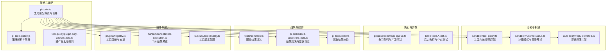
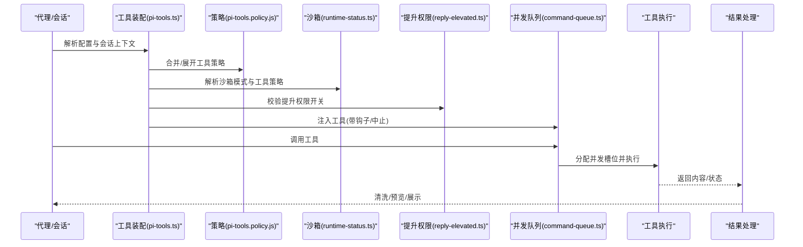
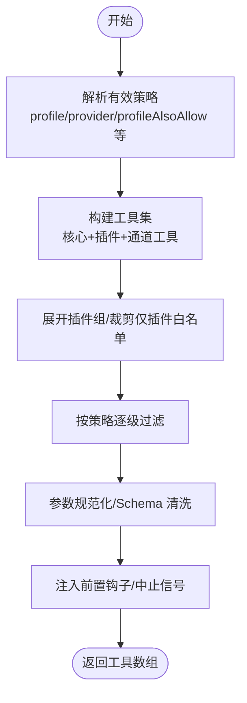
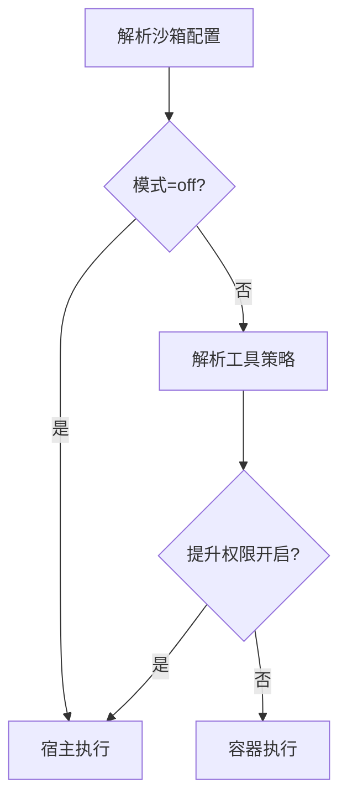
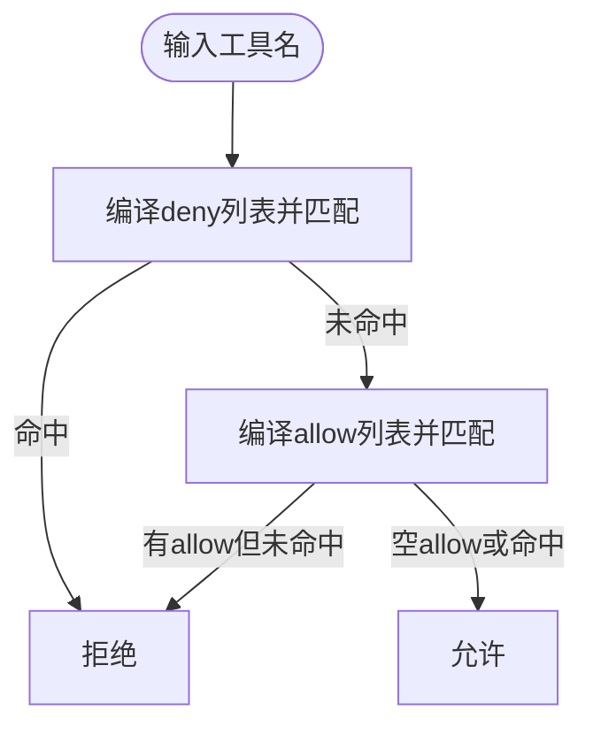
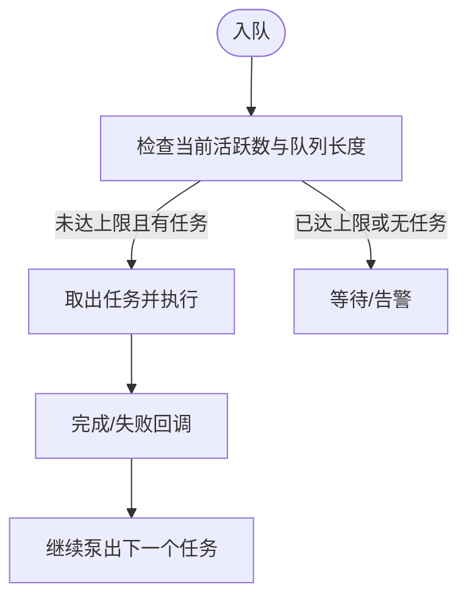
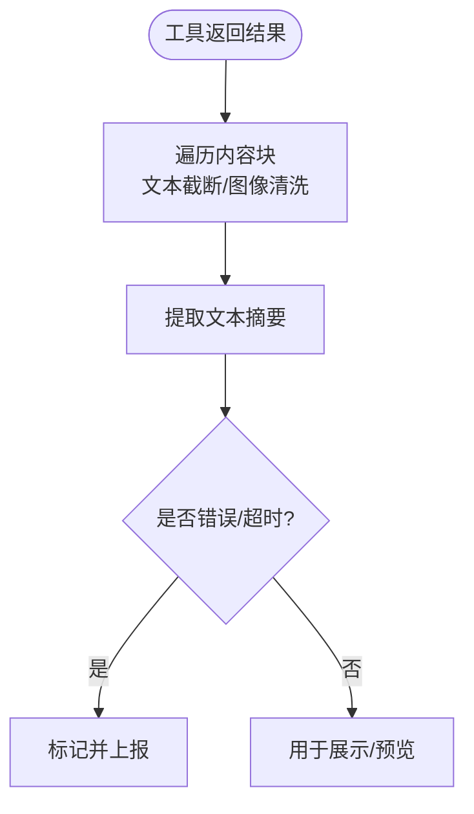
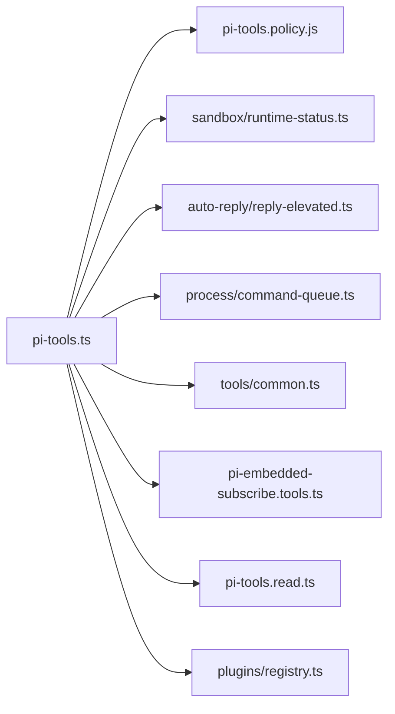

# 工具执行器

## 目录
1. [简介](#简介)
2. [项目结构](#项目结构)
3. [核心组件](#核心组件)
4. [架构总览](#架构总览)
5. [组件详解](#组件详解)
6. [依赖关系分析](#依赖关系分析)
7. [性能考量](#性能考量)
8. [故障排查指南](#故障排查指南)
9. [结论](#结论)
10. [附录](#附录)

## 简介
本文件面向 OpenClaw 工具执行器，系统性阐述其架构设计与执行流程，覆盖工具注册、发现与调用机制；工具权限控制、沙箱执行与安全隔离策略；工具执行策略、并发控制与资源管理；工具结果处理、图像处理与多媒体支持；工具策略配置、白名单管理与访问控制；以及工具开发指南（自定义工具创建、接口规范与测试方法）、性能优化与错误处理策略，并提供可落地的工具配置示例与使用场景。

## 项目结构
OpenClaw 的工具执行器由“策略解析与工具装配”“沙箱与权限”“执行与并发队列”“结果与媒体处理”“插件注册与扩展”等模块构成。核心入口在工具装配层，围绕 OpenClaw 配置与会话上下文，动态生成可用工具集并注入前置钩子与中止信号，随后通过统一的执行通道进入沙箱或宿主环境。

## 核心组件
- 工具装配与策略合并：根据全局/代理/分组/沙箱/子代理策略，合并并展开工具白名单，注入前置钩子与中止信号，输出最终可用工具集。
- 沙箱与权限：解析沙箱模式、工作区访问与工具策略，结合“提升权限”门禁，决定工具是否在沙箱内运行及可执行范围。
- 执行与并发：通过命令队列对工具调用进行并发限制、等待告警与错误传播，支持按通道（`lane`）隔离与动态调整并发度。
- 结果与媒体：统一封装文本/图像结果，自动清洗敏感数据与过大媒体，确保传输与展示安全可控。
- 插件注册与扩展：插件可注册工具与钩子，系统负责去重与规范化，避免重复暴露与命名冲突。

## 架构总览
下图展示了从“策略解析到工具执行”的端到端流程，包括沙箱决策、权限门禁、并发控制与结果处理。

## 组件详解

### 工具装配与策略合并
- 策略来源与优先级：基础配置(`profile`) → 提供商特定(`profile`/`allow`/`deny`) → 全局 → 代理 → 分组 → 沙箱 → 子代理 → 插件组展开 → 去除仅插件白名单项。
- 工具生成：基于核心工具集与插件工具，按沙箱/宿主条件选择对应实现（如读写/编辑工具），并注入参数规范化、前置钩子与中止信号。
- 输出：最终工具数组，名称统一为小写，便于模型调度与路由。

### 沙箱执行与安全隔离
- 模式与作用域：支持关闭/非主会话/全部三种模式；作用域支持会话级/代理级/共享容器。
- 工作区访问：none/只读/读写三档；入站媒体复制至沙箱工作区；技能镜像策略随配置变化。
- 工具策略叠加：沙箱工具策略在最终过滤阶段生效，且与全局/代理策略共同决定可用工具集。
- 提升权限：当启用提升权限时，`exec` 可绕过沙箱直接在宿主运行，但需满足全局与代理双重开关。

### 权限控制与白名单管理
- 匹配规则：支持全量/精确/正则三种模式；`deny` 优先于 `allow`；未显式允许即默认拒绝。
- 插件白名单裁剪：若 `allow` 仅包含插件工具或插件组，且不包含任何核心工具，则视为无效，系统忽略该 `allow` 并发出警告。
- 策略叠加顺序：基础配置 → 提供商特定 → 全局 → 代理 → 分组 → 沙箱 → 子代理；最终以最严格者为准。

### 执行策略、并发控制与资源管理
- 并发队列：按通道（`lane`）隔离任务，动态设置最大并发，记录排队等待与执行耗时，异常时打印诊断日志并透传错误。
- 默认并发：若未配置，默认值将被解析并应用；无效值会被强制最小化为 1。
- 资源管理：后台执行支持超时与中止；在后台模式下，工具返回“运行中”状态并携带会话标识，后续可通过进程工具轮询/日志/写入/终止/清理等操作。

### 结果处理、图像处理与多媒体支持
- 图像结果封装：统一生成文本块与图像块，自动检测 MIME 类型与大小，必要时进行 Base64 编码；返回时进行敏感信息清洗与字节统计。
- 结果清洗：对文本进行截断，对图像移除大字段并标注省略；支持从结果中提取纯文本摘要。
- 错误判定：依据 `details.status` 判断错误/超时状态，便于上层统一处理。

### 插件注册与工具发现
- 注册机制：插件通过工厂函数注册工具与钩子，系统对工具名进行归一化与去重，记录来源与可选性。
- 工具发现：装配阶段收集插件工具元信息，参与策略展开与过滤，保证工具清单一致与可追踪。

### 工具开发指南
- 接口规范：工具需提供名称、参数 Schema 与执行函数；建议遵循参数规范化与 Schema 清洗流程，确保跨模型兼容。
- 自定义工具创建：通过插件注册工具与钩子，注意工具名归一化与策略可见性；必要时提供显示配置以便在 UI 中正确呈现。
- 测试方法：参考后台执行与中止测试，验证超时、中止与会话生命周期管理；对图像/多媒体结果进行清洗与大小校验。

### 实际配置示例与使用场景
- 工具策略：参考工具文档中的“工具配置”“工具组”“提供商特定策略”等章节，按需设置 `profile`/`allow`/`deny` 与分组快捷方式。
- 沙箱策略：参考沙箱文档中的“模式/作用域/工作区访问/自定义挂载/镜像与初始化命令”等章节，按环境需求选择合适的隔离强度。
- 使用场景：浏览器自动化、Canvas 渲染、节点控制、消息发送、定时任务管理、图片理解等，均通过统一工具接口与策略体系进行编排。

## 依赖关系分析
- 组件耦合：工具装配强依赖策略解析与沙箱状态；执行层依赖并发队列；结果层依赖媒体与清洗逻辑；插件层独立于核心，通过注册机制接入。
- 外部依赖：Docker 容器（沙箱）、模型提供商 API（工具 Schema 适配）、文件系统（读写/编辑）、进程管理（后台执行）。

## 性能考量
- 并发控制：合理设置每通道最大并发，避免资源争用；对长队列任务设置等待告警阈值，及时发现瓶颈。
- 沙箱成本：容器启动与网络/挂载配置会影响延迟；按需启用沙箱与网络访问，减少不必要的 IO。
- 结果处理：对大图像进行清洗与省略，降低传输与渲染开销；对文本进行截断，避免冗余内容影响响应时间。
- 执行策略：后台执行与超时控制可避免阻塞；对不可中断的进程采用中止信号与进程树清理，防止僵尸进程。

## 故障排查指南
- 工具未出现：检查策略配置（`allow`/`deny`/`profile`/`group:*`）与插件白名单裁剪逻辑；确认工具名大小写与去重后名称。
- 沙箱执行失败：检查沙箱模式、工作区挂载与网络设置；核对工具策略与提升权限开关。
- 并发阻塞：查看队列长度与等待告警；调整通道并发或拆分任务；检查错误日志定位失败原因。
- 结果异常：确认图像 MIME 类型与 Base64 编码一致性；检查清洗逻辑与文本截断阈值；识别错误/超时状态并分级处理。

## 结论
OpenClaw 工具执行器以“策略驱动+沙箱隔离+并发治理+结果清洗”为核心设计，既保证了工具使用的灵活性与安全性，又提供了完善的可观测性与可扩展性。通过清晰的策略层级、严格的权限门禁与稳健的执行通道，系统能够在多模型、多平台环境下稳定地支撑各类自动化任务。

## 附录
- 工具策略配置要点：参考工具文档中的“工具配置/工具组/提供商特定策略/插件工具”等章节，结合沙箱与提升权限策略进行组合。
- 沙箱配置要点：参考沙箱文档中的“模式/作用域/工作区访问/自定义挂载/镜像与初始化命令”，按环境需求选择合适的隔离强度。
- 开发与测试：遵循参数规范化与 Schema 清洗流程；利用后台执行与中止测试验证生命周期管理；对图像/多媒体结果进行清洗与大小校验。