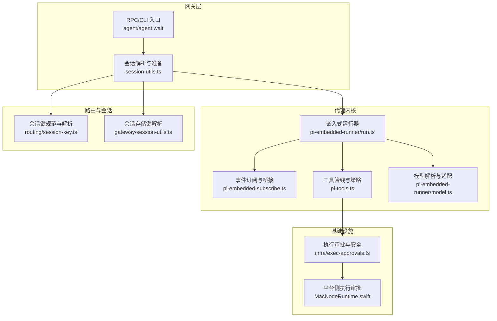
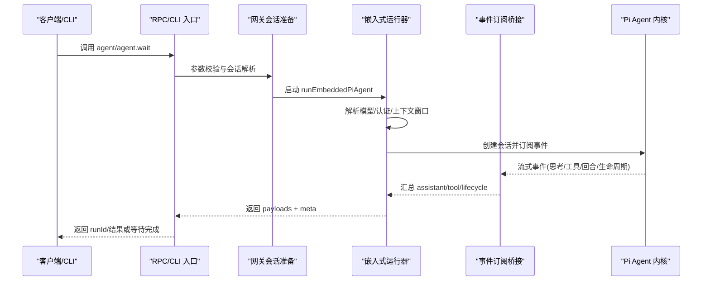
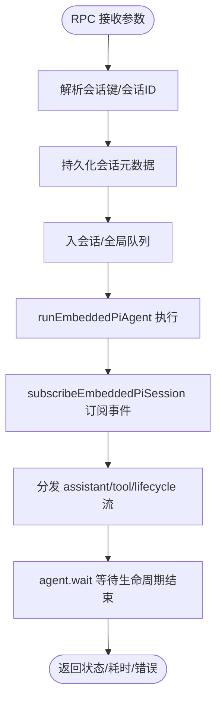
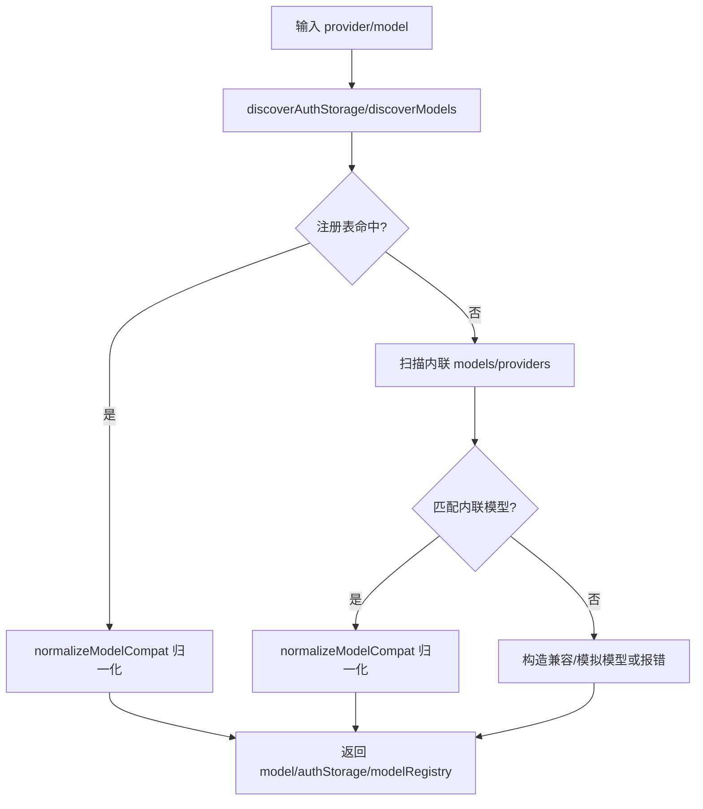
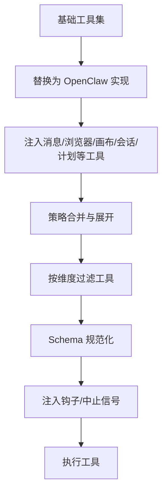
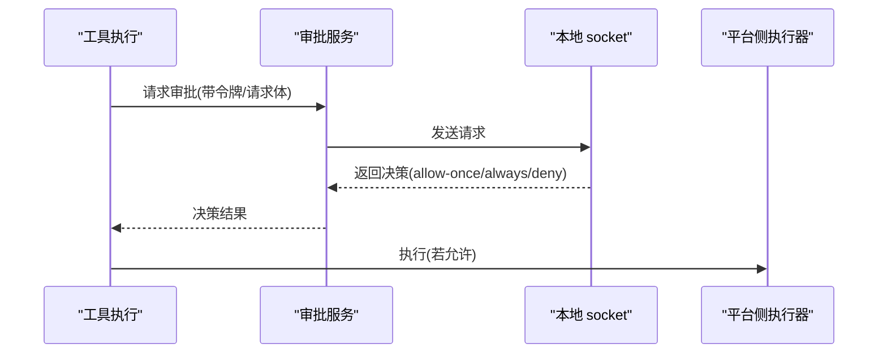
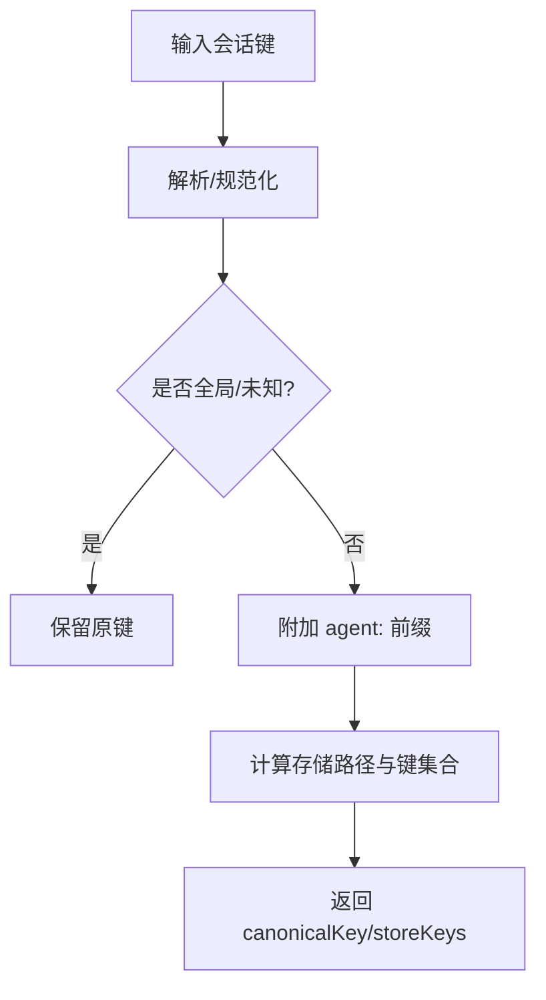
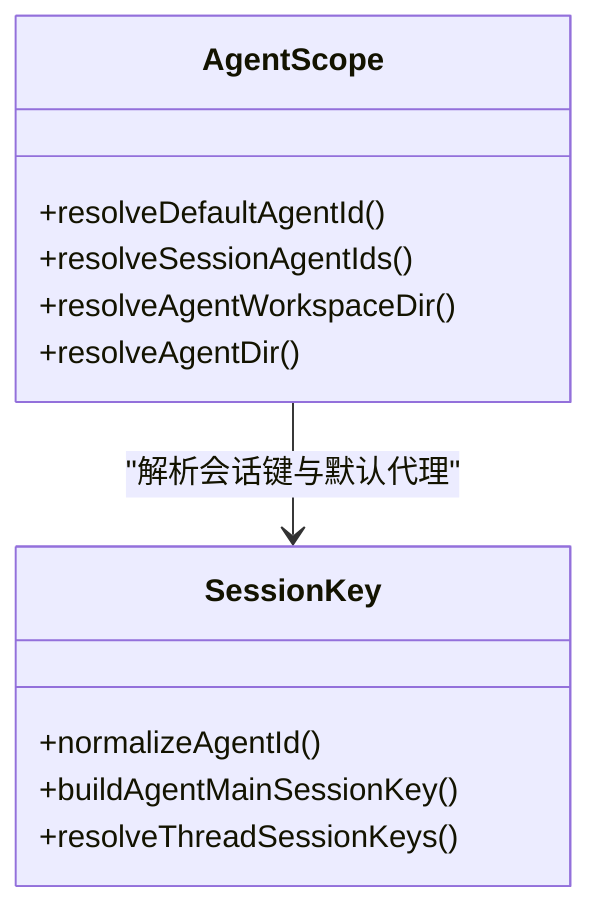
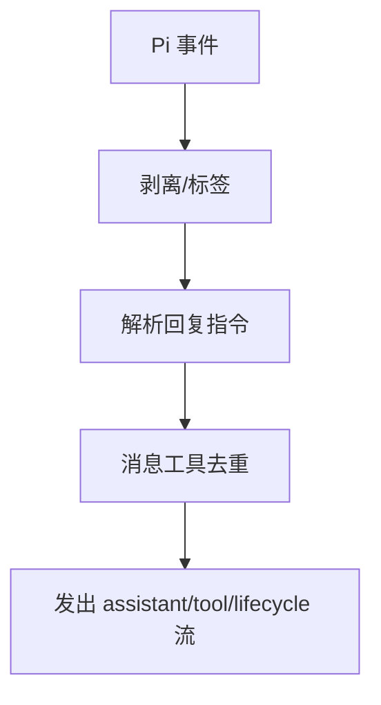
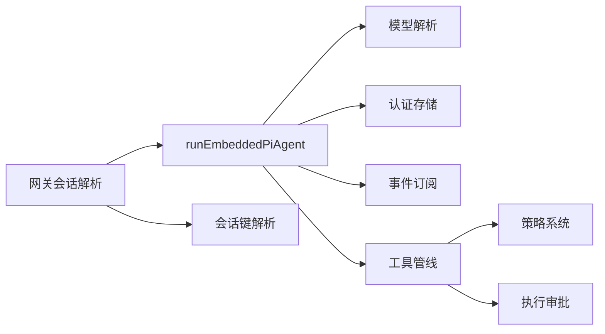

# 智能代理系统

## 目录
1. [引言](#引言)
2. [项目结构](#项目结构)
3. [核心组件](#核心组件)
4. [架构总览](#架构总览)
5. [详细组件分析](#详细组件分析)
6. [依赖关系分析](#依赖关系分析)
7. [性能考量](#性能考量)
8. [故障排查指南](#故障排查指南)
9. [结论](#结论)
10. [附录](#附录)

## 引言
本文件面向 OpenClaw 的智能代理系统，聚焦以下目标：
- 解释代理引擎的架构设计与运行机制（Pi Agent 核心的嵌入式运行、RPC 调用与事件桥接）
- 深入讲解模型适配器、多模型支持与模型切换策略
- 阐述代理配置管理、会话状态跟踪与上下文窗口管理
- 详解工具执行系统：工具注册、权限控制与执行安全
- 解释代理路由策略、多代理协作与会话隔离机制
- 提供代理开发指南：自定义代理创建、工具扩展与模型集成
- 给出性能优化、错误处理与调试技巧
- 提供可操作的代理配置示例与使用场景

## 项目结构
OpenClaw 将“Pi 集成”作为智能代理的核心，通过嵌入式方式直接调用 pi 的运行时，而非传统 RPC 或子进程模式。关键目录与职责概览：
- agents：代理运行时、工具体系、模型解析、会话订阅、扩展与策略
- gateway：网关层入口（RPC/CLI），负责参数校验、会话解析与生命周期事件桥接
- infra：系统级能力（如执行审批）
- routing：会话键解析与路由策略
- tui：终端交互界面（可选）

## 核心组件
- 嵌入式运行器：负责队列化串行执行、模型与认证解析、会话构建、事件订阅与超时控制，并产出标准化结果与用量元数据
- 工具管线：统一工具签名、参数规范化、策略过滤、插件组合并、中止信号包装与钩子注入
- 模型适配器：发现与注册模型、兼容性归一化、内联模型与别名支持
- 事件订阅桥接：将 pi 的内部事件映射为 OpenClaw 的流式输出（assistant/tool/lifecycle）
- 执行审批与安全：跨平台的系统运行审批、白名单与权限控制
- 会话与路由：会话键规范化、主会话与子代理键、存储路径解析与隔离

## 架构总览
OpenClaw 的代理循环由“RPC/CLI 入口 → 网关会话准备 → 嵌入式运行器 → 事件订阅 → 生命周期等待”构成。运行器内部通过“会话队列 + 模型/认证解析 + 事件桥接 + 超时/重试/降级”保障一致性与鲁棒性。

## 详细组件分析

### 代理引擎与 RPC 模式
- RPC 入口负责参数验证、会话解析与立即返回 runId；随后在后台串行执行代理命令
- 运行器在会话级与全局级队列中串行化执行，避免竞态并保持历史一致
- 订阅桥接将 pi 的内部事件映射为 OpenClaw 的三类流：assistant、tool、lifecycle
- `agent.wait` 仅等待生命周期结束/错误，不中断运行

### 模型适配器与多模型支持
- 发现与注册：运行器通过 `discoverAuthStorage` 与 `discoverModels` 获取认证与模型注册表
- 查找与兼容：优先从注册表查找，找不到则尝试内联模型与别名；必要时构造兼容模型以支持本地/模拟场景
- 别名与内联：支持 `agents.defaults.models` 中的别名映射与 `models.providers` 的内联模型注入
- 上下文窗口与降级：运行器对上下文窗口进行评估与告警/阻断，必要时触发降级或失败回退

### 工具执行机制与策略
- 工具管线：基础工具（read/write/edit）被替换为 OpenClaw 版本（含沙箱/参数规范化），并注入消息、浏览器、画布、会话、计划等工具
- 策略过滤：按 profile/provider/profile+provider/全局/代理/群组/沙箱/子代理维度合并与展开策略，剔除未知条目并允许插件组
- Schema 规范化：针对不同供应商（如 Gemini/OpenAI）进行 schema 清洗与兼容
- 中止与钩子：为工具包裹 AbortSignal 并注入 `before_tool_call` 钩子，便于拦截与审计
- 执行安全：`exec`/`process` 工具受安全级别、ask 策略与白名单控制，必要时触发审批流程

### 执行审批与安全
- 审批通道：通过本地 socket 请求审批，支持超时与令牌校验
- 平台侧控制：macOS Node 模式中对系统运行进行 deny/allowlist/full 三级安全控制，并支持 ask 策略与白名单持久化
- 审批决策：根据 ask/security/allowlist/skillAllow 组合决定 allow-once/allow-always/deny

### 会话状态跟踪与上下文窗口管理
- 会话键规范：支持 agentId/main/thread 等多维组合，提供规范化与解析函数
- 存储键解析：将用户输入的会话键解析为最终存储键，并确定所属 agentId 与存储路径
- 主会话与子代理：支持 `subagent:` 前缀与 `per-*` 作用域策略
- 上下文窗口：运行器在每次尝试前评估上下文窗口，低阈值告警，过小直接阻断；溢出时尝试自动压缩

### 代理路由策略与多代理协作
- 默认代理与会话绑定：根据会话键解析出 sessionAgentId，默认代理用于兜底
- 多代理工作区：每个代理拥有独立工作区与 agentDir，避免冲突
- 子代理与继承：子代理会继承父会话策略，同时可叠加自身工具策略
- TUI 会话切换：TUI 层维护当前代理与会话键，支持初始化与动态切换

### 事件流与回复整形
- 事件流：assistant/tool/lifecycle 三类流，分别承载模型输出、工具执行与生命周期
- 回复整形：剥离 `<think>`/`<final>` 标签、解析回复指令（媒体/语音/回复到某条消息）、去重（消息工具重复发送）
- 思维流：可选择单独流式输出或作为块回复的一部分

### 错误处理与重试/降级
- 错误分类：上下文溢出、角色顺序错误、图像尺寸/维度错误、鉴权/速率限制/配额/超时等
- 自动压缩：上下文溢出时尝试自动压缩，成功后重试
- 认证轮换：失败时标记冷却并轮换认证档案，支持失败回退
- 思维层级降级：当模型不支持当前思维层级时自动降级重试

## 依赖关系分析
- 运行器对模型解析、认证存储、会话管理与事件订阅存在强耦合
- 工具管线依赖策略系统、插件元数据与参数规范化
- 执行审批横切于工具执行链路，与平台侧实现协同
- 会话键解析贯穿网关与工具层，确保路由与隔离

## 性能考量
- 队列化串行：通过会话/全局队列避免并发竞争，减少磁盘争用与状态不一致
- 上下文窗口预检：提前评估上下文，避免无效往返
- 自动压缩：在溢出时自动压缩，降低失败率
- 事件缓冲与块回复：合理设置块回复分片与思维流策略，平衡延迟与可读性
- 插件与工具策略：最小化可用工具集，减少 schema 校验与传输开销

## 故障排查指南
- 上下文溢出：检查提示长度、历史修剪与自动压缩策略
- 角色顺序错误：使用 `/new` 新建会话，避免历史消息导致的角色冲突
- 图像尺寸/维度错误：调整图像大小或分辨率
- 认证失败/速率限制：检查认证档案轮换与冷却策略，必要时切换账号
- 执行被拒：检查 ask/security/allowlist 设置，必要时更新白名单或提升安全级别
- 事件未达：确认订阅桥接已正确初始化且未被提前取消

## 结论
OpenClaw 通过“嵌入式 Pi 运行器 + 策略化的工具管线 + 严格的会话与执行审批”构建了高可靠、可扩展、可审计的智能代理系统。其架构在保证安全性的同时，提供了灵活的多模型、多代理与多渠道集成能力，适合复杂业务场景下的自动化与智能化需求。

## 附录

### 代理开发指南
- 自定义代理
  - 在 agents 配置中新增代理条目，设置默认工作区与 agentDir
  - 使用 `agent-scope` 解析默认代理与工作区，确保隔离
- 工具扩展
  - 通过插件工具元数据与策略系统注册新工具
  - 使用参数规范化与 schema 清洗适配不同供应商
- 模型集成
  - 在 `models-config` 中声明内联模型或覆盖 provider 配置
  - 使用模型别名简化引用

### 会话与路由实践
- 会话键建议：使用 `agentId:main` 或 `agentId:dm/群组/频道:peerId` 的形式
- 主会话与线程：通过 `resolveThreadSessionKeys` 生成带线程后缀的键
- 存储路径：使用 `gateway/session-utils` 解析最终存储路径，确保隔离

### 实际使用场景
- 多渠道消息聚合：通过会话键区分不同渠道与群组，使用工具策略限制敏感操作
- 执行审批：对系统运行开启 ask/security 控制，结合白名单与批准记录
- 模型切换：在 `agents.defaults.models` 中配置别名，运行时按需切换