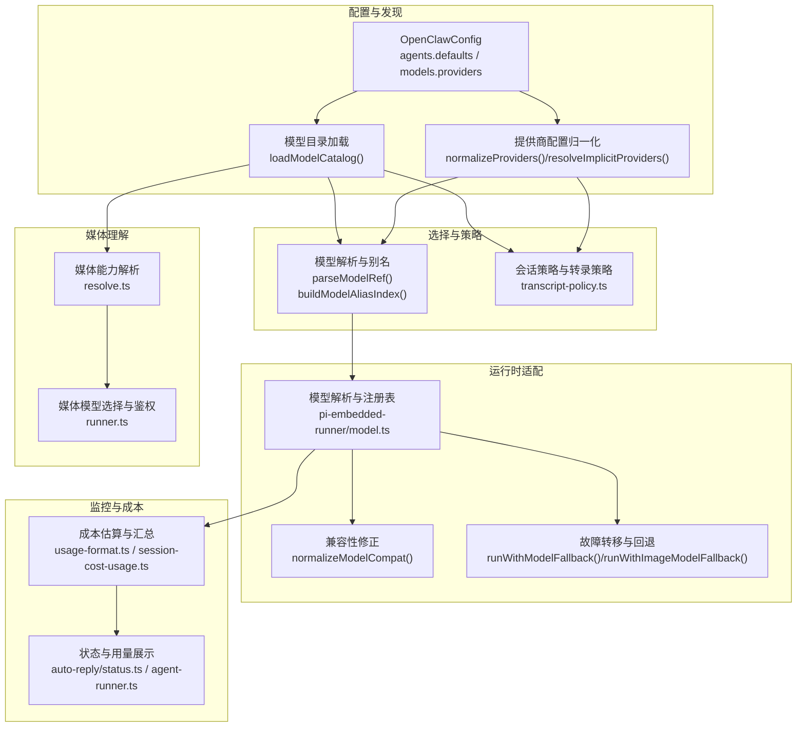
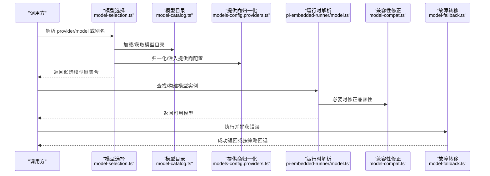
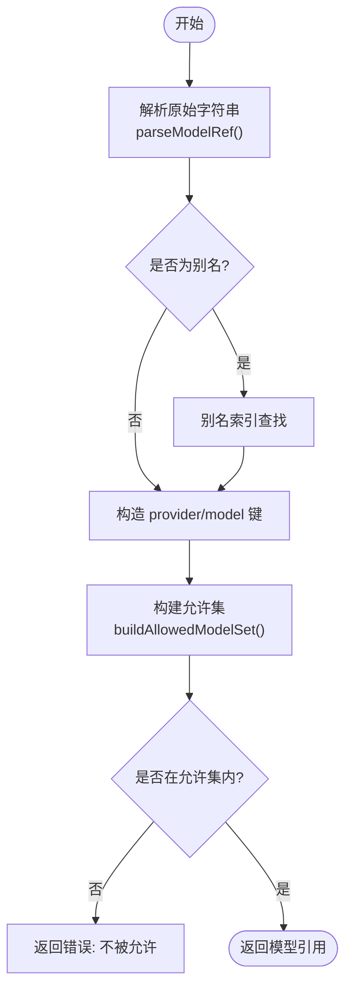
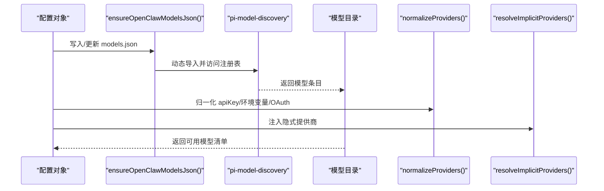
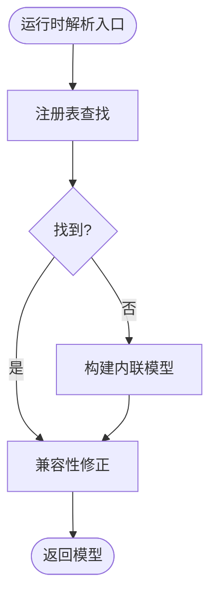
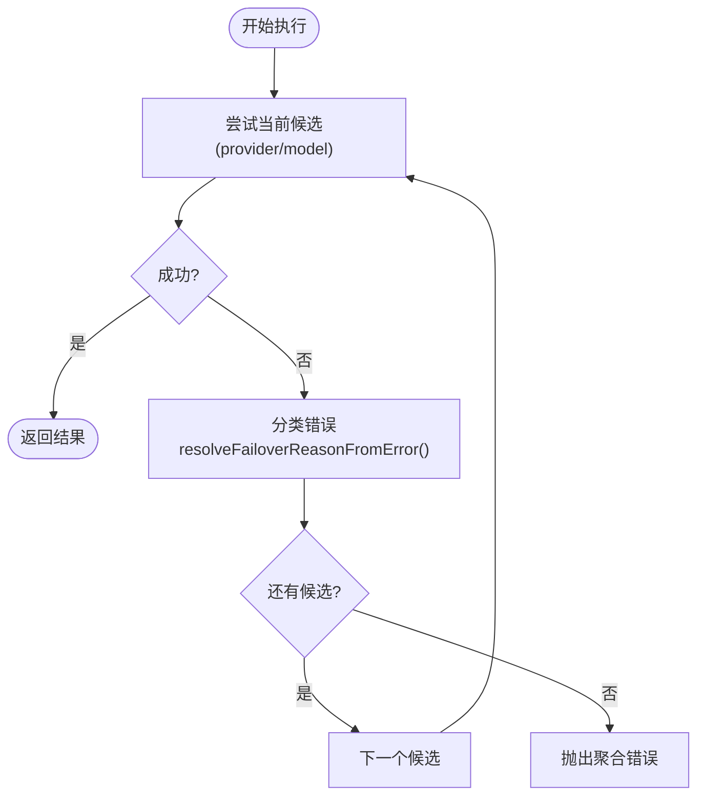
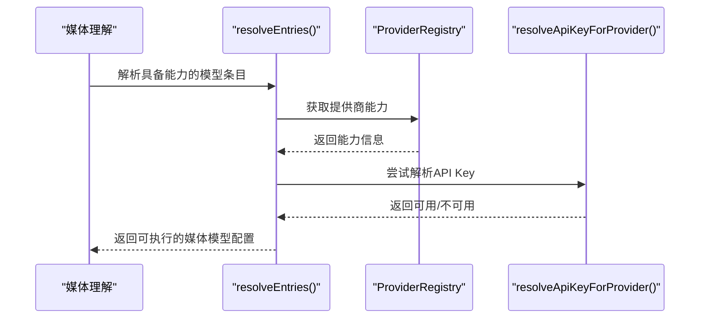
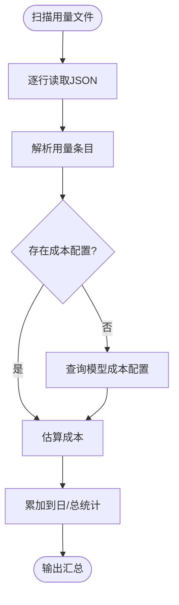
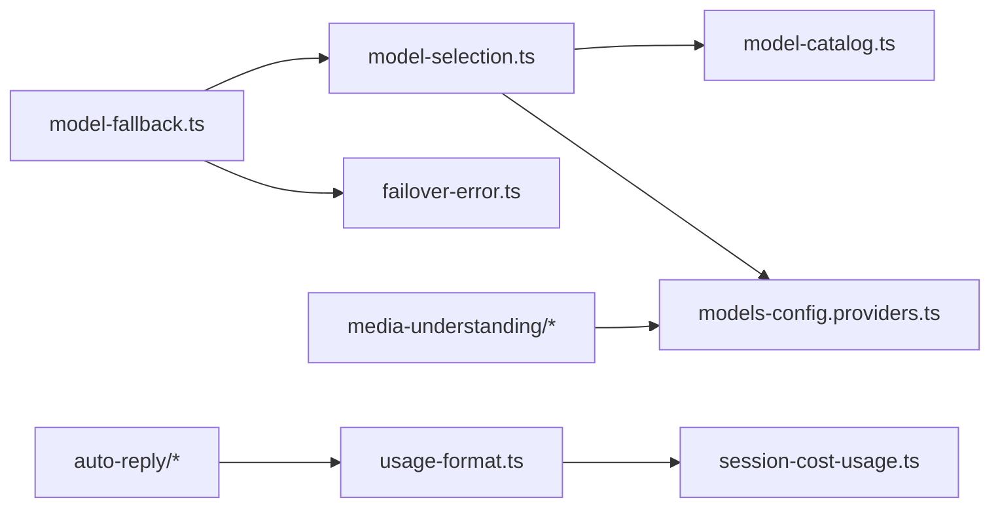

# 模型适配器

## 目录
1. [简介](#简介)
2. [项目结构](#项目结构)
3. [核心组件](#核心组件)
4. [架构总览](#架构总览)
5. [详细组件分析](#详细组件分析)
6. [依赖关系分析](#依赖关系分析)
7. [性能考量](#性能考量)
8. [故障排查指南](#故障排查指南)
9. [结论](#结论)
10. [附录](#附录)

## 简介
本文件面向 OpenClaw 的“模型适配器”系统，系统性阐述其架构设计、适配策略、多模型支持、模型选择与负载均衡、模型提供商集成（OpenAI、Anthropic、Google Gemini 等）、模型切换与故障转移、认证与路由、兼容性检查与参数转换、响应处理、监控与成本控制，以及新增模型与配置管理的最佳实践。

## 项目结构
围绕模型适配器的关键模块分布于 `agents`、`commands`、`infra`、`utils`、`media-understanding` 等目录，配合 Swift 前端的模型目录加载器，形成从配置到运行时选择、从认证到成本统计的完整链路。

## 核心组件
- 模型目录与发现：负责加载并缓存可用模型清单，支持本地与嵌入式 SDK 发现。
- 提供商配置归一化：统一处理 API Key、环境变量、OAuth 令牌、默认 Base URL 等，自动注入隐式提供商。
- 模型选择与别名：解析 `provider/model` 字符串、别名映射、允许集与默认模型。
- 运行时模型解析与兼容：通过注册表查找或内联定义模型，必要时做兼容性修正。
- 故障转移与回退：基于错误分类与认证配置，按候选列表顺序尝试，支持图像模型专用回退。
- 媒体理解路由：根据能力（文本/图像/音频/视频）与鉴权状态选择合适模型。
- 成本与用量：从日志解析用量，结合模型定价配置估算成本，支持会话与历史汇总。

## 架构总览
模型适配器采用“配置驱动 + 运行时解析 + 失败回退”的分层架构：
- 配置层：`agents.defaults` 与 `models.providers` 定义默认模型、别名、允许集、图像模型等。
- 解析层：模型字符串解析、别名索引、允许集构建、默认模型解析。
- 发现层：模型目录加载、提供商隐式注入、本地模型发现（如 Ollama）。
- 适配层：注册表查找、内联模型、兼容性修正。
- 路由层：根据能力与策略选择模型；媒体理解按能力与鉴权选择。
- 回退层：失败分类与回退，支持用户中断与超时区分。
- 监控层：用量解析、成本估算、会话与历史统计。

## 详细组件分析

### 组件A：模型选择与别名索引
- 功能要点
  - 解析 `provider/model` 字符串，支持省略 provider 的默认回退与别名。
  - 构建别名索引，支持按别名快速定位模型键。
  - 允许集构建：尊重 `agents.defaults.models` 映射，支持 CLI 提供商直连。
  - 默认模型解析：优先 agent 级覆盖，其次全局默认，最后回退到已弃用的默认 provider。
- 关键流程

### 组件B：模型目录与提供商配置
- 模型目录
  - 动态加载模型目录，支持缓存与错误恢复，避免一次性失败污染缓存。
  - 支持本地与嵌入式 SDK 发现，过滤无效条目并排序。
- 提供商配置归一化
  - 自动修复 `apiKey` 写法、从环境变量与认证配置中填充密钥。
  - Google 模型 ID 规范化（如 Gemini 3），确保与目录一致。
  - 隐式提供商注入：MiniMax、Moonshot、Qwen Portal、Synthetic、Venice、Xiaomi、Ollama、Copilot、Bedrock 等。
- 关键流程

### 组件C：运行时模型解析与兼容性
- 运行时解析
  - 通过注册表查找模型；若未找到，基于配置生成内联模型定义。
  - 对内联模型执行兼容性修正（如 Zai 的 `developer role` 兼容）。
- 兼容性修正
  - 针对特定提供商/API 的差异进行字段修正，保证上层调用一致性。

### 组件D：故障转移与回退
- 失败分类与描述
  - 基于状态码、错误代码与消息关键字识别超时、限流、鉴权失败、格式错误等。
  - 将通用错误转换为 `FailoverError`，携带原因、状态、代码等上下文。
- 回退策略
  - 文本模型：按 `agents.defaults.model.fallbacks` 与默认模型构建候选集，逐个尝试。
  - 图像模型：独立候选集，优先使用 `agents.defaults.imageModel.primary/fallbacks`。
  - 认证配置：检查各提供商配置文件顺序与冷却状态，跳过不可用配置。
- 关键流程

### 组件E：媒体理解模型选择与鉴权
- 能力解析：根据工具配置与共享模型，筛选具备对应能力（音频/图像/视频）的模型。
- 提供商能力：检查提供商是否支持相应能力（如转录/图像描述/视频描述）。
- 鉴权校验：逐一尝试解析提供商 API Key，仅返回可鉴权的候选。

### 组件F：认证与路由
- 认证选择与应用
  - 针对 Gemini 等提供商，支持交互式输入或环境变量预填 API Key，并应用认证配置。
  - 可设置默认模型（如 Google Gemini），并在交互中提示。
- 转录策略
  - 基于 `provider/modelId/modelApi` 判断是否 Anthropic、Mistral、Google、OpenRouter Gemini 等，决定对话策略与转录行为。

### 组件G：监控、用量与成本控制
- 用量解析与成本估算
  - 从日志逐行解析 JSON，提取用量并估算成本；若缺失成本配置则查询模型定价。
- 会话与历史统计
  - 支持按天聚合、30 天汇总，显示会话成本、令牌用量与缺失项标记。
- 响应用量展示
  - 在回复中按模式显示用量与成本，受认证模式影响（API Key 模式下显示成本）。

## 依赖关系分析
- 模块耦合
  - `model-selection` 依赖 `model-catalog` 与 `models-config.providers` 的结果。
  - `model-fallback` 依赖 `model-selection` 的候选构建与 `failover-error` 的错误分类。
  - `media-understanding` 依赖 provider 注册表与鉴权解析。
  - `cost` 与 `usage` 依赖模型定价配置与日志解析。
- 外部依赖
  - 动态导入 `pi-model-discovery` 用于模型目录发现。
  - 测试中可替换动态导入以模拟依赖问题，避免缓存污染。

## 性能考量
- 缓存与重试
  - 模型目录加载带缓存与失败回退，避免重复失败污染缓存。
  - 回退过程中区分用户主动中断与超时，避免无意义的继续尝试。
- 本地模型发现
  - Ollama 等本地模型发现设置超时，失败时快速降级。
- 成本估算
  - 用量解析按行流式处理，忽略异常行，降低内存压力。

## 故障排查指南
- 常见问题与定位
  - 模型不可用：检查 `agents.defaults.models` 是否包含该模型键；确认提供商 API Key 是否正确注入。
  - 回退不生效：确认 `fallbacks` 列表与 `allowlist`；检查认证配置文件是否全部处于冷却。
  - 超时/中断：区分 `AbortError` 与 `TimeoutError`，前者直接抛出，后者触发回退。
  - 成本缺失：确认模型定价配置是否存在；日志中缺少计费字段时会尝试查询配置。
- 建议步骤
  - 使用 `/models` 列表核对可用模型与别名。
  - 使用 `/model` 或别名切换模型。
  - 使用 `/usage` 查看会话/当日/30 天成本与令牌用量。
  - 检查认证配置与环境变量，必要时重新应用认证。

## 结论
OpenClaw 的模型适配器通过“配置驱动 + 运行时解析 + 失败回退 + 成本监控”的闭环，实现了对多提供商、多模型的灵活适配与稳健运行。其设计强调可扩展性（隐式提供商注入、内联模型）、可观测性（用量与成本）、以及可维护性（别名索引、允许集、兼容性修正）。对于新增模型与提供商，遵循现有归一化与注入流程，即可快速集成并纳入回退与成本统计体系。

## 附录

### 新增模型与提供商集成指南
- 新增提供商
  - 在 `models.providers` 中定义 `baseUrl`、`api`、可选 `auth` 与 `models` 数组。
  - 若需要隐式注入，可在 `resolveImplicitProviders` 中添加逻辑并填充 `apiKey`。
  - 如需特殊 ID 规范化（如 Google Gemini 3），在 `normalizeProviders` 中处理。
- 新增模型
  - 在 `models.json` 或 providers 配置中添加模型定义，包含 `id`/`name`/`contextWindow`/`maxTokens`/`cost`/`input`/`reasoning` 等。
  - 通过 `ensureOpenClawModelsJson` 生成/更新模型清单。
- 别名与允许集
  - 在 `agents.defaults.models` 中为模型设置别名，并在 `allowlist` 中启用。
  - 使用 `buildModelAliasIndex` 与 `buildAllowedModelSet` 确保解析与回退逻辑生效。
- 认证与路由
  - 通过 `auth-choice.apply.api-providers.ts` 应用认证配置，必要时设置默认模型。
  - 使用 `transcript-policy.ts` 判断策略分支（如 Anthropic/Gemini/OpenRouter 等）。
- 监控与成本
  - 确保模型定价配置存在；使用 `session-cost-usage.ts` 与 `usage-format.ts` 进行成本估算与汇总。
  - 在回复中按模式显示用量与成本，受认证模式影响。

### 实际配置示例与最佳实践
- 示例：Google Gemini 默认模型设置与 ID 规范化
  - 参考测试用例，确认 Google 模型 ID 被规范化为带有 `preview` 的版本，并写入 `models.json`。
- 最佳实践
  - 为常用模型设置别名，便于命令行切换。
  - 为每个提供商准备多个认证配置文件，按优先级与冷却策略使用。
  - 为图像/文本模型分别配置独立回退列表，避免跨能力误用。
  - 在生产环境开启模型目录缓存，减少动态导入失败的影响。
  - 使用 `/usage` 与成本估算定期评估开销，调整模型与回退策略。

### 前端模型目录加载（Swift）
- macOS 前端通过 `ModelCatalogLoader.swift` 加载模型目录，支持缓存、Bundle 与 `node_modules` 备选路径，并可缓存目录以提升性能。