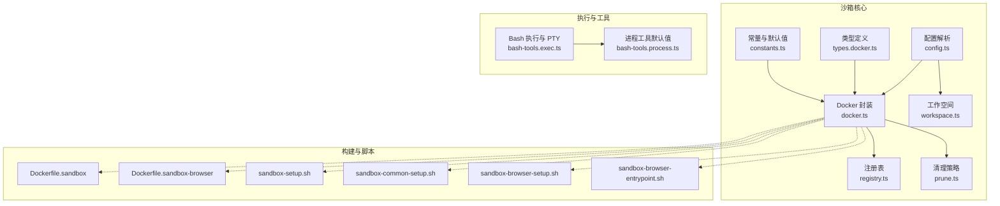
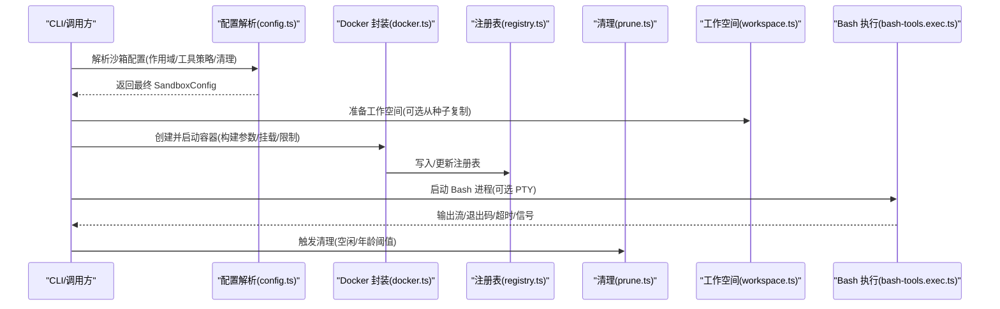
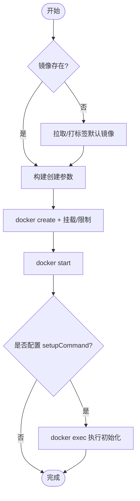
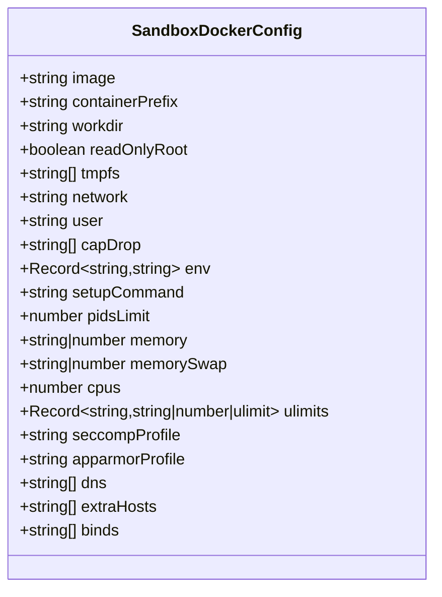
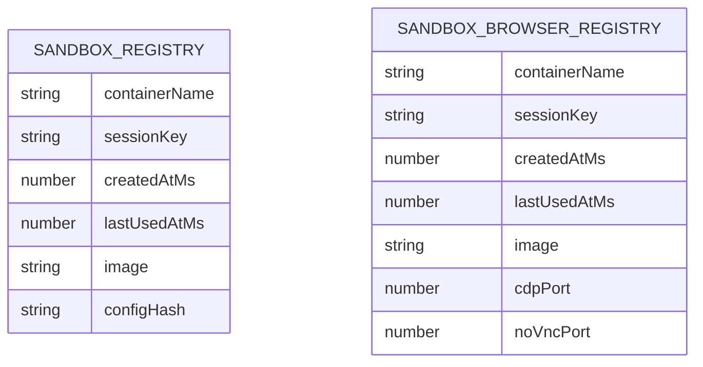
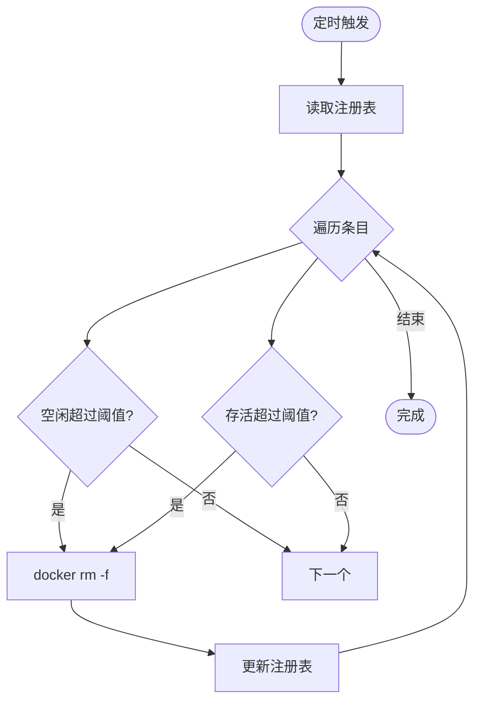
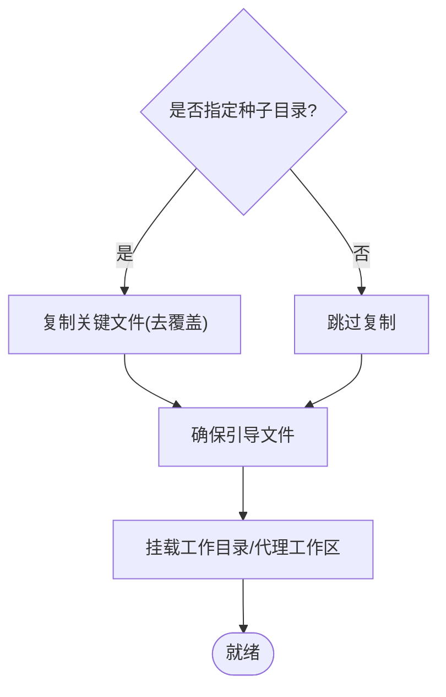
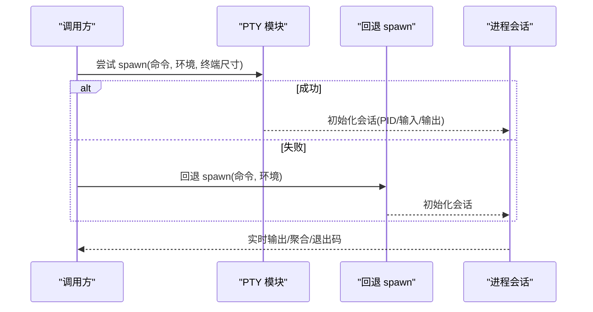
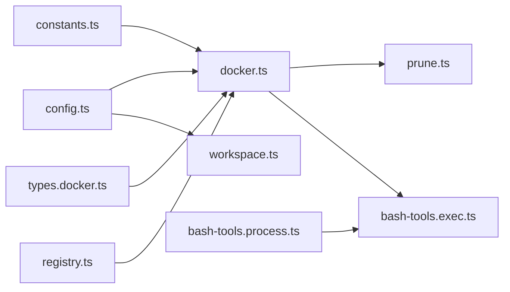

# 沙箱执行环境

## 目录
1. [简介](#简介)
2. [项目结构](#项目结构)
3. [核心组件](#核心组件)
4. [架构总览](#架构总览)
5. [详细组件分析](#详细组件分析)
6. [依赖关系分析](#依赖关系分析)
7. [性能考量](#性能考量)
8. [故障排除指南](#故障排除指南)
9. [结论](#结论)
10. [附录](#附录)

## 简介
本文件面向 OpenClaw 的沙箱执行环境，系统性阐述其容器化隔离、进程与资源控制、配置与启动参数、代理与工作空间管理、文件系统隔离、Bash 工具执行与 PTY 支持、交互式会话处理、执行主机管理、进程注册与资源监控，以及开发与运维最佳实践。内容基于仓库中沙箱实现与相关脚本、配置与文档进行归纳总结，帮助读者在理解整体设计的同时，快速定位到具体实现与使用方式。

## 项目结构
围绕沙箱执行环境的相关代码主要集中在以下位置：
- 核心沙箱逻辑：src/agents/sandbox/*
- Bash 工具与交互式执行：src/agents/bash-tools.exec.ts、src/agents/bash-tools.process.ts
- CLI 文档与概念文档：docs/cli/sandbox.md、docs/gateway/sandboxing.md、docs/concepts/agent-workspace.md
- 构建与运行时脚本：scripts/sandbox-*.sh、Dockerfile.sandbox、Dockerfile.sandbox-browser

## 核心组件
- 配置解析与默认值：负责从全局与代理维度合并沙箱配置，生成最终的 Docker 参数、浏览器参数与清理策略。
- Docker 封装：封装 docker 命令调用、镜像检查与拉取、容器创建与启动、端口查询、标签与资源限制注入等。
- 注册表与状态：持久化记录容器与浏览器容器的元信息（名称、会话键、创建/最后使用时间、镜像、配置哈希）。
- 清理策略：按空闲时长与最大存活天数清理过期容器，避免资源泄露。
- 工作空间：确保沙箱工作目录存在，并可从种子目录复制关键文件（如代理配置、工具清单等）。
- Bash 执行与 PTY：支持交互式会话、PTY 终端仿真、超时与退出码处理、输出聚合与截断、信号处理与回退机制。
- 类型与常量：统一 Docker 配置字段、默认镜像与前缀、默认工作目录、默认工具白名单/黑名单、端口与状态路径等。

## 架构总览
下图展示沙箱从配置解析到容器生命周期管理、工作空间准备、Bash 执行与 PTY 交互的整体流程。

## 详细组件分析

### Docker 容器化与执行隔离
- 镜像管理：自动检查镜像是否存在，不存在则拉取或打标签；支持默认镜像与自定义镜像。
- 容器创建：通过构建参数函数生成 `docker create` 命令行，注入只读根文件系统、tmpfs、网络、用户、能力降级、安全选项（no-new-privileges、seccomp、AppArmor）、DNS、额外主机、PID/内存/CPU/ulimit、绑定挂载等。
- 启动与初始化：创建后立即 start，若配置了 `setupCommand` 则进入容器执行初始化命令。
- 端口查询：支持查询容器暴露端口映射。
- 配置哈希与热容器：对容器配置进行哈希比对，若配置变更且容器近期活跃，则提示重建以应用新配置；否则删除旧容器并重新创建。

### 配置管理与启动参数
- 配置来源：全局配置与代理特定配置合并，优先级由作用域决定（agent/session/shared）。
- Docker 参数：镜像、容器前缀、工作目录、只读根、tmpfs、网络、用户、能力降级、安全选项、DNS、hosts、PID/内存/CPU/ulimit、绑定挂载、环境变量、CPU 密度、seccomp/AppArmor 策略等。
- 浏览器参数：启用/禁用、镜像、前缀、CDP/VNC/noVNC 端口、无头模式、自动启动与超时等。
- 清理策略：空闲小时数与最大存活天数，用于定时清理。
- 工具策略：默认允许/拒绝工具集合，结合代理策略进行细化。

### 注册表与执行主机管理
- 注册表：记录容器/浏览器容器的名称、会话键、创建/最后使用时间、镜像、配置哈希；提供读写与去重更新。
- 执行主机：通过注册表维护容器生命周期与状态，便于列表、移除与一致性校验。
- 状态路径：容器注册表与浏览器注册表分别持久化至状态目录。

### 资源清理与监控
- 清理策略：按空闲时长与最大存活天数扫描注册表条目，删除过期容器并更新注册表；失败不中断后续清理。
- 监控：通过注册表记录创建/使用时间，结合 prune 任务定期执行；支持检查容器运行状态与镜像匹配情况。

### 工作空间管理与文件系统隔离
- 工作空间准备：确保目录存在，可从种子目录复制关键文件（代理、工具、身份、心跳等），并保证引导文件齐全。
- 文件系统隔离：通过只读根、tmpfs、绑定挂载与工作目录映射实现最小权限访问；支持主工作区与代理工作区的独立挂载与只读标记。

### Bash 工具执行、PTY 支持与交互式会话
- PTY 支持：优先尝试 node-pty 启动交互式终端，失败则回退到普通子进程；自动处理光标查询响应与 EOF。
- 进程注册：将会话加入进程注册表，记录 PID、工作目录、输出缓冲、超时与退出状态；支持通知退出与后台化。
- 超时与信号：统一处理超时、信号终止与退出码，聚合输出并按策略截断；支持警告收集与重试提示。
- 工具默认值：提供进程工具的默认清理周期与作用域键等配置项。

### 代理配置与工具策略
- 默认工具策略：内置允许/拒绝工具集合，结合代理维度进行细化与覆盖。
- 策略来源：全局与代理的 sandbox.tools.allow/deny 合并，形成最终策略集。

### 沙箱代理与工作空间
- 代理维度：支持 perSession 与 perAgent 两种作用域，影响容器命名与生命周期。
- 工作空间：支持主工作区与代理工作区的独立挂载，可选择只读挂载；默认根目录位于用户家目录下的 `.openclaw/sandboxes`。

## 依赖关系分析
- 组件耦合：配置解析依赖常量与工具策略；Docker 封装依赖配置、注册表与常量；清理模块依赖注册表；工作空间依赖通用工作区工具；Bash 执行依赖进程工具默认值。
- 外部依赖：Docker 命令行、node-pty（可选）、宿主机文件系统与网络栈。
- 可能的循环：当前文件间未见直接循环导入；各模块职责清晰，通过函数与类型接口交互。

## 性能考量
- 资源限制：合理设置 CPU、内存、ulimit 与 pids-limit，避免单个沙箱占用过多宿主资源。
- 文件系统：使用 tmpfs 缓存临时数据，减少磁盘 IO；只读根可降低写放大风险。
- 网络：默认 none 网络可显著降低逃逸面；需要网络时再显式配置。
- 清理策略：适度缩短空闲与最大存活时间，平衡复用与资源回收。
- PTY：仅在需要交互式体验时启用，避免不必要的终端开销。

## 故障排除指南
- 容器无法启动/状态异常
  - 使用列表与状态检查容器运行状态与镜像匹配情况。
  - 若配置变更导致热容器，遵循提示进行重建。
- 镜像缺失
  - 确认默认镜像或自定义镜像已存在；必要时拉取或打标签。
- 端口映射问题
  - 使用端口查询功能确认映射是否正确。
- 清理失败
  - prune 模块对失败进行忽略，不影响其他条目；可在日志中查看错误信息。
- Bash 执行失败
  - 查看回退日志与警告信息；检查超时、信号与退出码；确认环境变量与工作目录。
- 绑定挂载无效
  - 确认 binds 数组格式正确；测试 `-v` 参数生成是否符合预期。

## 结论
OpenClaw 的沙箱执行环境以 Docker 为核心隔离手段，结合严格的资源限制、文件系统隔离与注册表状态管理，提供了可控、可观测且可维护的执行边界。配合 Bash 交互式执行与 PTY 支持，既满足自动化任务，也兼顾人机交互场景。通过配置解析与清理策略，系统在安全性与可用性之间取得平衡，适合在多代理、多会话的复杂环境中稳定运行。

## 附录

### 开发与运维指南
- 自定义沙箱配置
  - 在全局或代理配置中设置 docker/browser/prune/tools 字段，覆盖默认行为。
  - 使用只读根与 tmpfs 提升隔离强度；按需开启 DNS/hosts 与绑定挂载。
- 安全策略
  - 默认降级所有能力并启用 no-new-privileges；必要时加载 seccomp/AppArmor 策略。
  - 严格控制工具策略，避免开放高危工具。
- 性能优化
  - 合理设置 CPU/内存/ulimit；利用 tmpfs；关闭不需要的网络。
- 调试与审计
  - 使用 CLI 文档中的 sandbox 子命令进行容器与浏览器管理。
  - 关注注册表与日志，核对配置哈希与镜像版本一致性。

### 实际配置示例与最佳实践
- 示例：最小化隔离
  - 只读根 + tmpfs + 空网络 + 能力降级 + 严格 ulimit。
- 示例：开发调试
  - 允许必要网络与 DNS；开启绑定挂载以便本地调试；设置较高超时。
- 示例：生产安全
  - 严格工具策略；启用 seccomp/AppArmor；限制 CPU/内存；短空闲/最大存活时间。
- 最佳实践
  - 为不同代理/会话设定独立作用域，避免共享状态污染。
  - 定期清理过期容器，保持宿主机整洁。
  - 使用种子工作区模板，确保一致的初始环境。