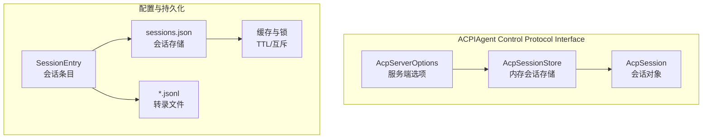
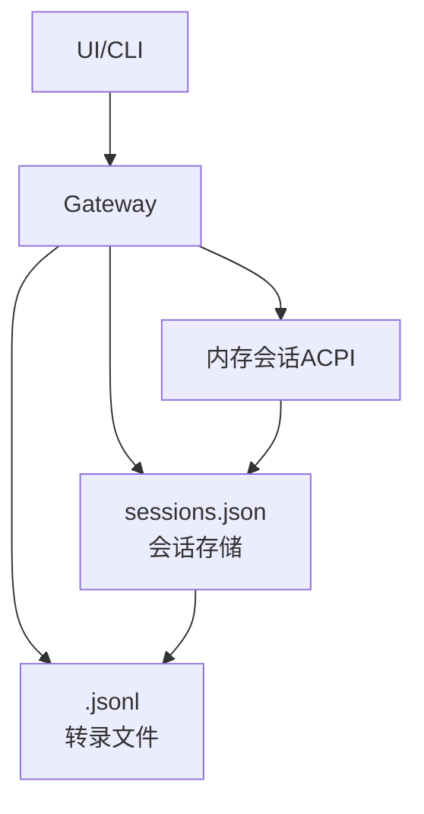
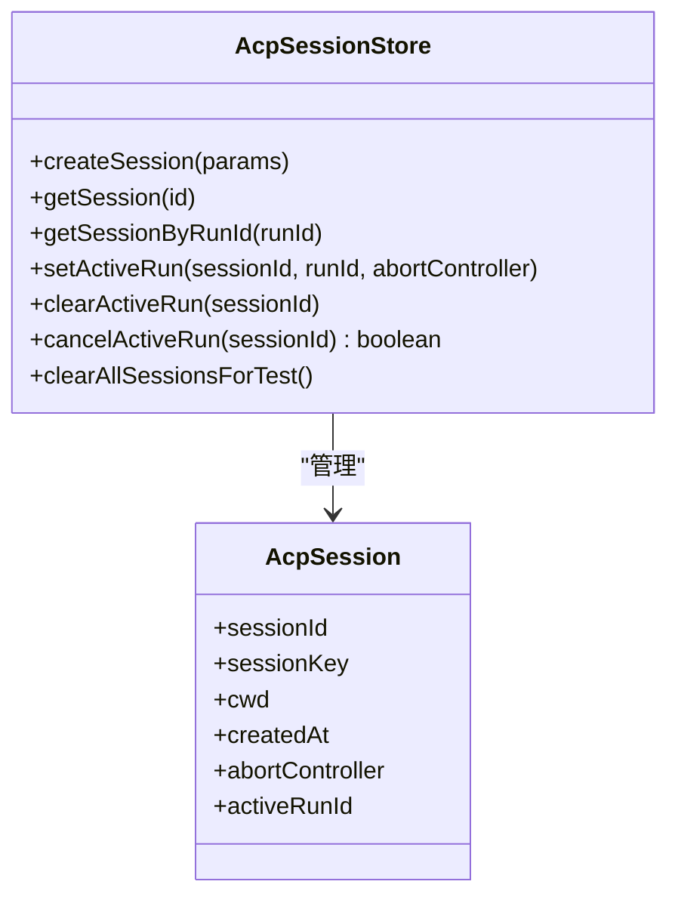
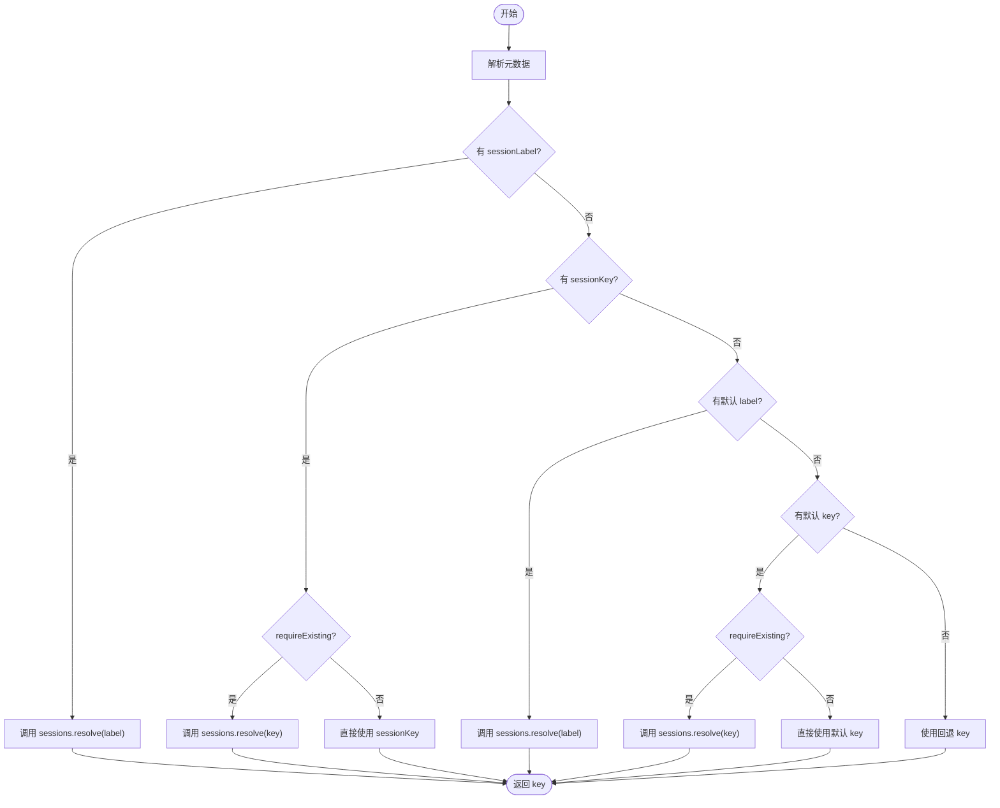
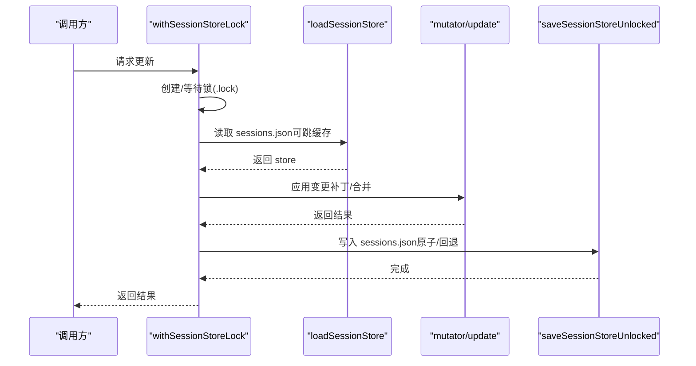
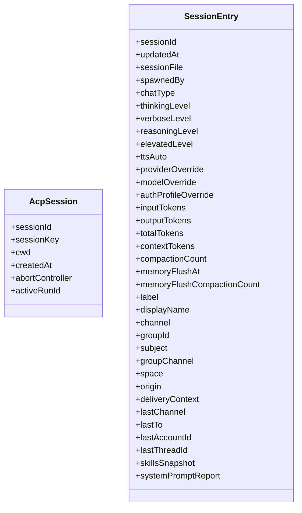
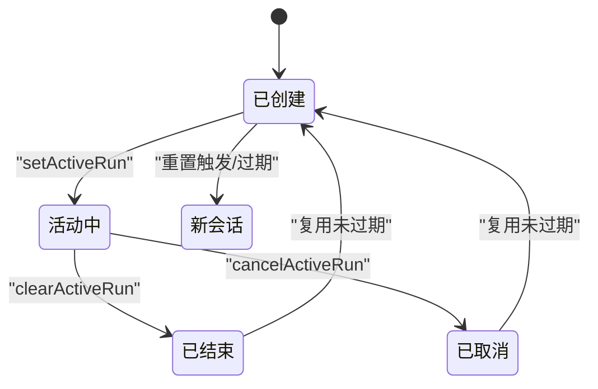
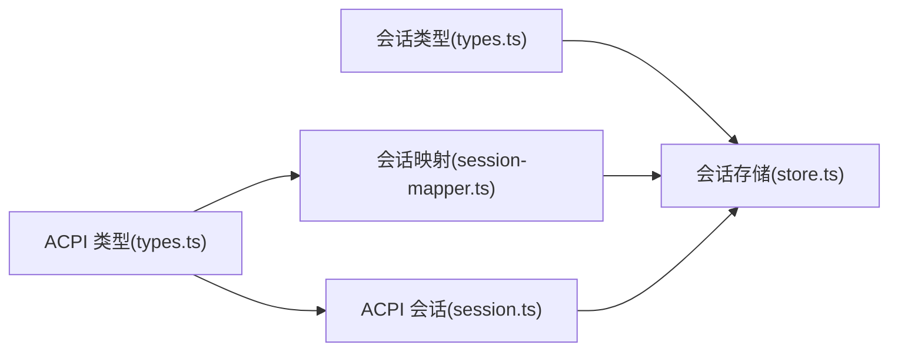

# 会话状态管理

## 目录
1. [简介](#简介)
2. [项目结构](#项目结构)
3. [核心组件](#核心组件)
4. [架构总览](#架构总览)
5. [组件详解](#组件详解)
6. [依赖关系分析](#依赖关系分析)
7. [性能考量](#性能考量)
8. [故障排查指南](#故障排查指南)
9. [结论](#结论)
10. [附录](#附录)

## 简介
本文件系统性阐述 OpenClaw 的会话状态管理机制，覆盖数据结构、字段定义、状态转换规则、持久化策略、内存缓存与并发控制、版本迁移与兼容性、增量更新与事务、备份恢复与一致性校验，并提供面向开发者的扩展接口与自定义存储后端实现建议。内容以仓库现有实现与文档为依据，避免臆测。

## 项目结构
围绕“会话状态”的关键代码与文档分布如下：
- ACP 层：会话生命周期与运行时状态（内存存储）
  - `session.ts`
  - `session-mapper.ts`
  - `types.ts`
  - `session.test.ts`
  - `session-mapper.test.ts`
- 配置与持久化层：会话存储（sessions.json）、转录（*.jsonl）、缓存与锁
  - `sessions.ts`
  - `store.ts`
  - `types.ts`
- 概念与参考文档：会话键规则、生命周期、修剪与压缩、来源权威性等
  - `session.md`
  - `session-pruning.md`
  - `session-management-compaction.md`

## 核心组件
- ACPI 会话存储（内存）
  - 提供创建、查询、活动运行绑定与取消、清理等能力；支持按 `sessionId` 与 `runId` 双索引。
- 会话映射器
  - 解析会话键（`sessionKey`）或标签（`sessionLabel`），支持“要求已存在”与“重置”策略。
- 会话存储（磁盘）
  - `sessions.json` 记录会话元数据；`*.jsonl` 记录对话历史树；提供缓存、锁、迁移与规范化。
- 会话类型
  - 定义 `AcpSession` 与 `SessionEntry` 字段、合并策略、来源与投递上下文等。

## 架构总览
OpenClaw 将“网关（Gateway）”作为会话状态的权威来源。UI 与 CLI 均应从网关查询状态，而非本地文件。会话状态由两层持久化组成：
- 会话存储（`sessions.json`）：键值映射，记录当前 `sessionId`、更新时间、令牌计数、模型与策略等。
- 转录（`*.jsonl`）：树形 JSONL 历史，承载消息、工具调用、压缩摘要等。

## 组件详解

### ACPI 会话存储（内存）
- 数据结构
  - `AcpSession`：包含 `sessionId`、`sessionKey`、`cwd`、`createdAt`、`abortController`、`activeRunId`。
  - `AcpSessionStore` 接口：创建、查询、按 `runId` 查询、设置/清除活动运行、取消活动运行、测试清理。
- 并发与一致性
  - 内部使用 Map 存储；未见显式并发锁；适合单进程内使用。
- 运行时行为
  - 绑定 `activeRunId` 与 `AbortController`，支持取消当前运行并清理映射。

### 会话映射与解析
- 元数据解析
  - 支持 `sessionKey`、`sessionLabel`、`resetSession`、`requireExisting`、`prefixCwd` 等键。
- 键解析优先级
  - 显式 `sessionLabel` > 显式 `sessionKey` > 默认 label/默认 key；可结合 `requireExisting` 判断是否强制已存在。
- 重置策略
  - 若 `meta` 或选项开启 `resetSession`，则通过网关调用 `sessions.reset`。

### 会话存储（磁盘）与缓存
- 文件布局
  - `sessions.json`：每 agent 一份，键为 `sessionKey`，值为 `SessionEntry`。
  - `*.jsonl`：会话转录，树形结构，包含消息、工具结果、压缩摘要等。
- 缓存与 TTL
  - 使用 Map 缓存 `sessions.json`，带加载时间与 mtime 校验；可通过环境变量调整 TTL。
- 写入与并发
  - 采用文件锁（`.lock`）串行写入，Windows 下回退到直接写；写入前失效缓存，保证一致性。
- 规范化与迁移
  - 对旧字段进行最佳努力迁移（如 `provider`→`channel`、`room`→`groupChannel`）。
- 增量更新
  - 提供 `updateSessionStore` 与 `updateSessionStoreEntry`，内部在锁内重读并应用补丁，再保存。

### 会话类型与字段定义
- `AcpSession`
  - 字段：`sessionId`、`sessionKey`、`cwd`、`createdAt`、`abortController`、`activeRunId`。
- `SessionEntry`
  - 字段：`sessionId`、`updatedAt`、`sessionFile`、`spawnedBy`、`chatType`、`toggle` 与策略、模型覆盖、令牌计数、压缩与内存刷新时间戳、标签与来源、投递上下文、最后路由、技能快照与系统提示报告等。
- 合并策略
  - `mergeSessionEntry`：若缺失则生成新 `sessionId`，取最大 `updatedAt`，浅合并。

### 生命周期与状态转换
- 生命周期
  - 复用策略：直到过期；过期评估发生在下一条入站消息；支持每日重置与空闲重置，二者取先到期者。
  - 手动触发：`/new` 或 `/reset` 开启新 `sessionId`，保留剩余消息。
- 状态转换
  - 创建：`createSession`。
  - 活动运行：`setActiveRun` 绑定 `runId` 与 `AbortController`。
  - 结束/取消：`clearActiveRun`/`cancelActiveRun` 清理映射并触发中断。
- 来源权威性
  - 网关为权威；UI 仅查询状态与统计，不自行解析 JSONL。

### 版本管理、迁移与兼容
- `sessions.json` 迁移
  - `provider`/`lastProvider` → `channel`；`room` → `groupChannel`；保持向后兼容。
- 修剪与压缩
  - 会话修剪（session-pruning）：针对工具结果的临时裁剪，不影响磁盘历史。
  - 会话压缩（compaction）：持久化摘要，减少上下文体积。
- 来源权威与 UI 行为
  - UI 不自行解析 JSONL；统计来自网关 store 字段。

### 增量更新、批量操作与事务
- 增量更新
  - `updateSessionStoreEntry`：按 `sessionKey` 增量打补丁，自动合并并保存。
- 批量操作
  - `recordSessionMetaFromInbound`：基于入站消息派生元数据补丁并更新。
  - `updateLastRoute`：统一更新路由与元数据，合并投递上下文。
- 事务语义
  - 通过 `withSessionStoreLock` 实现串行化写入，确保并发安全；读取时可跳缓存以避免脏读。

### 备份、恢复、一致性与完整性
- 备份
  - 备份 `sessions.json` 与对应 `*.jsonl` 即可完整保留会话状态与历史。
- 恢复
  - 将备份文件放回原位，重启网关后生效；必要时可删除特定键或转录文件以触发重建。
- 一致性
  - 写入前失效缓存；Windows 回退写入；锁保障串行化。
- 完整性
  - JSON5 解析容错；mtime 校验缓存有效性；规范化修复字段。

### 代码示例（路径）
以下为常见操作的实现位置（请参考相应文件行号）：
- 创建会话
  - `createSession`
- 读取会话
  - `getSession`
  - `getSessionByRunId`
- 更新活动运行
  - `setActiveRun`
- 取消活动运行
  - `cancelActiveRun`
- 清理所有会话（测试）
  - `clearAllSessionsForTest`
- 解析会话键
  - `resolveSessionKey`
- 重置会话
  - `resetSessionIfNeeded`
- 加载/保存会话存储
  - `loadSessionStore`
  - `saveSessionStore`
- 增量更新条目
  - `updateSessionStoreEntry`
- 记录入站元数据
  - `recordSessionMetaFromInbound`
- 更新最后路由
  - `updateLastRoute`

## 依赖关系分析
- ACPI 会话存储依赖 ACP 类型定义，提供内存态的运行时会话管理。
- 会话映射器依赖网关客户端与 ACP 选项，负责键解析与重置。
- 会话存储依赖文件系统、缓存工具与锁机制，提供持久化与并发控制。
- 文档层明确了来源权威、键规则、生命周期与修剪/压缩策略。

## 性能考量
- 缓存 TTL
  - `sessions.json` 默认缓存 TTL 为约 45 秒，可通过环境变量调整；缓存命中时返回深拷贝，避免外部修改污染。
- 写入优化
  - 采用文件锁串行化写入；非 Windows 使用原子重命名；Windows 回退直接写并忽略 ENOENT。
- 修剪与压缩
  - 会话修剪降低首次请求的 cacheWrite 体积；压缩持久化摘要，减少上下文占用。
- 上下文窗口估算
  - 会话存储中的 `contextTokens` 为估计值，不应视为严格上限。

## 故障排查指南
- 会话键错误
  - 使用 `/status` 确认 `sessionKey`；核对网关主机与 `sessions.json` 路径。
- 存储与转录不一致
  - 确认网关主机与存储路径；检查 `sessions.json` 与对应 `*.jsonl` 是否匹配。
- 压缩频繁
  - 检查模型上下文窗口、压缩保留与近期保留参数、工具输出膨胀；启用/调整会话修剪。
- 静默操作泄露
  - 确认回复以 `NO_REPLY` 开头且构建版本包含流式抑制修复。
- 并发写入异常
  - 确认 `.lock` 是否被正确创建与释放；检查 `staleMs` 与超时配置。

## 结论
OpenClaw 的会话状态管理以“网关权威、双层持久化、ACPI 内存态运行时”为核心设计。通过 `sessions.json` 与 `*.jsonl` 的清晰分离、缓存与锁的并发控制、修剪与压缩的上下文治理，以及完善的生命周期与迁移策略，实现了高可用、可维护的会话管理。开发者可在不破坏权威性的前提下，通过扩展接口与自定义存储后端进行二次开发。

## 附录

### 扩展接口与自定义存储后端建议
- 扩展接口
  - ACPI 会话存储接口（`AcpSessionStore`）可替换为持久化实现（如数据库/分布式 KV），需维持相同方法契约。
  - 会话映射器（`resolveSessionKey`）可接入外部键管理系统或服务发现。
- 自定义存储后端
  - 保持 `sessions.json` 的键值结构与 `SessionEntry` 字段语义不变；
  - 实现与 `store.ts` 中 load/save/update 相同的并发与一致性语义（锁、TTL、规范化、迁移）；
  - 保证 `*.jsonl` 的树形结构与条目类型与现有解析器兼容。