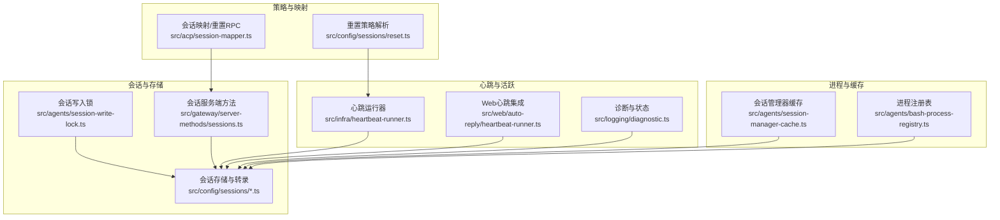
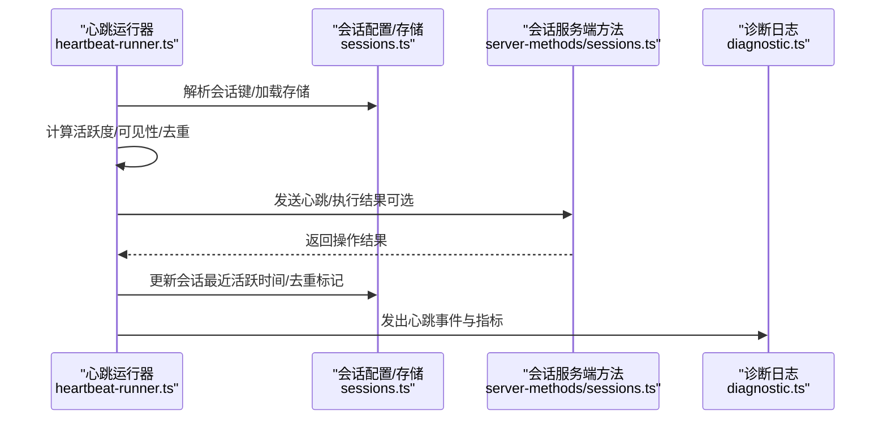
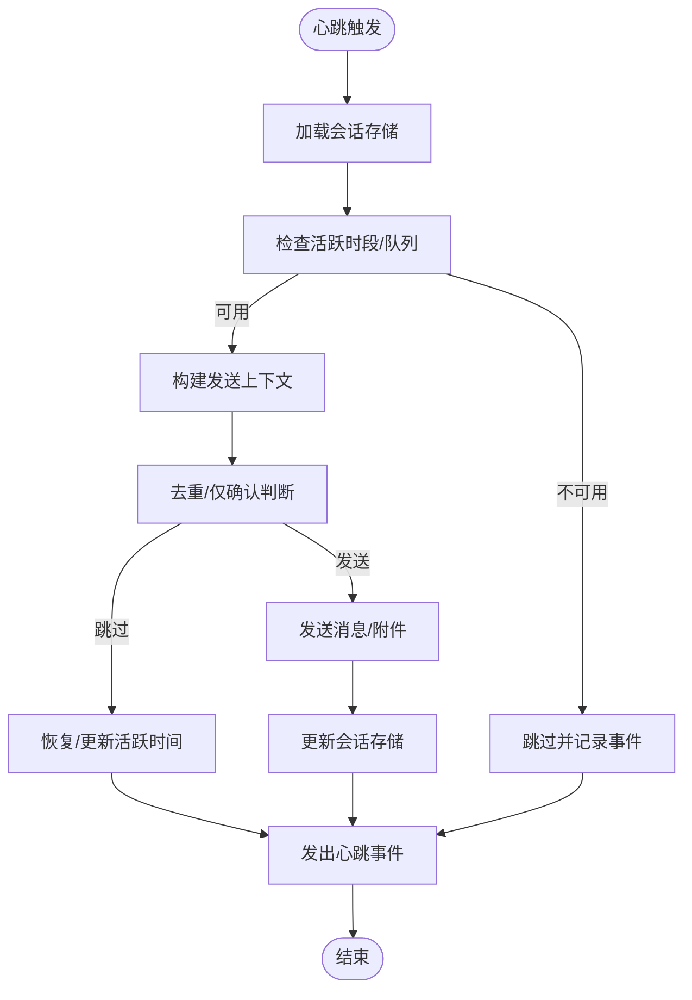
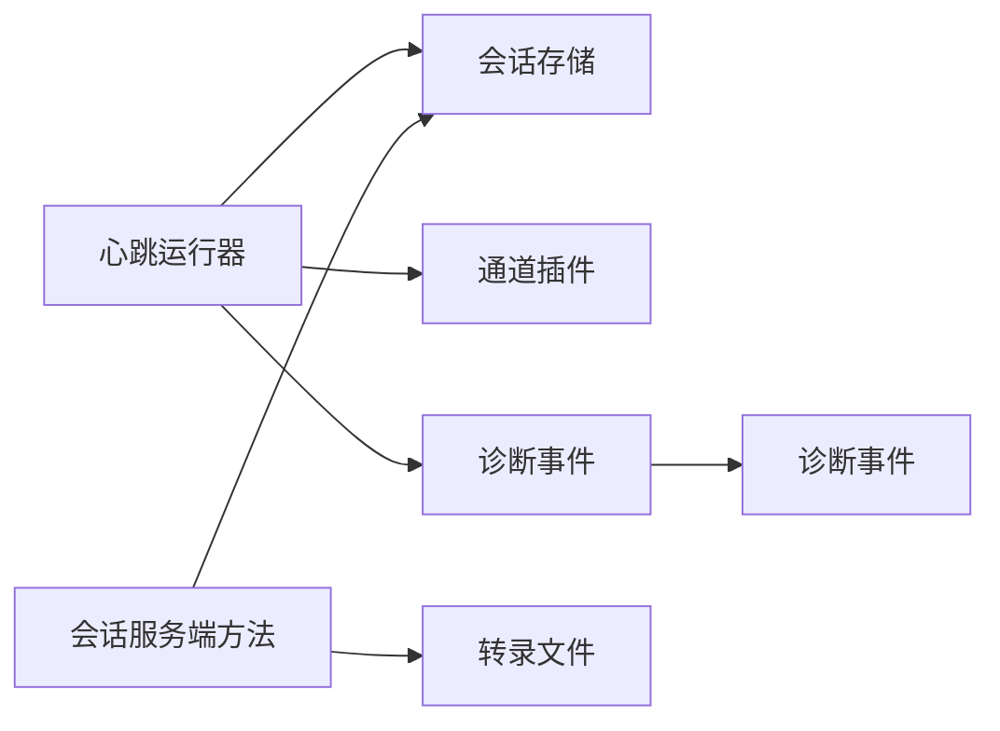

# 会话生命周期

## 目录
1. [简介](#简介)
2. [项目结构](#项目结构)
3. [核心组件](#核心组件)
4. [架构总览](#架构总览)
5. [详细组件分析](#详细组件分析)
6. [依赖关系分析](#依赖关系分析)
7. [性能考量](#性能考量)
8. [故障排查指南](#故障排查指南)
9. [结论](#结论)
10. [附录：扩展与自定义指南](#附录扩展与自定义指南)

## 简介
本文件系统化梳理 OpenClaw 的“会话生命周期”管理，覆盖会话创建时机与初始化、启动参数、运行状态与活跃检测、心跳机制、自动清理与超时、资源回收、关闭与优雅退出、异常终止处理、转录事件与审计日志、压缩与归档策略、存储优化，并提供关键流程的序列图与时序图，帮助开发者在不直接阅读源码的情况下理解并扩展会话生命周期。

## 项目结构
围绕会话生命周期的关键模块分布如下：
- 会话写入锁与资源保护：防止并发写冲突与资源泄漏（进程级锁）
- 心跳与活跃检测：周期性心跳、活跃度判定、去重与可见性控制
- 会话状态与诊断：会话状态机、队列深度、活动时间戳、诊断事件
- 会话重置策略：按类型/空闲/定时等多维度重置策略解析
- 会话映射与 RPC：会话键解析、重置调用
- 会话服务端方法：列出/预览/解析/补丁/压缩/删除/归档
- 存储与转录：会话存储读写、转录文件路径与候选、压缩与归档
- 进程注册表与缓存：进程会话清理、会话文件预热缓存

## 核心组件
- 会话写入锁：通过文件锁与进程 PID 检测，避免并发写入；支持超时与过期锁清理；进程退出/信号时同步释放。
- 心跳运行器：按配置周期执行，结合可见性与渠道就绪检查，发送“心跳”或“执行完成”响应，更新会话最近活跃时间与去重。
- 诊断与状态：维护每个会话的 `state`/`idle`/`processing`/`waiting`、队列深度、最后活动时间，输出诊断事件。
- 重置策略：支持按类型、空闲分钟数、每日定点等模式，兼容旧版 `idleMinutes` 配置。
- 会话映射与RPC：根据标签/键解析会话键，必要时请求网关重置。
- 会话服务端方法：提供列出、预览、解析、补丁、压缩、删除（可选转录归档）等能力。
- 存储与转录：统一的会话存储读写、转录文件候选路径、压缩保留行数、归档备份。
- 进程注册表与缓存：进程会话生命周期清理、已完成会话定期清扫、会话文件预热缓存。

## 架构总览
下图展示了从“心跳触发—会话存储—转录与归档—诊断事件”的关键交互：

## 详细组件分析

### 会话创建、初始化与启动参数
- 创建时机与初始化
  - 会话键解析：可通过标签或键解析，必要时要求已存在或回退到默认键。
  - 会话存储加载：按配置路径加载 JSON 存储，不存在则创建；支持主会话键与代理隔离。
  - 启动参数
    - 会话作用域：全局/按发送者/按主键别名
    - 心跳目标与模型：可按代理默认或覆盖
    - 心跳间隔与可见性：每间隔、活跃时段、是否显示提示/告警
- 关键实现位置
  - 会话键解析与重置触发：`src/acp/session-mapper.ts`
  - 会话存储路径与加载：`src/gateway/server-methods/sessions.ts`
  - 心跳会话解析与存储更新：`src/infra/heartbeat-runner.ts`

### 运行状态、活跃检测与心跳机制
- 状态机与活跃度
  - 维护会话状态：`idle`/`processing`/`waiting`；队列深度变化；最后活动时间
  - 诊断事件：状态变更、卡住检测（超过阈值）、活动标记
- 心跳机制
  - 周期触发：按配置解析心跳间隔与活跃时段
  - 可见性与渠道就绪：根据通道与账号上下文决定是否发送
  - 去重与“仅确认”：对纯确认令牌/空内容进行去重或仅更新活跃时间
  - 执行完成事件：当存在执行完成系统事件时，强制发送执行结果而非确认令牌
- 关键实现位置
  - 诊断状态与事件：`src/logging/diagnostic.ts`
  - 心跳运行与去重逻辑：`src/infra/heartbeat-runner.ts`
  - Web 自动回复心跳集成：`src/web/auto-reply/heartbeat-runner.ts`

### 自动清理、超时处理与资源回收
- 写入锁与资源回收
  - 文件锁：独占写入，支持超时与过期锁清理；进程退出/信号时同步释放
  - 进程注册表：已完成会话定期清理，避免内存泄漏
- 超时与过期
  - 心跳去重窗口：同内容在一定时间窗口内抑制重复
  - 会话活跃时间：用于空闲重置与超时判定
- 关键实现位置
  - 会话写入锁与信号处理：`src/agents/session-write-lock.ts`
  - 进程会话清理与定时器：`src/agents/bash-process-registry.ts`

### 关闭流程、优雅退出与异常终止
- 优雅退出
  - 会话写入锁：进程退出/信号时同步释放所有锁，确保资源回收
  - 心跳与命令队列：在心跳运行前检查队列是否为空，避免中断请求
- 异常终止
  - 过期锁清理：若锁持有进程不存在或过期，自动移除锁
  - 诊断事件：记录心跳失败、重复、空内容等事件，便于排障
- 关键实现位置
  - 锁释放与信号处理：`src/agents/session-write-lock.ts`
  - 心跳失败与事件上报：`src/infra/heartbeat-runner.ts`

### 转录事件、历史记录与审计日志
- 事件与日志
  - Webhook 接收/处理/错误统计与事件
  - 消息入队/处理/错误事件与会话状态联动
  - 心跳发送/跳过/失败事件与指标
- 关键实现位置
  - Webhook 事件与统计：`src/logging/diagnostic.ts`
  - 消息事件与会话状态：`src/logging/diagnostic.ts`
  - 心跳事件与指标：`src/infra/heartbeat-runner.ts`

### 压缩算法、归档策略与存储优化
- 压缩与归档
  - `sessions.compact`：按最大行数保留最新内容，旧内容归档为备份文件
  - 删除会话时可选归档转录文件
- 存储优化
  - 会话存储键合并：当多个候选键指向同一会话时，统一到主键
  - 去除 token 统计缓存以避免过时估算
- 关键实现位置
  - 压缩与归档：`src/gateway/server-methods/sessions.ts`
  - 会话键合并与更新：`src/gateway/server-methods/sessions.ts`
  - 删除时归档转录：`src/gateway/server-methods/sessions.ts`

### 会话重置策略与超时
- 策略解析
  - 支持按类型、基础重置、每日定点、空闲分钟数等组合
  - 兼容旧版 `idleMinutes`；默认模式与小时规范化
- 触发方式
  - ACP 层可请求网关重置指定会话键
- 关键实现位置
  - 重置策略解析：`src/config/sessions/reset.ts`
  - 重置 RPC 调用：`src/acp/session-mapper.ts`

### 会话映射与 RPC
- 映射规则
  - 优先使用 `meta.sessionLabel`/`meta.sessionKey`，否则使用请求参数
  - `requireExisting` 控制是否要求会话已存在
- 重置调用
  - 若启用 `resetSession`，则向网关发起 `sessions.reset` 请求
- 关键实现位置
  - 会话键解析与校验：`src/acp/session-mapper.ts`

### 会话服务端方法与协议
- 方法清单
  - `sessions.list`：列出会话
  - `sessions.preview`：按键批量预览转录片段
  - `sessions.resolve`：解析会话键
  - `sessions.patch`：补丁式更新会话
  - `sessions.reset`：重置会话
  - `sessions.delete`：删除会话（可选归档转录）
  - `sessions.compact`：压缩转录至指定行数
- 参数校验与错误返回
  - 使用协议模式进行参数校验，返回标准化错误
- 关键实现位置
  - 服务端方法与参数校验：`src/gateway/server-methods/sessions.ts`
  - 协议模式定义：`src/gateway/protocol/schema/sessions.ts`

### 会话写入锁与进程注册表
- 写入锁
  - 并发保护：独占文件锁，支持超时与过期锁清理
  - 进程退出/信号：同步释放所有锁，避免僵尸锁
- 进程注册表
  - 完成会话定期清理，避免长期占用内存
- 关键实现位置
  - 写入锁与信号处理：`src/agents/session-write-lock.ts`
  - 进程注册表与定时器：`src/agents/bash-process-registry.ts`

### 会话管理器缓存与内存刷新
- 缓存预热
  - 在允许缓存的前提下，读取会话文件头部以预热 OS 页面缓存
- 内存刷新与压缩计数
  - 记录内存刷新时间与压缩次数，更新会话条目元数据
- 关键实现位置
  - 缓存预热与 TTL：`src/agents/session-manager-cache.ts`
  - 内存刷新与压缩计数更新：`src/auto-reply/reply/agent-runner-memory.ts`、`src/auto-reply/reply/session-updates.ts`

## 依赖关系分析
- 组件耦合
  - 心跳运行器依赖会话存储与通道插件，受队列状态与活跃时段约束
  - 诊断模块与心跳/消息处理解耦，通过事件总线输出
  - 服务端方法统一访问会话存储与转录文件，提供原子更新
- 外部依赖
  - 文件系统：会话存储、转录文件、锁文件
  - 渠道插件：心跳就绪检查与消息投递
- 循环依赖
  - 未发现直接循环依赖；模块职责清晰，接口边界明确

## 性能考量
- 心跳成本控制
  - 空内容文件跳过、队列有请求时跳过、活跃时段限制
  - 去重抑制重复发送，减少带宽与 API 调用
- 存储与 IO
  - 会话文件预热缓存降低首次读取延迟
  - 压缩仅保留最新行，减少磁盘占用与读取开销
- 并发与锁
  - 文件锁避免竞争写入；过期锁清理避免阻塞
- 进程与内存
  - 定期清理已完成会话，降低内存占用

## 故障排查指南
- 心跳未发送
  - 检查活跃时段与队列状态；确认通道就绪与可见性设置
  - 查看心跳事件与原因字段，定位“空内容/重复/禁用/无目标”
- 会话未更新活跃时间
  - 确认心跳返回“仅确认/空内容”时的行为是否符合预期
  - 参考测试用例对 ack 最大字符数的影响
- 锁冲突或长时间等待
  - 检查是否存在过期锁或死锁进程；确认超时与过期阈值
- 删除/压缩失败
  - 校验参数合法性与会话键存在性；检查转录文件是否存在
- 关键实现位置
  - 心跳事件与原因：`src/infra/heartbeat-runner.ts`
  - ack 最大字符数影响：`src/web/auto-reply/heartbeat-runner.ts`
  - 测试用例验证 ack 行为：`src/infra/heartbeat-runner.respects-ackmaxchars-heartbeat-acks.test.ts`
  - 锁冲突与超时错误：`src/agents/session-write-lock.ts`

## 结论
OpenClaw 的会话生命周期通过“写入锁+会话存储+心跳+诊断+服务端方法”的协同，实现了高可靠、可观测且可扩展的会话管理。其设计兼顾性能（去重、预热、压缩）与安全（锁、可见性、重置），并提供完善的审计与排障能力。开发者可在不破坏现有契约的前提下，基于会话键解析、重置策略与服务端方法扩展自定义行为。

## 附录：扩展与自定义指南
- 扩展会话键解析
  - 在 ACP 层增加新的解析规则（如外部 ID 映射），并在会话映射中串联到 `sessions.resolve`
  - 参考：`src/acp/session-mapper.ts`
- 自定义重置策略
  - 新增按类型/场景的重置策略，结合现有解析函数生成最终策略
  - 参考：`src/config/sessions/reset.ts`
- 自定义心跳行为
  - 在心跳运行器中增加条件分支（如特定代理/通道），或通过通道插件扩展就绪检查
  - 参考：`src/infra/heartbeat-runner.ts`
- 自定义存储与转录
  - 通过服务端方法扩展新的会话操作（如导出/导入），并确保原子更新与归档策略
  - 参考：`src/gateway/server-methods/sessions.ts`
- 自定义诊断与审计
  - 在诊断模块中新增事件类型与聚合指标，便于监控与排障
  - 参考：`src/logging/diagnostic.ts`