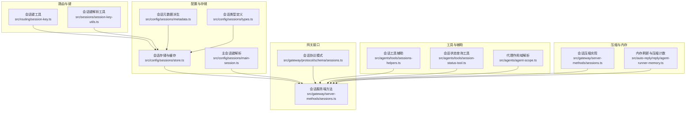
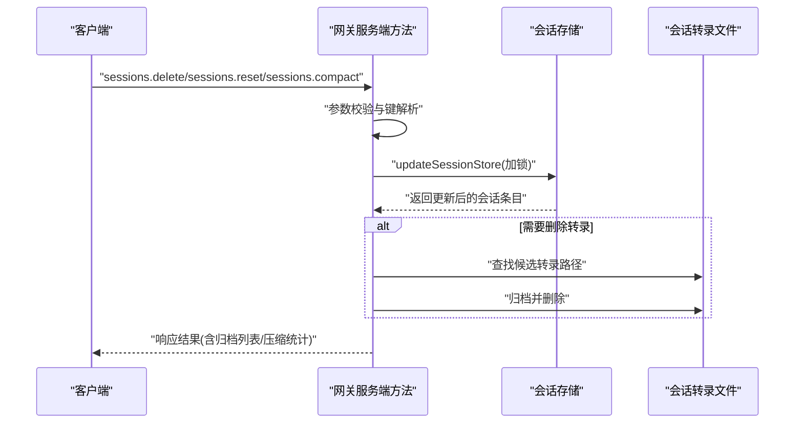
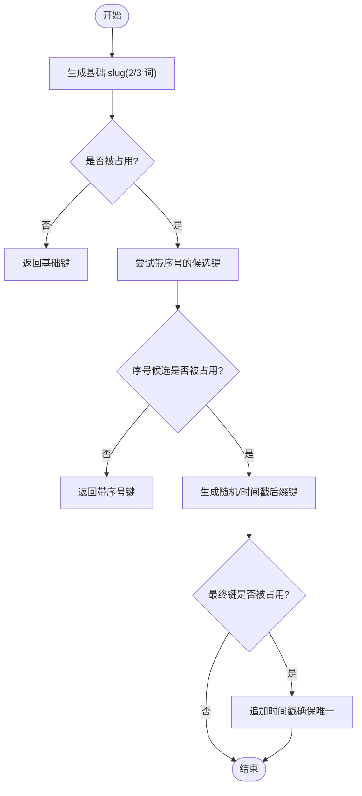
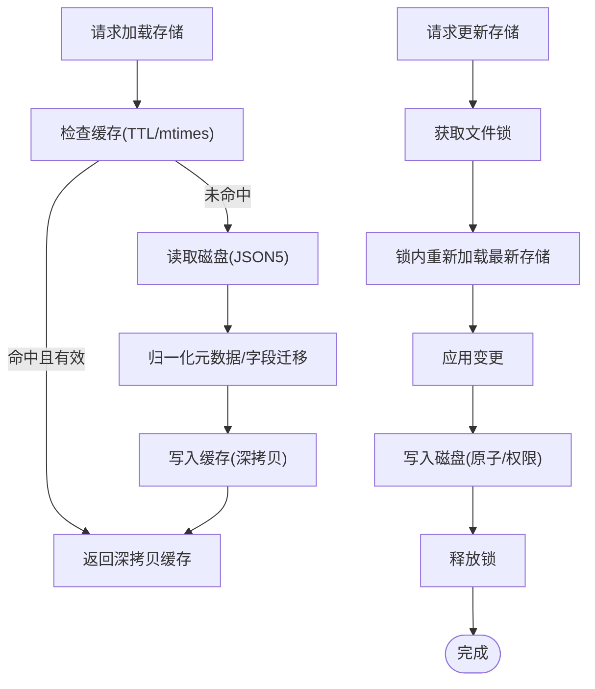
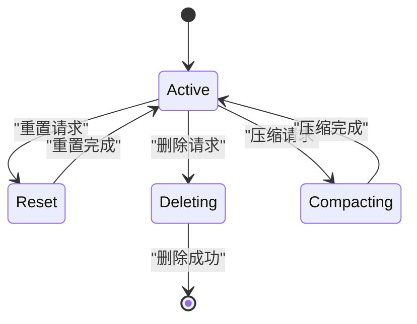
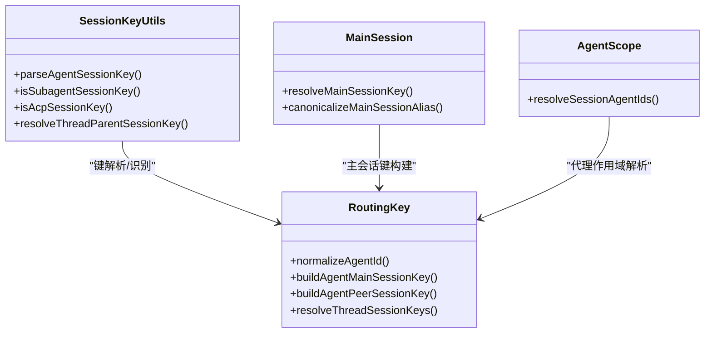
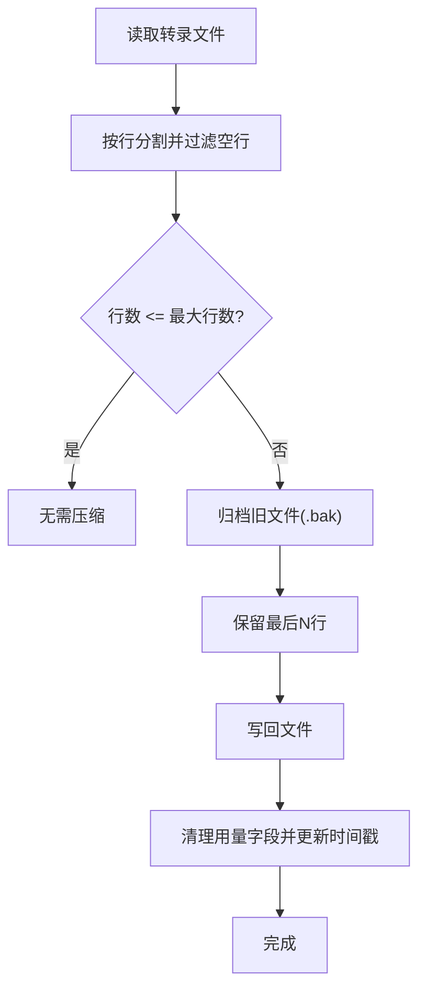
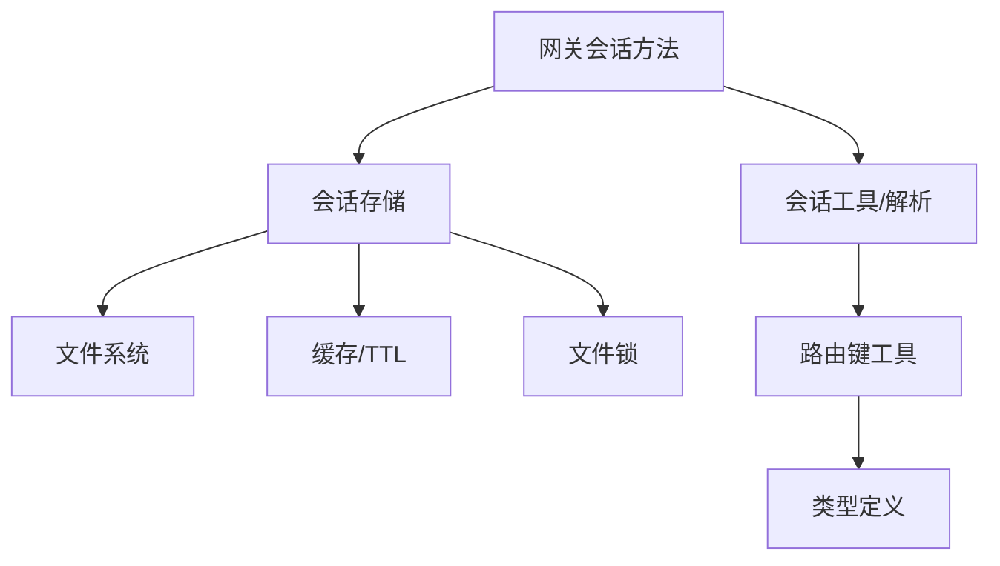

# 会话管理机制

**本文引用的文件**
- [src/routing/session-key.ts](file://src/routing/session-key.ts)
- [src/sessions/session-key-utils.ts](file://src/sessions/session-key-utils.ts)
- [src/agents/session-slug.ts](file://src/agents/session-slug.ts)
- [src/config/sessions/store.ts](file://src/config/sessions/store.ts)
- [src/config/sessions/metadata.ts](file://src/config/sessions/metadata.ts)
- [src/config/sessions/types.ts](file://src/config/sessions/types.ts)
- [src/config/sessions/main-session.ts](file://src/config/sessions/main-session.ts)
- [src/gateway/server-methods/sessions.ts](file://src/gateway/server-methods/sessions.ts)
- [src/gateway/protocol/schema/sessions.ts](file://src/gateway/protocol/schema/sessions.ts)
- [src/agents/tools/sessions-helpers.ts](file://src/agents/tools/sessions-helpers.ts)
- [src/agents/tools/session-status-tool.ts](file://src/agents/tools/session-status-tool.ts)
- [src/agents/agent-scope.ts](file://src/agents/agent-scope.ts)
- [src/infra/state-migrations.ts](file://src/infra/state-migrations.ts)
- [src/auto-reply/reply/agent-runner-memory.ts](file://src/auto-reply/reply/agent-runner-memory.ts)
- [src/config/sessions.cache.test.ts](file://src/config/sessions.cache.test.ts)

## 目录
1. [引言](#引言)
2. [项目结构](#项目结构)
3. [核心组件](#核心组件)
4. [架构总览](#架构总览)
5. [详细组件分析](#详细组件分析)
6. [依赖关系分析](#依赖关系分析)
7. [性能考量](#性能考量)
8. [故障排查指南](#故障排查指南)
9. [结论](#结论)
10. [附录](#附录)

## 引言
本文件系统性阐述 OpenClaw 的会话管理机制，覆盖会话键生成与唯一性、路由规则、状态持久化与缓存、生命周期与清理、多代理隔离与资源共享、会话转录存储与压缩、以及路由的负载均衡与故障转移优化。文档同时提供关键流程图与时序图，并以“章节来源”标注具体实现位置，便于开发者快速定位与扩展。

## 项目结构
围绕会话管理的关键模块分布如下：
- 路由与键规范：会话键的规范化、解析与主会话别名解析
- 存储与缓存：会话存储的加载、写入、并发锁与缓存 TTL
- 元数据与类型：会话条目字段、来源与派生元信息
- 网关方法：会话列表、预览、解析、补丁、重置、删除、压缩等 RPC 接口
- 工具与辅助：会话别名解析、状态查询、代理作用域解析
- 压缩与内存：基于行数的转录压缩与内存刷新计数

## 核心组件
- 会话键生成与解析
  - 规范化与构建：支持主会话、代理会话、子代理、线程会话、群组历史键等
  - 解析与识别：识别 `ACP`、子代理、线程父键等
- 会话存储与缓存
  - 加载/保存/更新：带锁的原子写入、缓存 TTL、mtime 校验
  - 元数据归一化：通道/账号/线程等字段归一化
- 会话元数据派生
  - 来源信息（渠道、表面、聊天类型、账号、线程等）
  - 群组会话补丁（频道、主题、空间、显示名等）
- 网关会话服务
  - 列表、预览、解析、补丁、重置、删除、压缩
  - 删除前清理队列、终止子代理与嵌入式运行
- 多代理隔离与路由
  - 代理 ID 归一化与作用域解析
  - 主会话别名与全局作用域
- 转录与压缩
  - 按行数保留最近 N 行并归档旧文件
  - 内存刷新与压缩计数联动

## 架构总览
下图展示了从客户端请求到网关处理再到存储与转录的完整链路，包括会话键解析、存储更新、转录压缩与清理等关键步骤。

## 详细组件分析

### 会话键生成与唯一性
- 生成策略
  - 使用形容词与名词组合生成 slug，优先尝试 2 词，失败则尝试 3 词；若仍冲突，附加随机后缀或时间戳后缀
  - 提供回调检测是否被占用，确保唯一性
- 唯一性保证
  - 通过循环尝试与回退策略，结合随机/时间戳后缀降低碰撞概率
  - 在会话解析与映射阶段，统一使用标准化键，避免歧义
- 路由规则
  - 支持主会话、按代理、按账户/频道/群组/私聊等多粒度键
  - 线程会话可作为子键，父键用于继承与关联

### 会话状态持久化与缓存
- 缓存机制
  - TTL 可配置，默认约 45 秒；命中则深拷贝返回，避免外部修改污染缓存
  - 写入时主动失效缓存，保证一致性
- 并发控制
  - 采用文件锁（.lock）实现互斥访问，支持超时与过期锁清理
  - 读取在锁内重新加载，避免竞态覆盖
- 写入策略
  - 非 Windows：先写临时文件再原子重命名，设置严格权限
  - Windows：直接写入，兼容性优先
- 元数据归一化
  - 自动迁移旧字段（如 `provider`→`channel`），并归一化通道/账号/线程等上下文

### 会话生命周期管理与清理
- 生命周期关键点
  - 创建：首次记录会话元数据并生成 `sessionId`
  - 更新：最后路由上下文、时间戳、令牌用量等
  - 重置：生成新 `sessionId`，保留部分配置，清零令牌用量
  - 删除：清理队列、终止子代理/嵌入式运行，可选删除转录并归档
  - 压缩：按最大行数保留最近内容，归档旧文件并清理用量字段
- 自动清理与超时
  - 删除前检查主会话保护，避免误删
  - 删除时对活动会话进行阻塞等待（终止运行后再删除）

### 多代理会话的隔离与资源共享
- 隔离机制
  - 代理 ID 归一化与作用域解析，确保不同代理不会互相污染
  - 主会话别名在全局作用域下统一为“global”，其他作用域保持按代理隔离
- 资源共享
  - 会话别名解析与内部键转换，支持“main”别名与实际主键之间的映射
  - 线程会话可继承父键，实现资源与上下文的延续
- 冲突解决
  - 键解析时优先匹配 canonical key，必要时进行键迁移与合并

### 会话转录的存储格式、检索与压缩
- 存储格式
  - 会话条目存储为 JSON5 文件，键为会话键，值为会话条目
  - 转录文件与会话键关联，支持多候选路径（含 `agentId`/通道/账号等）
- 检索策略
  - 预览：读取最近若干条消息片段，限制字符数与数量
  - 解析：根据 `label`/`key` 映射解析真实键
- 压缩算法
  - 基于行数的保留策略：仅保留最后 N 行，其余归档为 `.bak`
  - 清理用量字段（输入/输出/总 token）以减少冗余

### 会话路由与负载均衡、故障转移
- 路由规则
  - 支持 per-sender 与 global 两种作用域；主会话别名在 global 下统一为“global”
  - 群组/频道/私聊等场景下，键包含 `channel`/`account`/`thread` 等维度
- 负载均衡与故障转移
  - 通过会话键解析与 canonical 化，确保跨节点/进程的一致性
  - 删除/重置/压缩等操作在网关侧统一执行，避免客户端重复逻辑
- 性能优化
  - 存储缓存与锁粒度控制，减少磁盘 IO 与竞争
  - 预览与压缩采用最小化读写范围，避免全量扫描

### 代码示例路径（不含具体代码）
- 会话创建与状态查询
  - 创建会话键：[会话键生成函数](file://src/agents/session-slug.ts#L115-L143)
  - 解析会话键与别名：[会话键解析工具](file://src/sessions/session-key-utils.ts#L6-L26)、[主会话别名解析](file://src/config/sessions/main-session.ts#L51-L80)
  - 查询会话状态：[会话状态查询工具](file://src/agents/tools/session-status-tool.ts#L142-L186)
- 会话清理与重置
  - 重置会话：[重置 RPC 实现](file://src/gateway/server-methods/sessions.ts#L205-L262)
  - 删除会话并清理资源：[删除 RPC 实现](file://src/gateway/server-methods/sessions.ts#L263-L354)
- 会话转录压缩
  - 压缩实现：[压缩 RPC 实现](file://src/gateway/server-methods/sessions.ts#L355-L471)
- 存储与缓存
  - 加载/保存/更新存储：[存储读写与锁](file://src/config/sessions/store.ts#L109-L175)、[原子写入](file://src/config/sessions/store.ts#L189-L255)、[并发锁](file://src/config/sessions/store.ts#L285-L355)
  - 缓存测试用例：[缓存行为验证](file://src/config/sessions.cache.test.ts#L1-L53)

## 依赖关系分析
- 组件耦合
  - 网关方法依赖存储层与会话工具，存储层依赖缓存与锁工具
  - 路由层负责键构建与解析，贯穿所有上层调用
- 外部依赖
  - 文件系统（读写/原子重命名/权限）
  - JSON5 解析与序列化
  - 进程锁与文件 mtime 校验

## 性能考量
- I/O 优化
  - 使用缓存与深拷贝避免重复解析；写入时原子替换与权限设置减少碎片
  - 锁粒度短、重试轮询间隔小，提升并发吞吐
- 计算优化
  - 元数据归一化与迁移在加载阶段一次性完成，后续读取无额外开销
  - 预览与压缩仅处理必要范围，避免全量扫描
- 内存与资源
  - 压缩后清理用量字段，降低内存占用
  - 删除前终止活动任务，避免资源泄漏

## 故障排查指南
- 常见问题
  - 无法获取会话锁：检查锁文件是否存在与过期；确认目录权限与存在性
  - 缓存不一致：确认 TTL 设置与 mtime 是否变化；必要时禁用缓存或手动清理
  - 删除失败：确认会话是否仍在运行；等待终止后再试
- 关键定位点
  - 存储读写与锁：[存储实现](file://src/config/sessions/store.ts#L109-L255)
  - 删除流程与资源清理：[删除实现](file://src/gateway/server-methods/sessions.ts#L263-L354)
  - 压缩流程与归档：[压缩实现](file://src/gateway/server-methods/sessions.ts#L355-L471)

## 结论
OpenClaw 的会话管理以“键规范 + 存储缓存 + 网关 RPC + 转录压缩”为核心，实现了高可用、可扩展且易于维护的会话生命周期管理。通过严格的并发控制、元数据归一化与资源清理策略，系统在多代理与复杂路由场景下保持稳定与高效。建议在生产环境中合理配置缓存 TTL、监控锁争用与磁盘 I/O，并结合工具与脚本进行定期压缩与清理。

## 附录
- 会话类型与字段参考：[类型定义](file://src/config/sessions/types.ts#L25-L96)
- 会话元数据派生规则：[元数据派生](file://src/config/sessions/metadata.ts#L153-L172)
- 网关会话 RPC 参数模式：[协议模式](file://src/gateway/protocol/schema/sessions.ts#L84-L103)
- 状态迁移与 canonical 化：[状态迁移](file://src/infra/state-migrations.ts#L226-L255)
- 内存刷新与压缩计数联动：[内存刷新](file://src/auto-reply/reply/agent-runner-memory.ts#L169-L201)