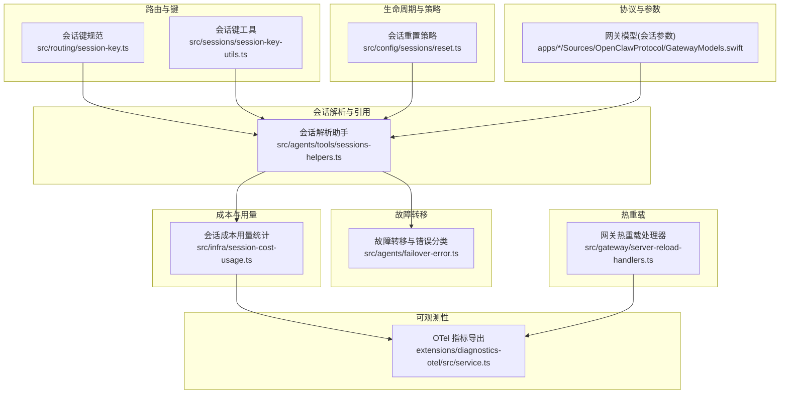
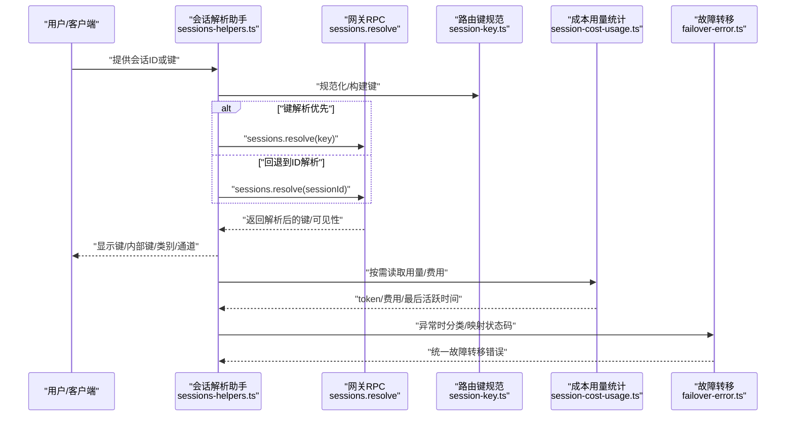
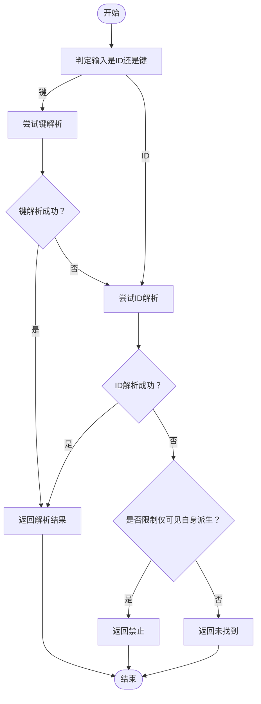
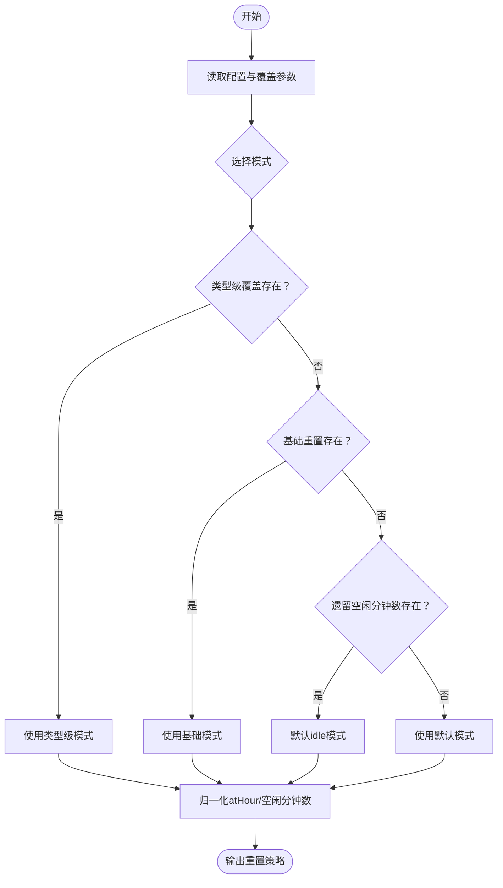
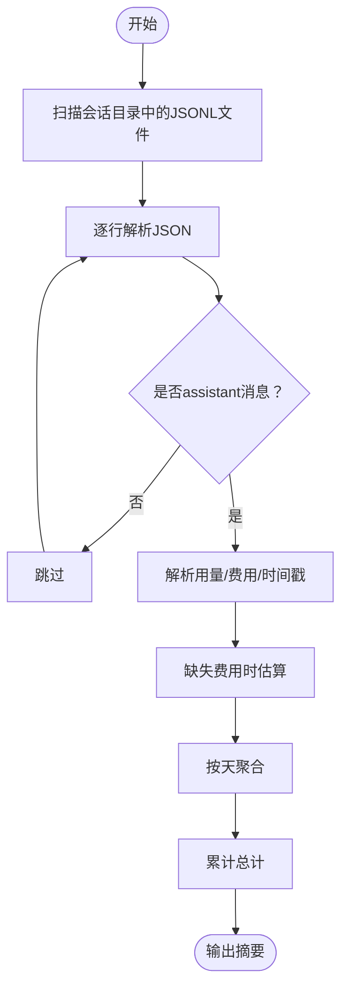
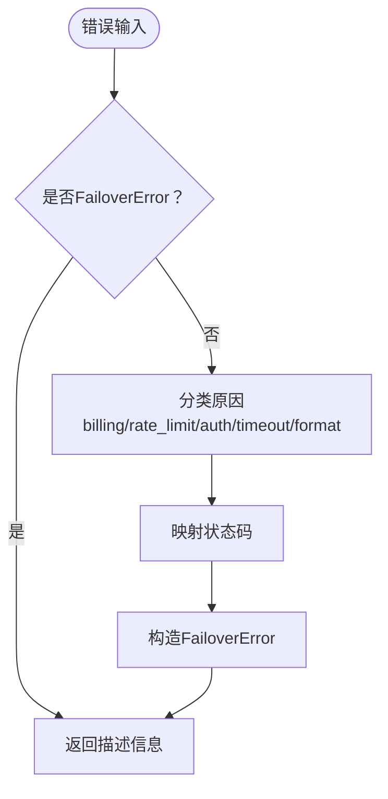
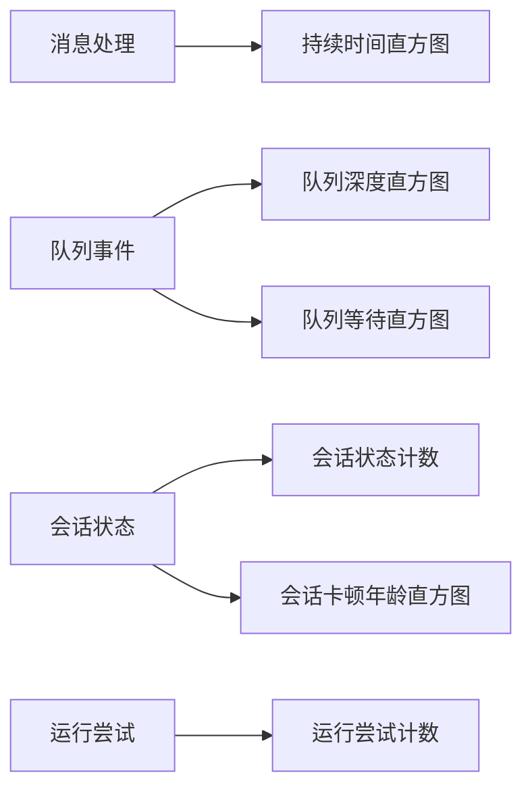
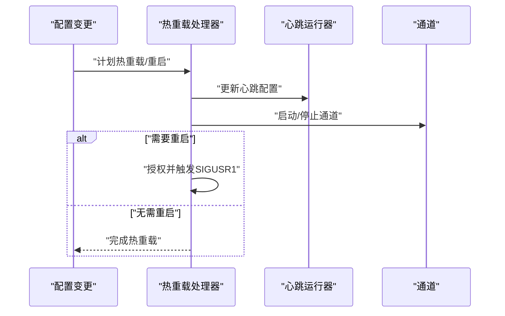
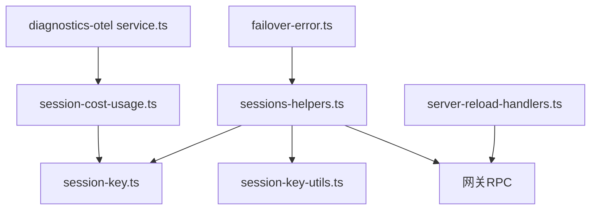

# 会话路由策略

## 目录
1. [引言](#引言)
2. [项目结构](#项目结构)
3. [核心组件](#核心组件)
4. [架构总览](#架构总览)
5. [详细组件分析](#详细组件分析)
6. [依赖关系分析](#依赖关系分析)
7. [性能考量](#性能考量)
8. [故障排查指南](#故障排查指南)
9. [结论](#结论)
10. [附录](#附录)

## 引言
本文件系统化梳理 OpenClaw 的“会话路由策略”，围绕以下主题展开：会话键规范与解析、路由决策与优先级、负载均衡与流量分配、故障转移与高可用、性能监控与延迟统计、动态调整与热重载、以及配置管理与扩展开发指南。目标是帮助开发者在理解现有实现的基础上，进行定制与扩展。

## 项目结构
OpenClaw 将会话路由能力分布在多个层次：
- 路由键生成与规范化：位于 routing 与 sessions 子模块，负责会话标识的标准化、主会话别名、线程/群组场景的键构建等。
- 会话解析与引用：通过工具函数解析用户输入（会话 ID 或键），并调用网关接口进行可见性与归属校验。
- 会话生命周期与重置策略：基于配置解析会话重置模式（按类型、按空闲时间、按固定时刻）。
- 成本与用量统计：扫描会话日志，聚合 token 与费用，支撑成本控制与配额管理。
- 故障转移与错误分类：对超时、鉴权失败、计费限制等进行归类，并映射到统一的状态码。
- 性能观测与指标：通过诊断插件导出消息处理耗时、队列深度、会话卡顿等关键指标。
- 热重载与配置变更：网关支持部分配置的热重载，或在必要时触发重启以应用变更。
- 协议与参数：跨平台协议定义了会话查询与补丁参数，便于客户端侧参与路由与筛选。

## 核心组件
- 会话键规范与生成
  - 规范化主键、代理 ID、账户 ID，构建代理主会话键、代理对等会话键（DM/群组/频道）、群组历史键、线程会话键等。
  - 提供键解析工具，识别子代理键、ACP 键、线程父键等。
- 会话解析与引用
  - 解析用户输入（会话 ID 或键），优先尝试键解析；若失败则回退到 ID 解析；同时尊重沙箱可见性与“仅可看到自身派生”的约束。
  - 分类会话类型（主会话、定时任务、钩子、节点、群组、其他），推导通道与显示键。
- 生命周期与重置策略
  - 基于配置解析会话重置模式（idle/定时/atHour），支持按类型覆盖与遗留字段兼容。
- 成本与用量统计
  - 扫描会话 JSONL 日志，提取用量与费用，按天聚合，输出会话/全局成本摘要。
- 故障转移与错误分类
  - 对超时、鉴权失败、计费限制、格式错误等进行分类，并映射状态码；支持将任意错误转换为统一的故障转移错误对象。
- 性能观测与指标
  - 导出消息处理耗时、队列深度/等待、会话卡顿年龄、运行尝试次数等指标，用于监控与告警。
- 热重载与配置变更
  - 针对 Hooks、心跳、通道等配置支持热重载；当需要时请求网关进程重启以应用变更。
- 协议与参数
  - 定义会话查询与补丁参数（如 `key`、`label`、`thinkinglevel`、`verboselevel`、`reasoninglevel`、`responseusage`、`elevatedlevel`、`exec*`、`model`、`spawnedby`、`sendpolicy`、`groupactivation` 等），便于客户端侧参与路由与筛选。

## 架构总览
下图展示了从“输入（会话 ID/键）”到“路由决策与执行”的端到端流程，以及与可观测性、成本统计、故障转移的关系。

## 详细组件分析

### 组件A：会话键规范与解析
- 关键职责
  - 规范化主键、代理 ID、账户 ID，构建多场景会话键（主会话、DM/群组/频道、线程、群组历史）。
  - 解析输入（ID 或键），优先键解析，再回退 ID；尊重沙箱可见性与“仅可见自身派生”的限制。
  - 分类会话类型、推导通道、显示键等。
- 决策规则与优先级
  - 输入判定：是否像会话 ID；否则视为键。
  - 解析顺序：键解析优先，失败后 ID 解析；若限制“仅可见自身派生”，则在网关层进行过滤。
  - 类型判定：主键、cron/hook/node、DM/群组/频道、群组/通道等。
- 权重与流量分配
  - 该组件不直接做负载均衡；但通过“主键/别名/作用域”（全局/按发送者）影响路由范围与可见性，间接影响流量分配。
- 复杂度
  - 键生成与解析为 O(n) 字符串操作（n 为键段数）；解析函数为 O(1) 到 O(k)（k 为键段数）。
- 错误处理
  - 未找到会话时返回错误/禁止状态；沙箱限制时返回禁止信息。

### 组件B：会话重置策略
- 关键职责
  - 基于配置解析会话重置模式（idle/定时/atHour），支持按类型覆盖与遗留字段兼容。
- 决策规则
  - 优先使用类型级覆盖；其次基础重置；若均无且存在遗留空闲分钟数，则默认 idle 模式。
  - 归一化 atHour 与空闲分钟数，确保数值有效。
- 复杂度
  - O(1) 配置合并与归一化。
- 适用场景
  - 与会话生命周期管理配合，避免长时间占用资源；支持按业务类型差异化重置策略。

### 组件C：成本与用量统计
- 关键职责
  - 扫描会话 JSONL 日志，解析用量与费用，按天聚合，输出会话/全局成本摘要。
- 数据流
  - 读取目录中近期文件 → 行级解析 JSON → 过滤 assistant 消息 → 计算 token/费用 → 聚合每日与总计。
- 复杂度
  - 文件扫描 O(f)、行级解析 O(l)、聚合 O(d)（f 为文件数，l 为行数，d 为天数）。
- 用途
  - 支持成本控制、配额预警、账单汇总与审计。

### 组件D：故障转移与高可用
- 关键职责
  - 对超时、鉴权失败、计费限制、格式错误等进行分类；将任意错误转换为统一的故障转移错误对象，映射状态码。
- 决策规则
  - 基于状态码、错误码、错误名称与消息关键字进行分类；对超时错误有专门的识别逻辑。
- 复杂度
  - O(1) 分类与映射。
- 适用场景
  - 与重试/降级/熔断策略结合，提升系统高可用性。

### 组件E：性能监控与延迟统计
- 关键职责
  - 通过诊断插件导出消息处理耗时、队列深度/等待、会话卡顿年龄、运行尝试次数等指标。
- 适用场景
  - 实时监控路由与执行链路的延迟与拥塞，辅助容量规划与优化。

### 组件F：热重载与配置变更
- 关键职责
  - 针对 Hooks、心跳、通道等配置支持热重载；当变更要求重启时，向进程发送信号触发重启。
- 适用场景
  - 在不中断服务的情况下应用新配置，保障会话路由策略的快速上线与回滚。

### 组件G：协议与参数（会话查询与补丁）
- 关键职责
  - 定义会话查询与补丁参数（如 `key`、`label`、`thinkinglevel`、`verboselevel`、`reasoninglevel`、`responseusage`、`elevatedlevel`、`exec*`、`model`、`spawnedby`、`sendpolicy`、`groupactivation` 等），便于客户端侧参与路由与筛选。
- 适用场景
  - 客户端根据策略动态选择会话键、设置思考/输出级别、执行主机/安全策略等。

## 依赖关系分析
- 组件耦合
  - 会话解析助手依赖路由键规范与工具函数；与网关 RPC 交互以满足可见性与归属校验。
  - 成本用量统计依赖会话路径解析与用量格式工具；与配置联动以决定成本估算策略。
  - 故障转移与热重载分别独立，但共同服务于稳定性与可维护性。
- 外部依赖
  - 诊断插件提供指标导出能力；网关进程支持热重载与重启。
- 循环依赖
  - 当前模块间无明显循环依赖；键规范与解析相互配合，属于单向依赖。

## 性能考量
- 路由键生成与解析
  - 采用预编译正则与字符串拼接，复杂度低；建议在高频路径复用已生成的键。
- 会话解析
  - 键解析优先，减少回退开销；沙箱可见性检查在网关侧完成，避免客户端重复请求。
- 成本统计
  - 仅扫描近期文件，按天聚合；建议按天滚动清理旧文件，控制 IO。
- 指标导出
  - 使用直方图与计数器记录延迟与队列状态，建议设置合理的采样率与分桶。
- 热重载
  - 优先热重载可热重载项；对需要重启的变更，尽量缩短停机窗口。

## 故障排查指南
- 会话解析失败
  - 检查输入是否为合法 ID 或键；确认沙箱可见性；核对网关返回的错误信息。
- 重置策略异常
  - 核对配置中的重置模式、atHour、空闲分钟数；确认是否存在类型级覆盖。
- 成本统计缺失
  - 检查 JSONL 文件是否包含 assistant 消息；确认费用字段或模型成本配置是否完整。
- 故障转移频繁
  - 查看错误分类与状态码映射；关注超时、鉴权失败、计费限制等高频原因。
- 指标异常
  - 关注消息处理耗时、队列等待、会话卡顿年龄等指标趋势；定位瓶颈环节。

## 结论
OpenClaw 的会话路由策略以“键规范 + 可见性解析 + 生命周期策略 + 成本统计 + 故障转移 + 指标导出 + 热重载”为核心闭环。通过清晰的键语义与解析流程，保证路由决策的确定性与可追溯；通过成本与指标体系，支撑运营与容量管理；通过故障转移与热重载，保障系统的高可用与可演进性。开发者可在上述基础上进行定制与扩展，以满足更复杂的路由与调度需求。

## 附录
- 开发者指南（面向扩展）
  - 自定义会话键：参考键规范与工具函数，新增场景键（如多租户/多账号）。
  - 路由决策扩展：在会话解析助手处增加新的分类规则或通道推导逻辑。
  - 重置策略扩展：在重置策略解析处增加新模式（如按峰值/按活动度）。
  - 成本统计扩展：在成本用量统计处增加新的费用来源或估算方法。
  - 故障转移扩展：在错误分类处增加新的错误类型与状态码映射。
  - 指标扩展：在诊断插件中新增自定义指标，采集关键路径耗时。
  - 热重载扩展：在热重载处理器中注册新的配置项与重载逻辑。
  - 协议扩展：在网关模型中新增参数字段，供客户端侧参与路由与筛选。