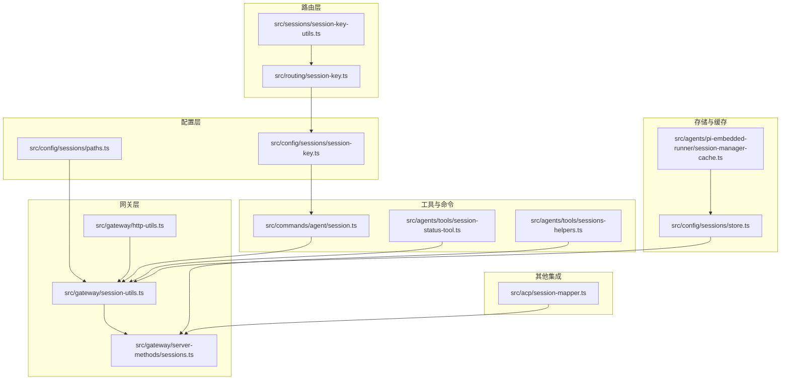
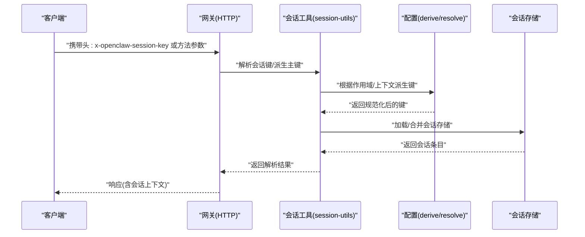
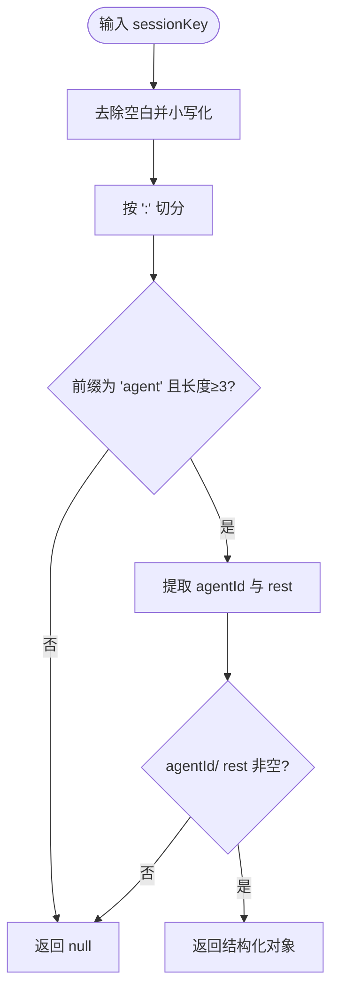
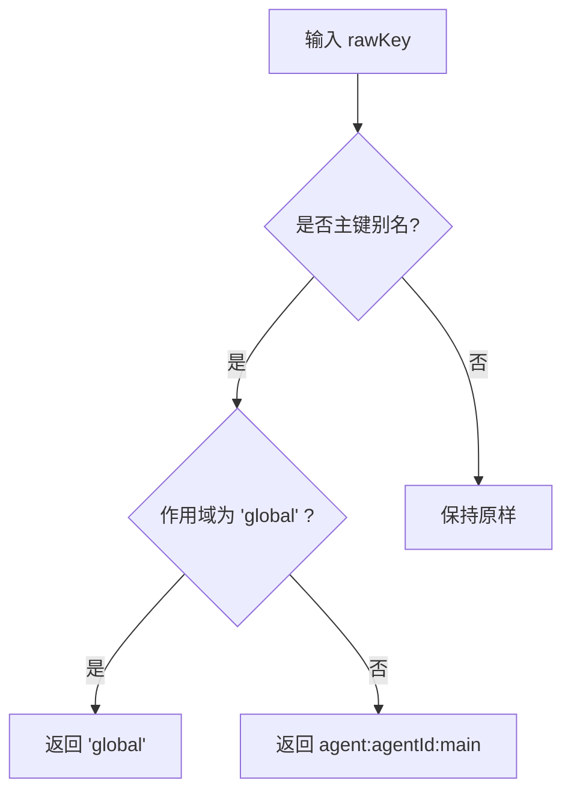
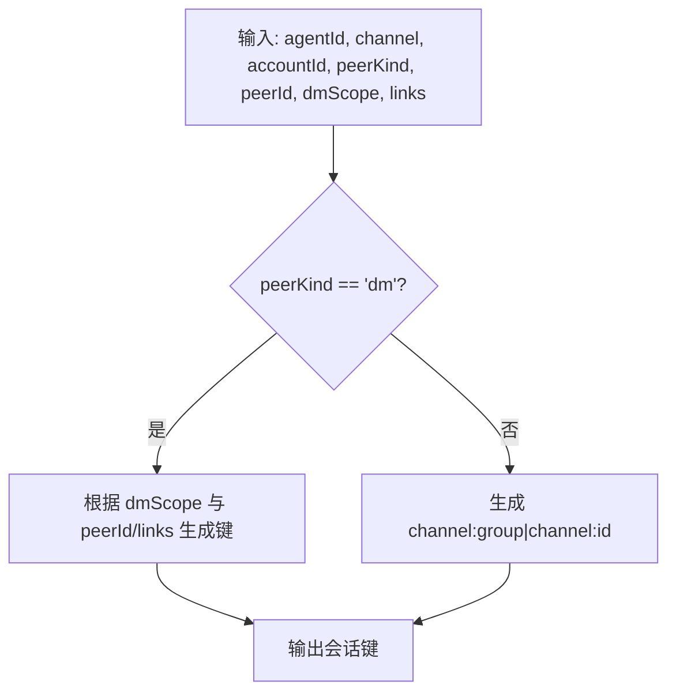
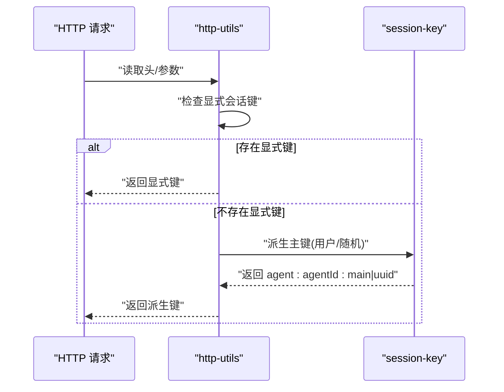
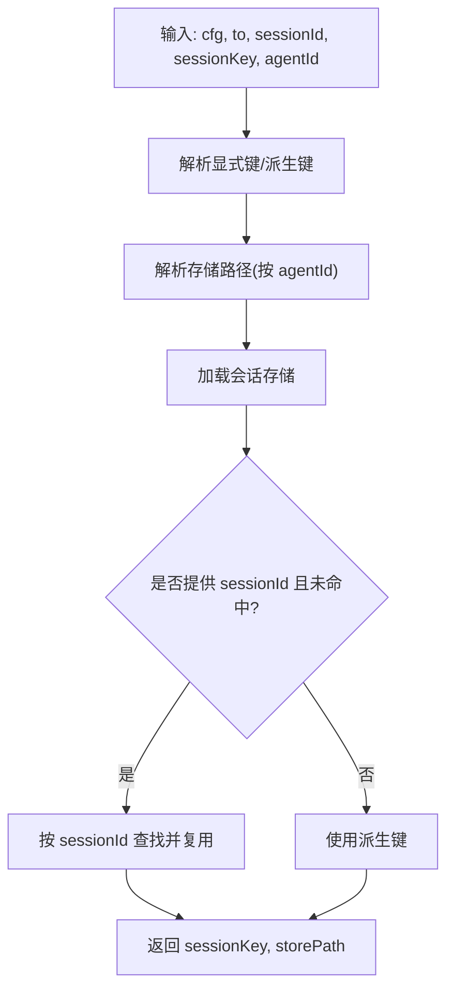
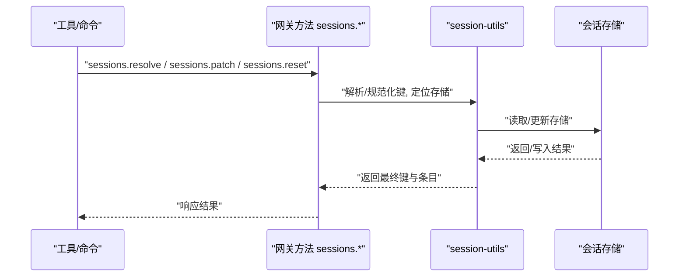
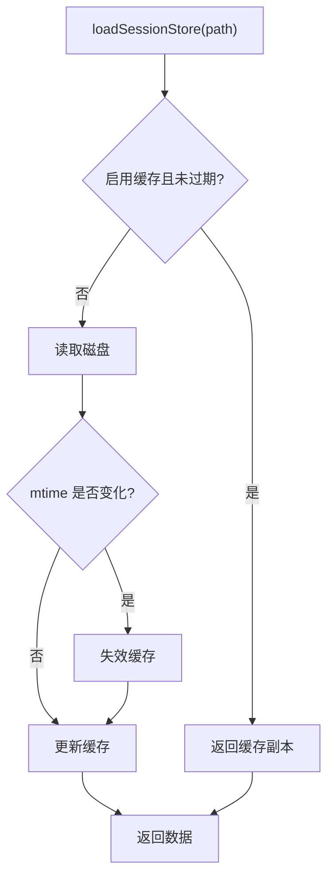
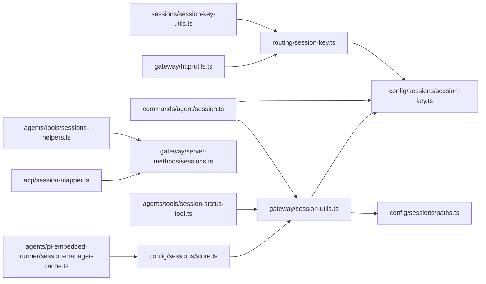

# 会话键生成与解析

## 目录
1. [简介](#简介)
2. [项目结构](#项目结构)
3. [核心组件](#核心组件)
4. [架构总览](#架构总览)
5. [详细组件分析](#详细组件分析)
6. [依赖分析](#依赖分析)
7. [性能考量](#性能考量)
8. [故障排查指南](#故障排查指南)
9. [结论](#结论)
10. [附录：扩展与自定义指南](#附录扩展与自定义指南)

## 简介
本文件系统化阐述 OpenClaw 的会话键（Session Key）生成与解析机制，覆盖以下关键主题：
- 会话键的生成算法、唯一性保证与哈希计算思路
- 会话键与运行 ID（`sessionId`）的映射关系、缓存策略与查找算法
- 会话键格式规范、分隔符使用与标准化处理
- 代理请求中的传递机制、路由决策与上下文绑定
- 解析过程中的错误处理、回退策略与性能优化
- 提供端到端的代码路径示例，帮助开发者快速定位实现位置并进行扩展

## 项目结构
围绕会话键的关键模块分布如下：
- 路由层：负责会话键的规范化、格式化与派生
- 配置层：负责会话键作用域、主键别名与存储路径解析
- 网关层：负责 HTTP 请求中会话键的提取、网关内解析与跨进程调用
- 工具与命令层：负责请求上下文下的会话键解析、重用与回退
- 存储与缓存：负责会话存储的加载、合并、缓存与失效

## 核心组件
- 会话键格式与解析器
  - 格式规范：以“agent:”前缀开头，后接 `agentId` 与 `rest` 部分；支持“subagent:”“acp:”等子空间标识
  - 解析器负责拆分与校验，返回标准化的结构化对象
- 主键与别名
  - 支持“main”“全局主键”等别名，并在不同作用域下归一化
- 会话键派生
  - 基于消息上下文、通道、账号、身份映射等派生 DM/群组/频道会话键
- 网关与代理请求
  - 通过 HTTP 头或方法参数传递会话键；网关内部统一解析与路由
- 存储与缓存
  - 会话存储按 `agentId` 分目录管理；支持内存缓存与磁盘失效联动

## 架构总览
下面的序列图展示了从 HTTP 请求到会话键解析与存储访问的完整流程。

## 详细组件分析

### 组件A：会话键格式与解析
- 格式与分隔符
  - 固定前缀“agent:”，随后为 `agentId` 与 `rest` 部分，使用“:”作为分隔符
  - 支持“subagent:”“acp:”等子命名空间
- 解析逻辑
  - 按“:”切分并校验前缀与长度
  - 返回标准化的结构化对象，便于后续处理
- 标准化处理
  - 对 `agentId`、`accountId`、`peerId` 等进行小写化与非法字符清理
  - 保留路径安全与 shell 友好性

### 组件B：主键别名与作用域归一化
- 主键别名
  - “main”“自定义 `mainKey`”“agent:...:main”等均视为主键别名
  - 在“global”作用域下，主键别名归一为“global”
- 作用域派生
  - per-sender：基于发送方或群组键派生
  - global：直接使用“global”

### 组件C：DM/群组/频道会话键派生
- DM 会话键
  - 支持多粒度：main/per-peer/per-channel-peer/per-account-channel-peer
  - 可通过 `identityLinks` 将多个 `peerId` 映射到同一 `canonical peerId`
- 群组/频道会话键
  - 使用“channel:group|channel:id”的形式
- 线程/话题键
  - 支持在基础键后追加“:thread:...”或“:topic:...”

### 组件D：HTTP 请求中的会话键传递与派生
- 优先级
  - 显式头“x-openclaw-session-key”优先
  - 其次根据用户标识与随机 UUID 派生主键
- 代理 ID 决策
  - 从头或模型字符串中解析 `agentId`，否则回退为“main”

### 组件E：请求上下文下的会话键解析与回退
- 解析顺序
  - 显式传入 `sessionKey` 优先
  - 若未传入，则根据 `MsgContext` 派生
  - 若提供了 `sessionId` 但未匹配到键，则在当前存储中按 `sessionId` 查找并复用
- 作用域与存储路径
  - 根据解析出的 `agentId` 计算存储路径
  - 加载会话存储并进行合并与去重

### 组件F：会话键解析服务与跨进程调用
- `sessions.resolve`
  - 支持按 `key` 或 `sessionId` 解析
  - 支持限制可见范围（`spawnedBy`、`includeGlobal`、`includeUnknown`）
- `sessions.patch`/`reset`
  - 支持对会话条目进行更新与重置
  - 自动处理键的规范化与存储目标定位

### 组件G：会话键与运行 ID 的映射与缓存策略
- 运行 ID（`sessionId`）与会话键的映射
  - 通过“`sessions.resolve`”按 `sessionId` 查找对应键
  - 支持跨 `agentId` 的组合存储合并，确保跨作用域可见性
- 缓存策略
  - 会话存储支持内存缓存，基于文件 `mtime` 与 TTL 控制
  - 预热与缓存失效：预读文件以利用 OS 页面缓存，写入时主动失效
  - 会话管理器缓存：针对会话文件的访问时间与 TTL 控制

## 依赖分析
- 路由层依赖配置层的主键与派生逻辑
- 网关层依赖路由层的解析与配置层的存储路径解析
- 工具与命令层依赖网关层的解析与存储层的加载
- 存储层依赖缓存层与文件系统

## 性能考量
- 缓存与预热
  - 会话存储缓存：基于 TTL 与文件 `mtime` 控制，避免重复 IO
  - 会话文件预热：读取文件头部以利用 OS 页面缓存，降低首次访问延迟
- 键解析与存储定位
  - 解析阶段尽量减少正则与字符串操作次数，优先使用结构化字段
  - 存储路径模板化，避免频繁路径拼接
- 跨进程解析
  - 通过“`sessions.resolve`”集中处理键解析与可见性控制，减少重复扫描

[本节为通用指导，无需特定文件分析]

## 故障排查指南
- 无法解析会话键
  - 检查是否以“agent:”开头，分隔符是否正确
  - 使用“`sessions.resolve`”确认键是否存在或是否被限制可见
- `sessionId` 无法匹配
  - 确认 `sessionId` 是否正确，必要时在组合存储中查找
  - 检查跨 `agentId` 的访问策略与 A2A 策略
- 缓存导致的数据不一致
  - 写入后会主动失效缓存；如需强制刷新，可禁用缓存或等待 TTL 过期
- 代理 ID 不匹配
  - 确保请求头或参数中的 `agentId` 与会话键中的 `agentId` 一致

## 结论
OpenClaw 的会话键体系以“agent:”前缀为核心，结合主键别名、作用域派生与存储路径模板化，实现了高可扩展与强一致的会话上下文管理。通过网关集中解析与跨进程调用，配合缓存与预热策略，既保证了性能也兼顾了灵活性。开发者可在不破坏现有约定的前提下，按需扩展键格式、派生规则与可见性策略。

[本节为总结，无需特定文件分析]

## 附录：扩展与自定义指南
- 扩展键格式
  - 在路由层增加新的命名空间（如“vendor:”），并在解析器中识别与处理
  - 保持分隔符与标准化处理的一致性
- 自定义派生规则
  - 在配置层新增派生函数，结合渠道、账号、身份映射等上下文
  - 通过“`sessions.resolve`”暴露新规则，确保跨进程可见
- 自定义存储路径
  - 使用“`{agentId}`”模板化路径，按 `agentId` 动态展开
  - 注意路径安全与权限控制
- 自定义缓存策略
  - 调整 TTL 与禁用开关，或引入更细粒度的失效策略
  - 对热点文件进行预热，提升首读性能