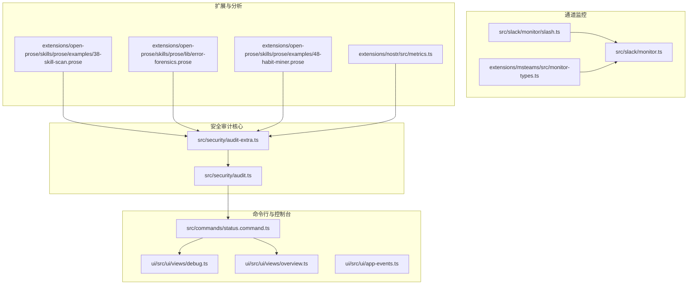
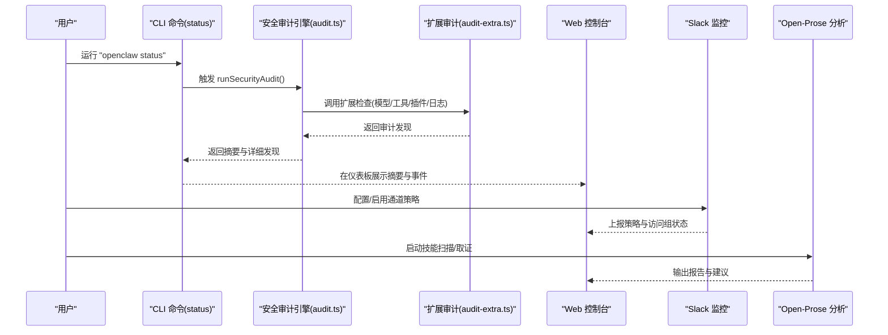
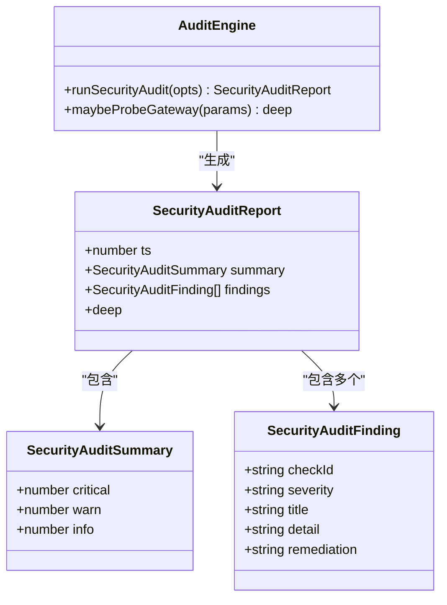
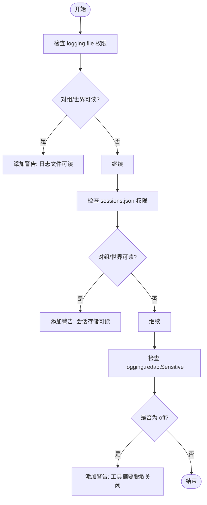
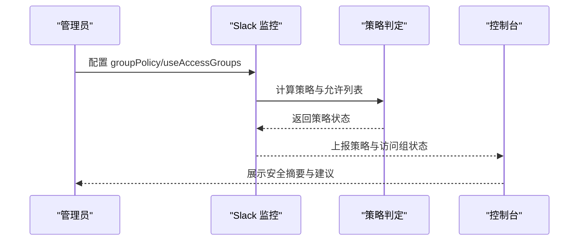
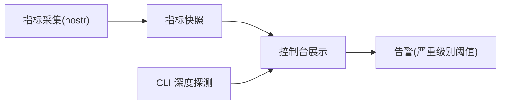
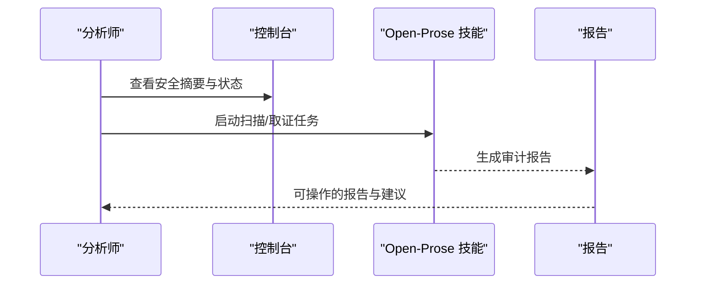
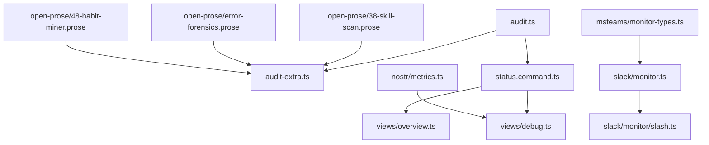

# 安全审计与监控

## 目录
1. [简介](#简介)
2. [项目结构](#项目结构)
3. [核心组件](#核心组件)
4. [架构总览](#架构总览)
5. [详细组件分析](#详细组件分析)
6. [依赖关系分析](#依赖关系分析)
7. [性能考量](#性能考量)
8. [故障排查指南](#故障排查指南)
9. [结论](#结论)
10. [附录](#附录)

## 简介
本文件面向安全运营人员与系统管理员，系统化梳理 OpenClaw 的安全审计与监控能力，覆盖以下主题：
- 审计事件分类、日志格式与存储策略
- 违规检测与异常行为监控机制
- 威胁分析与响应流程
- 审计指标采集、性能监控与告警机制
- 安全监控仪表板、日志分析工具与合规性报告
- 配置与使用指导（CLI 与 Web 控制台）

## 项目结构
OpenClaw 将“安全审计”作为独立模块实现，并通过 CLI 命令与 Web 控制台进行呈现；同时在各渠道（如 Slack、Teams）提供监控与策略控制；扩展技能（Open-Prose）支持对技能与钩子进行安全扫描与取证。

## 核心组件
- 安全审计引擎：集中于运行时安全检查、配置风险评估、文件系统权限与暴露面分析、模型与工具策略校验等。
- CLI 命令与状态输出：提供“安全审计摘要”与“深度探测”结果的终端展示。
- Web 控制台：在仪表板中可视化安全摘要、健康状态与事件日志。
- 通道监控与策略：在 Slack 等通道上实施访问组策略、命令执行白名单与线程上下文管理。
- 扩展分析与报告：通过 Open-Prose 技能对技能与钩子进行扫描、取证与模式挖掘，形成可操作的报告。
- 指标与度量：在特定扩展（如 Nostr）中提供事件处理、解密成功率、速率限制等指标。

## 架构总览
下图展示了从“审计引擎”到“CLI/控制台”的数据流，以及与“通道监控”“扩展分析”的交互。

## 详细组件分析

### 审计引擎与事件分类
- 事件类型与严重级别
  - 信息类：用于汇总攻击面、模型配置概览等。
  - 警告类：敏感配置未启用、弱口令、开放策略、大范围允许列表等。
  - 严重类：公网暴露、设备身份校验关闭、开放组策略且启用高危工具等。
- 关键检查点
  - 文件系统权限：状态目录、配置文件、日志文件、会话存储等。
  - 网关与浏览器控制：绑定地址、鉴权、反向代理信任、远程 CDP。
  - 日志脱敏：工具摘要脱敏策略。
  - 工具提升执行：允许列表通配符、过大列表。
  - 渠道安全：DM 策略、访问组策略、命令白名单。
  - 模型与工具策略：旧模型、弱模型层级、小参数模型的暴露面。
  - 插件信任：未设置允许列表且存在扩展目录。
  - 深度探测：网关连通性与健康状态。
- 输出结构
  - 时间戳、摘要（critical/warn/info）、详细发现数组、深度探测结果（可选）。

### 日志记录、格式与存储策略
- 日志文件权限检查：若日志文件对组或世界可读，标记为警告并给出修复建议。
- 会话存储权限检查：sessions.json 对组或世界可读时发出警告。
- 工具摘要脱敏：当 `logging.redactSensitive` 设置为 off 时，提示可能泄露敏感信息。
- 存储位置：日志文件路径可使用波浪号展开，最终解析为绝对路径后进行权限检查。

### 违规检测与异常行为监控
- 渠道策略与访问组
  - Slack：当 `useAccessGroups` 关闭且启用原生命令时，可能绕过访问组，标记为严重风险；若未配置任何允许列表，标记为警告。
  - Discord/Telegram：开放 DM 或群组策略且未配置允许列表时，标记为严重或警告。
- 事件日志与仪表板
  - 控制台将安全摘要渲染为调色板提示（严重/警告/无问题），并在调试视图中展示原始状态与健康数据。
  - 事件日志条目包含时间戳、事件名与可选载荷，便于回溯。

### 威胁分析与响应流程
- 威胁建模
  - 开放策略与高危工具组合：可能导致提示注入放大、命令执行扩大。
  - 弱模型与小参数模型：在未沙箱化且允许外部输入工具时，风险显著上升。
  - 未受控的扩展加载：在未设置允许列表的情况下，存在未知插件被加载的风险。
- 响应建议
  - 立即：收紧组策略、启用访问组、限制允许列表、开启沙箱、禁用高危工具。
  - 持续：定期运行安全审计与深度探测，结合 Open-Prose 的扫描与取证，形成闭环。

### 审计指标采集、性能监控与告警
- 指标采集
  - Nostr 扩展提供事件接收/处理/重复/拒绝、中继、速率限制、解密成功/失败、内存占用等指标快照。
- 性能监控
  - 通过心跳与健康状态在控制台展示；CLI 提供“深度探测”，用于验证网关连通性与鉴权。
- 告警机制
  - CLI 输出按严重级别聚合；控制台以颜色与标签直观提示；建议结合外部告警系统对接严重级别阈值。

### 安全监控仪表板、日志分析工具与合规性报告
- 仪表板
  - 概览页：显示连接状态、认证提示与网关健康；调试页：展示安全摘要、状态、健康与心跳数据。
- 日志分析
  - 事件日志条目结构化，便于检索与回溯。
- 合规性报告
  - Open-Prose 技能可对技能与钩子进行扫描，输出综合安全审计报告，包含风险等级、漏洞模式、优先整改项与统计信息。

## 依赖关系分析
- 组件耦合
  - 审计引擎与扩展审计紧密耦合，后者负责模型、工具、插件与文件系统权限等专项检查。
  - CLI 与控制台依赖审计引擎输出，形成“发现—展示—响应”的闭环。
  - 通道监控与策略控制影响“攻击面”与“访问控制”，与审计引擎的“渠道安全”检查相辅相成。
- 外部集成
  - Teams 监控接口定义了统一的日志器类型，便于扩展接入。
  - Nostr 指标模块提供可复用的指标采集与重置能力。

## 性能考量
- 深度探测超时：默认超时可配置，避免长时间阻塞。
- 权限检查与文件遍历：在大型 include 链路中注意 I/O 成本，建议合理设置 include 深度上限。
- 控制台渲染：仅展示关键摘要，避免一次性渲染大量事件日志导致卡顿。

## 故障排查指南
- CLI 安全审计
  - 使用“深度探测”选项运行，查看网关探测失败原因与建议。
  - 关注严重与警告级别的发现，优先处理高危项。
- 控制台调试
  - 查看安全摘要与状态、健康、心跳数据，定位认证失败、权限不足等问题。
- 通道策略
  - Slack：确认 `useAccessGroups` 与 `allowlist` 配置一致性；DM 策略与多用户共享主会话的风险。
- 日志与存储
  - 检查日志文件与会话存储权限，确保不被组或世界读取。
- 模型与工具
  - 对小参数模型启用沙箱并禁用外部输入工具；对旧模型与弱层级模型进行升级。

## 结论
OpenClaw 的安全审计与监控体系以“审计引擎 + CLI/控制台 + 通道策略 + 扩展分析”为核心，形成从“发现—评估—响应—报告”的完整闭环。通过严格的权限检查、模型与工具策略校验、深度探测与可视化仪表板，能够有效降低攻击面并提升整体安全性。建议在生产环境中持续运行安全审计、启用访问组与沙箱策略，并结合 Open-Prose 的扫描与取证能力，构建可持续的安全运营体系。

## 附录
- 配置与使用要点
  - 运行安全审计：参考 CLI 输出中的建议命令与修复措施。
  - 控制台访问：根据错误提示补充令牌或密码，确保认证通过。
  - 通道策略：在 Slack 等平台启用 `useAccessGroups` 并配置 `allowlist`，避免开放策略。
  - 日志与存储：确保日志文件与会话存储权限严格，避免泄露敏感信息。
  - 模型与工具：优先使用现代、指令硬化模型；对小参数模型启用沙箱并禁用外部输入工具。