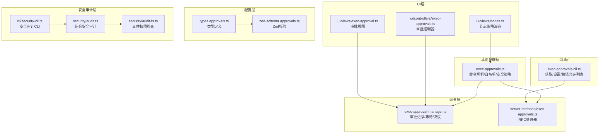
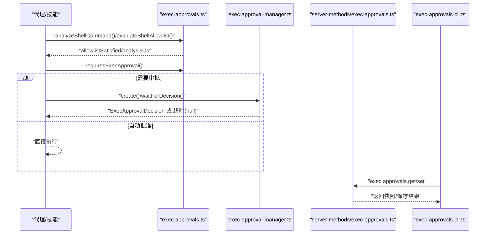
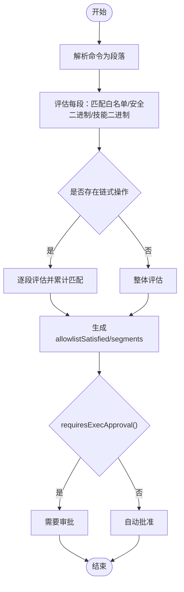
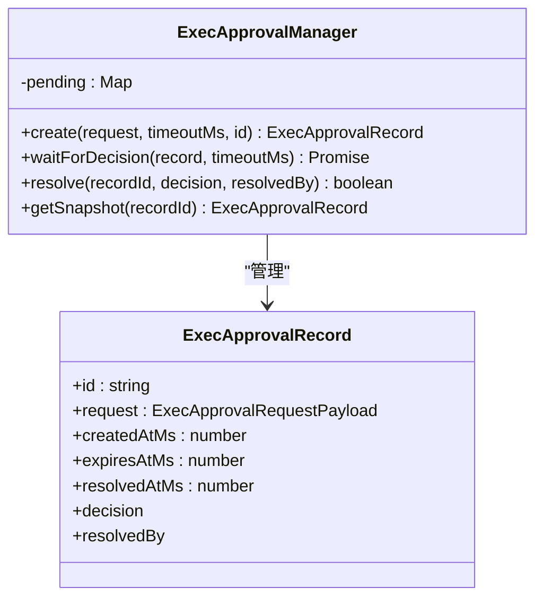
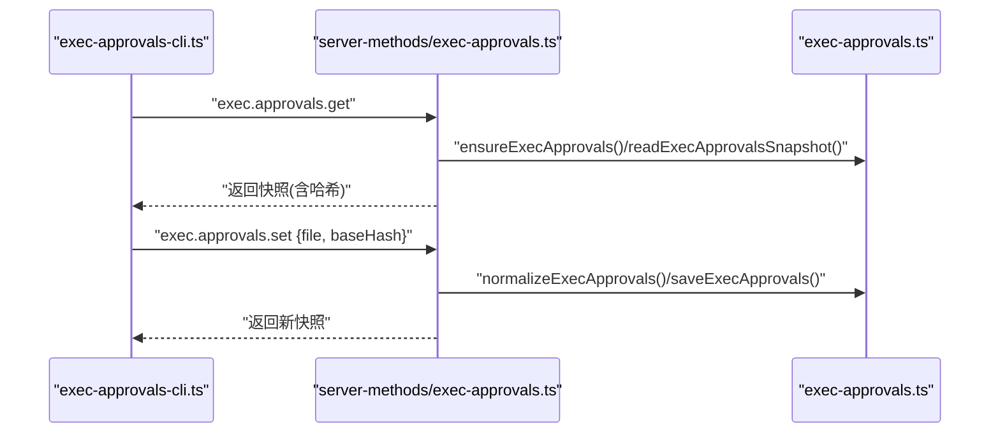
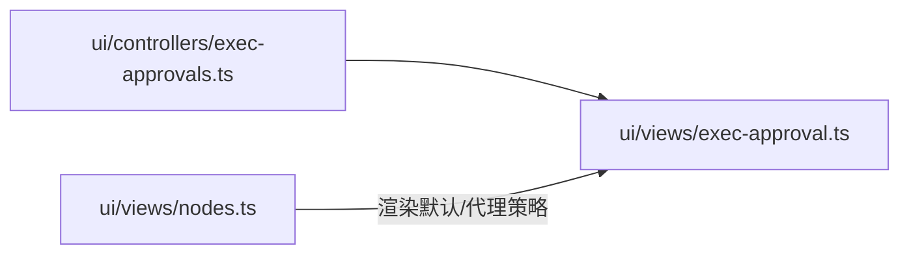
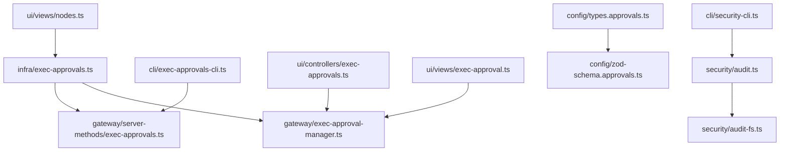

# 权限管理机制

## 目录
1. [简介](#简介)
2. [项目结构](#项目结构)
3. [核心组件](#核心组件)
4. [架构总览](#架构总览)
5. [详细组件分析](#详细组件分析)
6. [依赖关系分析](#依赖关系分析)
7. [性能考虑](#性能考虑)
8. [故障排除指南](#故障排除指南)
9. [结论](#结论)
10. [附录](#附录)

## 简介
本文件系统性阐述 OpenClaw 的权限管理机制，重点覆盖以下方面：
- 执行审批流程：从命令解析、白名单匹配到审批决策与自动批准策略
- 权限验证与访问控制：基于安全级别（拒绝/白名单/全开）与询问模式（关闭/仅缺失时/总是）的综合判定
- 工具调用权限、系统命令执行与文件访问控制：支持安全二进制白名单、技能二进制自动放行、路径参数限制等
- 权限白名单、黑名单与动态权限分配：通配符代理、按代理粒度与按会话过滤的转发策略
- 审批流程、用户确认与自动批准：CLI 管理、网关审批记录、超时与撤销机制
- 权限配置管理、权限审计与异常处理：Zod 校验、文件权限审计、安全 CLI 命令

## 项目结构
OpenClaw 的权限系统由基础设施层（命令解析与白名单评估）、网关层（审批记录与 RPC 处理）、CLI 层（配置与编辑）、UI 层（审批视图与节点策略）以及安全审计层组成。

## 核心组件
- 命令解析与白名单评估：负责将原始命令解析为段落、识别可执行文件、匹配通配符模式、判断是否满足安全策略与自动放行条件。
- 审批记录与等待：维护待决审批的生命周期、超时与决议回调。
- 网关 RPC 处理：提供获取/设置执行审批配置的 RPC 方法，并进行参数校验与哈希一致性检查。
- CLI 管理：提供 approvals 子命令，支持获取快照、替换配置、编辑允许列表。
- 配置类型与校验：定义执行审批转发配置的类型与 Zod Schema。
- 安全审计：综合检查配置、状态目录、通道安全策略与文件权限，输出风险报告并可选修复。

## 架构总览
下图展示了从命令发起到审批决策的关键交互流程，包括白名单评估、安全策略判定与审批请求的产生与处理。

## 详细组件分析

### 命令解析与白名单评估
- 命令解析：支持引号转义、管道与链式操作符，将复杂命令拆分为段并解析每个段的 argv 与可执行文件路径。
- 白名单匹配：对每个段的目标路径进行通配符匹配；支持绝对路径、相对路径与波浪号展开；在 Windows 平台进行 realpath 规范化。
- 安全策略：支持“安全二进制”白名单（如 jq、grep 等），仅允许这些二进制以安全方式使用（不接受路径类参数）；支持“技能二进制”自动放行（当启用自动放行且存在技能二进制集合时）。
- 审批触发：根据 ask 模式与安全级别决定是否需要人工审批；仅缺失时（on-miss）且白名单未满足或分析失败时触发。

### 审批记录与等待机制
- 记录创建：生成唯一 ID、记录创建时间与过期时间，支持自定义 ID。
- 等待决策：在超时前阻塞等待审批结果；超时后返回空值。
- 决议解决：支持通过 ID 解决审批记录，写入决议与处理人信息。
- 快照查询：按 ID 获取审批记录快照用于前端展示或调试。

### 网关 RPC 处理与 CLI 管理
- RPC 处理器：提供 `exec.approvals.get/set` 与节点级 `get/set`；进行参数校验、基线哈希检查与安全脱敏。
- CLI 子命令：支持 approvals get/set、allowlist add/remove，支持本地与远程节点目标，JSON 输出与表格渲染。
- 配置类型与校验：定义转发模式（会话/目标/两者）、过滤器与目标条目，使用 Zod 进行严格校验。

### UI 层：审批视图与节点策略
- 审批控制器与视图：负责渲染执行审批策略、显示默认与代理级别的 ask/security/autoAllowSkills 等配置。
- 节点视图：在节点页面中渲染默认作用域与代理作用域下的策略差异，支持自动覆盖与默认值合并。

### 权限白名单、黑名单与动态权限分配
- 白名单：支持通配符模式匹配可执行文件路径；支持按代理与通配符代理合并；记录最近使用情况。
- 黑名单：通过 deny 安全级别实现全局拒绝；allowlist 模式下仅允许白名单内的命令。
- 动态权限分配：支持 ask 模式（off/on-miss/always）与 askFallback；autoAllowSkills 在存在技能二进制集合时自动放行相关命令。
- 转发策略：支持按会话键模式与代理 ID 过滤，选择转发至聊天通道或特定目标。

### 审批流程、用户确认与自动批准
- 审批请求：当 ask 为 always 或 on-miss 且 allowlist 不满足时触发；可通过 socket 与网关通信获取决策。
- 用户确认：UI 层展示审批详情，支持允许一次/允许一直/拒绝三种决策。
- 自动批准：当 allowlist 满足、安全二进制使用安全或技能二进制自动放行时，无需人工干预。

### 权限配置管理、权限审计与异常处理
- 配置管理：CLI 提供 approvals get/set 与 allowlist 编辑；RPC 层进行参数校验与哈希一致性检查。
- 权限审计：综合检查状态目录与配置文件权限、通道安全策略、网关暴露与认证配置等，输出严重级别并提供修复建议。
- 异常处理：CLI 对未知错误进行格式化；RPC 层对无效请求返回标准化错误码；文件权限检查失败时记录错误信息。

## 依赖关系分析

## 性能考虑
- 命令解析与白名单匹配：使用通配符到正则转换与路径规范化，避免重复计算；在 Windows 平台进行 realpath 规范化以减少误判。
- 审批等待：采用定时器与 Map 管理待决记录，超时即释放内存；建议合理设置超时时间以平衡用户体验与资源占用。
- 文件权限检查：在非 Windows 平台使用 POSIX 模式位快速判断，在 Windows 使用 ACL 检查；对失败场景记录错误以便诊断。
- CLI 渲染：表格宽度自适应终端列数，避免长输出导致的性能问题。

[本节为通用指导，不涉及具体文件分析]

## 故障排除指南
- 审批未触发或频繁触发
  - 检查 ask 与 security 配置，确认 on-miss 与 allowlist 是否正确设置。
  - 使用 CLI approvals get 查看当前快照与哈希，确保 set 操作时基线一致。
- 允许列表不生效
  - 确认模式是否包含路径分隔符或波浪号；Windows 平台注意路径规范化。
  - 检查通配符代理与代理允许列表的合并顺序。
- 安全审计告警
  - 关注状态目录与配置文件的权限设置，按建议调整模式或 ACL。
  - 对于通道安全策略，检查 DM 政策与 allowFrom 列表的一致性。
- CLI 错误处理
  - CLI 将未知错误格式化为单行提示；优先检查网络连通性与 RPC 参数有效性。

## 结论
OpenClaw 的权限管理机制通过“命令解析 + 白名单评估 + 审批决策”的闭环设计，实现了对工具调用、系统命令与文件访问的细粒度控制。结合安全级别、询问模式与自动放行策略，既保证了安全性，又兼顾了可用性。配合 CLI、网关 RPC 与 UI 展示，形成了完整的配置、审计与治理能力。建议在生产环境中：
- 明确 ask 与 security 策略，谨慎使用 always 模式
- 合理维护允许列表，利用通配符与技能二进制自动放行
- 定期运行安全审计，及时修复权限与配置风险
- 通过 CLI 与网关接口进行集中化配置与审批管理

[本节为总结性内容，不涉及具体文件分析]

## 附录

### 示例：安全代理权限配置
以下示例展示了如何为不同代理定义只读代码审查者、受限文档作者与全权管理员的权限策略，涵盖读取、写入与 Bash 执行的控制。

- 代码审查者：仅允许读取源文件与文档，禁止修改与 Bash 执行
- 文档作者：仅允许写入文档目录，禁止 Bash 执行
- 全权管理员：允许读写与 Bash 执行，并开启网络访问