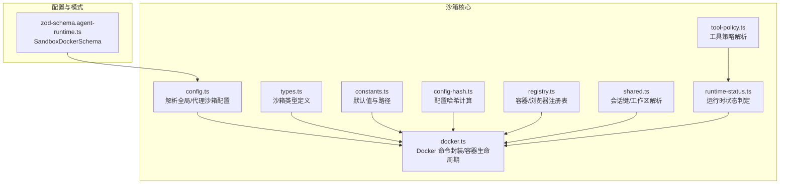
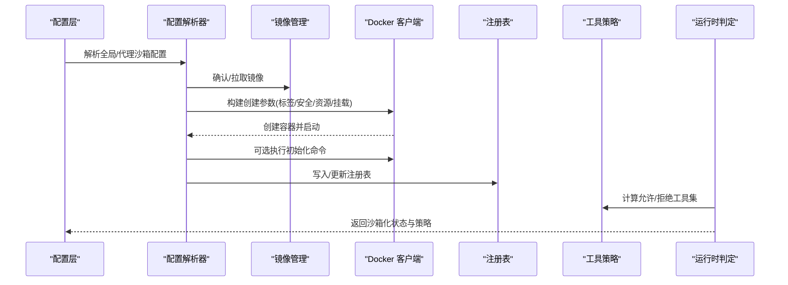
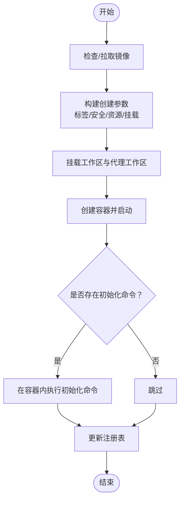
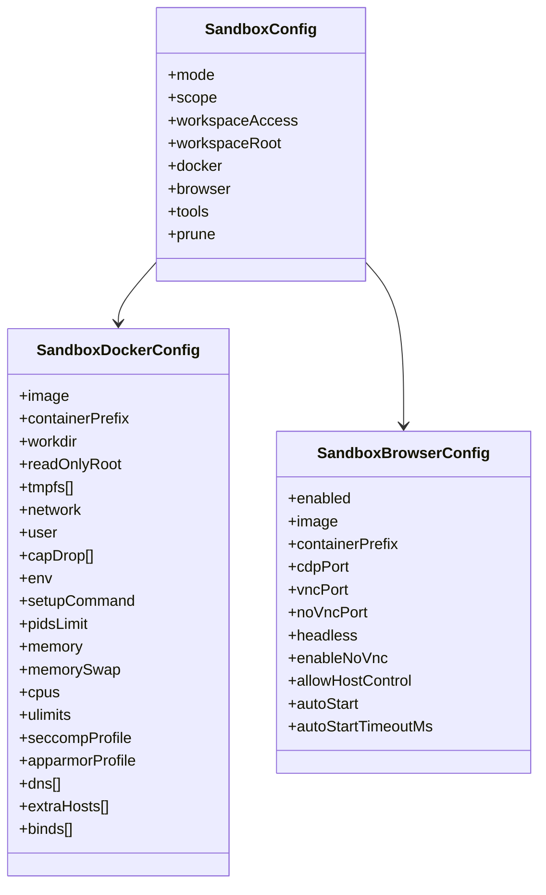
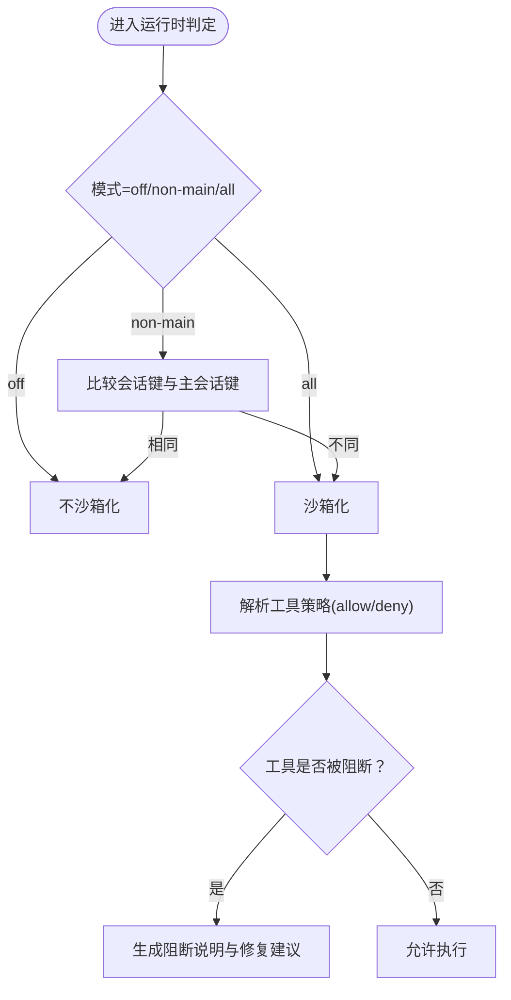
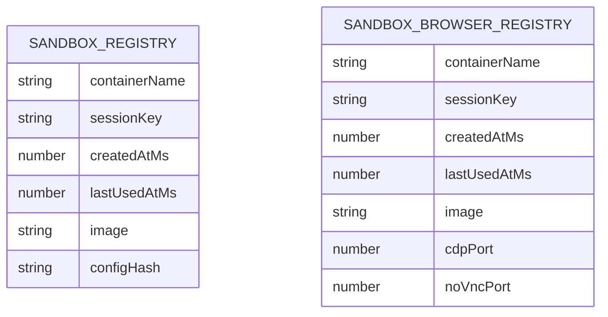
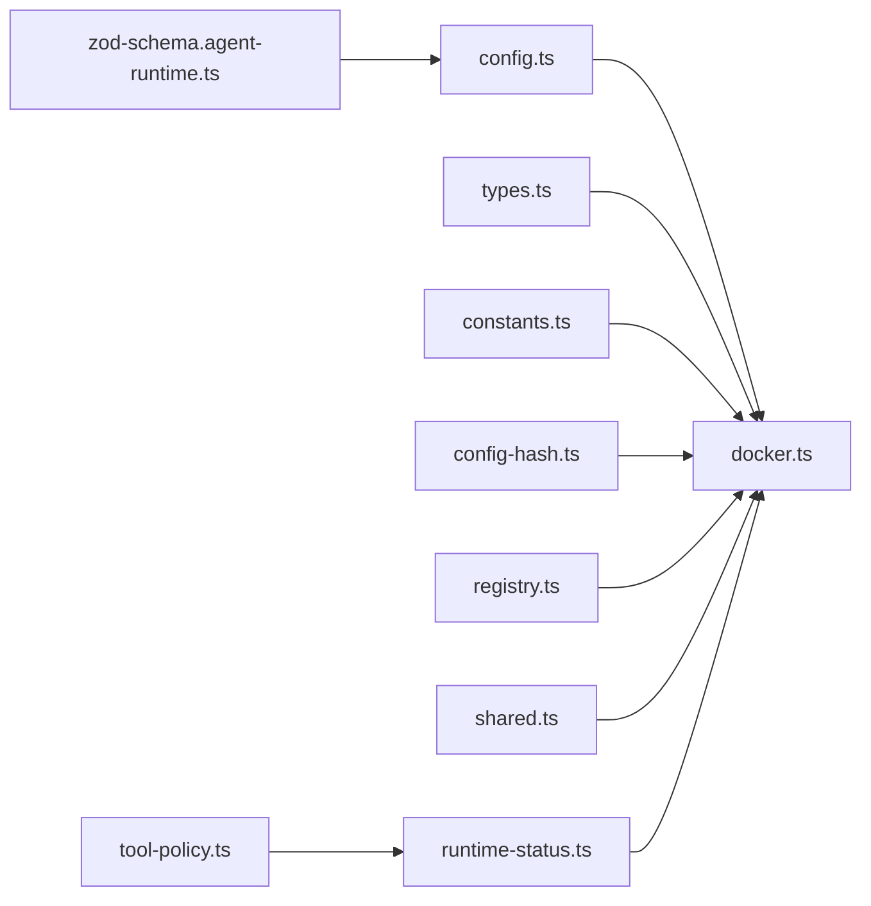

# 沙箱执行模型

## 目录
1. [引言](#引言)
2. [项目结构](#项目结构)
3. [核心组件](#核心组件)
4. [架构总览](#架构总览)
5. [详细组件分析](#详细组件分析)
6. [依赖关系分析](#依赖关系分析)
7. [性能考虑](#性能考虑)
8. [故障排查指南](#故障排查指南)
9. [结论](#结论)
10. [附录](#附录)

## 引言
本文件系统性阐述 OpenClaw 的沙箱执行模型，围绕 Docker 容器化执行环境的设计与安全隔离展开，覆盖沙箱配置管理、资源限制与权限控制策略，以及代理沙箱、工具执行沙箱与技能运行时的隔离实现。文档同时解释镜像管理、启动参数配置与网络隔离机制，并通过序列图与流程图展示沙箱创建、配置与销毁的完整流程，最后提供性能优化、资源监控与故障恢复策略，帮助系统管理员与开发者完成部署与运维。

## 项目结构
OpenClaw 将“沙箱”相关能力集中在 agents/sandbox 子模块中，配合配置层（config）与 CLI 层（cli），形成从配置解析到容器生命周期管理的闭环。关键目录与文件如下：
- agents/sandbox：沙箱核心逻辑（容器创建/校验/标签/挂载/策略）
- config：配置模式与校验（含 SandboxDockerSchema）
- scripts/e2e：端到端测试镜像构建
- 根目录 Dockerfile.sandbox 与 Dockerfile.sandbox-browser：官方沙箱镜像构建

## 核心组件
- 配置解析与合并：根据作用域（session/agent/shared）与优先级（全局/代理）合并 Docker、浏览器、工具策略与修剪策略。
- 容器生命周期：镜像检查/拉取、容器创建/启动、挂载工作区、执行初始化命令、更新注册表。
- 安全与隔离：只读根文件系统、丢弃能力、安全选项（seccomp/apparmor）、网络隔离、DNS/hosts 控制、ulimit/pids/memory 等资源限制。
- 工具策略：基于 allow/deny 列表与通配符匹配，支持组展开与默认白名单/黑名单。
- 运行时判定：根据会话模式（off/non-main/all）与主会话键决定是否沙箱化。
- 注册表与哈希：持久化容器元数据，基于配置哈希判断变更并提示重建或自动清理。

## 架构总览
下图展示了从配置到容器生命周期的端到端交互，包括镜像准备、容器创建、挂载与初始化、运行时策略评估与注册表更新。

## 详细组件分析

### 组件一：Docker 容器生命周期与安全参数
- 镜像管理：若未指定镜像则回退到默认镜像并拉取基础镜像后打标签；否则要求镜像存在。
- 创建参数：统一构建 docker create 参数，注入标签（会话键/创建时间/配置哈希）、只读根、tmpfs、网络、用户、能力丢弃、安全选项、DNS/hosts、资源限制（pids/memory/cpus/ulimit）、自定义挂载（binds）。
- 容器创建：追加工作目录与工作区挂载（主/代理），以 sleep infinity 作为入口，随后启动容器；如配置了初始化命令则在容器内执行。
- 状态与重建：读取容器运行状态与配置哈希，若哈希不一致且容器近期使用则提示重建，否则删除旧容器并重新创建。
- 注册表更新：记录容器名、会话键、创建/使用时间、镜像与配置哈希。

### 组件二：配置解析与合并（全局/代理/作用域）
- 作用域解析：支持 session/agent/shared 三种作用域，perSession 也可映射为作用域。
- Docker 配置合并：环境变量采用“代理覆盖全局”的策略；ulimits 合并；binds 数组合并；其余字段按“代理优先，否则全局，否则默认”规则填充。
- 浏览器配置：独立于 Docker，包含镜像、前缀、端口、无头模式、自动启动等。
- 修剪配置：空闲时长与最大存活天数，支持 per-agent 覆盖。
- 工具策略：解析 allow/deny 列表，支持组展开与默认集合；确保 `image` 工具在沙箱会话中可用。

### 组件三：运行时状态与工具策略
- 运行时判定：根据模式（off/non-main/all）与主会话键决定是否沙箱化；支持会话别名规范化。
- 工具策略：编译通配符/正则，匹配 allow/deny；若 allow 为空则放行所有；默认允许一组基础工具，拒绝一组高风险工具；确保 `image` 在沙箱会话中可用。
- 阻断消息格式化：当工具被阻断时，输出原因与修复建议（调整 allow/deny 或切换会话）。

### 组件四：配置哈希与注册表
- 配置哈希：对输入进行标准化（数组/对象排序、过滤 undefined、原语转字符串）后计算 SHA1，用于检测配置变更。
- 注册表：持久化容器元信息（名称、会话键、创建/使用时间、镜像、配置哈希），支持更新与删除；浏览器注册表类似。

### 组件五：镜像与构建
- 默认镜像：若使用默认镜像，先拉取 debian:bookworm-slim 并打上默认标签。
- 官方镜像构建：仓库提供 Dockerfile.sandbox 与 Dockerfile.sandbox-browser，用于构建标准沙箱与浏览器沙箱镜像。
- 端到端测试镜像：scripts/e2e 下的 Dockerfile 与 Dockerfile.qr-import 用于集成测试场景。

## 依赖关系分析
- 配置层依赖 Zod Schema 对 Docker 字段进行严格校验，保证配置合法性。
- 沙箱核心依赖配置层提供的默认值与合并策略，再通过 docker.ts 执行容器操作。
- 工具策略与运行时判定相互协作，前者提供允许/拒绝集合，后者决定是否应用策略。
- 注册表与哈希共同保障容器重建与状态一致性。

## 性能考虑
- 资源限制：合理设置 pidsLimit、memory/memorySwap、cpus 与 ulimits，避免单容器占用过多宿主资源。
- 文件系统：启用 tmpfs 提升临时文件访问性能；只读根文件系统减少写放大。
- 网络隔离：默认 none 网络可显著降低攻击面；如需联网，仅开放必要 DNS 与 hosts。
- 镜像与缓存：复用默认镜像并保持版本稳定，减少构建与拉取开销；利用注册表避免重复创建。
- 会话粒度：按需选择作用域（session/agent/shared），避免过度隔离带来的容器数量膨胀。

## 故障排查指南
- 容器无法启动/重启：检查配置哈希是否变化导致重建；查看最近一次使用时间窗口内的热容器提示；必要时手动重建。
- 权限不足：确认 capDrop 与 no-new-privileges 是否生效；检查 seccomp/apparmor 配置是否过于严格。
- 网络异常：核对 network、dns、extraHosts 设置；验证端口映射与防火墙。
- 工具被阻断：使用运行时状态接口获取阻断原因与修复建议；调整 allow/deny 或切换会话。
- 镜像缺失：确保已拉取或构建所需镜像；默认镜像需先拉取基础镜像并打标签。

## 结论
OpenClaw 的沙箱执行模型以“配置即代码”为核心，结合严格的 Docker 安全参数与细粒度的工具策略，实现了对代理沙箱、工具执行沙箱与技能运行时的可靠隔离。通过注册表与配置哈希，系统在保证安全性的同时兼顾了可维护性与可观测性。建议在生产环境中遵循最小权限原则与最小暴露面原则，结合资源限制与网络隔离策略，持续监控容器健康与工具调用行为，确保系统稳定与安全。

## 附录
- 配置模式参考：SandboxDockerSchema 定义了镜像、容器前缀、工作目录、只读根、tmpfs、网络、用户、能力丢弃、环境变量、初始化命令、进程数限制、内存限制、CPU 份额、ulimit、seccomp/apparmor、DNS、额外主机、绑定挂载等字段。
- 执行主机与安全策略：工具执行可选择在 sandbox、gateway 或 node 上执行，安全模式支持 deny/allowlist/full，询问模式支持 off/on-miss/always，策略解析遵循“工具参数 → 代理覆盖 → 全局默认”的优先级。