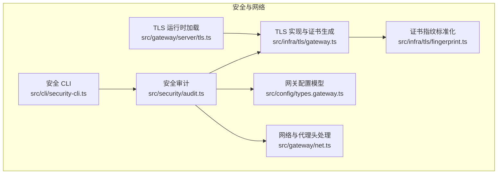
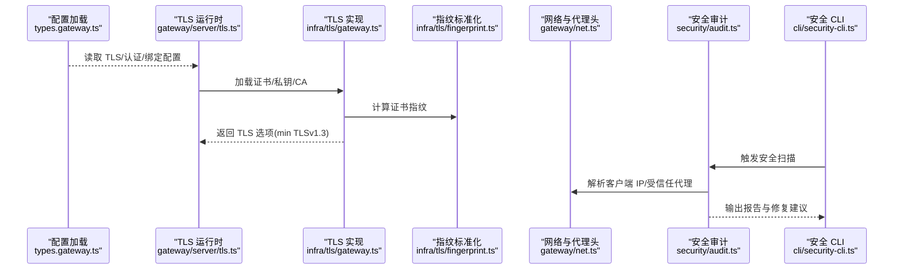
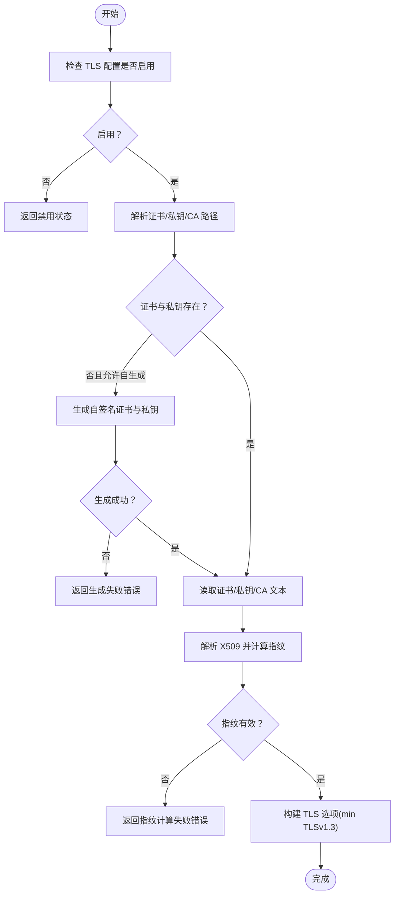
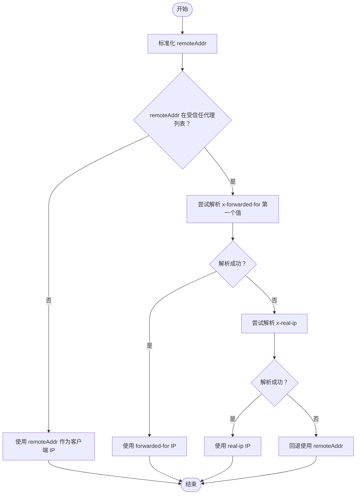
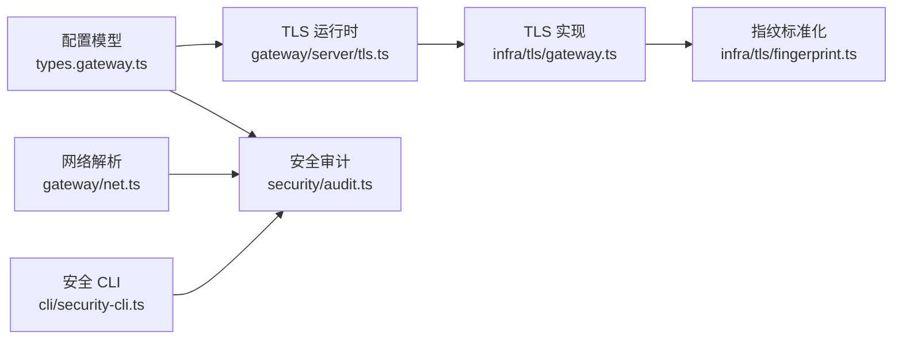

# 网络安全协议

## 目录
1. [简介](#简介)
2. [项目结构](#项目结构)
3. [核心组件](#核心组件)
4. [架构总览](#架构总览)
5. [组件详解](#组件详解)
6. [依赖关系分析](#依赖关系分析)
7. [性能考量](#性能考量)
8. [故障排查指南](#故障排查指南)
9. [结论](#结论)
10. [附录](#附录)

## 简介
本文件面向网络工程师与安全专家，系统化梳理 OpenClaw 网络安全协议与实现，重点覆盖：
- WebSocket 通信的安全机制与 TLS 加密
- 传输层保护与证书管理
- 网络连接验证、IP 地址解析与代理头处理
- 安全配置、证书生成与指纹校验
- 攻击防护、DDoS 防护与连接限制策略
- 安全审计、入侵检测与事件响应建议
- 具体代码路径示例，帮助快速定位实现位置

## 项目结构
围绕网络安全的关键代码主要分布在以下模块：
- TLS 与证书管理：gateway 层加载与运行时配置、证书生成与指纹计算
- 网络与代理头处理：客户端 IP 解析、受信任代理判定、本地地址识别
- 安全审计与 CLI：安全扫描、修复建议与输出格式化
- 配置模型：网关绑定模式、认证、TLS、反向代理信任等

## 核心组件
- TLS 运行时加载与配置
  - 负责根据配置加载证书、私钥与 CA，并生成最小 TLSv1.3 选项；支持自动生成自签名证书。
  - 关键实现路径：`src/gateway/server/tls.ts`、`src/infra/tls/gateway.ts`
- 证书指纹与标准化
  - 计算 SHA-256 指纹并统一格式，用于远端连接的证书校验。
  - 关键实现路径：`src/infra/tls/gateway.ts`、`src/infra/tls/fingerprint.ts`
- 网络与代理头处理
  - 解析 forwarded-for、real-ip 等头部，结合受信任代理列表判定真实客户端 IP，避免代理绕过本地信任。
  - 关键实现路径：`src/gateway/net.ts`
- 安全审计与 CLI
  - 提供安全扫描、修复建议与报告输出，涵盖文件权限、网关暴露策略、反向代理信任、令牌强度等。
  - 关键实现路径：`src/security/audit.ts`、`src/cli/security-cli.ts`
- 配置模型
  - 定义网关绑定模式、认证方式、TLS 开关与自动生成功能、反向代理信任列表等。
  - 关键实现路径：`src/config/types.gateway.ts`

## 架构总览
下图展示了从配置到运行时 TLS、代理头解析与安全审计的整体流程。

## 组件详解

### TLS 与证书管理
- 功能要点
  - 支持启用/禁用 TLS、自动证书生成（自签名）、读取用户证书与私钥、可选 CA Bundle（mTLS 或自定义根）
  - 通过 Node.js crypto 读取证书并计算 SHA-256 指纹，标准化格式后返回运行时对象
  - 设置 TLS 最低版本为 TLSv1.3，确保传输层安全
- 关键流程
  - 若未启用或未提供证书/私钥且允许自动生成，则调用 openssl 生成证书与私钥，并设置严格权限
  - 读取证书/私钥/CA 后尝试解析 X509 并计算指纹，失败则返回错误状态
  - 将证书、私钥、可选 CA 与 TLSv1.3 选项打包返回给上层服务

### 网络连接验证与代理头处理
- 功能要点
  - 解析 x-forwarded-for 与 x-real-ip 等头部，剥离端口与 IPv4 映射，标准化 IP
  - 结合受信任代理列表判断请求来源是否可信，若不可信则忽略代理头部，防止伪造本地信任
  - 识别本地回环与 Tailscale 地址，辅助本地直连判定与配对逻辑
- 关键流程
  - 若远端地址不在受信任代理列表，直接采用远端地址作为客户端 IP
  - 若远端地址在受信任代理列表，优先使用 forwarded-for 或 real-ip，否则回退至远端地址
  - 本地直连判定综合 host 是否为 localhost/ts.net、是否存在代理头部以及代理是否可信

### 安全配置与证书管理
- 关键配置项
  - TLS 开关、自动生成功能、证书/私钥/CA 路径
  - 反向代理信任列表（`trustedProxies`），用于代理头可信性判定
  - 绑定模式（`loopback`/`lan`/`auto`/`custom`/`tailnet`）与尾云暴露模式
  - 控制 UI 认证策略（`token`/`password`、设备身份校验开关）
- 影响范围
  - 不当的绑定与代理信任会导致本地直连绕过、外网暴露风险与鉴权失效
  - 弱令牌长度、开放 DM 策略、大宽泛 allowlist 等均被审计器标记为风险

### 安全审计与 CLI
- 审计能力
  - 文件系统权限检查（state/config 目录与文件权限）
  - 网关暴露策略与认证缺失风险评估
  - 反向代理信任缺失警告
  - 浏览器控制端点（CDP）协议风险提示
  - 工具提升执行白名单过大与通配符风险
  - 渠道 DM 策略与会话隔离建议
- CLI 行为
  - 支持深度探测（最佳努力）、JSON 输出、自动修复（收紧默认权限与 chmod）

## 依赖关系分析
- 组件耦合
  - TLS 运行时依赖证书基础设施与指纹标准化
  - 安全审计同时依赖配置模型、网络解析与 TLS 运行时状态
  - CLI 作为入口，串联审计与报告输出
- 外部依赖
  - Node.js crypto/X509Certificate 用于证书解析与指纹计算
  - Node.js child_process/execFile 用于 openssl 生成自签名证书
  - 受信任代理列表来自配置模型

## 性能考量
- TLS 选项最小化
  - 仅启用 TLSv1.3，减少握手与加密开销，同时保证现代安全基线
- 证书生成成本
  - 自签名证书生成仅在首次缺失时触发，后续复用文件，避免频繁调用 openssl
- 代理头解析
  - 仅在受信任代理场景下解析头部，降低误判与额外计算
- 审计扫描
  - 深度探测为“尽力而为”，避免阻塞主流程；可通过 CLI 选择是否启用

## 故障排查指南
- TLS 证书缺失或加载失败
  - 现象：返回“cert/key missing”或“failed to load cert”
  - 排查：确认证书/私钥路径存在且权限正确；若启用自动生成功能，检查 openssl 可用性
  - 参考实现路径：`src/infra/tls/gateway.ts`
- 证书指纹为空
  - 现象：返回“unable to compute certificate fingerprint”
  - 排查：确认证书内容有效且可被 X509 解析
  - 参考实现路径：`src/infra/tls/gateway.ts`
- 代理头导致本地信任被绕过
  - 现象：外网请求被误判为本地直连
  - 排查：检查 `trustedProxies` 列表是否包含实际代理；确认代理未伪造 x-forwarded-for/x-real-ip
  - 参考实现路径：`src/gateway/net.ts`
- 绑定模式与认证缺失导致外网暴露
  - 现象：非 loopback 绑定但无认证，或 loopback 绑定且未配置认证
  - 排查：根据审计报告调整 `gateway.bind` 与 `gateway.auth`；必要时开启 HTTPS/Tailscale Serve
  - 参考实现路径：`src/security/audit.ts`
- 安全审计报告
  - 使用 CLI 执行安全审计，按严重级别逐项处理修复建议
  - 参考实现路径：`src/cli/security-cli.ts`

## 结论
OpenClaw 的网络安全协议以“最小暴露面 + 严格认证 + 传输层强加密”为核心设计原则：
- 通过 TLSv1.3 与证书指纹校验保障传输层安全
- 严格的代理头解析与受信任代理列表防止本地信任绕过
- 安全审计与 CLI 提供持续的风险发现与修复能力
建议在生产环境强制启用 HTTPS/Tailscale Serve、配置强令牌、收敛 allowlist、定期执行安全审计并监控异常访问行为。

## 附录
- 相关文档索引
  - 网络总览与配对：`docs/network.md`