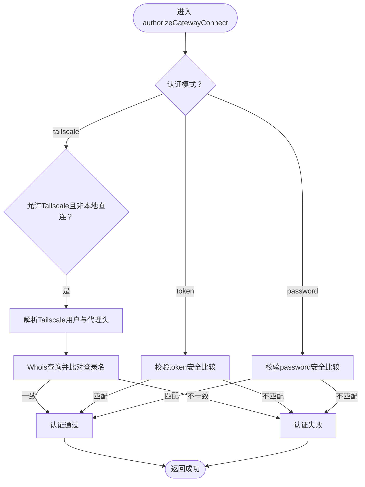

# 认证与授权机制

## 目录
1. [引言](#引言)
2. [项目结构](#项目结构)
3. [核心组件](#核心组件)
4. [架构总览](#架构总览)
5. [详细组件分析](#详细组件分析)
6. [依赖关系分析](#依赖关系分析)
7. [性能考量](#性能考量)
8. [故障排除指南](#故障排除指南)
9. [结论](#结论)
10. [附录](#附录)

## 引言
本文件系统性梳理 OpenClaw 的认证与授权机制，覆盖以下主题：
- 多种认证方式：Token 认证、密码认证、Tailscale 认证
- 设备身份与令牌：设备签名、设备令牌生成与校验、配对状态管理
- 授权策略：角色与作用域（role/scopes）、访问控制与权限检查
- 客户端 IP 识别：本地直连检测、代理地址解析与可信代理配置
- 错误处理与故障排除：错误码、失败原因与修复建议
- 最佳实践：配置要点、安全边界与运维建议

## 项目结构
围绕认证与授权的关键模块分布如下：
- 网关认证与握手：网关侧认证解析、握手流程与错误提示
- 设备身份与令牌：设备公私钥、签名与验证、配对状态与令牌生命周期
- 网络与代理：客户端 IP 解析、本地直连判定、可信代理配置
- 协议与错误码：协议参数校验、错误码定义与响应格式


## 核心组件
- 网关认证解析与授权
  - 支持“token”或“password”两种模式；可选启用 Tailscale 认证
  - 使用安全常量时间比较防止时序攻击
  - 通过环境变量与配置项注入认证凭据
- 设备身份与令牌
  - 基于 Ed25519 的设备公私钥对，设备 ID 由公钥派生
  - 连接握手时校验设备签名与配对状态，按需生成/校验设备令牌
- 客户端 IP 识别与本地直连
  - 综合 remoteAddr、X-Forwarded-For、X-Real-IP 与可信代理配置
  - 严格区分本地直连与代理转发，避免绕过本地策略
- 协议与错误码
  - 严格的请求帧与连接参数校验
  - 明确的错误码与人类可读提示，便于诊断

## 架构总览
下图展示了从客户端发起连接到完成认证与授权的整体流程。


## 详细组件分析

### 网关认证与授权（Token/密码/Tailscale）
- 认证模式选择
  - 优先级：Tailscale（在允许条件下）> token > password
  - 通过配置与环境变量注入凭据，支持运行时覆盖
- 安全比较
  - 使用安全常量时间比较函数，避免时序侧信道
- Tailscale 身份校验
  - 仅在本地直连或具备可信代理头时启用
  - 通过 Tailscale Whois 查询与请求头登录名比对，确保一致性
- 本地直连检测
  - 结合 Host 头、Loopback 地址与代理头判断是否为本地直连
  - 防止反向代理未正确配置导致的本地策略绕过



### 设备身份与令牌（Device Identity & Token）
- 设备身份
  - 生成 Ed25519 密钥对，设备 ID 由公钥派生
  - 公钥支持 PEM 或 Base64URL 形式输入，统一归一化
- 设备签名
  - 连接握手时构建设备认证载荷，使用设备私钥签名
  - 支持 v1/v2 版本差异（v2 包含 nonce），验证签名一致性
- 设备令牌
  - 按角色与作用域生成/校验设备令牌，支持轮换与撤销
  - 令牌持久化与并发锁保护，避免竞态

```mermaid
classDiagram
class DeviceIdentity {
+deviceId : string
+publicKeyPem : string
+privateKeyPem : string
+loadOrCreateDeviceIdentity()
+signDevicePayload(payload) string
+deriveDeviceIdFromPublicKey(publicKey) string
+verifyDeviceSignature(publicKey, payload, signature) bool
}
class DeviceAuthPayload {
+buildDeviceAuthPayload(params) string
}
class DevicePairing {
+ensureDeviceToken(params) DeviceAuthToken
+verifyDeviceToken(params) {ok, reason}
+approveDevicePairing(requestId)
+rejectDevicePairing(requestId)
+rotateDeviceToken(params)
+revokeDeviceToken(params)
}
DeviceIdentity --> DeviceAuthPayload : "构建签名载荷"
DeviceAuthPayload --> DevicePairing : "用于设备令牌校验"
```

### 客户端 IP 识别与本地直连检测
- 代理与 XFF 解析
  - 优先信任可信代理链路中的 X-Forwarded-For/X-Real-IP
  - 对 IPv6 映射、端口剥离等进行标准化处理
- 本地直连判定
  - 仅当客户端 IP 为回环地址且 Host 为 localhost/ts.net，或经可信代理转发时，才视为本地直连
  - 防止未配置可信代理导致的误判
- 客户端 IP 报告
  - 在本地直连或存在不可信代理头时，不对外报告真实客户端 IP，以降低泄露风险


### 授权策略、访问控制与权限检查
- 角色与作用域
  - 支持 operator/node 角色；默认 operator 赋予管理员权限
  - 作用域为空时默认拒绝，显式声明作用域后按子集关系检查
- 设备配对与权限升级
  - 未配对设备需发起配对请求；角色或作用域提升需重新配对
  - 已配对设备的角色/作用域变更需重新审批
- 设备令牌权限
  - 令牌按角色与作用域绑定，校验时要求完全包含请求的作用域集合


### 协议与错误码
- 协议参数校验
  - 使用 JSON Schema 与 AJV 校验连接参数与请求帧
  - 提供结构化的错误信息，便于前端与 CLI 诊断
- 错误码
  - 定义了通用错误码，如 `INVALID_REQUEST`、`NOT_PAIRED` 等
  - 握手失败与认证失败均返回明确错误码与提示

### 认证配置与示例（面向开发者）
- 网关认证配置
  - 支持通过配置文件与环境变量设置 token/password
  - 可开启 Tailscale 认证（在 serve 模式且非密码模式下）
- 设备令牌生成与使用
  - 连接握手时按角色与作用域生成设备令牌
  - 后续可通过设备令牌进行二次认证
- Android 客户端令牌存储
  - 客户端侧以键值形式保存设备令牌，键名包含设备与角色信息

## 依赖关系分析
- 组件耦合
  - 握手处理器依赖认证解析器、网络解析器与设备令牌服务
  - 设备令牌服务依赖配对状态与并发锁，保证一致性
- 外部依赖
  - Node crypto 的安全比较与签名/验签
  - Tailscale Whois 查询（外部服务）
- 潜在风险
  - 代理配置不当可能导致本地策略被绕过
  - 令牌泄露可能影响设备权限，应定期轮换


## 性能考量
- 认证路径短、开销低：主要为常量时间比较与少量字符串拼接
- 并发控制：设备令牌操作使用互斥锁，避免频繁写入冲突
- 代理解析：仅在握手阶段执行一次，后续会话复用解析结果
- 建议
  - 将可信代理列表最小化，减少解析分支
  - 合理设置令牌有效期与轮换策略，平衡安全与可用性

## 故障排除指南
- 常见错误与原因
  - token 缺失/不匹配：检查配置与环境变量，确认客户端携带正确 token
  - password 缺失/不匹配：确认密码配置与客户端输入一致
  - tailscale 身份缺失/不一致：确认 Tailscale Serve 代理头与登录名一致
  - 设备签名无效/过期：检查设备公私钥、签名时间偏移与 nonce
  - 未配对设备：发起配对请求并等待审批
- 诊断步骤
  - 查看握手日志与错误码
  - 确认代理配置与 XFF 头是否正确
  - 校验设备令牌与角色/作用域是否匹配
- 参考文档
  - 网关认证与模型认证状态检查文档

## 结论
OpenClaw 的认证与授权体系以“多因子混合认证 + 设备身份 + 令牌与配对”为核心，结合严格的本地直连检测与代理解析，形成安全可控的接入边界。通过常量时间比较、Ed25519 签名与细粒度的作用域控制，系统在易用性与安全性之间取得良好平衡。建议在生产环境中：
- 正确配置可信代理与本地直连策略
- 定期轮换设备令牌与密钥
- 严格限制角色与作用域范围
- 使用 Tailscale 时确保代理头完整性与一致性

## 附录

### 认证流程与令牌验证算法摘要
- Token/密码认证
  - 读取配置与环境变量，进行常量时间比较
- Tailscale 认证
  - 仅在本地直连或可信代理转发下启用，校验登录名与 Whois 一致性
- 设备签名与令牌
  - 构建签名载荷（含版本、设备ID、角色、作用域、签名时间、可选 token 与 nonce），验证签名
  - 按角色与作用域生成/校验设备令牌，支持轮换与撤销