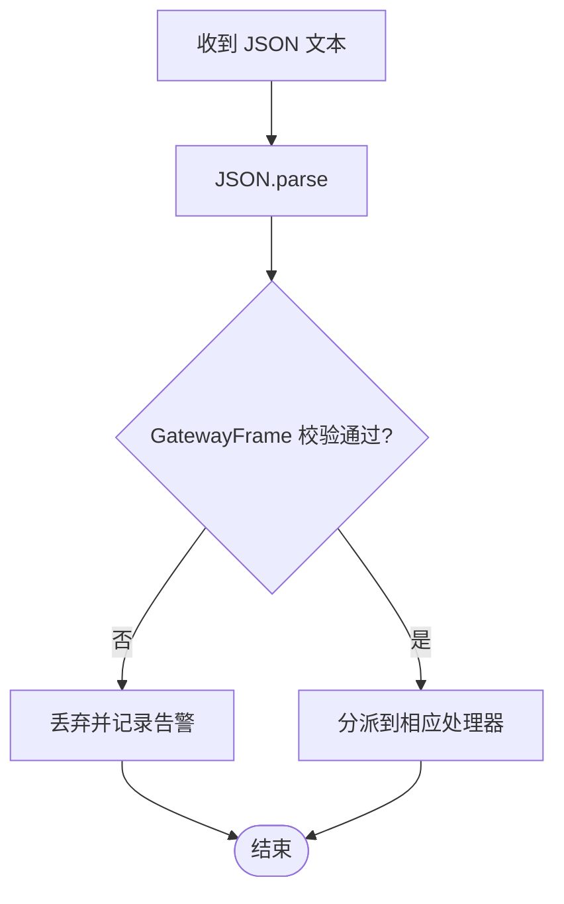

# WebSocket 协议规范

## 目录
1. [引言](#引言)
2. [项目结构](#项目结构)
3. [核心组件](#核心组件)
4. [架构总览](#架构总览)
5. [详细组件分析](#详细组件分析)
6. [依赖关系分析](#依赖关系分析)
7. [性能考量](#性能考量)
8. [故障排查指南](#故障排查指南)
9. [结论](#结论)
10. [附录](#附录)

## 引言
本文件系统性梳理 OpenClaw 的 WebSocket 协议规范，覆盖协议版本管理、消息帧格式与序列化、连接建立与握手、认证机制、请求-响应与事件推送、双向通信、错误处理与重连、心跳保活、消息验证与数据完整性、协议升级与向后兼容、以及最佳实践与性能优化建议。目标是帮助开发者快速理解并正确实现 OpenClaw 的网关 WebSocket 协议。

## 项目结构
OpenClaw 将协议定义与实现分层组织：
- 协议定义层：基于 TypeBox 的 Schema 定义，集中于 `protocol/schema` 目录，并在 `protocol/index.ts` 中导出校验器与类型。
- 服务器实现层：在 `server/ws-connection/message-handler.ts` 中实现握手、认证、消息路由与事件广播。
- 客户端实现层：在 `gateway/client.ts` 中实现连接、重连、心跳与待处理请求管理。
- Web 端工具：在 `web/reconnect.ts` 提供重连策略与心跳解析；在 `web/auto-reply/monitor.ts` 实现监控与自动重连。
- 平台模型：Swift 侧生成的 `GatewayModels.swift` 展示了帧类型的枚举与未知帧的前向兼容处理。

## 核心组件
- 协议版本与帧类型
  - 版本号：协议版本为固定整数，客户端与服务端通过 `minProtocol`/`maxProtocol` 进行协商。
  - 帧类型：`req`（请求）、`res`（响应）、`event`（事件），使用判别字段 `type` 进行区分。
- 消息帧格式
  - 请求帧：包含 `type`、`id`、`method`、`params`。
  - 响应帧：包含 `type`、`id`、`ok`、`payload` 或 `error`。
  - 事件帧：包含 `type`、`event`、`payload`、可选序号与状态版本。
- 序列化与校验
  - 使用 AJV 对帧与参数进行严格校验，支持额外属性拒绝、错误信息格式化。
- 连接与握手
  - 首帧必须为 `connect` 方法的请求帧，携带 `ConnectParams`。
  - 协商协议版本，不匹配则拒绝。
- 认证与配对
  - 支持共享密钥（`token`/`password`）与设备签名认证，控制台界面可配置安全策略。
  - 设备需完成配对或满足免配对条件，角色与作用域按策略授予。
- 双向通信
  - 请求-响应模式用于方法调用；事件推送用于状态变更与通知。
- 错误处理与关闭码
  - 使用标准化错误形状与标准关闭码，便于客户端识别与恢复。
- 心跳与保活
  - 服务端周期性发送心跳事件，客户端维护心跳计时器，超时则主动断开并触发重连。
- 重连机制
  - 指数退避+抖动，带最大尝试次数与上限时间，支持中断与取消。

## 架构总览
下图展示了从客户端到服务端的消息流，包括握手、认证、方法调用与事件推送。

## 详细组件分析

### 协议版本管理与协商
- 版本常量：协议版本在协议 Schema 中定义为固定值。
- 协商流程：客户端在 `connect` 参数中声明 `minProtocol`/`maxProtocol`，服务端检查是否与本地版本相容，不兼容则返回错误并关闭连接。
- 向后兼容：Swift 侧模型保留未知帧类型以避免破坏旧客户端。

### 消息帧格式与序列化
- 帧类型与判别字段：`GatewayFrame` 使用 `type` 字段作为判别器，生成强类型模型。
- 参数 Schema：所有方法参数均以 TypeBox Schema 定义，确保严格的输入约束。
- 校验器：AJV 编译后的校验函数，统一错误格式化输出。

### 连接建立与握手流程
- 首帧要求：首个帧必须为 `type=req` 且 `method=connect`。
- 参数校验：`ConnectParams` 严格校验，包含客户端元信息、能力、命令、权限、角色与作用域、设备签名与认证信息等。
- 挑战事件：服务端在连接建立后发送 `connect.challenge` 事件，客户端据此构造设备签名。
- 成功握手：返回 `hello-ok`，包含协议版本、特性列表、快照、策略与可选认证令牌。

### 认证机制与配对策略
- 授权方式：支持 `token`、`password` 与设备签名认证；可结合代理头与 Tailscale 身份。
- 控制台安全：可配置允许非安全上下文访问或禁用设备认证，以满足不同部署场景。
- 设备配对：首次连接需要配对，后续根据角色与作用域变化可能触发升级请求。
- 设备令牌：为已配对设备签发临时令牌，支持撤销与轮换。

### 请求-响应模式与事件推送
- 请求-响应：客户端发送 `req`，服务端处理后返回 `res`，包含 `ok`、`payload` 或 `error`。
- 事件推送：服务端向客户端广播 `event`，包含事件名与负载，可附带状态版本与序号。
- 方法注册：服务端维护方法表与事件表，消息处理器根据 `method` 分派至对应处理器。

### 心跳保活与重连机制
- 心跳策略：服务端周期性发送心跳事件；客户端维护心跳计时器，若超过阈值未收到心跳则主动断开。
- 重连策略：指数退避+抖动，支持最大尝试次数与上限时间；支持中断与取消。
- 自动重连：Web 监控器在连接异常关闭后自动触发重连流程。

### 消息验证、Schema 校验与数据完整性
- Schema 约束：所有对象使用 `additionalProperties:false`，确保字段严格。
- 校验器生成：AJV 编译 Schema 为校验函数，统一错误格式化。
- 数据完整性：判别字段与最小/最大值约束防止畸形帧进入处理链。

### 协议升级、向后兼容与版本演进
- 版本常量：协议版本在协议 Schema 中集中定义，客户端与服务端共同遵守。
- 兼容策略：服务端拒绝不兼容版本；Swift 侧保留未知帧类型以避免破坏旧客户端。
- 演进路径：新增方法与事件时，通过 Schema 扩展与版本号递增实现平滑过渡。

### 代码示例路径（发送/接收/处理）
以下为关键流程的代码示例路径，便于定位实现细节：
- 发送 `connect` 请求帧并等待 `hello-ok`
- 校验请求帧与 `ConnectParams`
- 协商协议版本并拒绝不兼容
- 返回响应帧与事件帧
- 客户端解析响应并处理待处理队列
- 心跳超时断开与重连
- Web 端重连策略与心跳解析

## 依赖关系分析
- 协议层依赖：协议定义层为上层提供强类型与校验器，服务器与客户端均依赖该层。
- 服务器依赖：消息处理器依赖认证模块、设备配对与系统状态，同时受服务器常量限制。
- 客户端依赖：客户端依赖协议层与重连策略，实现连接生命周期管理。
- 平台模型：Swift 生成的模型依赖协议层的帧与事件定义，保持跨语言一致性。

## 性能考量
- 帧大小与缓冲限制：服务端对单帧大小与每连接发送缓冲设置上限，避免内存压力。
- 心跳间隔：合理的心跳间隔平衡保活与网络开销，避免频繁心跳造成拥塞。
- 退避策略：指数退避与抖动降低风暴效应，配合最大尝试次数与上限时间避免无限重连。
- 校验成本：AJV 校验在高并发下可能成为瓶颈，建议在接入层做基础过滤与限流。

## 故障排查指南
- 握手失败
  - 首帧非 `connect` 或参数校验失败：检查客户端是否按规范发送 `connect` 请求帧。
  - 协议版本不匹配：确认客户端 `min`/`maxProtocol` 与服务端版本一致。
- 认证失败
  - 共享密钥缺失或不匹配：检查 `token`/`password` 配置。
  - 设备签名无效或过期：确认设备公钥、签名与时间戳。
- 心跳超时断开
  - 客户端未及时处理心跳或网络异常：调整心跳间隔或检查网络质量。
- 重连异常
  - 退避策略配置不当导致频繁重连：检查初始延迟、最大延迟与抖动参数。

## 结论
OpenClaw 的 WebSocket 协议通过严格的 Schema 定义与 AJV 校验，确保消息格式与数据完整性；通过版本协商与设备配对机制实现安全接入；借助心跳与重连策略保障连接稳定性；并通过 Swift 侧模型的未知帧保留实现向前兼容。开发者在实现时应严格遵循帧格式、认证流程与版本策略，并结合性能与可靠性需求优化心跳与重连参数。

## 附录
- 最佳实践
  - 在客户端实现中，先等待 `connect.challenge` 再发送 `connect` 请求。
  - 对所有入站帧执行严格校验后再处理业务逻辑。
  - 合理设置心跳间隔与退避参数，避免网络风暴。
  - 对设备签名与时间戳进行严格校验，防止重放攻击。
- 性能优化建议
  - 在接入层增加基础过滤与限流，减少无效帧进入处理链。
  - 使用连接池与复用策略降低握手频率。
  - 对高频事件进行去重与合并，减少带宽占用。