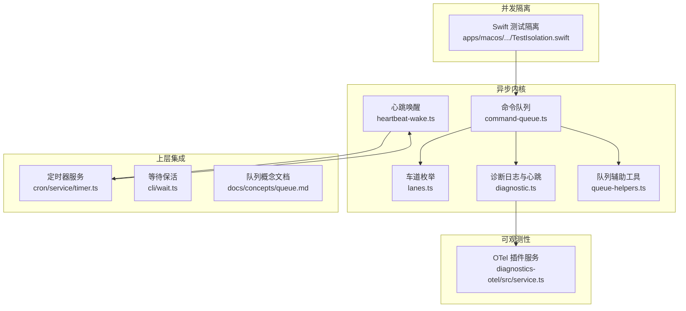
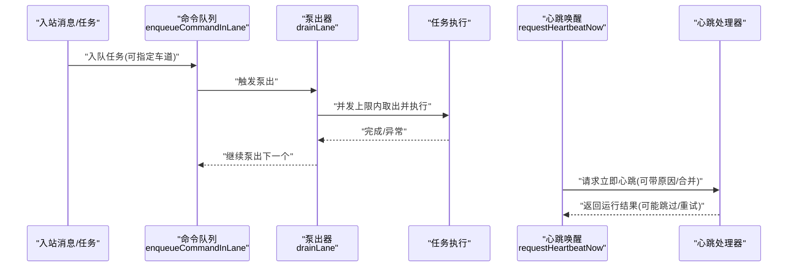
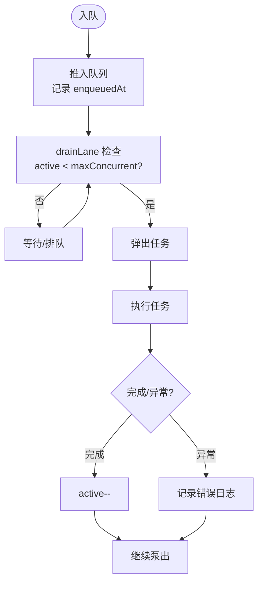
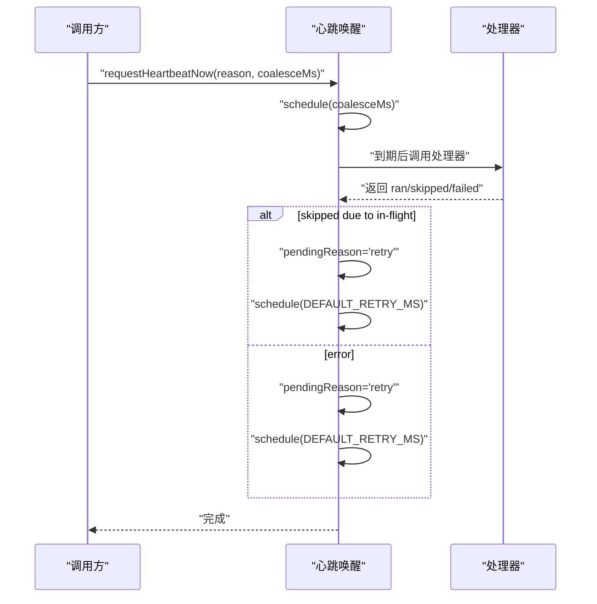
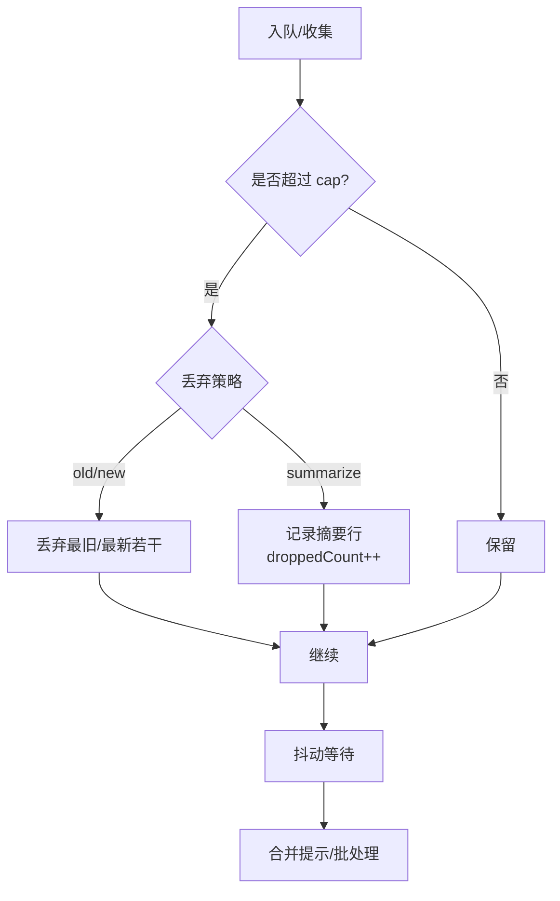
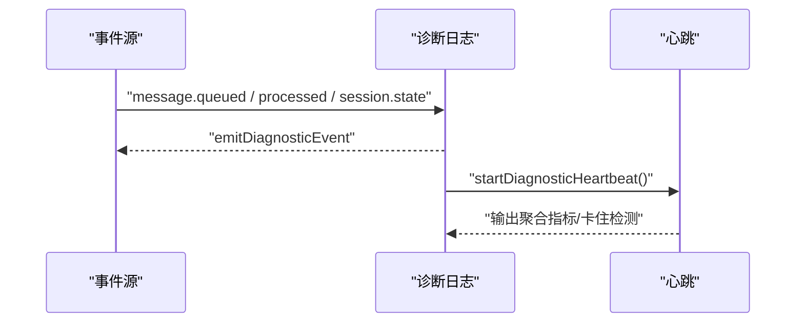
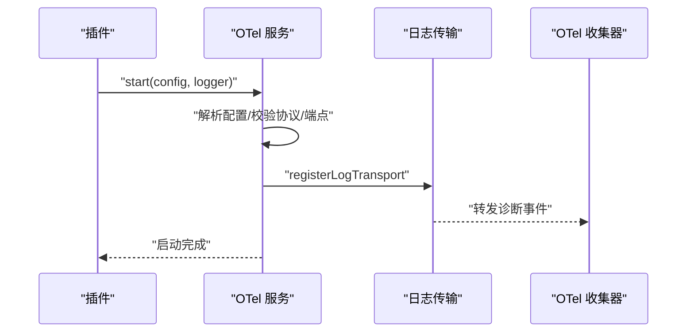
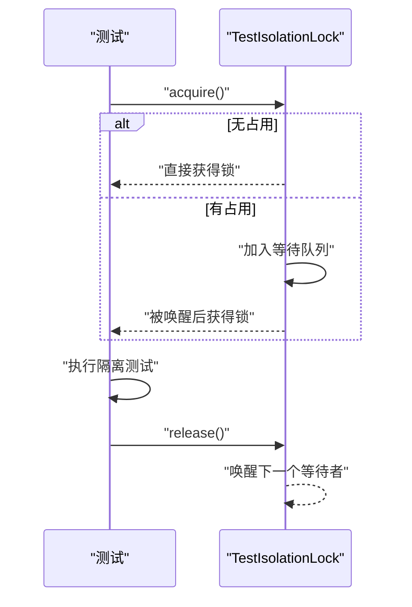
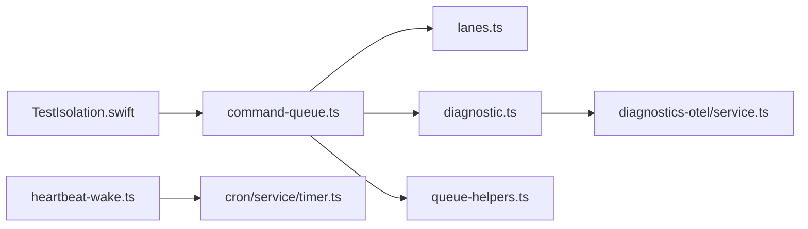

# 异步处理与并发控制

## 目录
1. [引言](#引言)
2. [项目结构](#项目结构)
3. [核心组件](#核心组件)
4. [架构总览](#架构总览)
5. [组件详解](#组件详解)
6. [依赖关系分析](#依赖关系分析)
7. [性能考量](#性能考量)
8. [故障排查指南](#故障排查指南)
9. [结论](#结论)
10. [附录](#附录)

## 引言
本文件面向开发者系统性梳理 OpenClaw 的异步处理与并发控制体系，重点覆盖事件驱动架构、消息队列与任务调度、并发限制与资源管理、死锁预防策略、异步任务生命周期与状态管理、错误恢复机制、任务优先级与批处理/流控策略、协程管理与上下文传递、异常传播、性能监控与瓶颈分析，并提供可直接定位到源码路径的示例与最佳实践。

## 项目结构
OpenClaw 在多语言与多平台环境下通过统一的异步调度内核实现跨通道并发控制与可观测性：
- 命令队列与车道（Lane）：基于内存队列的串行化与并行化控制，支持按会话与全局并发上限。
- 心跳唤醒（Heartbeat）：事件驱动的周期性触发与退避重试，避免主线程拥塞。
- 队列辅助工具：去重、丢弃策略、抖动合并、汇总提示构建。
- 诊断日志与心跳：会话状态、队列深度、运行时指标的持续观测。
- 插件式可观测性：OpenTelemetry 导出器插件，支持指标、追踪与日志。
- 并发隔离测试：Swift actor 锁与隔离测试工具，保障并发场景下的稳定性。

## 核心组件
- 命令队列与车道
  - 多车道（main、cron、subagent、nested）隔离不同类型的并发负载。
  - 每车道维护 FIFO 队列与活跃任务计数，按最大并发上限泵出执行。
  - 支持等待告警阈值回调，便于诊断排队延迟。
- 心跳唤醒
  - 事件驱动的周期性触发，支持合并抖动、失败重试与“请求在途”跳过策略。
  - 提供立即唤醒与状态查询接口，避免主线程拥塞。
- 队列辅助工具
  - 去重、容量控制、丢弃策略（旧/新/摘要）、抖动等待、汇总提示构建。
- 诊断日志与心跳
  - 记录 Webhook 接收/处理/错误、消息入队/处理、会话状态、车道入队/出队、运行尝试、活动心跳。
  - 定期输出诊断心跳，检测“卡住”的会话。
- 插件式可观测性
  - OTel 插件服务注册日志传输、追踪与指标，支持采样率与端点配置。
- 并发隔离测试
  - Swift actor 锁与 @MainActor 隔离测试，确保并发状态访问安全。

## 架构总览
OpenClaw 的异步内核围绕“车道 + 队列 + 心跳”的事件驱动模型组织：
- 入站消息与后台任务通过命令队列进入各自车道，受并发上限约束。
- 主心跳负责周期性扫描与调度，遇到“请求在途”则延后重试，避免拥塞。
- 诊断日志与心跳提供运行时可观测性，OTel 插件将指标与日志外发。
- 并发隔离测试保障在 Swift 端的并发安全。

## 组件详解

### 命令队列与车道（Lane）
- 设计要点
  - 车道隔离：main（主入站/心跳）、cron（定时）、subagent（子代理）、nested（嵌套）。
  - 并发上限：每车道独立 maxConcurrent 控制，缺省 1；main 默认 4，subagent 默认 8。
  - 串行化与并行化：按会话键（`session:<key>`）入队保证单会话只运行一次；全局 main 车道受 `agents.defaults.maxConcurrent` 限制。
  - 等待告警：超过 `warnAfterMs` 触发 `onWait` 回调，便于诊断排队延迟。
- 关键流程
  - 入队：记录 `enqueuedAt`，推入队列，触发泵出。
  - 泵出：当 `active < maxConcurrent` 且队列非空时，取出任务执行；成功/失败均递减 `active` 并继续泵出。
  - 清理：异常不阻塞后续任务，但会记录错误日志并继续调度。

### 心跳唤醒（Heartbeat Wake）
- 设计要点
  - 合并抖动：`coalesceMs` 内多次唤醒合并为一次。
  - 退避重试：遇到“requests-in-flight”或异常时，按 `DEFAULT_RETRY_MS` 重试。
  - 状态机：running/pending/scheduled 三态避免并发执行与重复调度。
  - 外部接口：`setHeartbeatWakeHandler` 注册处理器；`requestHeartbeatNow` 请求立即唤醒。
- 关键流程
  - `schedule`：若已有定时器则直接返回；否则创建定时器并在到期后调用处理器。
  - 处理器返回“requests-in-flight”时，设置 `pendingReason` 并延时重试。
  - `finally` 中根据 `pendingReason`/`scheduled` 决定是否再次 `schedule`。

### 队列辅助工具（Drop/Debounce/Collect）
- 设计要点
  - 容量控制：`cap <= 0` 表示不限制；超过 `cap` 时按策略丢弃。
  - 丢弃策略：old（丢弃最旧）、new（丢弃最新）、summarize（摘要保留少量丢弃线索）。
  - 抖动等待：`waitForQueueDebounce` 基于 `lastEnqueuedAt` 与 `debounceMs` 合并批量。
  - 汇总提示：`buildQueueSummaryPrompt` 将丢弃摘要注入后续提示，减少信息丢失。
  - 批处理：`buildCollectPrompt` 将多个项合并为单一提示块。
- 关键流程
  - `applyQueueDropPolicy`：计算丢弃数量，更新 `droppedCount` 与 `summaryLines`。
  - `waitForQueueDebounce`：循环检查自 `lastEnqueuedAt` 起的时间差，直到满足 `debounceMs`。

### 诊断日志与心跳（Diagnostic Logging & Heartbeat）
- 设计要点
  - 会话状态：idle/processing/waiting，跟踪 `queueDepth` 与 `lastActivity`。
  - Webhook 指标：received/processed/errors，记录最后接收时间。
  - 车道指标：`queue.lane.enqueue`/`dequeue`，`waitMs`。
  - 运行尝试：`run.attempt`，便于重试与幂等性审计。
  - 心跳：定期输出诊断心跳，检测“卡住”的会话（超过阈值未活动）。
- 关键流程
  - `logMessageQueued`/`logMessageProcessed`：入队与处理事件，更新会话状态与队列深度。
  - `logSessionStateChange`/`logSessionStuck`：状态变更与卡住检测。
  - `startDiagnosticHeartbeat`：每 30 秒输出聚合指标，清理无活动状态。

### 插件式可观测性（OTel）
- 设计要点
  - 服务启动：解析配置，校验协议与端点，初始化 SDK 与日志提供者。
  - 日志传输：注册日志传输器，转发诊断事件到 OTel。
  - 指标与追踪：按需创建 counter/histogram/tracer，支持采样率。
- 关键流程
  - `createDiagnosticsOtelService`：创建服务实例，注册日志传输。
  - 单元测试验证：注册日志传输、启动/停止、指标与 span 记录。

### 并发隔离测试（Swift Actor）
- 设计要点
  - `TestIsolationLock`：基于 `CheckedContinuation` 的互斥锁，保证测试隔离。
  - `@MainActor`：确保 UI/主线程相关测试在正确线程执行。
  - `withIsolatedState`：临时修改环境变量与用户默认值，测试结束后恢复。
- 关键流程
  - `acquire`/`release`：先进先出等待队列，释放时唤醒下一个等待者。
  - 测试中使用 `acquire` 包裹测试逻辑，确保并发安全。

## 依赖关系分析
- 组件耦合
  - 命令队列依赖车道枚举与诊断日志；心跳唤醒独立但与定时器服务协作。
  - 队列辅助工具为通用工具，被消息处理与队列策略复用。
  - 诊断日志与 OTel 插件解耦，通过事件总线连接。
- 外部依赖
  - Node.js 定时器与事件循环用于队列与心跳调度。
  - OTel SDK 用于指标/追踪/日志导出。
- 循环依赖
  - 未发现直接循环依赖；模块间通过函数与事件解耦。

## 性能考量
- 并发上限与车道隔离
  - 使用 `setCommandLaneConcurrency` 动态调整车道并发度，避免全局拥塞。
  - 通过 per-session 车道（`session:<key>`）保证单会话串行，降低竞争。
- 抖动合并与批处理
  - `debounceMs` 合并高频事件，减少重复处理；`collect` 模式将多条消息合并为一次 followup。
- 丢弃策略与摘要
  - `summarize` 策略保留少量丢弃摘要，注入后续提示，兼顾吞吐与信息完整性。
- 心跳与退避
  - requests-in-flight 时延时重试，避免主线程忙等；合并抖动降低唤醒频率。
- 观测与指标
  - 通过 `diagnostic.ts` 输出队列深度、等待时长、会话状态；OTel 插件导出指标与追踪，便于瓶颈定位。

## 故障排查指南
- 命令卡住
  - 查看“queued for …ms”日志确认队列是否在运行；检查 `warnAfterMs` 与 `onWait` 回调是否触发。
  - 使用 `getQueueSize`/`getTotalQueueSize` 获取队列深度。
- 会话卡住
  - 诊断心跳会检测超过阈值未活动的会话；关注 `session.stuck` 事件。
- 心跳未触发
  - 检查 `hasPendingHeartbeatWake` 与 `hasHeartbeatWakeHandler`；确认 `coalesceMs` 与 `retry` 间隔。
- 并发冲突
  - 检查车道并发设置；确认 per-session 车道是否正确隔离。
- 观测性缺失
  - 确认 OTel 插件已启动并正确配置端点与协议；检查日志传输注册。

## 结论
OpenClaw 通过“车道 + 队列 + 心跳”的事件驱动架构实现了高并发下的有序执行与可观测性。命令队列提供细粒度的并发控制与等待告警，心跳唤醒避免拥塞并支持退避重试，队列辅助工具平衡吞吐与信息完整性，诊断日志与 OTel 插件提供全面的性能与行为洞察。配合 Swift 并发隔离测试，整体方案在复杂场景下具备良好的稳定性与可维护性。

## 附录

### 异步任务生命周期与状态管理
- 生命周期阶段
  - 入队：记录 `enqueuedAt`，推入队列，触发泵出。
  - 出队：等待时长超过阈值触发 `onWait` 回调；开始执行。
  - 执行：捕获异常并记录错误日志，不影响后续任务。
  - 完成：递减活跃计数并继续泵出。
- 状态管理
  - 会话状态：idle/processing/waiting；队列深度变化与最后活动时间同步更新。
  - 车道状态：`queueSize`、`waitMs`、`active` 数量。

### 错误恢复机制
- 队列内错误
  - 任务抛错仅影响当前任务，泵出器继续调度后续任务。
  - 对 `probe` 类会话抑制错误日志噪声。
- 心跳错误
  - 处理器异常会被捕获并延时重试；requests-in-flight 时同样延后。
- 重试与回退
  - 通过 `coalesceMs` 与 `retryMs` 合并抖动与退避，避免雪崩。

### 任务优先级、批处理与流控策略
- 优先级
  - 通过车道隔离与并发上限实现软优先级：高优先级车道（如 main）可设置更高并发。
- 批处理
  - `collect`/`steer-backlog` 模式将多条消息合并为一次 followup；`waitForQueueDebounce` 合并高频事件。
- 流控
  - `debounceMs` 与 `cap` 控制队列长度；`drop` 策略（old/new/summarize）平衡吞吐与信息保留。

### 协程管理、上下文传递与异常传播
- 协程管理
  - 命令队列内部使用异步函数与 Promise 链式执行，避免阻塞事件循环。
- 上下文传递
  - 通过 `sessionKey`/`agentId`/`runId` 等标识贯穿诊断事件与日志。
- 异常传播
  - 任务异常被捕获并透传至 Promise 拒绝，同时记录错误日志；心跳异常同样延时重试。

### 