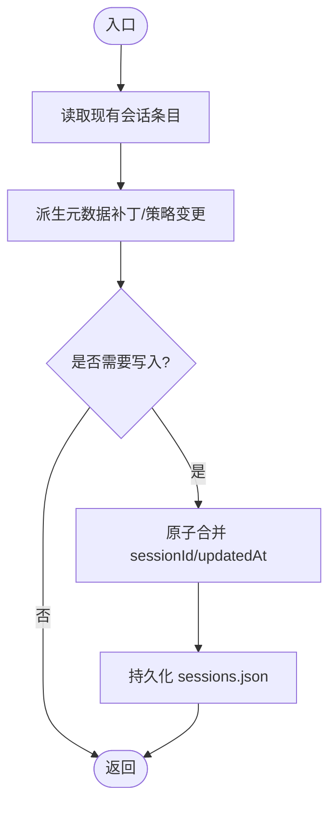

# 数据一致性与事务处理

## 目录
1. [引言](#引言)
2. [项目结构](#项目结构)
3. [核心组件](#核心组件)
4. [架构总览](#架构总览)
5. [详细组件分析](#详细组件分析)
6. [依赖关系分析](#依赖关系分析)
7. [性能考量](#性能考量)
8. [故障排查指南](#故障排查指南)
9. [结论](#结论)
10. [附录](#附录)

## 引言
本技术文档聚焦 OpenClaw 的数据一致性与事务处理体系，覆盖分布式事务、ACID 特性与最终一致性模型、会话状态管理、数据同步与冲突解决、幂等性与重复检测、事务边界与回滚、数据恢复、状态快照与增量同步、版本控制策略，以及一致性级别选择、性能权衡与分区容忍性考量。文档同时提供面向开发者的最佳实践与设计模式，并通过图示与路径引用展示关键实现。

## 项目结构
OpenClaw 将“会话状态”作为“网关权威来源”，客户端仅查询网关以获取会话列表与令牌统计；会话持久化采用 JSON 存储与 JSONL 历史记录；内存索引负责向量与全文检索能力，支持增量同步与批处理容错；去重缓存提供幂等性保障；并发与批处理失败保护确保稳定性。

## 核心组件
- 会话存储与条目：提供会话权威状态、来源元数据、令牌计数、队列与策略字段，支持 TTL 缓存与磁盘落盘。
- 内存索引管理器：负责增量同步、向量/FTS 索引构建、批处理与超时/降级、并发控制与批失败保护。
- 去重缓存：基于时间窗口与容量的键值去重，保障幂等性与重复检测。
- 压缩安全运行时：弱映射注册表，按会话管理上下文窗口与历史份额等安全阈值。
- 快照与版本：跨平台快照模型包含状态版本、健康与存在性信息，支撑状态快照与恢复。

## 架构总览
OpenClaw 的一致性与事务处理遵循“网关权威 + 客户端只读查询”的原则。会话状态由网关维护，客户端通过网关接口获取会话列表与令牌统计；内存索引负责增量同步与检索增强；幂等性通过去重缓存与“检查-再写入”原子化策略保障；批处理具备超时、重试与降级能力；压缩与清理在安全阈值内进行，避免破坏一致性。

## 详细组件分析

### 会话状态管理与 ACID 实践
- 权威来源：会话状态由网关持有，UI 客户端应通过网关查询而非本地解析 JSONL。
- 原子更新：会话条目合并逻辑确保 `sessionId` 与 `updatedAt` 的原子性；幂等写入通过“检查-再写入”与 TTL 去重实现。
- 一致性模型：默认采用最终一致性，通过增量同步与阈值触发，结合客户端只读查询维持强一致视图。
- 事务边界：会话重置、队列策略变更、令牌统计更新等操作以会话为边界，避免跨会话耦合。

### 数据同步与冲突解决
- 增量同步：内存索引管理器跟踪会话文件大小变化与消息数量，达到阈值后触发同步。
- 冲突解决：基于 `updatedAt` 的时间戳比较决定新旧条目保留；支持“同时刻优先策略”。
- 清理与回收：过期/废弃会话文件从索引中删除，向量与 FTS 表同步清理。

### 幂等性保证、重复检测与去重策略
- 去重缓存：基于键与时间窗口的去重，支持最大容量淘汰与过期清理。
- 幂等写入：在“检查-再写入”阶段使用去重缓存判定重复请求，避免重复项与越界。
- 并发与重试：在并发场景下，上限检查与刷新操作需保持原子性，防止超过 `MaxPending`。

### 事务边界、回滚机制与数据恢复
- 事务边界：以会话为单位，重置、队列策略、令牌统计等变更在会话粒度内生效。
- 回滚与恢复：当自动压缩失败或角色顺序冲突时，系统重置会话并保留转录候选以便清理。
- 恢复流程：删除旧会话文件与 JSONL，重启会话并重试；必要时清理转录文件。

### 状态快照、增量同步与版本控制
- 快照模型：跨平台快照包含存在性、健康度、状态版本、运行时长、配置路径与会话默认项。
- 增量同步：基于会话文件的字节与消息计数阈值驱动同步；支持定时与观察器触发。
- 版本控制：状态版本包含 `presence` 与 `health` 两部分，用于快照对比与一致性校验。

### 一致性级别选择、性能权衡与分区容忍性
- 一致性级别：默认最终一致性，通过阈值驱动与客户端只读查询维持可用性与一致性平衡。
- 性能权衡：批处理嵌入、并发限制、超时与降级策略在延迟与吞吐之间取得平衡；缓存与 TTL 减少重复 IO。
- 分区容忍性：去重缓存与原子合并减少网络分区下的重复写入风险；批失败保护与降级提升分区期间可用性。

## 依赖关系分析
- 会话存储依赖类型定义与元数据派生；内存索引依赖会话文件路径与阈值配置；去重缓存独立于业务逻辑但广泛用于幂等写入；压缩安全运行时与会话管理器弱耦合。
- 外部依赖：SQLite 扩展（向量）、嵌入提供者（OpenAI/Gemini/本地），客户端通过网关协议访问快照与状态。

## 性能考量
- 批处理与并发：嵌入批处理与并发限制在可用性与吞吐间平衡；超时与降级策略降低单点失败影响。
- 缓存与 TTL：会话存储与去重缓存减少 IO 与重复计算；合理设置 TTL 与容量避免内存膨胀。
- 增量同步：阈值驱动的增量同步降低全量索引成本；定时与观察器触发互补。

## 故障排查指南
- 去重与幂等问题：确认去重键生成与 TTL 设置；检查重复请求是否命中缓存。
- 批处理失败：关注批失败计数与禁用阈值；查看超时与错误信息；必要时降级为非批处理。
- 会话重置：当压缩失败或角色冲突导致异常，系统会重置会话并清理旧转录；检查日志与会话文件清理情况。
- 并发与上限：确保“检查-再写入”原子化；监控 `MaxPending` 与重复刷新行为。

## 结论
OpenClaw 通过“网关权威 + 客户端只读”、“原子合并 + 去重缓存”、“阈值驱动的增量同步 + 批处理容错”与“压缩安全运行时”等机制，在可用性与一致性之间取得稳健平衡。开发者可依据场景选择最终一致性或更强一致性策略，结合幂等性与回滚恢复流程，构建可靠的分布式会话与状态管理。

## 附录
- 会话生命周期与重置策略参见概念文档。
- 快照模型字段与用途参见跨平台协议定义。
- 并发与幂等性声明参见形式化验证文档。