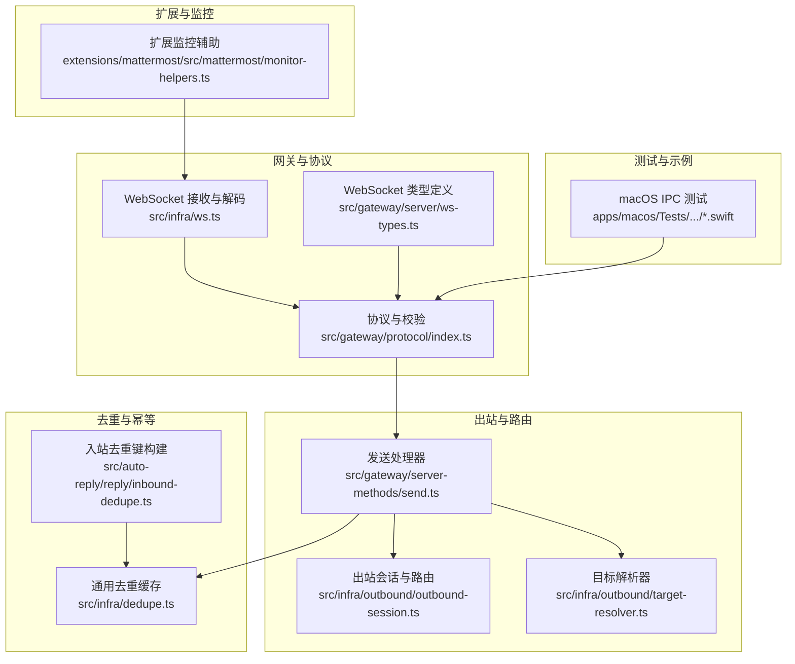
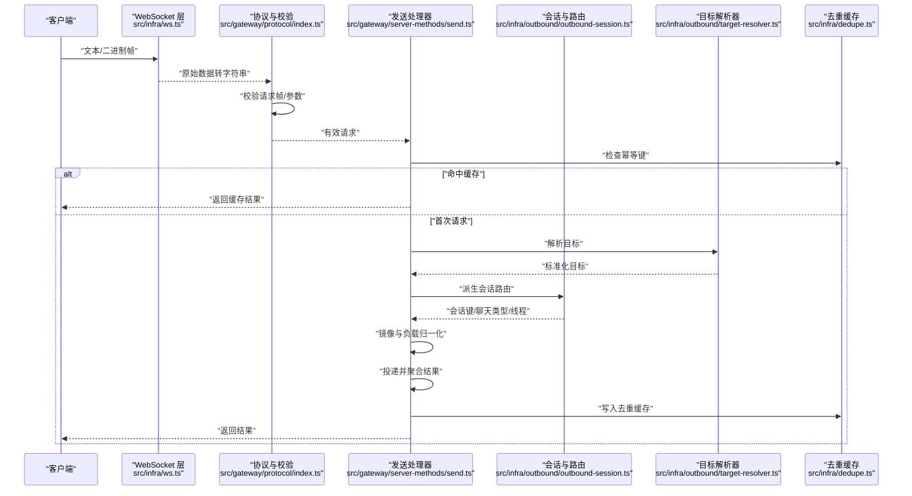
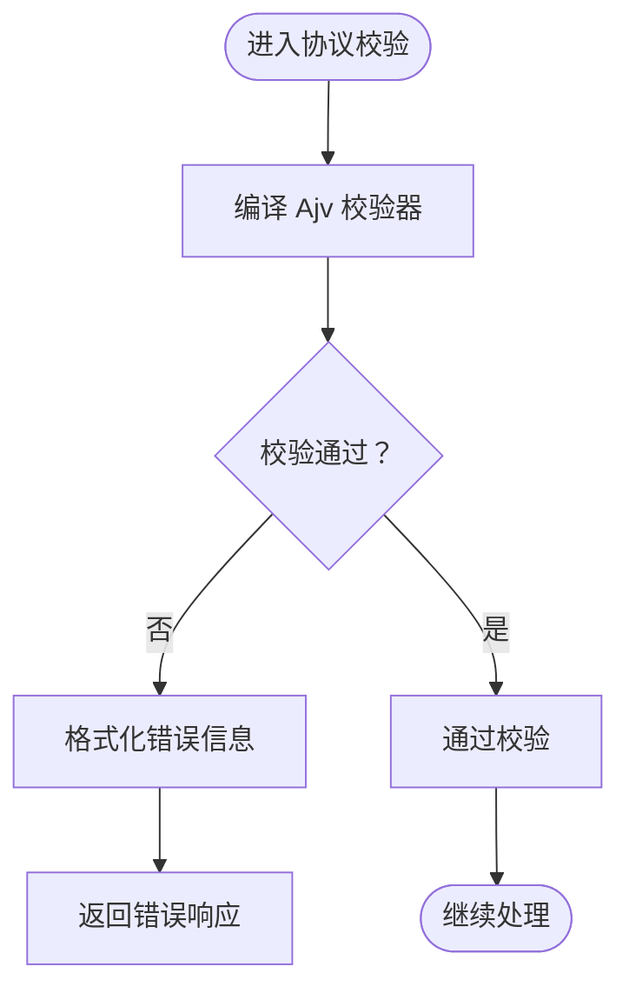
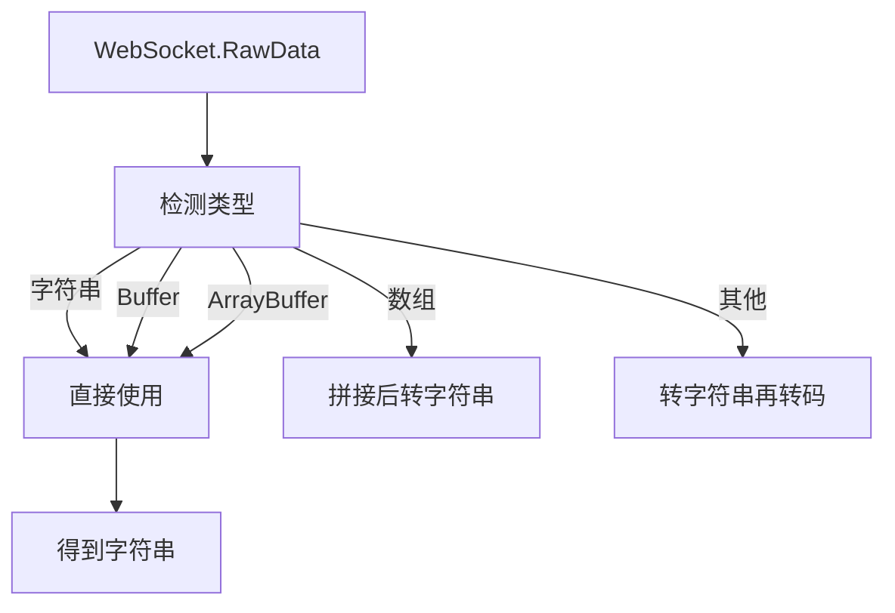
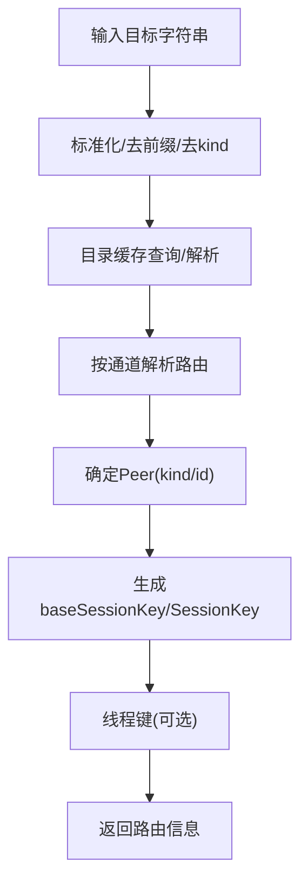
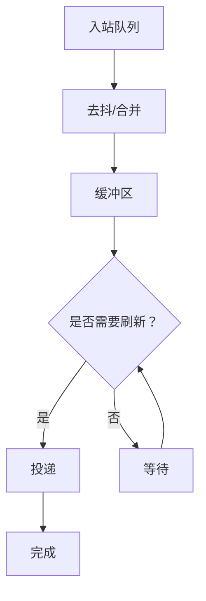
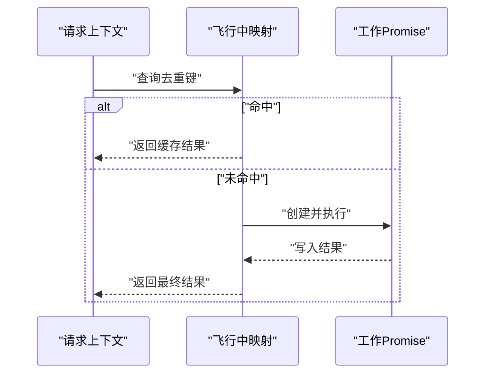
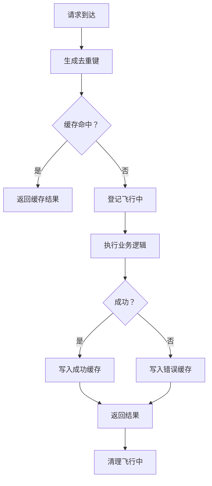
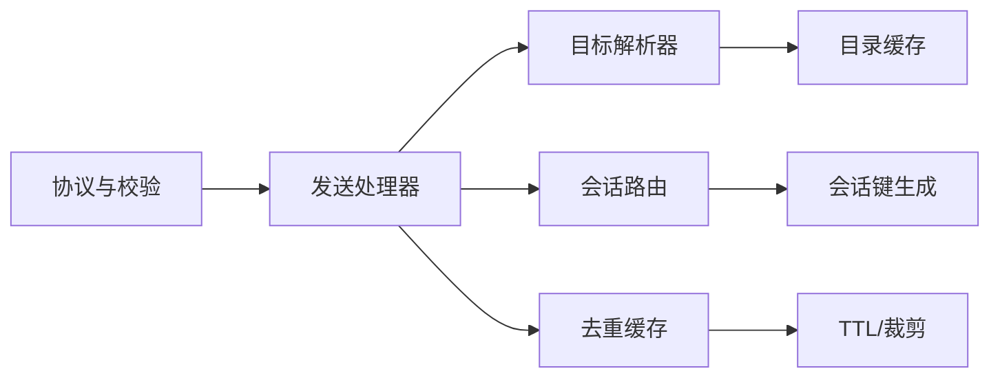

# 数据流与消息模式

## 目录
1. [引言](#引言)
2. [项目结构](#项目结构)
3. [核心组件](#核心组件)
4. [架构总览](#架构总览)
5. [详细组件分析](#详细组件分析)
6. [依赖关系分析](#依赖关系分析)
7. [性能考量](#性能考量)
8. [故障排查指南](#故障排查指南)
9. [结论](#结论)
10. [附录：消息发送与接收示例路径](#附录消息发送与接收示例路径)

## 引言
本文件系统性梳理 OpenClaw 的数据流与消息模式，覆盖 WebSocket 消息格式与协议规范、序列化与校验机制、消息路由与目标解析、分层架构与缓冲/流控策略、事件驱动与异步并发控制、去重与幂等性、一致性保障、以及数据转换与协议升级要点。文档同时提供面向开发者的最佳实践与性能优化建议，并通过图示与示例路径帮助快速定位实现。

## 项目结构
OpenClaw 的消息与数据流主要由“网关协议层”“出站会话与路由层”“去重与幂等层”“扩展通道监控与辅助工具”等模块协同完成。下图给出与本文主题直接相关的模块关系概览。

## 核心组件
- 协议与校验：基于 Ajv 的请求/响应/事件帧与参数模式校验，统一错误格式化输出，确保消息格式与字段约束一致。
- 出站发送处理器：负责参数校验、幂等与去重、会话派生与目标解析、负载镜像与投递、结果聚合与回包。
- 出站会话与路由：按通道解析目标、推导会话键、确定聊天类型（个人/群组/频道）、线程上下文与 from/to 映射。
- 目标解析器：从用户输入标准化并解析为可路由的目标标识，支持目录缓存与歧义处理策略。
- 去重与幂等：通用去重缓存与入站去重键构建，结合 TTL 与容量裁剪，保障重复消息不被重复处理或回放。
- WebSocket 辅助：统一 RawData 到字符串的解码，便于协议层解析；扩展监控也提供类似工具以避免重复解析。
- 并发与批处理：内存管理器的并发执行与失败锁，确保批量任务在限流与一致性约束下的稳健运行。

## 架构总览
下图展示从 WebSocket 接收到出站投递的整体流程，包括协议校验、去重、会话派生、目标解析、投递与回包。

## 详细组件分析

### WebSocket 消息格式与协议规范
- 消息帧类型：请求帧、响应帧、事件帧、错误形状，均通过 Ajv 模式进行严格校验，错误信息可格式化为人类可读字符串。
- 参数校验：针对不同方法（如 `send`、`poll`）分别编译校验器，未通过时返回统一错误码与错误信息。
- 协议版本：协议版本常量贯穿于校验与握手阶段，用于兼容性判断与升级提示。

### 序列化机制与数据解码
- 统一解码：RawData 可能是字符串、Buffer、数组或 ArrayBuffer，统一转为 UTF-8 字符串以便后续 JSON 解析。
- 扩展监控辅助：扩展侧同样提供 RawData 转字符串工具，避免重复解析与编码差异导致的问题。

### 消息路由算法与目标解析
- 目标解析：将用户输入标准化为目标字符串，支持带前缀与 kind 的混合形式，结合目录缓存与歧义处理策略（error/best/first）。
- 会话路由：按通道解析目标，推导 `baseSessionKey` 与 `sessionKey`，识别聊天类型（direct/group/channel），并处理线程上下文。
- 线程键：部分通道（如 Mattermost、Discord）对线程有独立键空间，采用专用函数生成线程会话键。

### 分层架构、缓冲与流控策略
- 分层架构：协议层负责格式与校验；处理器层负责幂等、会话派生与投递；路由层负责目标解析与会话键生成；去重层提供全局幂等保障。
- 缓冲与去抖：自动回复流水线中存在去抖与缓冲逻辑，合并同类项并在合适时机刷新，减少重复投递与抖动。
- 流控与并发：内存管理器提供受控并发执行与失败锁，限制批量任务并发度，避免资源争用与级联失败。

### 事件驱动、异步处理与并发控制
- 异步链路：发送处理器内部以 Promise 包裹工作单元，利用 WeakMap 记录同上下文内的“飞行中”请求，避免重复处理。
- 并发控制：内存管理器的并发执行函数以固定 worker 数量并行执行任务，首个错误即终止后续任务，保证一致性。
- 失败锁：批处理失败时通过锁阻塞后续批次，防止雪崩式放大。

### 消息去重、幂等性与一致性
- 通用去重缓存：基于 Map 的 TTL 与容量裁剪，支持 touch/prune 与 O(1) 查询。
- 入站去重键：由 Provider、MessageSid、PeerId、SessionKey、ThreadId 等组合生成稳定键，避免重复处理。
- 发送去重：以 `idempotencyKey` 为键，结合“飞行中”映射与缓存，确保同一请求在生命周期内只处理一次。
- 一致性：处理器在成功后写入去重缓存，失败时同样记录错误，保证后续请求能正确命中缓存。

### 数据转换、格式化与协议升级
- 时间戳格式化：支持 UTC 与本地时区格式化，用于信封时间戳与日志标记。
- 协议升级：协议版本常量与校验器编译贯穿全链路，升级时需同步更新模式与校验器，并在握手阶段传递版本信息。
- 插件能力：通道插件暴露 outbound 能力（如 `sendPoll`），处理器根据插件能力动态选择实现。

## 依赖关系分析
- 协议层依赖 Ajv 模式与错误格式化工具，统一约束所有请求/响应/事件。
- 发送处理器依赖目标解析器、会话路由、去重缓存与通道插件能力。
- 会话路由按通道实现差异化解析，共享 `baseSessionKey` 生成与线程键策略。
- 去重缓存被发送处理器与入站去重共同使用，形成跨层幂等保障。

## 性能考量
- 校验开销：Ajv 校验在高频请求场景应尽量复用编译后的校验器，避免重复编译。
- 去重缓存：合理设置 TTL 与最大容量，避免内存膨胀；优先使用短键与紧凑键结构。
- 会话派生：通道解析与线程键计算应尽量缓存（如 Slack 通道类型），减少外部调用。
- 并发与批处理：使用受控并发与失败锁，避免资源争用；对长耗时任务拆分为小批次。
- 缓冲与去抖：在自动回复流水线中合理设置去抖窗口，平衡吞吐与延迟。

## 故障排查指南
- 请求无效：检查协议校验错误信息，确认字段类型与必填项；关注 `formatValidationErrors` 的输出。
- 重复请求：确认 `idempotencyKey` 是否正确传递；查看去重缓存命中情况。
- 会话异常：核对目标字符串前缀与 `kind` 是否匹配通道要求；检查会话键生成与线程键是否正确。
- 并发问题：观察“飞行中”映射是否清理；检查失败锁是否阻塞后续批次。
- 扩展监控：确认 RawData 解码一致性；避免重复解析导致的性能与语义问题。

## 结论
OpenClaw 的数据流与消息模式以严格的协议校验为基础，结合去重与幂等保障、分层路由与会话派生、以及事件驱动与受控并发，形成了高可靠、可扩展的消息处理体系。通过合理的缓冲与流控策略、清晰的错误处理与可观测性，系统能够在复杂多通道环境下保持一致性与性能。

## 附录：消息发送与接收示例路径
- 发送处理器（含去重、会话派生、投递与回包）
  - [src/gateway/server-methods/send.ts](file://src/gateway/server-methods/send.ts#L45-L242)
- 目标解析与目录缓存
  - [src/infra/outbound/target-resolver.ts](file://src/infra/outbound/target-resolver.ts#L32-L44)
- 会话路由（按通道解析）
  - [src/infra/outbound/outbound-session.ts](file://src/infra/outbound/outbound-session.ts#L200-L253)
- 通用去重缓存
  - [src/infra/dedupe.ts](file://src/infra/dedupe.ts#L12-L63)
- 入站去重键构建
  - [src/auto-reply/reply/inbound-dedupe.ts](file://src/auto-reply/reply/inbound-dedupe.ts#L18-L51)
- WebSocket 解码与类型定义
  - [src/infra/ws.ts](file://src/infra/ws.ts#L4-L21)
  - [src/gateway/server/ws-types.ts](file://src/gateway/server/ws-types.ts#L4-L9)
- 扩展监控 RawData 解码
  - [extensions/mattermost/src/mattermost/monitor-helpers.ts](file://extensions/mattermost/src/mattermost/monitor-helpers.ts#L94-L111)
- macOS 测试中的握手与响应数据构造
  - [apps/macos/Tests/OpenClawIPCTests/GatewayChannelConfigureTests.swift](file://apps/macos/Tests/OpenClawIPCTests/GatewayChannelConfigureTests.swift#L92-L132)
  - [apps/macos/Tests/OpenClawIPCTests/GatewayChannelShutdownTests.swift](file://apps/macos/Tests/OpenClawIPCTests/GatewayChannelShutdownTests.swift#L66-L96)
  - [apps/macos/Tests/OpenClawIPCTests/GatewayProcessManagerTests.swift](file://apps/macos/Tests/OpenClawIPCTests/GatewayProcessManagerTests.swift#L72-L113)
- 自动回复去抖与缓冲
  - [src/auto-reply/reply/block-reply-pipeline.ts](file://src/auto-reply/reply/block-reply-pipeline.ts#L163-L193)
- 单元测试（去抖行为）
  - [src/auto-reply/inbound.test.ts](file://src/auto-reply/inbound.test.ts#L214-L257)
- 时间戳格式化
  - [test/helpers/envelope-timestamp.ts](file://test/helpers/envelope-timestamp.ts#L42-L59)