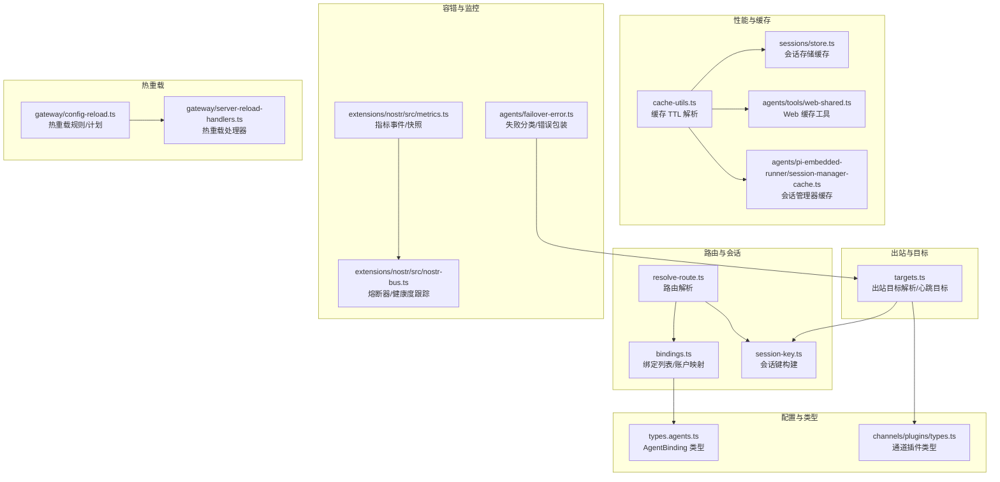
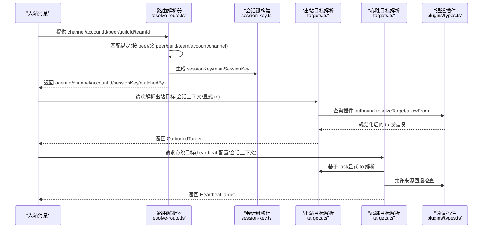
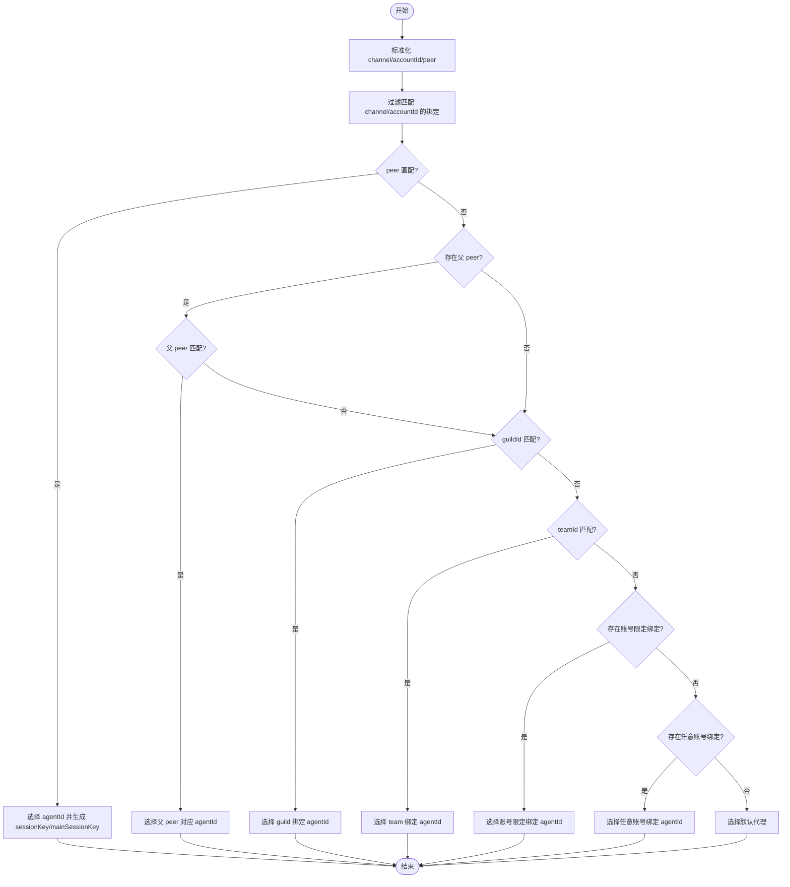
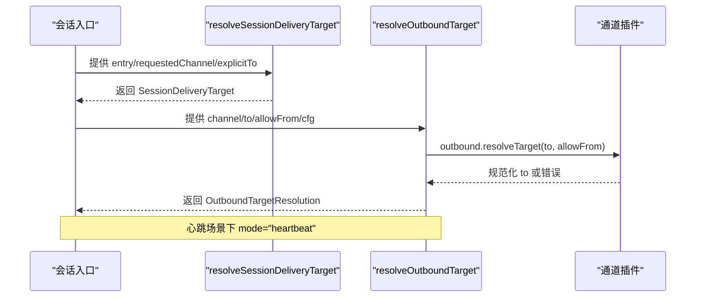
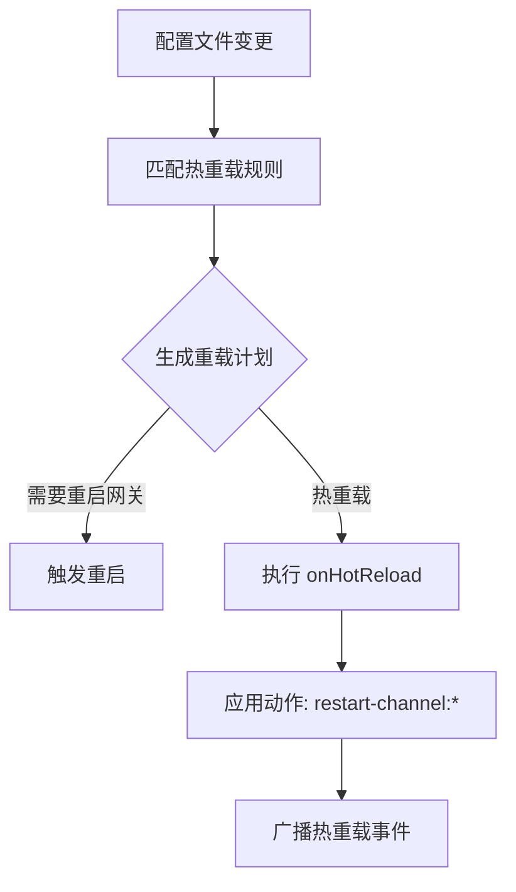
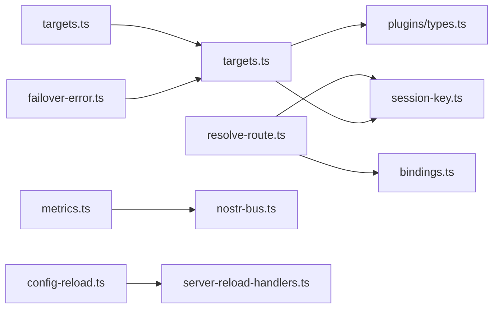

# 消息路由与分发

## 目录
1. [简介](#简介)
2. [项目结构](#项目结构)
3. [核心组件](#核心组件)
4. [架构总览](#架构总览)
5. [组件详解](#组件详解)
6. [依赖关系分析](#依赖关系分析)
7. [性能考量](#性能考量)
8. [故障排查指南](#故障排查指南)
9. [结论](#结论)
10. [附录](#附录)

## 简介
本文件针对 OpenClaw 的消息路由与分发系统进行深入技术说明，覆盖以下主题：
- 路由算法与目标解析：从绑定规则到会话键生成，再到出站目标解析与心跳目标选择。
- 频道绑定机制与优先级策略：按 peer/group/guild/team/account/channel 的匹配优先级与回退策略。
- 会话键管理：主会话键、DM 会话作用域、群组历史键与线程会话键。
- 分发与负载均衡、故障转移与容错：通道插件的允许来源（`allowFrom`）回退、熔断器与健康度跟踪。
- 缓存、性能优化与内存管理：会话存储缓存、通用缓存 TTL 解析、Web 缓存工具与内存刷新。
- 动态路由、热插拔与运行时配置更新：热重载规则、通道重启动作、运行时广播。
- 监控、统计与调试：指标事件、内存与速率限制统计、集成测试与模糊测试。

## 项目结构
OpenClaw 的路由与分发能力主要分布在如下模块：
- 路由核心：绑定列表、路由解析、会话键构建
- 出站目标：会话出站目标解析、心跳目标解析、发送者上下文
- 配置与类型：代理绑定类型、通道插件类型
- 性能与缓存：通用缓存 TTL、会话存储缓存、Web 缓存工具
- 容错与监控：失败分类与错误包装、指标与健康度跟踪
- 热重载：配置变更检测与热重载计划执行

## 核心组件
- 路由解析器：根据通道、账号、peer、父 peer、群组/团队 ID 与默认代理，匹配绑定并生成会话键与主会话键。
- 绑定管理：列出绑定、解析默认绑定的账号、构建“频道→代理→账号”映射、首选账号解析。
- 会话键构建：支持主会话键、DM 多种作用域、群组历史键、线程会话键与身份链接解析。
- 出站目标解析：从会话上下文解析目标通道与收件人，结合通道插件的允许来源进行规范化与回退。
- 心跳目标解析：支持“无/最后”等目标策略，并在目标不可用时返回“无目标”状态。
- 失败分类与错误包装：统一错误描述、状态码与原因，便于上层容错与降级。
- 指标与健康度：事件计数、速率限制、解密统计、内存使用与熔断器状态。
- 热重载：基于前缀的热重载规则，触发通道重启或无操作，支持运行时广播。

## 架构总览
下图展示了从入站消息到出站投递的关键流程：路由解析 → 会话键生成 → 出站目标解析 → 心跳目标解析 → 插件适配与容错。

## 组件详解

### 路由解析与绑定匹配
- 匹配顺序与优先级：
  - peer 直配（含线程父 peer 继承）
  - guildId
  - teamId
  - 账号限定绑定
  - 任意账号绑定（通配）
  - 默认代理
- 会话键生成：
  - 主会话键：`agent:{agentId}:{mainKey}`
  - DM 会话键：支持多种作用域（main/per-peer/per-channel-peer/per-account-channel-peer），可基于 `identityLinks` 将不同 peerId 映射到同一主会话
  - 群组历史键：`channel:accountId:{group|channel}:{peerId}`
  - 线程会话键：在基础会话键后追加 `:thread:{threadId}`

### 会话键管理与 DM 作用域
- 主会话键：用于代理的“主”会话
- DM 作用域策略：
  - main：合并为主会话
  - per-peer：按 peerId 归并
  - per-channel-peer：按 `channel:peerId` 归并
  - per-account-channel-peer：按 `account:channel:peerId` 归并
- 身份链接：通过 `identityLinks` 将不同 peerId 规范化到同一 canonical peerId
- 群组历史键与线程键：用于群组上下文与线程继承

### 出站目标解析与心跳目标
- 会话出站目标解析：
  - 从会话条目提取 `lastChannel`/`lastTo`/`lastAccountId`/`threadId`
  - 支持 `requestedChannel="last"` 或指定通道
  - `explicitTo` 优先；否则复用 `lastTo`（当通道一致或允许不一致）
  - 返回 `SessionDeliveryTarget`，包含 mode（explicit/implicit）
- 出站目标规范化：
  - 通过通道插件的 `outbound.resolveTarget` 进行规范化
  - 若插件未提供，则以 trim 后字符串为准；否则返回缺失目标错误
  - `allowFrom` 回退：若显式 to 与规范化 to 不同，标记 `allowFrom-fallback`
- 心跳目标解析：
  - 支持 `target="none"`/`"last"`/通道名
  - 当 `target="none"` 返回 `channel:"none"`，`reason:"target-none"`
  - 否则基于会话上下文解析并再次规范化，若仍不可用返回 `reason:"no-target"`

### 绑定与账户映射
- 列表绑定：过滤无效绑定，标准化通道与账号
- 默认代理绑定账号解析：在给定通道下查找默认代理绑定的账号
- 频道→代理→账号映射：构建多级映射，便于快速查询与首选账号选择

### 容错与故障转移
- 失败分类与错误描述：统一提取 `message`/`reason`/`status`/`code`，便于上层策略
- 错误包装：将非 `FailoverError` 转换为 `FailoverError`，携带 `provider`/`model`/`profileId` 等上下文
- 心跳目标回退：当 `allowFrom` 指定允许来源时，若显式 to 与规范化 to 不一致，采用 `allowFrom` 中第一个允许来源作为发送者

### 监控、统计与调试
- 指标事件：事件计数、拒绝原因细分、中继连接/断开/重连/错误、熔断器状态、解密成功/失败、内存与速率限制统计
- 快照与重置：提供 `getSnapshot`/`reset` 以便导出与清零
- Nostr 熔断器与健康度：记录失败次数、延迟统计、按健康度排序中继
- 集成与模糊测试：验证 seen tracker 行为、指标名称容错

### 动态路由、热插拔与运行时配置更新
- 热重载规则：通道插件可声明 `configPrefixes`/`noopPrefixes`，形成“热重载/无操作”规则
- 变更检测：基于路径前缀匹配，生成重启/热重载计划
- 执行动作：支持 `restart-channel:xxx` 动作，重启特定通道；同时可更新心跳运行器配置
- 运行时广播：热重载期间通过广播通知客户端/浏览器端

## 依赖关系分析
- 路由解析依赖绑定列表与会话键构建
- 出站目标解析依赖通道插件类型与会话上下文
- 心跳目标解析复用出站目标解析逻辑，并引入 `allowFrom` 回退
- 失败分类与错误包装为出站目标解析提供统一错误语义
- 指标与健康度为通道插件提供可观测性支撑
- 热重载规则驱动通道重启与运行时广播

## 性能考量
- 会话存储缓存：基于文件 mtime 与 TTL 的缓存，写入后主动失效，避免脏读
- 通用缓存 TTL：支持环境变量覆盖，默认值与边界校验
- Web 缓存工具：超时与 TTL 计算、键规范化、读取命中判断
- 会话管理器缓存：针对会话文件访问的短期缓存，减少频繁 IO
- 内存刷新与压缩：自动回复流程中的内存刷新与压缩计数持久化，降低峰值占用

## 故障排查指南
- 路由未命中：检查绑定是否正确配置（通道/账号/peer/guild/team），确认匹配优先级与通配符使用
- 会话键异常：核对 DM 作用域设置与 `identityLinks` 是否导致 peerId 规范化
- 出站目标缺失：确认通道插件是否提供 `outbound.resolveTarget`，或显式 to 是否为空
- 心跳目标不可用：检查 `heartbeat.target` 设置与 `lastChannel`/`lastTo` 是否有效
- 允许来源回退：若显式 to 与 `allowFrom` 不一致，系统会回退到允许来源列表中的首个项
- 指标与健康度：通过 metrics 快照查看中继状态、错误计数与熔断器状态，辅助定位通道问题

## 结论
OpenClaw 的路由与分发系统以“绑定优先、会话键规范、目标解析可控、容错与可观测性完备”为核心设计原则。通过明确的匹配优先级、灵活的 DM 作用域与身份链接、严格的出站目标规范化与 `allowFrom` 回退、以及完善的热重载与监控体系，系统在复杂多通道环境下实现了高可用与可维护性。

## 附录
- 代码示例路径（不含具体代码内容）：
  - 路由决策：`src/routing/resolve-route.ts`
  - 会话键生成：`src/routing/session-key.ts`
  - 出站目标解析：`src/infra/outbound/targets.ts`
  - 心跳目标解析：`src/infra/outbound/targets.ts`
  - 绑定匹配与回退：`src/routing/resolve-route.test.ts`
  - 出站目标解析测试：`src/infra/outbound/agent-delivery.test.ts`
  - 心跳目标解析测试：`src/infra/heartbeat-runner.returns-default-unset.test.ts`
  - 失败分类与错误包装：`src/agents/failover-error.ts`
  - 指标与健康度：`extensions/nostr/src/metrics.ts`、`extensions/nostr/src/nostr-bus.ts`
  - 热重载规则与执行：`src/gateway/config-reload.ts`、`src/gateway/server-reload-handlers.ts`