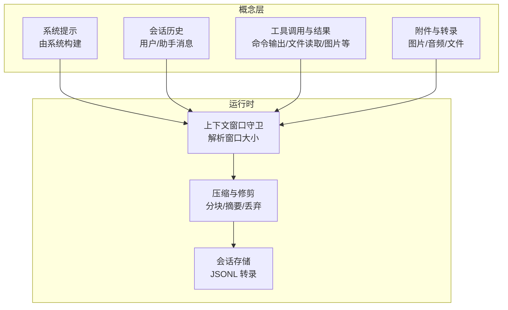
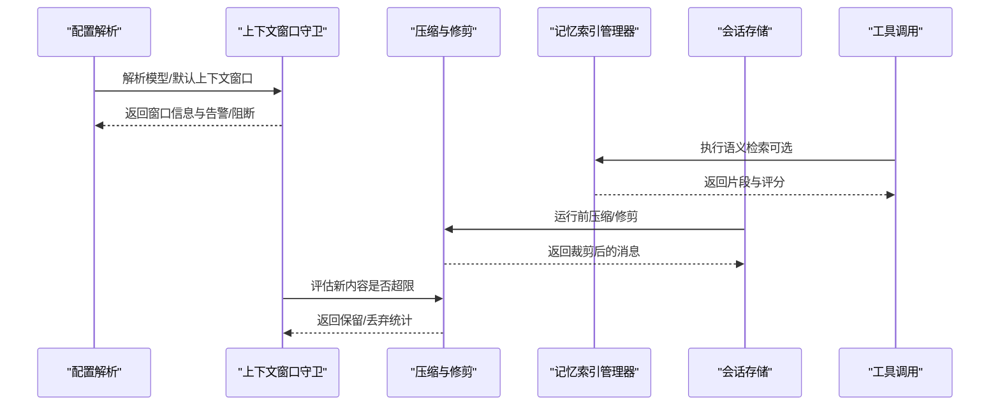
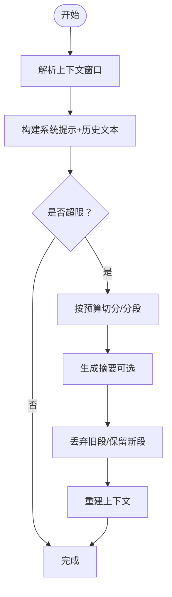
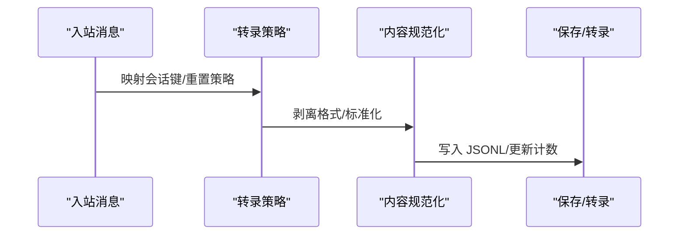
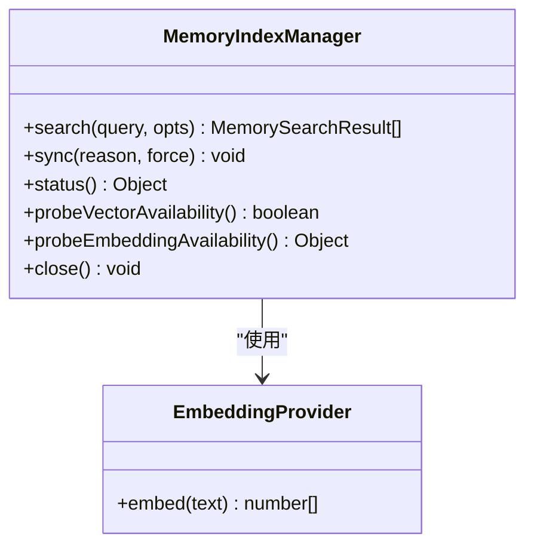
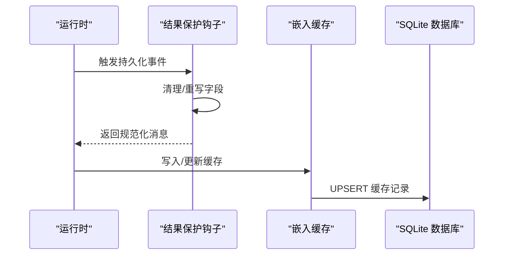
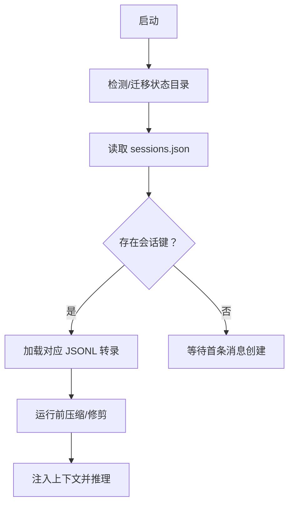
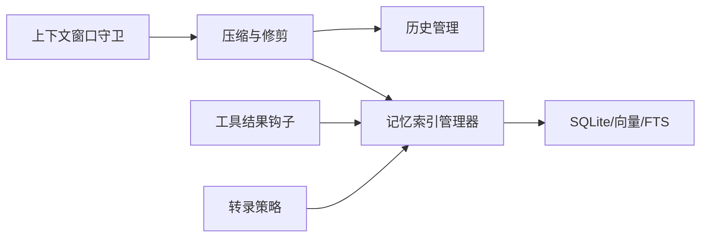

# 上下文管理系统

## 目录
1. [简介](#简介)
2. [项目结构](#项目结构)
3. [核心组件](#核心组件)
4. [架构总览](#架构总览)
5. [组件详解](#组件详解)
6. [依赖关系分析](#依赖关系分析)
7. [性能考量](#性能考量)
8. [故障排查指南](#故障排查指南)
9. [结论](#结论)
10. [附录：代码示例路径](#附录代码示例路径)

## 简介
本文件系统性梳理 OpenClaw 的上下文管理系统，围绕以下目标展开：
- 代理上下文的构建、维护与清理机制
- 会话转录的策略管理、消息过滤与内容规范化
- 记忆搜索的索引机制、查询算法与结果排序策略
- 工具结果的保护机制、缓存策略与一致性保证
- 上下文窗口大小控制、历史记录管理与内存优化
- 上下文状态的持久化、恢复与迁移机制
- 面向开发者的上下文管理设计原则与扩展方法

## 项目结构
OpenClaw 将“上下文”定义为模型在一次推理中看到的所有输入（系统提示、对话历史、工具调用/结果、附件等），并受模型上下文窗口上限约束。系统通过“会话”承载连续对话，并在运行时动态构建上下文；同时提供压缩与修剪策略以控制上下文规模。

## 核心组件
- 上下文窗口守卫：解析并评估模型上下文窗口，提供告警与阻断策略。
- 历史与会话管理：维护会话键、历史条目、历史文本构建与清理。
- 记忆搜索与索引：基于 SQLite 向量/FTS 的混合检索，支持批处理与缓存。
- 工具结果保护：通过事件钩子对工具结果进行预处理与持久化。
- 会话转录与规范化：对不同通道的消息进行格式剥离、标准化与内容提取。
- 持久化与迁移：会话状态与历史的持久化、跨版本迁移与兼容。

## 架构总览
OpenClaw 的上下文管理贯穿“配置解析—运行期构建—持久化—查询—清理”的闭环。下图展示了从配置到运行时上下文的关键交互：

## 组件详解

### 代理上下文构建、维护与清理
- 上下文窗口解析与评估
  - 依据模型配置、默认值与代理限制解析上下文窗口，并提供“警告阈值/硬性下限”的评估结果。
  - 用于在运行前判断是否需要压缩或阻断。
- 历史与会话管理
  - 提供历史条目追加、按上限截断、按键清理等能力，避免无界增长。
  - 支持将历史文本拼接为上下文字符串，便于注入系统提示或作为补充背景。
- 压缩与修剪
  - 将历史按令牌预算切分为多段，优先保留最新消息；对超出预算的历史进行摘要或直接丢弃。
  - 提供“自适应分块比例”与“安全余量”，以应对估算误差与大消息场景。

### 会话转录的策略管理、消息过滤与内容规范化
- 策略管理
  - 会话键映射规则（主键、按发送者、按通道+发送者、按账户+通道+发送者）与重置策略（每日/空闲）。
  - 会话存储位置与 JSONL 转录文件命名规范。
- 消息过滤
  - 在运行前对工具结果进行“修剪”（从内存上下文中移除旧工具结果），不改写 JSONL。
- 内容规范化
  - 不同通道的消息格式剥离与标准化（如去除信封头、去除 Nextcloud Talk 特定格式标记、目标 ID 规范化）。
  - 对会话文本进行归一化（合并换行、空白折叠、去除多余空格）。

### 记忆搜索的索引机制、查询算法与结果排序
- 索引与存储
  - 使用 SQLite 存储文件/分片元数据，支持向量表（sqlite-vec）与 FTS 表，提供混合检索。
  - 支持嵌入缓存表，减少重复计算；支持批处理与失败计数与锁定。
- 查询算法
  - 关键词检索（FTS）与向量检索（BM25 排序后归一化）混合，按权重融合。
  - 结果按最小分数与最大返回数量过滤，支持候选倍增以提升召回。
- 结果排序
  - 向量与文本得分加权融合，统一转换为 0-1 分数后排序，再截断至最大结果数。

### 工具结果的保护机制、缓存策略与一致性保证
- 保护机制
  - 通过“工具结果持久化钩子”在持久化前对消息进行二次加工（例如剔除大型诊断载荷、附加顺序与代理标识）。
- 缓存策略
  - 嵌入缓存表按 provider/model/provider_key/hash 去重更新，支持跨数据库迁移。
- 一致性保证
  - 向量维度变化时自动重建表；批处理失败计数与锁定防止雪崩；超时与重试策略保障稳定性。

### 上下文窗口的大小控制、历史记录管理与内存优化
- 窗口大小控制
  - 优先从模型配置获取上下文窗口，其次来自模型参数，最后回退到默认值；可被代理级上限覆盖。
- 历史记录管理
  - 历史条目按上限滑动窗口维护，支持按键清理与最近使用刷新，避免内存无限增长。
- 内存优化
  - 压缩阶段仅保留最新消息，丢弃旧段；对超大消息采用“部分摘要+注释”策略；估算误差引入安全余量。

### 上下文状态的持久化、恢复与迁移机制
- 持久化
  - 会话状态存储于 sessions.json；转录以 JSONL 文件保存；UI 客户端应通过网关查询而非本地读取。
- 恢复
  - 重启后根据会话键加载对应 JSONL；必要时触发“静默内存刷新”提醒模型将重要信息落盘。
- 迁移
  - 支持状态目录迁移与遗留状态迁移检测与执行；会话键大小写规范化与别名兼容。

## 依赖关系分析
- 组件耦合
  - 上下文窗口守卫与压缩模块强相关：前者决定预算，后者负责执行。
  - 记忆索引管理器依赖嵌入提供者与 SQLite；支持向量与 FTS 双引擎。
  - 工具结果保护钩子与会话存储解耦，通过事件机制协作。
- 外部依赖
  - sqlite-vec 扩展用于向量检索；批处理服务用于远程嵌入。
  - 不同通道的消息格式剥离与标准化逻辑独立于核心流程，通过插件化扩展。

## 性能考量
- 窗口预算与安全余量：在估算不准确时引入 20% 安全余量，避免越界。
- 自适应分块：根据平均消息大小动态调整分块比例，降低单条消息过大导致的分块膨胀。
- 混合检索：向量与关键词检索加权融合，兼顾召回与相关性。
- 批处理与缓存：远程嵌入批处理与嵌入缓存显著降低延迟与成本。
- 历史修剪：运行前修剪旧工具结果，减少上下文体积但不改写 JSONL，兼顾性能与可审计性。

## 故障排查指南
- 上下文超限
  - 使用“`/compact`”触发压缩；检查“`/context list/detail`”定位大体积贡献项。
- 记忆检索异常
  - 查看“`/memory status`”确认向量扩展加载状态、FTS 可用性与批处理失败计数。
- 会话键冲突或迁移问题
  - 检查 sessions.json 中键的大小写与映射；必要时执行状态迁移。
- 工具结果过大
  - 通过工具结果钩子清理冗余字段；确认缓存命中情况。

## 结论
OpenClaw 的上下文管理系统以“可配置的上下文窗口”为边界，结合“运行前压缩/修剪”“会话转录策略”“记忆索引混合检索”“工具结果保护与缓存”等机制，实现了在有限上下文窗口内高效、稳定地承载复杂对话与知识检索。通过清晰的持久化与迁移策略，系统在可扩展性与一致性之间取得平衡，适合在多通道、多代理场景下部署与演进。

## 附录：代码示例路径
以下为面向开发者的上下文创建、更新与查询的实际实现示例路径（请在仓库中查看具体实现）：
- 上下文窗口解析与评估
  - `src/agents/context-window-guard.ts`
- 历史条目追加与构建上下文
  - `src/auto-reply/reply/history.ts`
- 压缩与修剪（分块/摘要/丢弃）
  - `src/agents/compaction.ts`
  - `src/agents/pi-extensions/compaction-safeguard.ts`
- 记忆搜索与索引管理
  - `src/memory/manager.ts`
  - `src/memory/search-manager.ts`
  - `src/agents/memory-search.ts`
- 工具结果保护钩子
  - `src/agents/session-tool-result-guard.tool-result-persist-hook.test.ts`
- 会话转录与规范化
  - `src/agents/pi-embedded-runner/google.ts`
  - `extensions/nextcloud-talk/src/format.ts`
  - `extensions/nextcloud-talk/src/normalize.ts`
  - `src/memory/session-files.ts`
- 上下文状态持久化与迁移
  - `docs/concepts/session.md`
  - `src/hooks/bundled/session-memory/handler.ts`
  - `src/commands/doctor-state-migrations.test.ts`
  - `src/infra/state-migrations.ts`
- UI 消息内容提取
  - `ui/src/ui/chat/message-extract.ts`