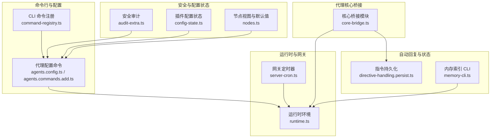
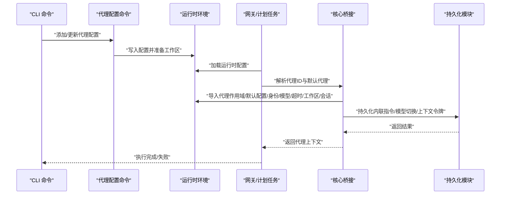
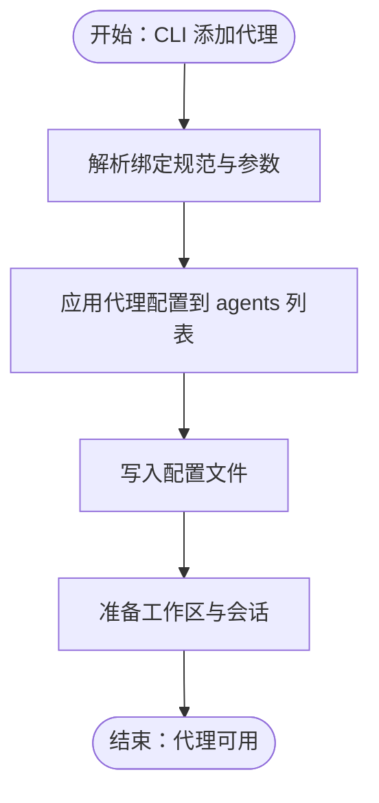
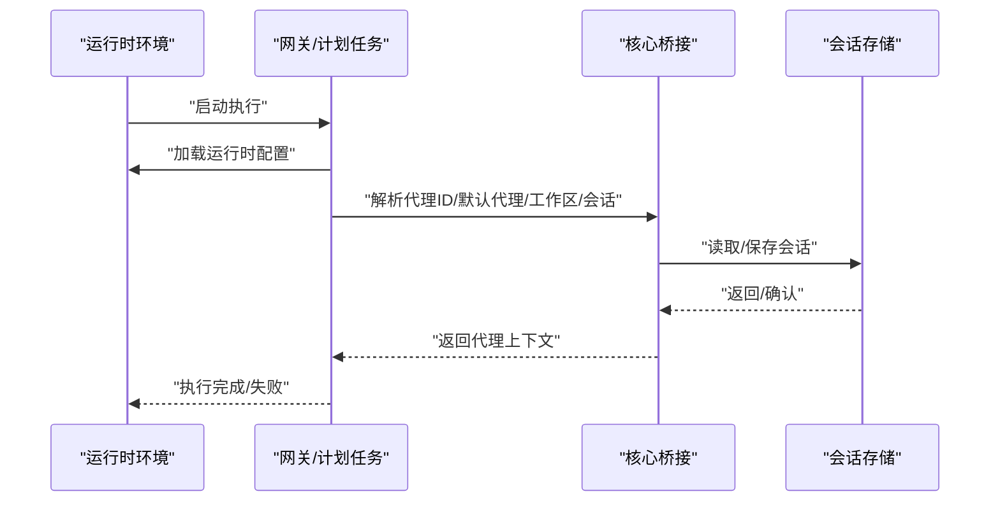
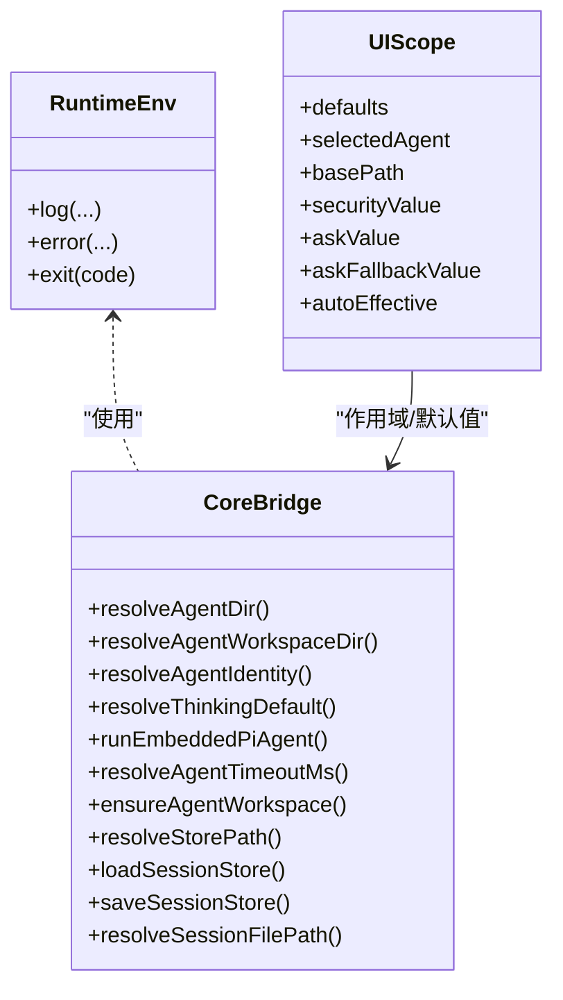
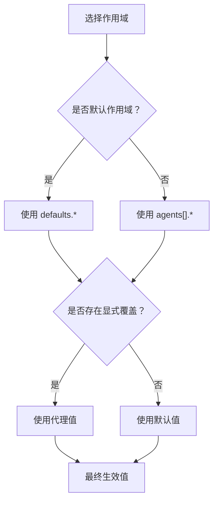
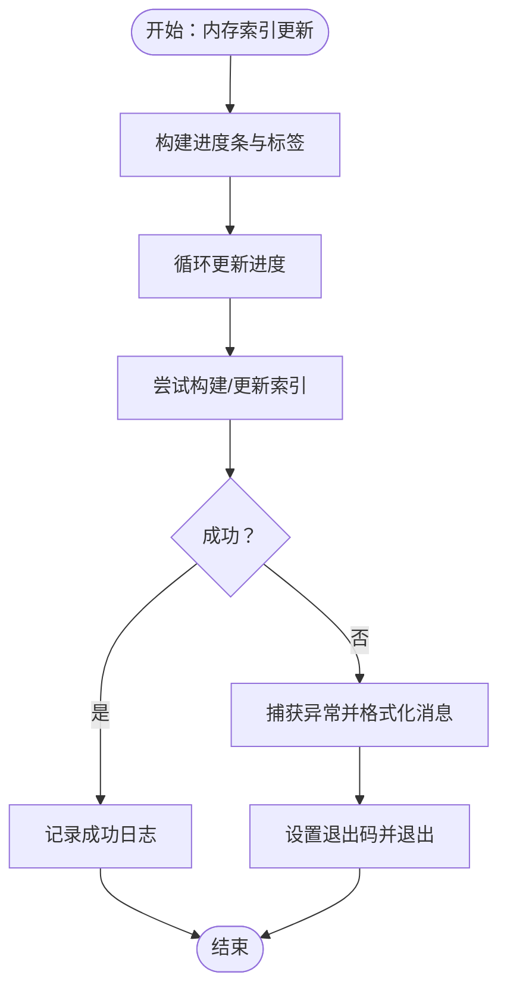
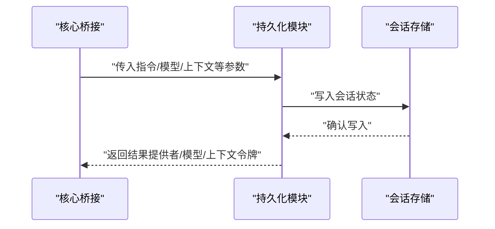
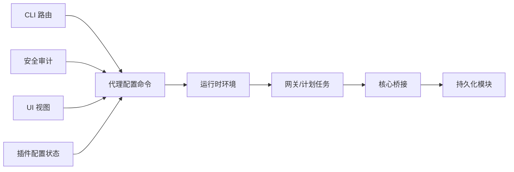

# 代理核心引擎

## 目录
1. [引言](#引言)
2. [项目结构](#项目结构)
3. [核心组件](#核心组件)
4. [架构总览](#架构总览)
5. [详细组件分析](#详细组件分析)
6. [依赖关系分析](#依赖关系分析)
7. [性能考量](#性能考量)
8. [故障排查指南](#故障排查指南)
9. [结论](#结论)
10. [附录](#附录)

## 引言
本文件系统性梳理 OpenClaw 代理核心引擎的设计与实现，聚焦以下主题：
- 代理对象的创建、初始化与生命周期管理
- 代理运行时环境（状态存储、配置管理、资源分配）设计
- 代理作用域与访问控制机制
- 代理默认配置的继承与覆盖规则
- 实例化过程中的内存管理、错误处理与异常恢复
- 提供可追溯到源码路径的实现参考，帮助开发者理解并扩展代理核心

## 项目结构
OpenClaw 的代理核心涉及多模块协作：命令行工具负责配置与工作区准备；网关与计划任务在运行期解析代理上下文；自动回复模块在会话中持久化指令与模型选择；插件与 UI 层提供配置决策与可视化。

## 核心组件
- 运行时环境与日志输出：统一的日志与错误输出接口，支持进度线清理，确保 CLI 输出一致性。
- 代理配置与工作区：通过命令行工具维护代理列表、绑定与工作区初始化，确保首次运行前的目录与会话准备。
- 网关与计划任务：在定时触发场景下解析代理 ID 与默认代理，保证任务执行的代理上下文正确性。
- 核心桥接模块：动态导入代理作用域、默认配置、身份解析、模型选择、超时、工作区与会话存储等能力。
- 自动回复与状态持久化：在会话中持久化内联指令、模型切换事件与上下文令牌数，保障状态一致性。
- 安全与配置状态：审计凭据目录权限，插件层对内存槽位进行启用/选择决策，UI 层体现默认值与覆盖逻辑。

## 架构总览
代理核心引擎围绕“配置—运行时—桥接—持久化”的主干流程展开。命令行负责配置变更与工作区准备；运行时提供统一日志与退出；网关在调度时解析代理上下文；核心桥接模块按需加载代理作用域与默认配置；自动回复模块在会话中持久化状态；安全与 UI 层贯穿配置决策与可视化。

## 详细组件分析

### 组件一：代理创建与初始化（配置与工作区）
- 配置入口：命令行路由将 `agents/list`、`sessions` 等子命令分发至对应处理器，确保 CLI 能力与配置管理解耦。
- 配置应用：通过 `applyAgentConfig` 将用户输入合并到 `agents` 列表，支持名称、工作区、代理目录与模型字段的增量更新。
- 工作区与会话：在写入配置后调用工作区与会话准备逻辑，确保首次运行前的目录与会话数据可用，并尊重默认配置中的跳过引导选项。

### 组件二：代理运行时环境与生命周期
- 运行时接口：统一的日志、错误输出与进程退出接口，便于在 CLI 与网关中复用。
- 生命周期要点：
  - 初始化：加载配置、解析代理 ID、解析默认代理、解析工作区与会话存储路径。
  - 执行：在网关或计划任务中按代理上下文执行，期间使用超时与模型选择策略。
  - 结束：持久化状态（如会话存储）、释放资源、记录日志。

### 组件三：代理作用域与访问控制
- 作用域解析：核心桥接模块动态导入代理作用域、工作区与会话存储能力，形成“作用域—资源—存储”的解耦。
- 访问控制：UI 层在节点视图中区分默认作用域与代理作用域，计算安全策略、询问策略与自动允许技能等的生效值，体现“默认值/覆盖值”的决策链路。

### 组件四：默认配置的继承与覆盖
- 默认值来源：UI 层在节点视图中根据是否为默认作用域决定从 `defaults` 或 `agents[].security/ask/askFallback/autoAllowSkills` 中取值。
- 覆盖规则：当代理层提供具体值时优先使用代理值；否则回退到默认值；`autoAllowSkills` 支持显式覆盖与默认回退。
- 插件层决策：内存槽位启用与否由插件配置状态函数判定，若未指定则启用；若指定但非当前 ID 则禁用并给出原因。

### 组件五：实例化过程中的内存管理、错误处理与异常恢复
- 内存管理：CLI 在构建内存索引时使用进度条与清理逻辑，确保长时间操作的 UI 体验；最终记录成功或失败信息。
- 错误处理：CLI 捕获异常并格式化错误消息，设置进程退出码，避免静默失败。
- 异常恢复：运行时提供统一的 `error`/`exit` 接口，便于在不同模块中一致地报告问题并终止流程。

### 组件六：状态持久化与模型选择
- 指令持久化：在会话中持久化内联指令、有效模型指令、提供者与模型选择、上下文令牌数等，支持模型切换事件格式化。
- 会话存储：核心桥接模块提供会话存储的解析与读写能力，确保状态跨执行周期保持一致。

## 依赖关系分析
- 命令行与配置：CLI 路由将请求分发给配置命令；配置命令在写入后触发工作区与会话准备。
- 运行时与网关：网关在执行前加载运行时配置，解析代理上下文；核心桥接模块提供代理作用域与默认配置。
- 安全与 UI：安全审计关注凭据目录权限；UI 层体现默认值与覆盖逻辑；插件层对内存槽位进行启用/选择决策。

## 性能考量
- 并行加载：核心桥接模块通过 `Promise.all` 并行导入多个核心模块，减少冷启动延迟。
- 会话存储：在持久化阶段尽量批量写入，避免频繁 IO；在 CLI 中使用进度条提升长耗时操作的可观测性。
- 资源释放：在异常分支中确保清理定时器与进度条，防止资源泄漏。

## 故障排查指南
- 凭据目录权限：安全审计检查凭据目录的可读/可写权限，若存在风险应调整权限并遵循最小暴露原则。
- 内存索引失败：CLI 在构建/更新索引失败时会记录错误消息并设置退出码，建议检查磁盘空间、权限与网络连接。
- 代理配置冲突：在应用代理配置时若出现绑定冲突，应先清理冲突项再重试。

## 结论
OpenClaw 代理核心引擎以“配置—运行时—桥接—持久化”为主线，结合 CLI、网关与插件生态，实现了代理的可配置、可扩展与可审计。通过默认值与覆盖规则、作用域与访问控制、并行加载与错误处理等机制，既保证了开发体验，也兼顾了生产环境的稳定性与安全性。

## 附录
- 代码示例路径（不展示具体代码内容）：
  - 代理配置应用：`agents.config.ts`
  - 工作区与会话准备：`agents.commands.add.ts`
  - 运行时环境接口：`runtime.ts`
  - 网关定时解析代理：`server-cron.ts`
  - 核心桥接并行加载：`core-bridge.ts`
  - 指令持久化与模型选择：`directive-handling.persist.ts`
  - 内存索引 CLI 失败处理：`memory-cli.ts`
  - 默认值与覆盖决策：`nodes.ts`
  - 内存槽位启用决策：`config-state.ts`
  - 凭据目录权限审计：`audit-extra.ts`