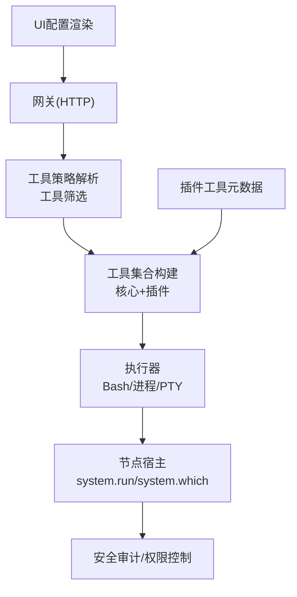
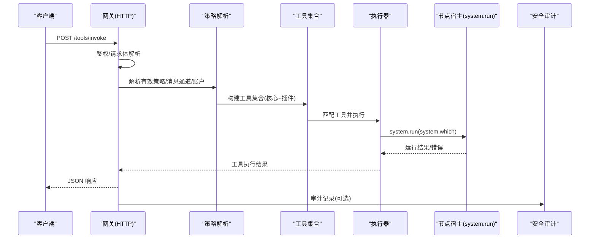
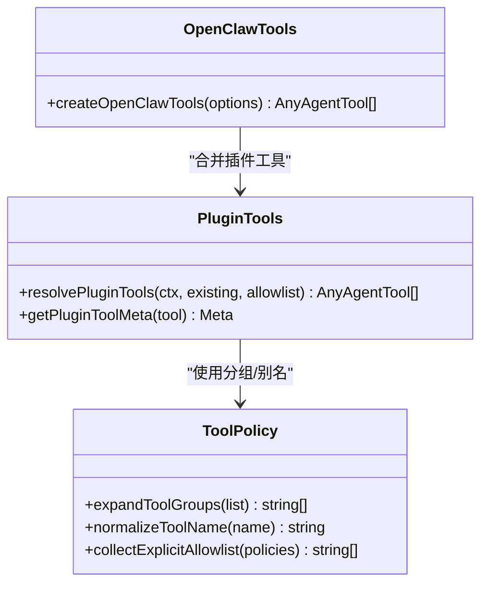
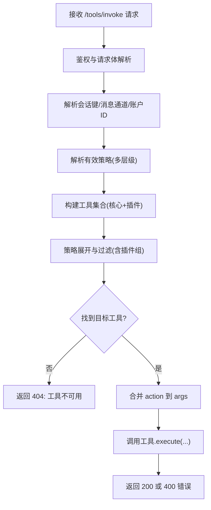
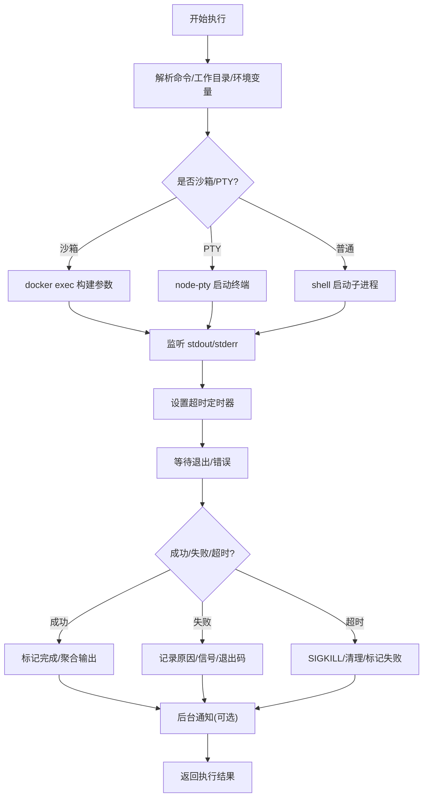
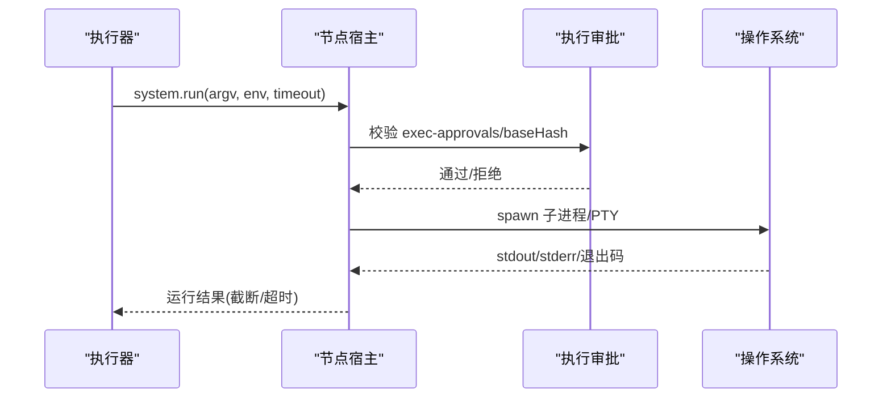
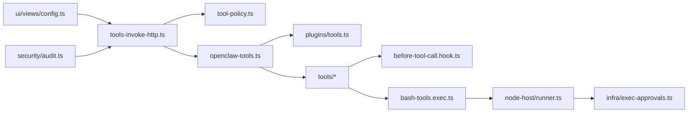

# 工具执行系统

## 目录
1. [简介](#简介)
2. [项目结构](#项目结构)
3. [核心组件](#核心组件)
4. [架构总览](#架构总览)
5. [详细组件分析](#详细组件分析)
6. [依赖关系分析](#依赖关系分析)
7. [性能考虑](#性能考虑)
8. [故障排查指南](#故障排查指南)
9. [结论](#结论)
10. [附录](#附录)

## 简介
本文件为 OpenClaw 工具执行系统的全面技术文档，聚焦于工具执行器的设计架构、执行流程、工具注册与元数据管理、工具调用协议、策略验证与权限控制、安全审计、并发与资源限制、性能优化、错误处理与重试恢复，以及 UI 渲染与用户界面集成。文档同时提供面向开发者的扩展接口与最佳实践建议。

## 项目结构
OpenClaw 的工具执行系统由“网关层”、“代理层”、“节点宿主层”和“插件/扩展层”协同构成：
- 网关层负责 HTTP 入口、鉴权、策略解析与工具筛选；
- 代理层负责工具注册、策略模型与工具集合构建；
- 节点宿主层负责实际命令执行、沙箱/宿主模式、超时与输出截断；
- 插件/扩展层提供工具扩展能力与元数据管理；
- UI 层负责配置渲染与用户交互。

## 核心组件
- 工具注册与集合构建：通过 `createOpenClawTools` 统一收集核心工具与插件工具，结合允许白名单与策略展开生成最终可用工具集。
- 工具策略与元数据：工具分组、配置化策略、插件工具组展开、策略合并与去重。
- 执行器：Bash 执行器封装命令执行、PTY 支持、超时与输出截断、会话管理与退出通知。
- 节点宿主：`system.run`/`system.which`/`system.execApprovals.*` 命令的实现与安全参数校验。
- 安全审计：文件系统权限、网关暴露面、浏览器控制端点、日志脱敏、提升执行白名单等检查。
- 并发与资源限制：代理并发上限、会话输出上限、节点 PATH 与环境变量限制。
- UI 渲染：配置表单渲染、工具显示配置解析与展示。

## 架构总览
工具执行从 HTTP 请求进入，经鉴权与策略解析后定位具体工具，随后由代理层执行器完成命令执行，节点宿主负责底层系统调用与安全参数校验，最终返回结果并进行 UI 渲染与审计。

## 详细组件分析

### 工具注册与元数据管理
- 工具集合构建：`createOpenClawTools` 将核心工具与插件工具合并，支持工作空间目录、沙箱根路径、会话键、消息通道、账户 ID 等上下文注入。
- 插件工具元数据：通过 `resolvePluginTools` 与 `getPluginToolMeta` 获取插件工具的元信息，用于策略展开与显示配置。
- 工具分组与别名：`TOOL_GROUPS` 定义工具分组，`TOOL_NAME_ALIASES` 提供名称规范化，便于策略匹配与 UI 显示。

### 工具调用协议与策略验证
- HTTP 协议：`/tools/invoke` 接收 JSON 请求，包含 `tool`/`action`/`args`/`sessionKey`/`dryRun` 等字段；鉴权通过后解析策略并筛选工具。
- 策略合并：按 `profile`/`providerProfile`/`global`/`agent`/`group`/`subagent` 等层级合并策略，支持插件组展开与未知条目告警。
- 参数融合：当工具 Schema 含有 `action` 字段时，自动将 `action` 注入 `args`，确保工具参数一致性。

### 执行器设计与执行流程
- Bash 执行器：`runExecProcess` 负责命令执行、PTY/子进程切换、超时处理、输出截断与会话状态更新；支持沙箱容器执行与环境变量安全处理。
- 会话管理：维护会话生命周期、输出缓冲、尾部输出、退出码/信号、后台化与退出通知。
- 超时与终止：超时触发 SIGKILL 并清理资源，最终汇总执行结果。

### 节点宿主与系统调用
- `system.run`/`system.which`/`system.execApprovals.*`：节点宿主实现系统级命令执行与查询，支持 PATH 规范化、环境变量清洗、超时控制与输出截断。
- 执行审批：`exec-approvals` 文件校验、socket 路径与令牌、baseHash 校验，防止篡改与越权。

### 权限控制与安全检查
- 文件系统权限：检查 `state_dir`/`config_path` 的符号链接、可写/可读权限，给出修复建议。
- 网关暴露面：bind 非 loopback 且无认证、反向代理未信任头、Tailscale Funnel 暴露等高危配置。
- 浏览器控制端点：远程 CDP 使用 HTTP、未启用设备身份等风险。
- 日志脱敏：`logging.redactSensitive` 配置不当可能导致敏感信息泄露。
- 提升执行白名单：`allowFrom` 中通配符与过大列表的风险评估。

### 并发控制与资源限制
- 代理并发：默认代理最大并发与子代理最大并发，避免资源争用。
- 会话输出：pending 输出与总输出字符上限，防止内存膨胀。
- 环境变量与 PATH：严格阻断危险变量与自定义 PATH，降低劫持风险。

### 错误处理、重试与失败恢复
- 超时与终止：超时触发 SIGKILL 并清理，最终汇总失败原因。
- 失败恢复：通过策略与 UI 重新配置工具可用性与参数，必要时切换执行主机/模式。
- 审计与诊断：日志与诊断事件记录运行尝试与活动会话，辅助问题定位。

### 工具显示配置与 UI 集成
- Android 工具显示：`ToolDisplayRegistry` 解析 `tool-display.json`，根据工具名、动作与参数生成摘要与详情。
- Web UI 配置：`renderConfig`/`renderConfigForm` 渲染配置表单，支持分节/子节导航、帮助文案与保存/重载按钮。
- UI 渲染：`app-render` 根据状态渲染配置视图，支持原始/表单模式切换与搜索过滤。

## 依赖关系分析
- 网关层依赖策略解析与工具集合构建，策略层依赖插件工具元数据与工具分组。
- 执行器依赖节点宿主与安全模块，节点宿主依赖执行审批与系统调用封装。
- UI 依赖配置渲染与工具显示配置，策略与安全检查贯穿各层。

## 性能考虑
- 输出截断：限制单次输出与尾部输出长度，避免内存占用过高。
- 超时控制：为每个执行设置合理超时，防止长时间阻塞。
- 并发上限：代理与子代理并发上限，避免系统过载。
- 环境变量清洗：阻断危险变量与 PATH 修改，减少潜在开销与风险。
- PTY 回退：在不支持 PTY 时自动回退至普通子进程，保证兼容性。

## 故障排查指南
- 工具不可用：确认工具名大小写与别名、策略允许列表与插件组展开。
- 超时失败：检查命令复杂度、超时设置与系统负载；必要时调整超时或切换执行主机。
- 权限问题：检查文件系统权限、网关暴露面与浏览器控制端点配置。
- 审计告警：根据审计报告逐项修复，如权限模式、通配符白名单、日志脱敏等。

## 结论
OpenClaw 工具执行系统通过清晰的分层架构与严格的策略、安全与并发控制，实现了可扩展、可观测、可审计的工具执行能力。开发者可通过插件工具与策略配置灵活扩展工具集，结合 UI 与审计工具保障系统安全与稳定性。

## 附录
- 扩展接口与最佳实践
  - 插件工具：通过 `resolvePluginTools` 注册工具，提供元数据以参与策略展开与显示配置。
  - 策略配置：使用 `tools.profile`、`tools.allow`、`byProvider` 等策略组合，配合 `tools.alsoAllow` 实现增量启用。
  - 安全基线：遵循 `exec-approvals`、PATH 与环境变量限制、日志脱敏与最小暴露面原则。
  - UI 集成：提供 `tool-display.json` 以增强工具显示摘要与详情，确保跨平台一致体验。