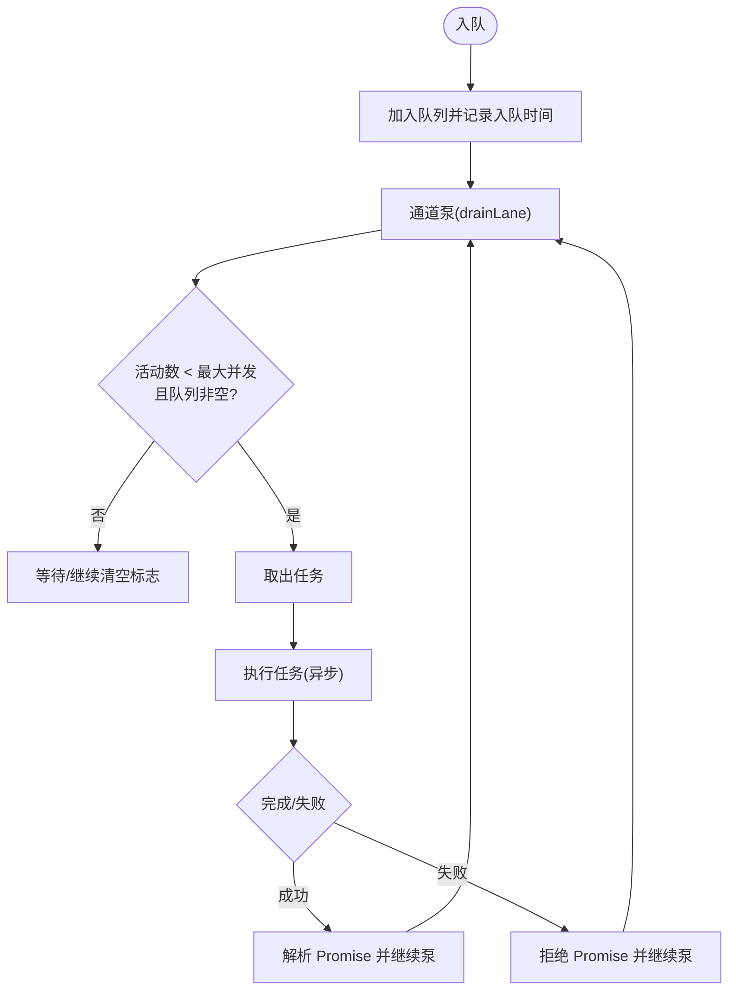

# 并发控制机制

## 目录
1. [引言](#引言)
2. [项目结构](#项目结构)
3. [核心组件](#核心组件)
4. [架构总览](#架构总览)
5. [详细组件分析](#详细组件分析)
6. [依赖关系分析](#依赖关系分析)
7. [性能考量](#性能考量)
8. [故障排查指南](#故障排查指南)
9. [结论](#结论)
10. [附录](#附录)

## 引言
本文件系统化梳理 OpenClaw 的并发控制机制，覆盖代理并发执行的调度策略、资源分配与优先级管理、代理通道（Lanes）设计、Bash 工具的进程与 PTY 控制、进程注册表生命周期与回收、超时与中断处理、异常恢复、性能监控与负载均衡、死锁预防，以及最佳实践与优化建议。文档以代码为依据，辅以图示帮助理解。

## 项目结构
OpenClaw 将并发控制能力分布在多个层次：
- 进程与命令队列层：提供基于“通道”的串行化与并行化控制，支持优先级与并发度配置。
- 代理工具层：封装 Bash 执行、PTY 控制、输出缓冲与截断、会话状态管理。
- 子代理运行时：持久化运行记录、清理策略、归档与回收。
- 监控与诊断：事件埋点、直方图与计数器、心跳唤醒与退避策略。
- 配置与网关集成：从配置解析并发度并在启动时应用到各通道。

## 核心组件
- 命令通道与队列：通过枚举定义主通道、定时通道、子代理与嵌套通道，配合队列实现串行化与并发度控制。
- Bash 工具执行：统一的命令执行入口，支持超时、输出截断、PTY 支持与回退、会话注册与状态维护。
- 进程注册表：运行中与已完成会话的生命周期管理、输出缓冲与截断、后台态标记与回收。
- 子代理运行时：运行记录持久化、恢复、清理与归档，确保崩溃重启后的可恢复性。
- 监控与诊断：事件埋点、直方图与计数器、心跳唤醒与退避策略，支撑可观测性与弹性。

## 架构总览
OpenClaw 的并发控制采用“通道 + 队列 + 会话”的分层架构：
- 通道（Lane）：隔离不同类型的执行任务，避免相互干扰（如主工作流与定时任务）。
- 队列（CommandQueue）：每个通道内部维护 FIFO 队列与并发度计数，按最大并发度泵出任务。
- 会话（ProcessSession）：封装单次执行的输入、输出、状态与生命周期，支持后台态与回收。
- 监控（Diagnostic/Observability）：埋点事件与指标，结合心跳与退避策略提升稳定性。

## 详细组件分析

### 命令通道与队列（Lanes 与 CommandQueue）
- 设计要点
  - 通道枚举定义主通道、定时通道、子代理与嵌套通道，便于隔离与优先级管理。
  - 每个通道维护队列、活动计数、最大并发度与“正在清空”标志，保证公平与可控。
  - 入队时记录排队时间与等待告警阈值，出队时统计等待时长与队列长度，便于诊断。
- 关键流程
  - 设置并发度：根据配置动态调整通道最大并发度，并触发通道泵。
  - 入队：将任务包装为队列条目，记录入队时间与回调，触发通道泵。
  - 泵出：当活动数小于并发度且队列非空时，取出任务执行，捕获错误并继续泵。
- 性能与安全
  - 严格限制并发度，避免资源争用与日志交错。
  - 对探针类通道进行错误抑制，降低噪音。

### Bash 工具执行与 PTY 控制
- 设计要点
  - 统一的执行入口，支持超时、输出截断、PTY 输出与回退、会话注册与状态维护。
  - 安全校验：禁止危险环境变量与主机路径修改，防止劫持与注入。
  - PTY 支持：封装键盘编码、括号粘贴、修饰键转换，兼容终端交互。
- 关键流程
  - 创建会话标识，初始化会话对象，注册到运行中会话集合。
  - 选择 spawn 方案：优先 PTY，失败则回退到普通子进程。
  - 追加输出到会话缓冲，按上限截断，聚合尾部输出。
  - 标记退出状态并移至已完成会话集合，支持后台态回收。
- 超时与中断
  - 通过定时器发送 SIGKILL，确保长时间运行任务可被终止。
  - 支持外部传入输入数据，写入 stdin 并结束。

### 进程注册表生命周期与资源回收
- 设计要点
  - 运行中会话与已完成会话分离管理，支持后台态标记与回收。
  - 输出缓冲采用分块与上限截断策略，避免内存膨胀。
  - TTL 清理：周期性扫描已完成会话，按配置的 TTL 删除过期记录。
- 关键流程
  - 新建会话：生成唯一标识，加入运行中集合，启动清理定时器。
  - 追加输出：将新块加入 pending 缓冲，累计字符数并按上限截断。
  - 标记退出：设置退出码/信号，移至已完成集合，保留必要字段。
  - 清理：按 TTL 扫描并删除，停止定时器以释放资源。

### 子代理运行时与持久化
- 设计要点
  - 记录运行 ID、会话键、请求者信息、任务描述、清理策略与归档时间。
  - 启动时从磁盘恢复运行记录，尝试恢复未完成的运行或发起清理。
  - 清理策略：按配置决定删除或保留，完成后持久化并归档。
- 关键流程
  - 初始化：加载磁盘记录，去重保留内存中的新记录。
  - 恢复：对已结束但未清理的运行发起清理公告，对未结束的运行重新等待完成。
  - 清扫：定期扫描归档时间到达的运行，调用网关删除会话并清理内存映射。

### 超时控制、中断处理与异常恢复
- 超时控制
  - 命令执行：通过定时器发送 SIGKILL，确保任务在超时后被终止。
  - Bash 工具：统一的超时参数，支持 PTY 与回退两种路径。
- 中断处理
  - PTY 写入与退出事件监听，支持按键序列与粘贴。
  - 会话标准输入接口，支持写入与结束。
- 异常恢复
  - 通道泵捕获错误并继续泵，避免单点阻塞。
  - 心跳唤醒与退避策略，缓解主通道繁忙导致的延迟。
  - 子代理运行时的持久化与恢复，确保崩溃后可继续清理。

### 性能监控、负载均衡与死锁预防
- 性能监控
  - 诊断事件：队列入队/出队、会话状态变化、卡住会话、运行尝试次数等。
  - OTEL 指标：队列深度直方图、等待时长直方图、会话状态计数器、卡住会话年龄直方图。
- 负载均衡
  - 通道隔离：主通道与定时通道互不干扰，避免日志与标准输入交错。
  - 并发度配置：从配置解析并发度并应用到各通道，支持动态调整。
- 死锁预防
  - 通道泵使用异步执行与 Promise 解析，避免阻塞。
  - PTY 回退机制：PTY 失败时自动切换到普通子进程，保障可用性。
  - 会话输出缓冲与截断：防止内存占用无限增长。

## 依赖关系分析
- 组件耦合
  - 命令队列依赖通道枚举与诊断日志，向上游提供统一的并发控制接口。
  - Bash 工具执行依赖进程注册表与 PTY 键盘编码，向下封装 spawn 与输出处理。
  - 子代理运行时依赖持久化存储与网关调用，负责运行记录的生命周期管理。
- 外部依赖
  - Node.js child_process、定时器与 JSON 文件读写。
  - 网关 RPC 接口用于会话删除与生命周期通知。

## 性能考量
- 并发度与通道隔离
  - 主通道与定时通道分离，避免高吞吐定时任务影响主工作流。
  - 动态调整并发度，结合队列深度与等待时长进行容量规划。
- 输出与内存管理
  - 分块缓冲与上限截断，避免内存峰值。
  - TTL 清理周期与最小间隔，平衡回收及时性与 CPU 开销。
- I/O 与 PTY
  - PTY 提升交互体验，失败时回退到普通子进程，保证稳定性。
  - 键盘编码与括号粘贴减少终端兼容性问题。
- 退避与心跳
  - 心跳唤醒与指数退避，缓解瞬时拥塞与抖动。

[本节为通用指导，无需特定文件分析]

## 故障排查指南
- 通道等待过久
  - 观察诊断日志中的等待时长与队列长度，确认是否存在热点通道或并发度过低。
  - 调整通道并发度或拆分通道类型。
- PTY 失败
  - 查看回退逻辑是否生效，确认终端环境与权限。
  - 检查 PTY 键盘编码是否正确，避免特殊键冲突。
- 会话卡住
  - OTEL 事件记录会话卡住与年龄直方图，定位长时间运行的任务。
  - 检查超时配置与 SIGKILL 是否正常触发。
- 子代理清理失败
  - 检查持久化文件是否可写，确认网关 RPC 是否可达。
  - 关注清理公告重试逻辑与最终归档时间。

## 结论
OpenClaw 的并发控制以“通道 + 队列 + 会话”为核心，通过严格的隔离、可配置的并发度、完善的监控与恢复机制，实现了稳定高效的代理并发执行。Bash 工具与 PTY 的结合提供了良好的交互体验，同时具备回退与安全校验保障。子代理运行时的持久化与清扫策略进一步提升了系统的韧性与可维护性。

[本节为总结，无需特定文件分析]

## 附录
- 并发任务创建与调度示例（路径参考）
  - 创建通道与设置并发度：`src/gateway/server-lanes.ts`
  - 入队任务并等待结果：`src/process/command-queue.ts`
- Bash 任务执行与 PTY 控制（路径参考）
  - 执行入口与超时控制：`src/agents/bash-tools.exec.ts`
  - PTY 键盘编码与粘贴：`src/agents/pty-keys.ts`
- 进程注册表生命周期（路径参考）
  - 会话注册与状态迁移：`src/agents/bash-process-registry.ts`
  - TTL 清理与定时器管理：`src/agents/bash-process-registry.ts`
- 子代理运行时（路径参考）
  - 恢复与清理流程：`src/agents/subagent-registry.ts`
  - 归档与网关删除：`src/agents/subagent-registry.ts`
- 监控与诊断（路径参考）
  - 事件埋点与直方图：`extensions/diagnostics-otel/src/service.ts`
  - 会话状态变更：`src/logging/diagnostic.ts`