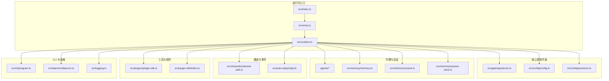
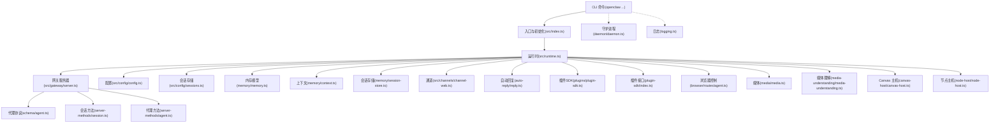
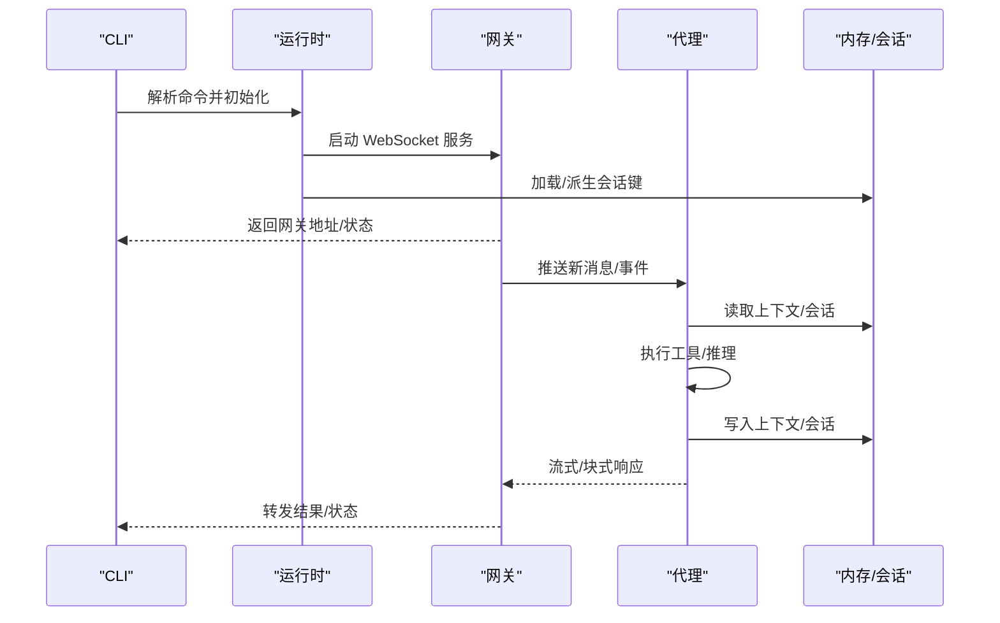
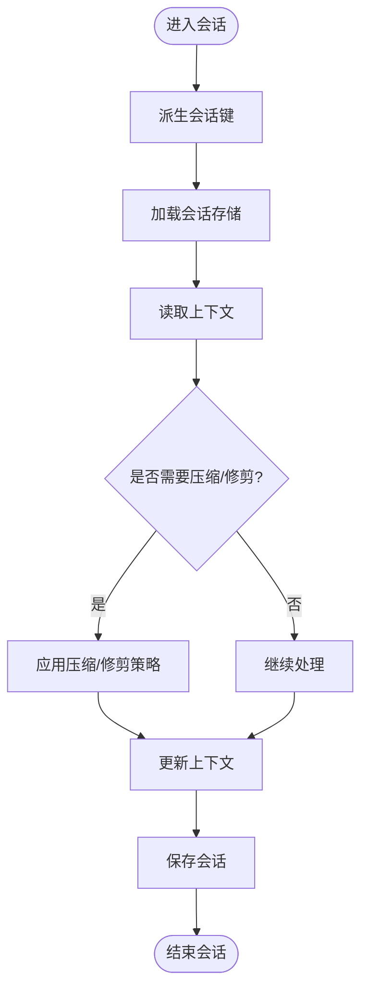
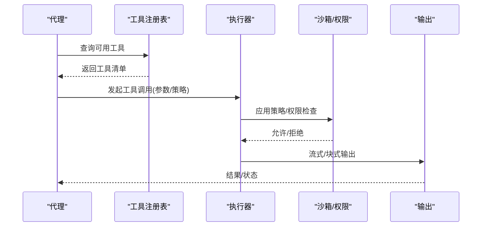
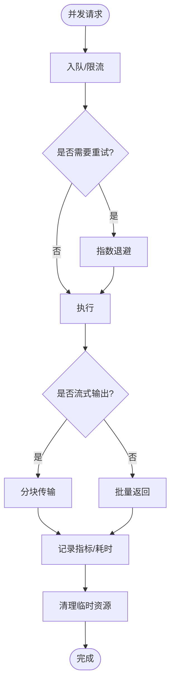
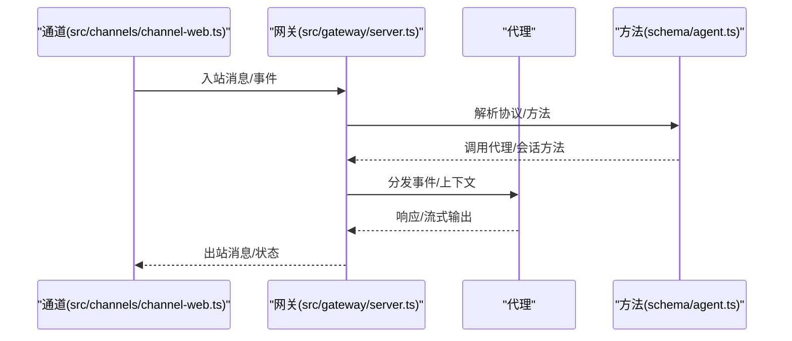
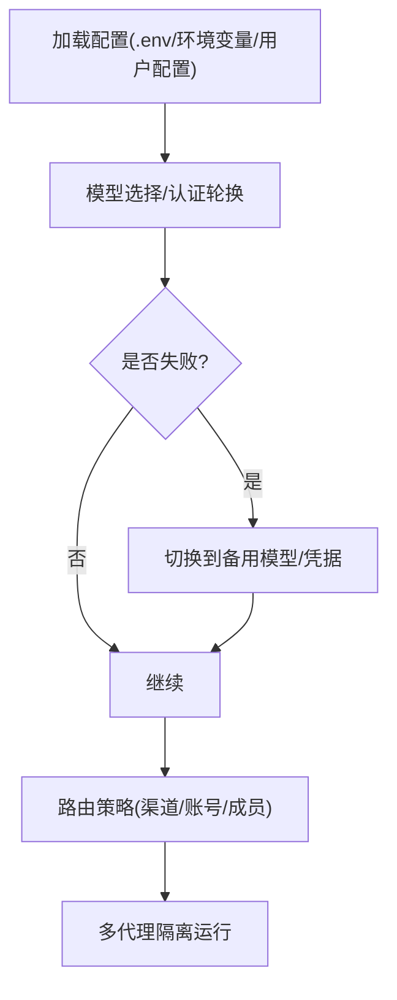
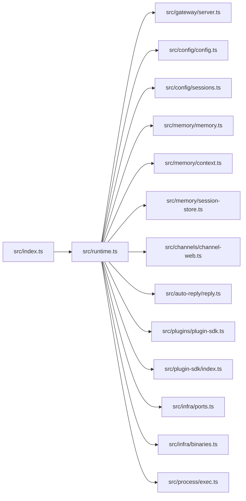

# 智能代理系统

## 目录
1. [简介](#简介)
2. [项目结构](#项目结构)
3. [核心组件](#核心组件)
4. [架构总览](#架构总览)
5. [详细组件分析](#详细组件分析)
6. [依赖关系分析](#依赖关系分析)
7. [性能考虑](#性能考虑)
8. [故障排查指南](#故障排查指南)
9. [结论](#结论)
10. [附录](#附录)

## 简介
OpenClaw 是一个在用户本地设备上运行的个人 AI 助手，支持多通道接入（如 WhatsApp、Telegram、Slack、Discord、Google Chat、Signal、iMessage、Microsoft Teams、WebChat 等），并提供多代理路由、会话管理、工具执行、媒体理解、Canvas 可视化工作区、语音唤醒与对话等能力。其核心运行时通过“网关（Gateway）”作为统一控制平面，承载会话、通道、工具与事件，并通过 WebSocket 提供客户端、工具与事件的统一接入。

本技术文档围绕以下主题展开：代理核心架构与运行时、生命周期管理；状态管理、会话处理与上下文维护；工具执行器设计、工具注册与调用流程；并发控制、资源管理与性能优化；代理与网关的交互模式、消息传递与事件处理；配置管理、模型选择与路由策略；以及可扩展性与最佳实践。

## 项目结构
OpenClaw 的代码组织采用按功能域划分的模块化结构，核心目录包括：
- src：核心运行时与平台层
  - agents：代理定义与运行逻辑
  - gateway：WebSocket 控制平面与协议
  - config：配置加载与会话存储
  - channels：各渠道适配器
  - memory：会话与上下文内存模型
  - plugins：插件 SDK 与扩展点
  - cli：命令行入口与子命令
  - infra：基础设施（端口、环境、二进制、错误处理）
  - auto-reply：自动回复模板与规则
  - browser、media、media-understanding、canvas-host、node-host：前端与媒体能力
  - cron、routing、providers、security、hooks 等支撑模块
- extensions：第三方渠道与认证扩展
- skills：技能（工具）集合
- apps：移动端与桌面应用（macOS/iOS/Android）
- docs：官方文档与概念说明

## 核心组件
- 运行时入口与全局初始化
  - 入口脚本负责加载 .env、标准化环境变量、确保 CLI 在 PATH 中、捕获控制台输出、断言运行时版本、安装未处理异常处理器，并解析 CLI 命令。
  - 关键职责：环境准备、日志捕获、错误兜底、命令解析。
- 网关控制平面
  - 提供 WebSocket 服务，承载会话、通道、工具与事件的统一接入；支持远程访问（Tailscale）、健康检查、配对与安全策略。
- 配置与会话
  - 配置加载与合并；会话存储与派生、解析会话键；支持会话状态持久化与恢复。
- 代理与内存
  - 代理运行于 RPC 模式，具备工具流式输出与块流式输出能力；内存模型包含会话与上下文，支持压缩、清理与使用追踪。
- 工具与插件
  - 插件 SDK 定义扩展点；工具注册与调用遵循统一协议；支持沙箱策略与权限控制。
- 自动回复与模板
  - 基于配置与模板生成自动回复，支持 Web 渠道监控与规则匹配。
- CLI 与守护进程
  - CLI 子命令驱动网关、代理、发送消息、仪表盘、医生诊断等；守护进程保证网关常驻运行。

## 架构总览
下图展示了从 CLI 到网关、再到代理与工具的端到端交互路径，以及与通道、媒体、Canvas、节点等子系统的协作关系。

## 详细组件分析

### 代理核心架构与生命周期
- 生命周期阶段
  - 初始化：加载配置、建立会话存储、启动网关、注册通道与工具。
  - 运行：接收事件（消息、心跳、钩子）、调度代理循环、执行工具、更新上下文与会话。
  - 终止：优雅关闭网关、保存会话、释放资源。
- 代理运行模式
  - RPC 模式：代理以独立进程运行，支持工具流式与块流式输出，便于与网关解耦。
- 上下文与会话
  - 会话键派生与解析、会话状态持久化与恢复；上下文压缩与清理策略降低内存占用。
- 并发与队列
  - 多通道并发接入，内部队列与限流保障稳定性；重试与超时策略提升鲁棒性。

### 状态管理、会话处理与上下文维护
- 会话键管理
  - 会话键派生、解析与存储路径解析，确保跨重启与多实例的一致性。
- 会话存储
  - 支持保存与加载会话，结合上下文压缩策略减少历史冗余。
- 上下文维护
  - 上下文模型支持分段、摘要与修剪，结合使用追踪与成本控制。

### 工具执行器设计、注册与调用流程
- 执行器设计
  - 工具注册表与调用协议；支持沙箱策略、权限白名单/黑名单；流式与块式输出。
- 注册与调用
  - 插件 SDK 定义工具接口；代理在运行时动态发现与调用工具；支持会话级策略（如非主会话启用沙箱）。
- 安全与隔离
  - 默认在主会话执行工具；群组/频道场景可启用 per-session Docker 沙箱，限制工具能力。

### 并发控制、资源管理与性能优化
- 并发与队列
  - 多通道并发接入，内部队列与限流保障稳定性；重试与超时策略提升鲁棒性。
- 资源管理
  - 进程生命周期管理、二进制依赖检测与安装、端口占用检测与错误处理。
- 性能优化
  - 上下文压缩、会话修剪、媒体缓存与临时文件生命周期管理；流式输出减少延迟。

### 代理与网关交互模式、消息传递与事件处理
- 协议与方法
  - 代理协议定义了消息格式与方法签名；会话方法用于查询与更新会话状态；代理方法用于触发代理行为。
- 事件处理
  - 网关监听通道事件并转发至代理；代理根据上下文与规则生成响应并通过网关回传。
- 通道集成
  - Web 渠道监控与自动回复规则；其他渠道通过适配器接入。

### 配置管理、模型选择与路由策略
- 配置加载
  - 合并默认与用户配置，支持环境变量覆盖；.env 文件与 PATH 标准化。
- 模型选择与回退
  - 支持多模型提供商与 OAuth/API Key 切换；失败回退策略保障连续性。
- 路由策略
  - 多代理路由：按渠道/账号/成员路由到隔离代理；群组激活模式与队列模式；会话工具用于跨会话协调。

### 代码示例与实现指引
以下示例以“代码片段路径”的形式给出，帮助开发者快速定位实现位置：

- 代理创建与启动
  - 运行时初始化与网关启动：`src/runtime.ts`
  - CLI 命令解析与入口：`src/index.ts#L75-L93`
- 工具调用
  - 插件 SDK 接口与工具注册：`src/plugins/plugin-sdk.ts`
  - 代理侧工具调用流程：`src/plugin-sdk/index.ts`
- 状态同步与会话管理
  - 会话键派生与存储：`src/config/sessions.ts`
  - 会话保存与加载：`src/memory/session-store.ts`
  - 上下文压缩与修剪：`src/memory/context.ts`
- 代理与网关交互
  - 代理协议与方法：`src/gateway/protocol/schema/agent.ts`
  - 代理方法实现：`src/gateway/server-methods/agent.ts`
  - 会话方法实现：`src/gateway/server-methods/session.ts`
- 自动回复与模板
  - 自动回复规则与模板：`src/auto-reply/reply.ts`
  - Web 渠道监控：`src/channels/channel-web.ts`
- 并发与资源
  - 端口占用检测与错误处理：`src/infra/ports.ts`
  - 二进制依赖与安装：`src/infra/binaries.ts`
  - 进程执行与超时：`src/process/exec.ts`

## 依赖关系分析
- 入口与运行时
  - 入口脚本依赖环境标准化、日志捕获、运行时断言、未处理异常处理与 CLI 解析。
- 网关与协议
  - 网关依赖协议 schema 与 server-methods 实现；与通道、内存、工具、安全模块耦合。
- 配置与会话
  - 配置模块与会话存储模块相互依赖，共同支撑代理运行期状态。
- 工具与插件
  - 插件 SDK 与工具注册表解耦，通过统一接口扩展；代理仅依赖抽象接口。
- 并发与资源
  - 并发控制依赖队列与限流；资源管理依赖端口检测、二进制安装与进程执行。

## 性能考虑
- 上下文压缩与修剪：定期压缩长上下文，减少 Token 使用与延迟。
- 流式输出：工具与模型响应采用流式/块式传输，降低首字节延迟。
- 并发与限流：多通道并发接入时，内部队列与限流避免过载。
- 临时文件与缓存：媒体与浏览器快照的生命周期管理，及时清理临时资源。
- 沙箱策略：在非主会话启用沙箱，平衡安全性与性能。

## 故障排查指南
- 环境与运行时
  - 断言运行时版本、捕获未处理异常与拒绝、格式化错误信息，避免静默崩溃。
- 端口与网络
  - 端口占用检测与错误描述，必要时提示端口归属者信息。
- 配置与会话
  - 检查配置加载顺序与覆盖关系；验证会话键派生与存储路径。
- 工具与权限
  - 确认工具注册与调用链路；检查沙箱策略与权限白名单。
- 日志与诊断
  - 启用结构化日志捕获；使用 doctor 命令进行健康检查与配置诊断。

## 结论
OpenClaw 的智能代理系统以“网关控制平面 + 多代理运行时 + 工具生态”为核心，通过严格的配置管理、会话与上下文模型、并发与资源控制、安全与沙箱策略，实现了在本地设备上稳定、可扩展且高性能的个人 AI 助手体验。开发者可基于插件 SDK 与工具注册机制扩展能力，同时依托完善的日志、诊断与运维工具保障系统可靠性。

## 附录
- 快速开始与安装
  - 参考项目自述文件中的安装与入门指南，了解 Node 版本要求、推荐安装方式与基础命令。
