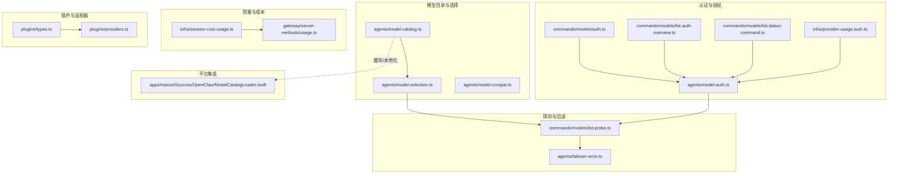
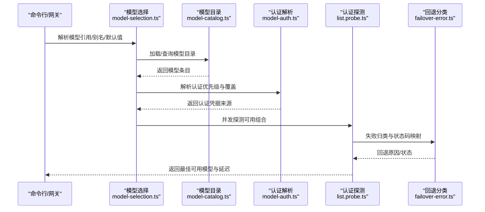
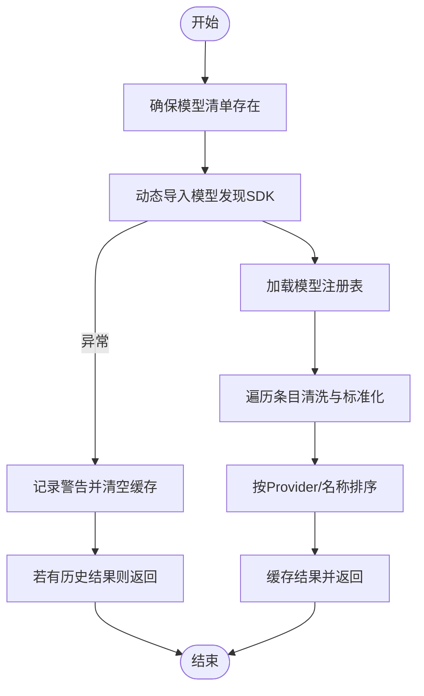
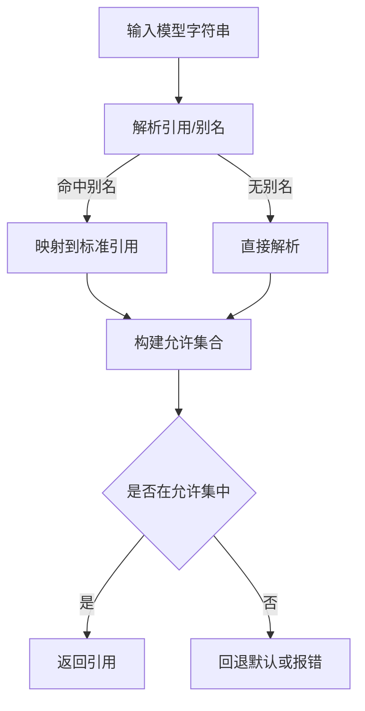
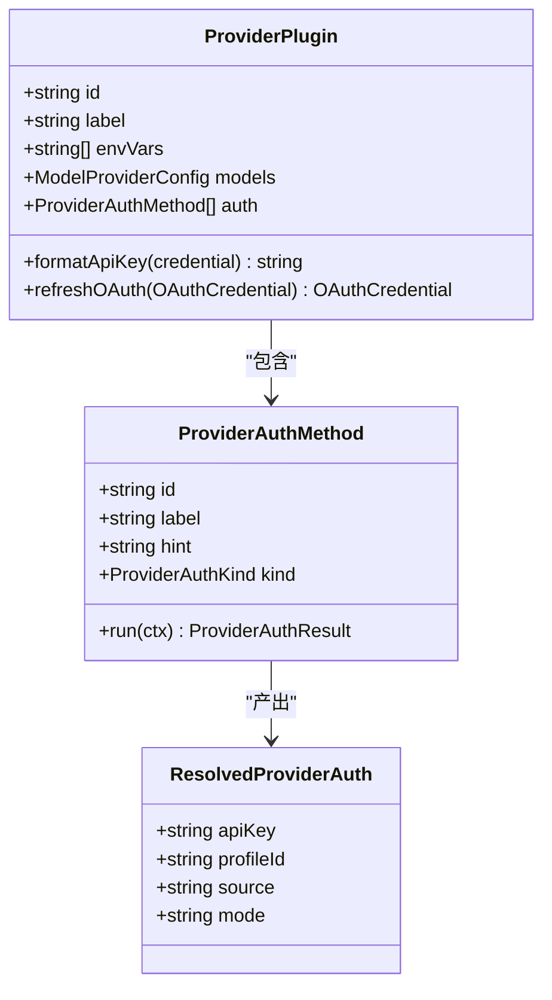
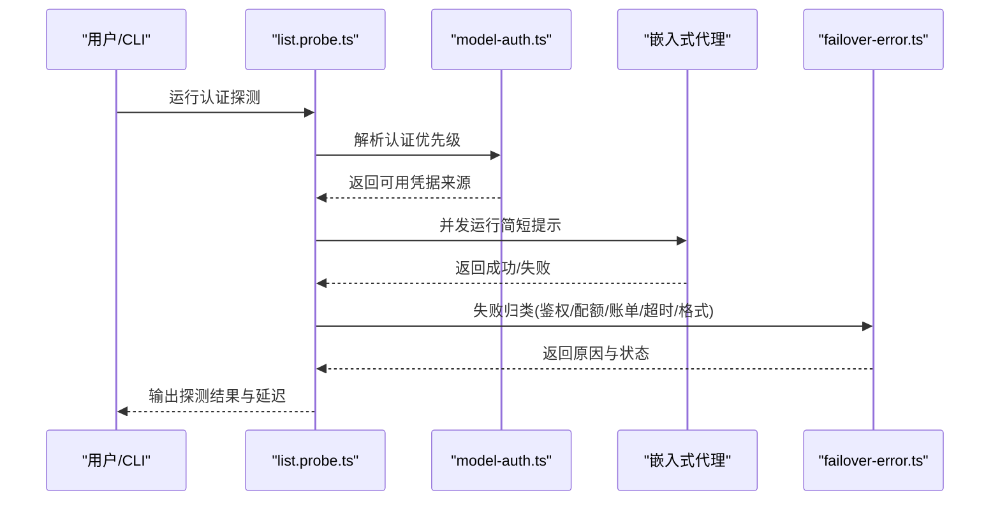
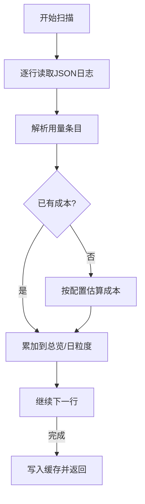
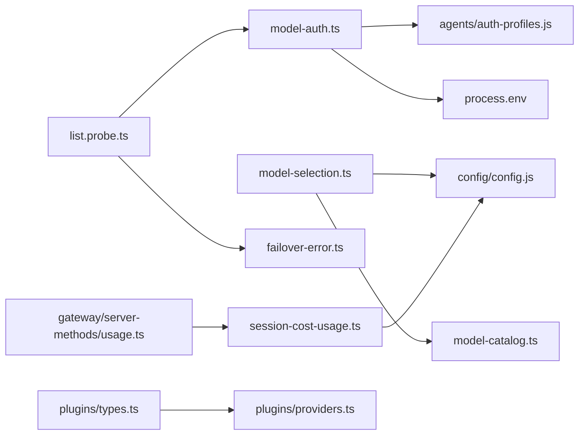

# 模型集成与适配

## 目录
1. [引言](#引言)
2. [项目结构](#项目结构)
3. [核心组件](#核心组件)
4. [架构总览](#架构总览)
5. [详细组件分析](#详细组件分析)
6. [依赖关系分析](#依赖关系分析)
7. [性能考量](#性能考量)
8. [故障排查指南](#故障排查指南)
9. [结论](#结论)
10. [附录](#附录)

## 引言
本文件面向开发者，系统化梳理 OpenClaw 的“模型集成与适配”体系，覆盖以下主题：
- 模型目录管理与发现、版本与能力标注
- 模型选择、别名与白名单策略
- 认证与授权、适配器与插件机制
- 负载探测与回退、故障转移与降级
- 性能评估与成本用量追踪
- 参数兼容性与响应格式标准化
- 模型使用的计费统计与成本控制
- 提供可操作的扩展接口与适配器开发指引

## 项目结构
围绕模型集成的关键模块分布于 agents、commands、infra、plugins 等子系统，并通过命令行与网关方法对外暴露能力。

## 核心组件
- 模型目录与发现：动态加载并缓存模型清单，支持排序、过滤与错误容错。
- 模型选择与别名：解析用户输入、别名索引、默认模型与白名单策略。
- 认证与授权：多源认证（OAuth/API Key/Token/AWS SDK），优先级与覆盖策略。
- 探测与回退：并发探测不同凭据组合，失败分类与回退策略。
- 成本与用量：本地用量扫描、成本估算与缓存聚合。
- 插件与适配器：统一 `ProviderPlugin` 接口，封装认证流程与 API 封装。

## 架构总览
OpenClaw 的模型集成采用“目录驱动 + 配置白名单 + 多源认证 + 探测回退”的分层架构。上层通过命令行与网关方法调用，底层由插件生态承载不同提供商的适配器。

## 详细组件分析

### 模型目录管理与发现
- 动态导入与缓存：通过动态导入 SDK 获取模型注册表，失败不污染缓存，支持重试与降级。
- 清单清洗：过滤空 ID/Provider，标准化字段，按 Provider 与名称排序。
- 能力标注：上下文窗口、推理能力、输入模态等，用于后续选择与兼容性判断。

### 模型选择与别名、白名单
- 别名索引：将配置中的别名映射到标准模型引用，支持跨 Provider 的统一引用。
- 默认模型与回退：未指定 Provider 时的默认策略与警告提示。
- 白名单与允许集：基于配置的允许列表构建允许集合，支持 CLI Provider 与显式配置 Provider。

### 认证与授权、适配器与插件
- 多源认证：优先级顺序为 显式凭据 > 配置覆盖 > 环境变量 > 自定义配置 > AWS SDK。
- 插件适配器：`ProviderPlugin` 定义认证方法、模型配置、API 封装与刷新逻辑。
- CLI 登录：交互式选择 Provider，执行认证流程并写入凭据存储。

### 认证探测与回退策略
- 目标构建：根据 Provider、模型候选、认证配置生成探测目标，支持并发与进度回调。
- 探测执行：嵌入式运行代理执行简短提示，捕获错误并分类。
- 结果汇总：按 Provider 分组、排序，输出延迟与状态。

### 成本与用量追踪
- 本地用量扫描：逐行解析会话日志，提取用量与成本，缺失成本时按配置估算。
- 缓存聚合：按天与总览聚合，支持缓存与并发去重。
- 网关接口：提供使用量状态与成本查询的网关方法。

### 参数兼容性与响应标准化
- 兼容性修正：针对特定 Provider 的差异进行兼容性调整（如角色支持）。
- 响应标准化：统一输出字段与类型，便于上层消费与统计。

### 平台集成与本地化
- macOS 平台：对模型目录进行缓存与净化处理，保证前端稳定加载。

## 依赖关系分析
- 组件耦合：模型选择依赖目录与配置；认证解析依赖存储与环境；探测依赖认证与失败分类；用量依赖配置与缓存。
- 外部依赖：动态导入 SDK、文件系统、HTTP 网关方法。
- 循环依赖：未见循环依赖迹象，模块职责清晰。

## 性能考量
- 目录缓存：避免重复导入与 I/O，失败时不污染缓存，支持重试。
- 并发探测：限制并发度，分批执行以平衡吞吐与资源占用。
- 用量扫描：流式读取与逐行解析，避免一次性加载大文件。
- 网关缓存：对成本汇总结果进行缓存与去重，降低重复计算。

[本节为通用性能建议，无需具体文件引用]

## 故障排查指南
- 探测状态分类：鉴权失败、速率限制、账单限制、超时、格式错误、未知等，便于快速定位问题根因。
- 凭据健康概览：列出可用凭据数量、OAuth 状态与冷却时间，辅助诊断认证问题。
- 用量缺失提示：当成本缺失时，提示按配置估算并给出补救建议。

## 结论
OpenClaw 的模型集成体系以“目录驱动 + 多源认证 + 探测回退 + 成本追踪”为核心，既保证了灵活性与可扩展性，又提供了稳健的可用性保障。通过插件适配器与统一接口，开发者可以快速接入新的模型提供商，并在不改动上层逻辑的前提下实现认证、参数与响应的标准化。

[本节为总结性内容，无需具体文件引用]

## 附录

### 开发者扩展与适配器开发指引
- 注册 Provider 插件：实现 `ProviderPlugin`，定义认证方法与模型配置。
- 实现认证流程：在 `ProviderAuthMethod` 中处理凭据获取、刷新与格式化。
- 统一 API 封装：在插件中封装第三方 API，保持请求/响应的一致性。
- 集成 CLI：通过插件注册命令与服务，提供用户交互入口。

### 代码示例路径（不含代码内容）
- 模型目录加载与缓存
  - [src/agents/model-catalog.ts](file://src/agents/model-catalog.ts#L41-L119)
- 模型选择与别名解析
  - [src/agents/model-selection.ts](file://src/agents/model-selection.ts#L102-L195)
- 认证解析与优先级
  - [src/agents/model-auth.ts](file://src/agents/model-auth.ts#L132-L230)
- 认证探测与并发执行
  - [src/commands/models/list.probe.ts](file://src/commands/models/list.probe.ts#L136-L459)
- 失败分类与回退
  - [src/agents/failover-error.ts](file://src/agents/failover-error.ts#L172-L231)
- 成本与用量扫描
  - [src/infra/session-cost-usage.ts](file://src/infra/session-cost-usage.ts#L156-L204)
- 网关用量查询
  - [src/gateway/server-methods/usage.ts](file://src/gateway/server-methods/usage.ts#L41-L88)
- 插件适配器接口
  - [src/plugins/types.ts](file://src/plugins/types.ts#L114-L124)
- macOS 目录缓存与净化
  - [apps/macos/Sources/OpenClaw/ModelCatalogLoader.swift](file://apps/macos/Sources/OpenClaw/ModelCatalogLoader.swift#L122-L156)