# 核心概念

## 目录
1. [引言](#引言)
2. [项目结构](#项目结构)
3. [核心组件](#核心组件)
4. [架构总览](#架构总览)
5. [详细组件分析](#详细组件分析)
6. [依赖关系分析](#依赖关系分析)
7. [性能考量](#性能考量)
8. [故障排查指南](#故障排查指南)
9. [结论](#结论)
10. [附录](#附录)

## 引言
本文件面向有经验的开发者，系统化阐述 OpenClaw 的核心概念与实现细节，聚焦以下主题：
- 网关控制平面的 WebSocket 协议设计与握手流程
- 智能代理系统的架构原理与会话管理机制
- 安全模型与设备身份、配对、TLS 钉印
- 多渠道集成与代理路由策略
- 工具执行系统与节点命令调用
- 配置管理、模型适配器与消息路由
- Pi Agent 核心的 RPC 模式、工具流式传输与块流式传输机制
- 系统边界、组件交互与数据流向

## 项目结构
OpenClaw 采用“协议 + 网关 + 代理 + 渠道插件 + 工具”的分层组织方式：
- 协议层：定义 WebSocket 控制面帧类型、参数校验与版本化
- 网关层：承载通道连接、方法分发、会话持久化、事件广播
- 代理层：工作区隔离、会话键解析、路由绑定、模型选择
- 渠道层：各 IM 平台插件与出站会话解析
- 工具层：节点命令、浏览器代理、技能与子代理

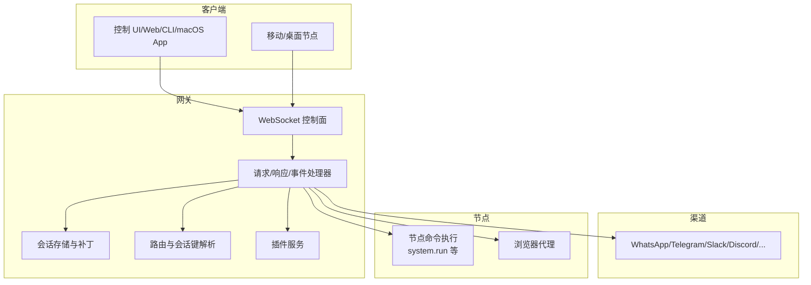

## 核心组件
- WebSocket 协议与握手：统一的 `connect` 流程、角色与作用域声明、设备身份与配对、TLS 钉印
- 网关服务器：启动、健康状态、发现、维护任务、插件加载、WS 运行时
- 会话管理：会话键格式、补丁更新、重置与清理、并发与合并
- 渠道路由：按渠道/账号/对端/群组/线程的确定性路由
- 块流与流式传输：块流合并、字符节流、段落/换行/句子断句策略
- 工具执行：节点命令调用、浏览器代理、技能与子代理
- 配置管理：Schema + UI 提示 + 写入与校验
- 安全审计：配置包含文件权限检查与修复建议

## 架构总览
下图展示从客户端到网关、再到渠道与节点的端到端交互，以及关键数据流与控制流。

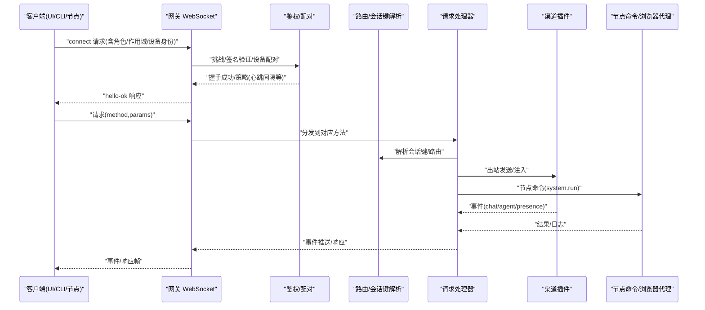

## 详细组件分析

### WebSocket 协议与握手
- 传输：文本帧 JSON，首帧必须为 `connect`
- 握手：服务端先发 `connect.challenge`，客户端签名并携带 `device.identity` 与角色/作用域
- 设备身份：基于密钥指纹的稳定设备 ID，非本地连接需对挑战进行签名
- TLS 钉印：可选证书指纹校验
- 版本化：协议版本号在 `connect` 中声明，`hello-ok` 返回实际协商版本

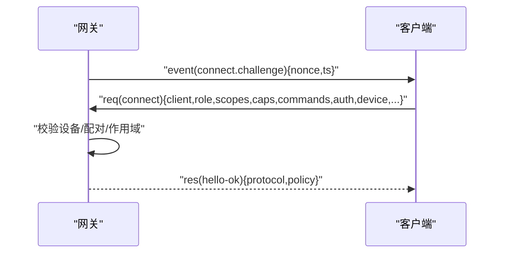

### 网关服务器与运行时
- 启动流程：读取配置快照、迁移旧配置、写回变更、加载插件、启动发现/心跳/维护任务
- 绑定策略：loopback、LAN、tailnet、auto
- 功能开关：是否暴露浏览器控制 UI、HTTP 兼容接口
- 事件与方法：注册方法列表、事件广播、健康状态与存在版本

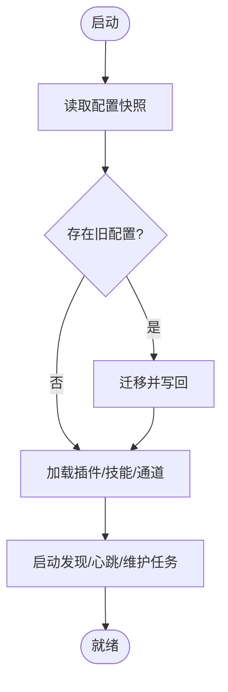

### 会话管理与路由
- 会话键格式：`agent:{agentId}:{mainKey|channel|dm|group|channel|thread|topic}`
- 路由策略：默认 main，DM 可按对端或按渠道+对端隔离，群组/频道按渠道隔离，线程/论坛主题附加键位
- 会话补丁：支持 `patch`/`reset`/`delete`/`compact`，合并同名键，更新时间戳
- 绑定：通过 `(channel, accountId, peer)` 与可选 `guild`/`team` ID 将入站消息路由到 `agentId`

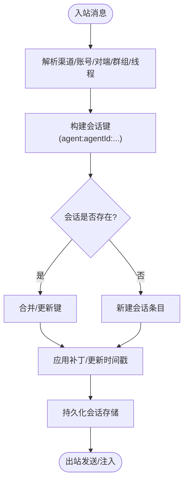

### 多渠道集成与代理路由策略
- 支持渠道：WhatsApp、Telegram、Discord、Slack、Signal、iMessage、WebChat 等
- 多账户/多手机号：通过 `accountId` 区分不同登录实例
- 对端优先：`peer` 绑定优先于渠道级规则
- 示例：将 WhatsApp 路由到日常智能体，Telegram 路由到深度工作智能体

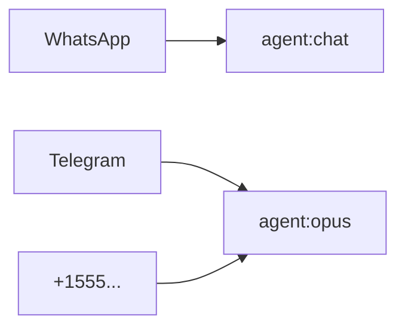

### 工具执行系统与节点命令
- 节点命令：通过工具调用 `gateway` 的 `node.invoke`，传递 `system.run` 参数（命令、`cwd`、`env`、超时、屏幕录制需求、`agentId`、`sessionKey`）
- 浏览器代理：对路径进行映射替换，支持 GET/POST/DELETE，带超时与错误处理
- 执行策略：超时包装、错误消息标准化

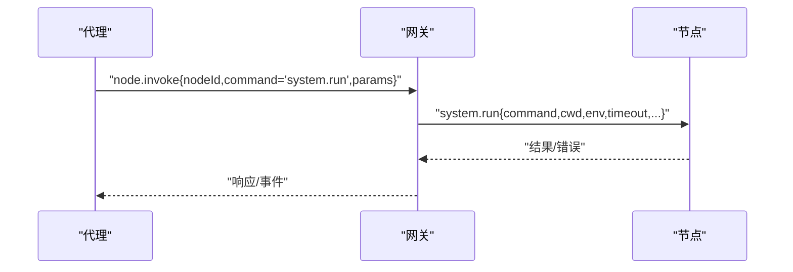

### 配置管理与模型适配器
- 配置 Schema：TypeBox 定义，返回 `schema` 与 UI 提示，支持版本与生成时间
- UI 表单：根据 `schema` 分析可用分组与字段，渲染配置表单
- 模型适配器：解析模型引用（`provider`/`model`），构建别名索引，规范化 `provider`/`model`

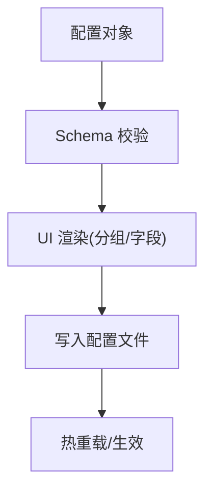

### 消息路由与块流式传输
- 出站会话解析：按渠道分派到具体解析器（Slack/Discord/Telegram/WhatsApp/Signal/iMessage/Mattermost/Matrix/Tlon/Nostr/Zalo/Zalouser/NextcloudTalk/BlueBubbles）
- 块流合并：按最小/最大字符数、空行/段落/句子断句策略合并文本块，避免超出渠道限制
- 去抖与防重复：基于 `payload` 键去重，缓冲媒体消息优先发送，超时中断链路保护顺序

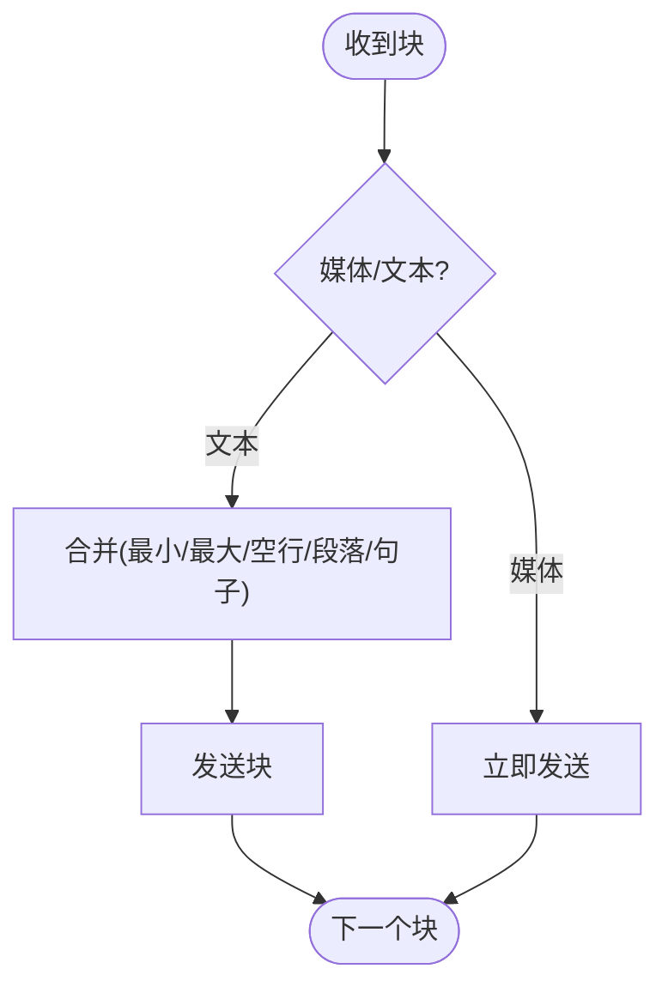

### Pi Agent 核心的 RPC 模式与工具流式/块流式传输
- RPC 模式：客户端向网关发起请求（`req`），网关返回响应（`res`）或事件（`event`），形成请求-响应-事件的统一帧模型
- 工具流式传输：在长文本场景中，按段落/换行/句子断句，结合合并窗口与超时控制，保证顺序与可靠性
- 块流式传输：针对媒体/大文本，优先发送媒体块，随后合并文本块，避免重复与乱序

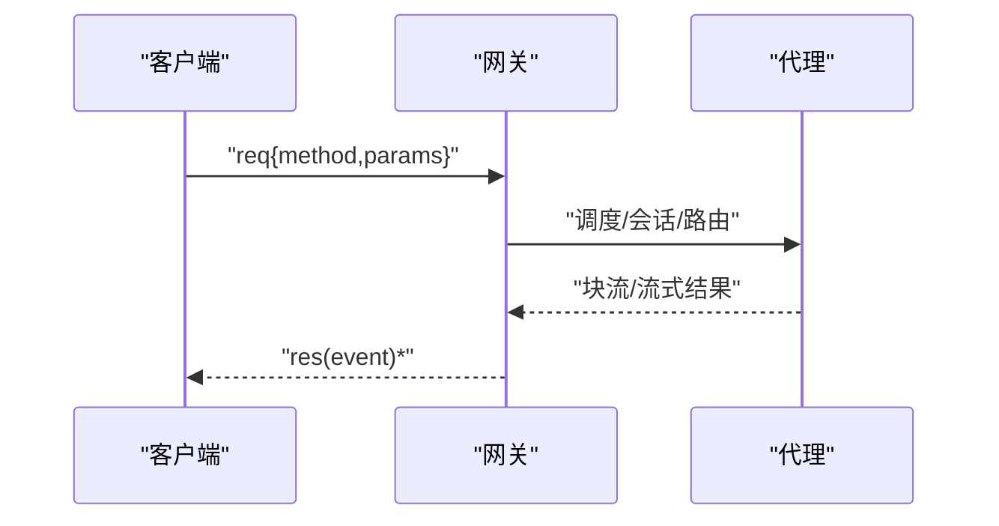

### 安全模型与审计
- 设备身份与配对：设备指纹、签名挑战、本地/非本地差异、自动批准策略
- TLS 钉印：可选证书指纹校验，降低 MITM 风险
- 配置包含文件权限：检测世界可写/组可写/全局可读等高危权限，给出修复建议

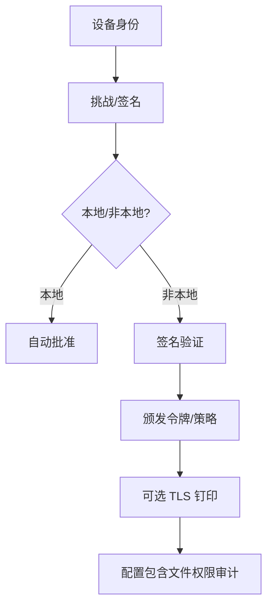

## 依赖关系分析
- 协议层依赖 AJV 校验器，统一请求/响应/事件的参数校验与错误格式化
- 网关服务器依赖插件系统、通道管理器、会话存储、路由解析、健康与心跳
- 渠道路由依赖会话键解析与绑定配置
- 块流依赖渠道码头(`outbound`)与文本分块配置

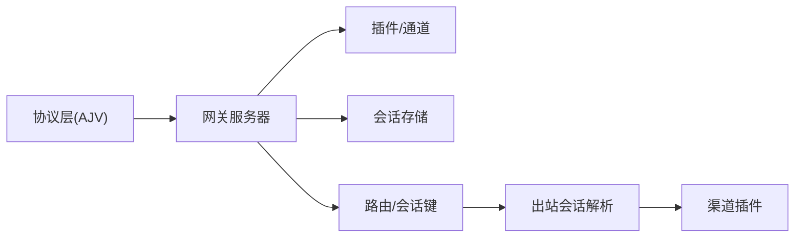

## 性能考量
- 块流合并窗口与超时：通过最小/最大字符数与空行/段落/句子断句策略平衡吞吐与延迟
- 去重与缓冲：避免重复发送与乱序，媒体优先保障用户体验
- 并发与限流：会话键隔离与通道文本限制共同约束并发与速率
- 配置热重载：减少重启成本，提升运维效率

## 故障排查指南
- 握手失败：检查 `connect.challenge` 是否正确签名、设备身份是否有效、本地/非本地策略是否匹配
- 作用域不足：确认 `scopes`/`caps`/`commands` 是否满足目标方法要求
- 会话异常：核对会话键格式、补丁参数、重置/清理操作是否符合预期
- 渠道限流：关注文本块大小与断句策略，避免超过渠道限制
- 配置问题：使用 `doctor` 修复配置，检查包含文件权限

## 结论
OpenClaw 通过统一的 WebSocket 控制面协议、确定性的渠道路由与会话键、严谨的块流合并与去重机制，以及完善的配置与安全审计，构建了可扩展、可观测、可治理的多渠道智能代理平台。其设计在保证易用性的同时，兼顾了生产环境的稳定性与安全性。

## 附录
- 模型适配器：解析 `provider`/`model`，构建别名索引，便于跨渠道一致引用
- 浏览器代理：路径映射与下载路径替换，统一资源定位
- 多智能体/多账户：通过 `accountId` 与 `peer` 绑定实现精细化路由