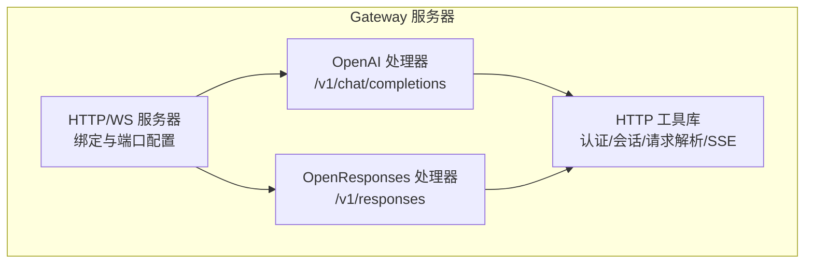
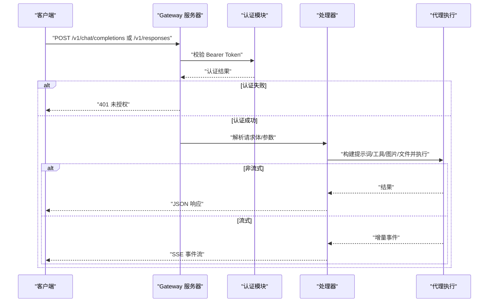
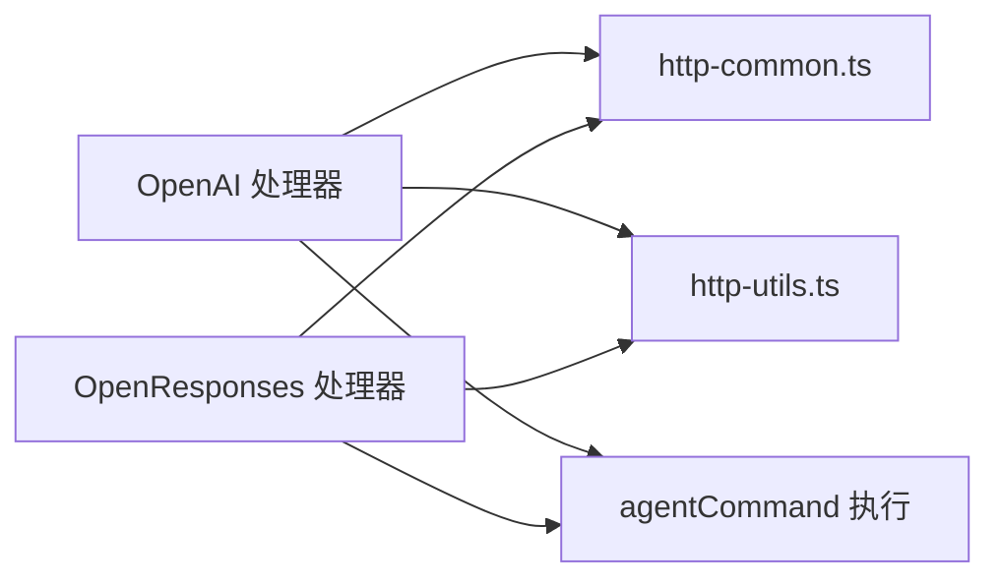

# HTTP API 设计

## 目录
1. [简介](#简介)
2. [项目结构](#项目结构)
3. [核心组件](#核心组件)
4. [架构总览](#架构总览)
5. [详细组件分析](#详细组件分析)
6. [依赖关系分析](#依赖关系分析)
7. [性能考虑](#性能考虑)
8. [故障排查指南](#故障排查指南)
9. [结论](#结论)
10. [附录](#附录)

## 简介
本文件系统性梳理 OpenClaw Gateway 的 HTTP API 设计，覆盖以下内容：
- RESTful 端点与路由规则
- 请求/响应格式与流式传输（SSE）
- 认证与授权机制
- OpenAI 兼容 API、OpenResponses API 与自定义 API 的实现差异
- 版本管理、向后兼容与废弃策略
- 集成示例、错误处理与性能优化建议

## 项目结构
OpenClaw Gateway 在同一 HTTP/WebSocket 服务器上提供多类接口，HTTP API 主要由两类处理器实现：
- OpenAI 兼容端点：`/v1/chat/completions`
- OpenResponses 兼容端点：`/v1/responses`

同时，HTTP 通用工具与认证工具被多个处理器复用。

## 核心组件
- OpenAI 兼容处理器（`/v1/chat/completions`）
  - 支持非流式与流式响应
  - 使用 Bearer Token 认证
  - 通过请求头或 model 字段选择代理
  - 会话键可基于 user 字段稳定化
- OpenResponses 兼容处理器（`/v1/responses`）
  - 支持非流式与流式响应
  - 支持客户端函数工具定义与调用
  - 支持图片与文件输入（限制与校验）
  - 流事件类型丰富，便于前端渲染
- HTTP 通用工具
  - 统一的 JSON 响应、SSE 头设置、方法不允许、未授权等
  - 请求体读取与大小限制
- HTTP 工具库
  - Authorization: Bearer 解析
  - 代理选择（header 或 model 前缀）
  - 会话键生成与稳定化
- 服务器启动与端点开关
  - 通过配置项控制是否启用 OpenAI 与 OpenResponses 端点

## 架构总览
下图展示了从客户端到处理器再到代理执行的整体流程，以及两种端点的差异与共性。

## 详细组件分析

### OpenAI 兼容 API（`/v1/chat/completions`）
- 路由与方法
  - 仅接受 POST 方法，路径为 `/v1/chat/completions`
- 认证
  - 使用 Bearer Token；支持 token/password 模式
- 代理选择
  - 优先使用请求头 `x-openclaw-agent-id`
  - 其次从 model 字段解析 `openclaw:<agentId>` 或 `agent:<agentId>`
  - 默认代理 `main`
- 会话行为
  - 默认每次请求生成新会话键
  - 若提供 user 字段，则根据 user 衍生稳定会话键
- 请求体字段
  - model、messages、stream、user 等
- 响应
  - 非流式：标准 OpenAI chat.completion 结构
  - 流式：SSE，事件类型为 `chat.completion.chunk`
- 错误
  - 401 未授权、400 请求无效、405 方法不允许

### OpenResponses 兼容 API（`/v1/responses`）
- 路由与方法
  - 仅接受 POST 方法，路径为 `/v1/responses`
- 认证
  - 使用 Bearer Token；支持 token/password 模式
- 代理选择
  - 优先使用请求头 `x-openclaw-agent-id`
  - 其次从 model 字段解析 `openclaw:<agentId>` 或 `agent:<agentId>`
  - 默认代理 `main`
- 会话行为
  - 默认每次请求生成新会话键
  - 若提供 user 字段，则根据 user 衍生稳定会话键
- 请求体字段
  - input（字符串或 ItemParam 数组）、instructions、tools、tool_choice、stream、max_output_tokens、user 等
  - 支持图片与文件输入（限制与校验）
- 响应
  - 非流式：ResponseResource，包含 output、usage、status 等
  - 流式：丰富的 SSE 事件类型，如 `response.created`、`response.in_progress`、`response.output_text.delta`、`response.completed` 等
- 错误
  - 401 未授权、400 请求无效、405 方法不允许

### HTTP 通用工具与认证
- 统一响应与错误
  - `sendJson`、`sendText`、`sendMethodNotAllowed`、`sendUnauthorized`、`sendInvalidRequest`、`writeDone`、`setSseHeaders`
- 请求体读取
  - `readJsonBodyOrError`，带最大字节数限制
- 认证与授权
  - `getBearerToken` 解析 Authorization: Bearer
  - 与 Gateway 授权配置对接（token/password）

### 服务器启动与端点开关
- 启动时根据配置决定是否启用 OpenAI 与 OpenResponses 端点
- 控制 UI、TLS、发现、插件等子系统初始化

## 依赖关系分析
- 处理器对工具库的依赖
  - OpenAI 与 OpenResponses 处理器均依赖 `http-common.ts` 与 `http-utils.ts`
- 处理器对代理执行的依赖
  - 两者最终通过 `agentCommand` 触发代理执行，并订阅 agent 事件流
- 端点差异
  - 输入形态不同：OpenAI 使用 messages，OpenResponses 使用 input（字符串或 ItemParam[]）
  - 工具调用：OpenResponses 支持客户端函数工具与 function_call 输出项
  - 图片/文件：OpenResponses 支持 input_image 与 input_file 并进行安全限制
  - 流事件：OpenResponses 提供更丰富的 SSE 事件类型

## 性能考虑
- 流式传输
  - 优先使用 SSE 流式输出，降低首字节延迟与内存占用
- 会话键策略
  - 对于长对话场景，建议传入稳定的 user 字段以复用会话
- 请求体大小限制
  - OpenAI 端点默认较小上限；OpenResponses 端点支持更大上限与图片/文件限制
- 代理并发与资源
  - 服务器维护代理运行状态与缓冲区，避免重复执行与资源浪费

## 故障排查指南
- 401 未授权
  - 检查 Authorization: Bearer 是否正确传递
  - 确认 Gateway 认证模式与密钥配置
- 400 请求无效
  - OpenAI：检查 messages 是否包含用户消息
  - OpenResponses：检查 input 是否为空或字段不符合 Schema
- 405 方法不允许
  - 确保使用 POST 方法访问 `/v1/chat/completions` 或 `/v1/responses`
- 流式连接中断
  - 检查网络稳定性与超时设置
  - 确认客户端正确处理 SSE 事件与 `[DONE]` 终止符

## 结论
OpenClaw Gateway 的 HTTP API 通过统一的认证与工具层，为 OpenAI 兼容与 OpenResponses 兼容提供了清晰、可扩展的接口。OpenAI 端点侧重简洁的消息交互，OpenResponses 端点则提供更丰富的输入形态、工具调用与流事件，满足复杂场景需求。建议在生产中优先采用 OpenResponses 端点，并结合流式传输与稳定的会话键策略提升体验与性能。

## 附录

### API 端点与请求/响应摘要
- OpenAI 兼容（`/v1/chat/completions`）
  - 方法：POST
  - 认证：Bearer
  - 请求体字段：model、messages、stream、user
  - 响应：非流式为 chat.completion；流式为 `chat.completion.chunk`
- OpenResponses 兼容（`/v1/responses`）
  - 方法：POST
  - 认证：Bearer
  - 请求体字段：model、input、instructions、tools、tool_choice、stream、max_output_tokens、user
  - 响应：非流式为 ResponseResource；流式为多种 SSE 事件

### 认证与授权
- 支持 token 与 password 两种模式
- 通过环境变量或配置文件注入密钥
- 建议使用独立凭据并定期轮换

### 版本管理、向后兼容与废弃策略
- OpenAI 端点当前为兼容层，建议迁移到 OpenResponses 端点
- 通过配置项独立启用/禁用端点，避免破坏现有集成
- 文档与实验计划明确指出 Responses 端点为长期演进方向

### 集成示例与最佳实践
- 使用 curl 进行端点测试（含流式与非流式）
- 通过 `x-openclaw-agent-id` 指定代理
- 通过 user 字段稳定会话
- 通过 SSE 事件驱动前端实时渲染