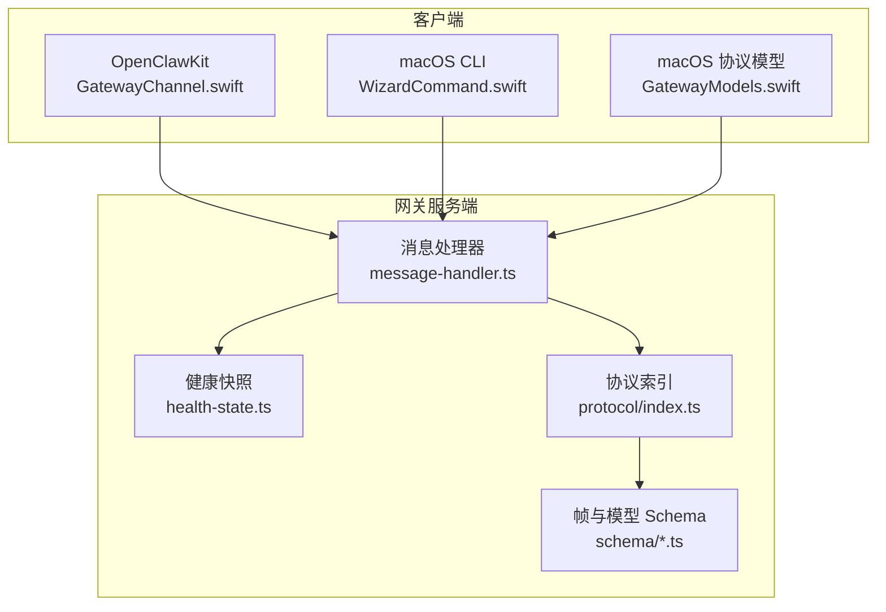
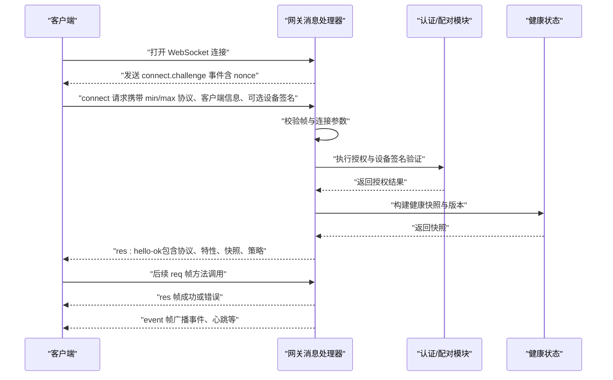
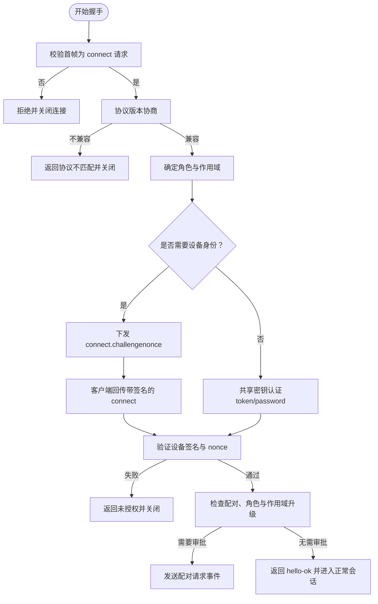
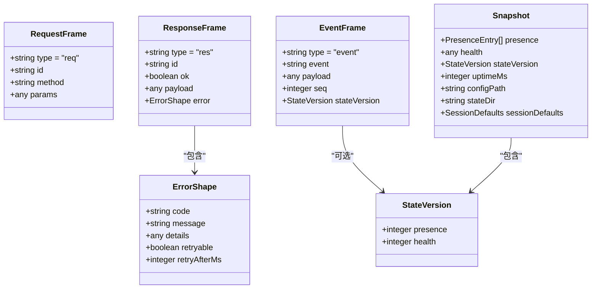
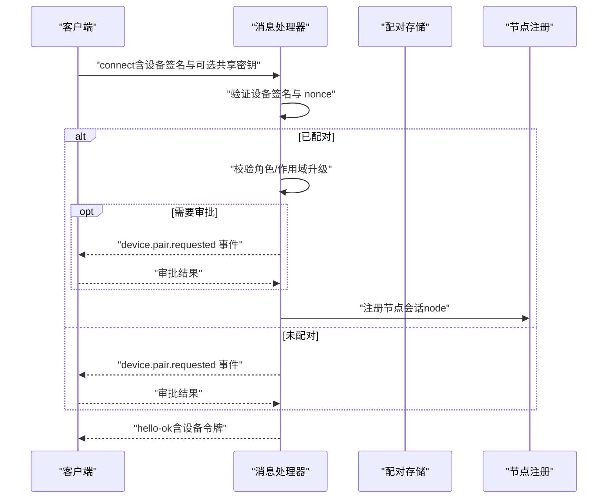
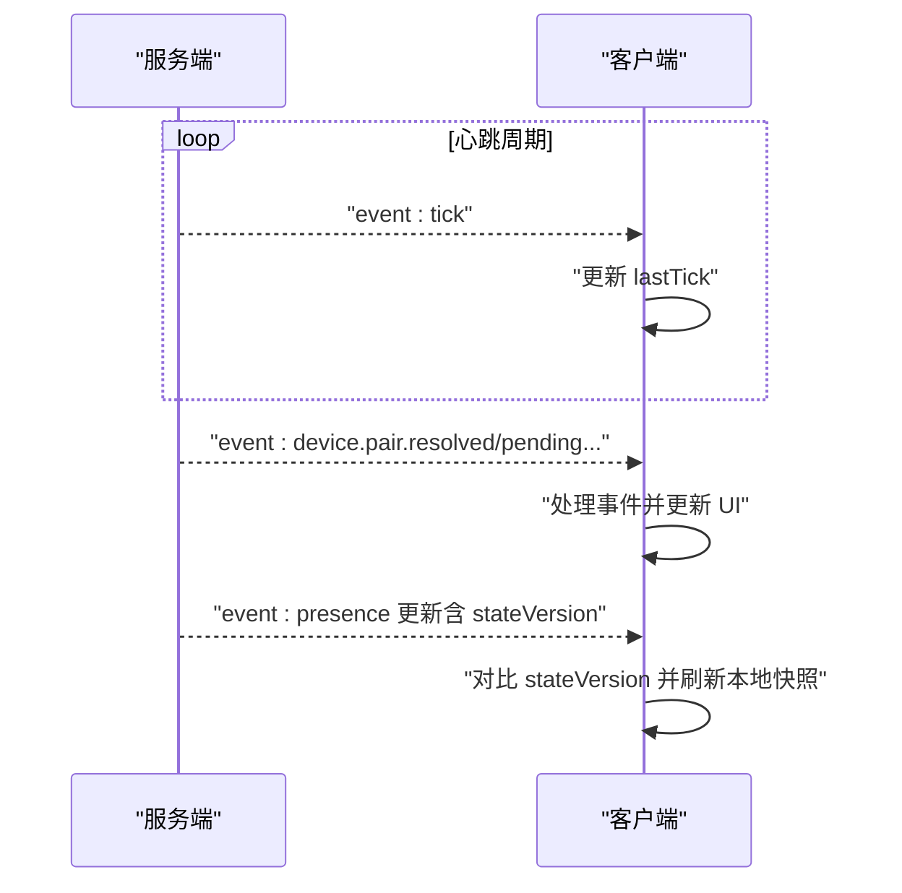
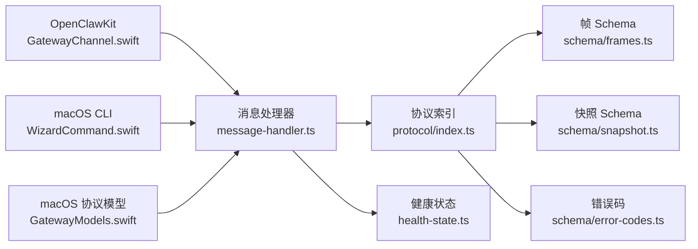

# WebSocket 协议设计

## 目录
1. [引言](#引言)
2. [项目结构](#项目结构)
3. [核心组件](#核心组件)
4. [架构总览](#架构总览)
5. [详细组件分析](#详细组件分析)
6. [依赖关系分析](#依赖关系分析)
7. [性能考虑](#性能考虑)
8. [故障排查指南](#故障排查指南)
9. [结论](#结论)
10. [附录](#附录)

## 引言
本文件系统性梳理 OpenClaw 的 WebSocket 协议设计与实现，覆盖握手流程、消息帧格式、事件模型、认证与配对、会话与状态管理、实时数据流、错误与重连策略，并提供 API 使用指南与最佳实践。目标读者包括需要对接 OpenClaw 网关的客户端开发者与平台集成工程师。

## 项目结构
OpenClaw 的 WebSocket 协议由服务端与多语言客户端共同实现：
- 服务端：在网关层实现 WebSocket 握手、认证、配对、请求处理与事件广播，位于 `src/gateway/server`。
- 协议定义：通过 Ajv 校验器与 TypeBox Schema 定义消息帧、连接参数、快照与错误码，位于 `src/gateway/protocol`。
- 客户端：提供通用的 WebSocket 会话封装与握手流程，位于 `apps/shared/OpenClawKit`；另有 macOS 平台特定实现，位于 `apps/macos`。

## 核心组件
- 消息处理器：负责解析与校验帧、执行握手、认证与配对、构建 hello-ok 响应、分发请求与广播事件。
- 协议与校验：基于 Ajv 与 TypeBox 的 Schema，统一定义帧结构、连接参数、错误码与快照模型。
- 健康状态：提供系统健康快照与版本号，用于握手时的初始状态同步。
- 客户端通道：封装 WebSocket 任务、最大消息尺寸、挑战-响应握手流程与事件序列号跟踪。

## 架构总览
下图展示了从客户端发起连接到握手完成并进入请求-响应与事件广播阶段的整体流程。

## 详细组件分析

### 握手与连接建立
- 首帧限制：首个帧必须是 `type="req"` 且 `method="connect"`，否则直接关闭连接并返回无效握手错误。
- 协议协商：客户端需提供 `minProtocol` 与 `maxProtocol`，服务端与当前 `PROTOCOL_VERSION` 比较，不兼容则返回协议不匹配并关闭。
- 角色与作用域：默认 `operator.admin`，支持 `node` 角色与命令白名单过滤。
- 设备身份与挑战：非本地连接要求提供 `nonce`；服务端生成 `connectNonce` 并通过 `connect.challenge` 事件下发，客户端收到后回传签名后的 `connect` 请求。
- 授权与配对：支持 `token/password` 共享密钥认证；设备签名验证通过后，检查是否已配对、角色与作用域升级是否需要人工审批。
- 成功响应：返回 `res: hello-ok`，包含协议版本、服务器元信息、功能列表、快照与策略（最大负载、缓冲字节、心跳间隔）。

### 消息格式与事件模型
- 帧类型：`req/res/event` 三类帧，通过 `discriminator` 字段区分。
- 错误模型：包含 `code`、`message`、`details`、`retryable`、`retryAfterMs`。
- 快照模型：包含 `presence`、`health`、`stateVersion`、`uptimeMs`、配置路径与会话默认值。
- 事件字段：`event` 名称、可选 `payload`、可选 `seq` 序列号、可选 `stateVersion` 版本号。

### 认证与会话管理
- 认证方式：共享密钥（`token/password`）与设备签名（`device.identity`）双重保障；控制 UI 在安全上下文（HTTPS/localhost）下可放宽设备身份要求。
- 设备配对：首次连接若未配对，触发 `device.pair.requested` 事件；静默连接可自动批准；升级角色/作用域时可能要求审批。
- 会话与存在性：连接成功后更新系统存在性记录，携带主机名、IP、版本、平台、设备家族、型号、模式、设备 ID、角色、作用域、实例 ID 等。
- 设备令牌：为已配对设备颁发短期设备令牌，支持角色与作用域变更时轮换。

### 实时通信与事件路由
- 事件广播：服务端在上下文层面广播事件（如设备配对、节点状态变化），客户端按事件名称订阅与处理。
- 心跳与保活：服务端周期性发送 `tick` 事件；客户端维护 `lastTick` 时间戳以检测连接活性。
- 序列号与丢包检测：事件帧可携带 `seq`，客户端检测缺失并回调 `gap` 回调。
- 快照与版本：事件可携带 `stateVersion`，客户端据此判断本地缓存是否陈旧。

### 错误处理与重连机制
- 错误码：`INVALID_REQUEST`、`UNAVAILABLE`、`NOT_PAIRED`、`NOT_LINKED`、`AGENT_TIMEOUT` 等，配合 `details` 与 `retryable/retryAfterMs` 提示重试策略。
- 关闭原因：握手失败、协议不匹配、未授权、设备身份无效、配对必需等，均会设置 `closeCause` 并返回相应错误。
- 重连建议：客户端在连接断开后根据错误码与 `retryAfterMs` 决定指数退避重连；对协议不匹配、未授权等永久性错误应提示用户修正配置。

## 依赖关系分析
- 协议层：通过 Ajv 编译 Schema，统一校验请求/响应/事件帧与连接参数，确保跨语言一致性。
- 消息处理器：依赖健康状态模块构建快照，依赖配对模块进行设备与节点配对管理，依赖认证模块进行授权判定。
- 客户端：依赖 URLSession 的 WebSocket 任务封装，设置最大消息尺寸以避免“消息过长”错误；在 Swift 侧提供类型化的帧解码与事件处理。

## 性能考虑
- 最大负载与缓冲：服务端在 `hello-ok` 中声明 `maxPayload` 与 `maxBufferedBytes`，客户端应据此限制单次消息大小与队列长度，避免内存压力。
- 心跳间隔：`tickIntervalMs` 控制事件发送频率，客户端应根据网络状况调整接收与处理节奏。
- 快照体积：`presence/health` 快照可能较大，建议客户端按需增量更新与版本比对，减少全量渲染成本。
- 并发请求：服务端对每个请求异步处理并通过上下文广播事件，避免阻塞握手与关键路径。

## 故障排查指南
- 握手超时：若长时间无任何帧，服务端将关闭连接。检查客户端是否正确发送 `connect` 请求。
- 协议不匹配：`min/max` 协议与服务端 `PROTOCOL_VERSION` 不一致导致握手失败。请确保客户端与服务端版本兼容。
- 未授权：共享密钥缺失或不匹配、Tailscale 身份缺失或不匹配、设备签名无效或过期。核对配置与时间偏移。
- 设备身份问题：非本地连接缺少 `nonce` 或 `nonce` 不匹配；设备公钥无效或签名不合法。确认代理与时间设置。
- 需要配对：设备未配对或角色/作用域升级未审批。检查配对请求事件与审批流程。
- 心跳异常：客户端未收到 `tick` 或 `lastTick` 长时间未更新。检查网络稳定性与代理配置。

## 结论
OpenClaw 的 WebSocket 协议以严格的 Schema 校验与清晰的握手流程为基础，结合设备签名与共享密钥认证，提供了高安全性与可扩展的实时通信能力。通过事件驱动与健康快照机制，客户端能够高效地感知系统状态并进行自适应处理。遵循本文档的协议规范与最佳实践，可确保稳定、可靠的集成体验。

## 附录

### 协议示例与字段说明
- `connect.challenge` 事件：`payload` 含 `nonce`，客户端需在 `connect` 请求中回传签名。
- `hello-ok` 响应：`payload` 含 `type="hello-ok"`，包含 `protocol`、`server`（版本/主机/连接 ID）、`features`（方法与事件列表）、`snapshot`（`presence/health/stateVersion/uptimeMs`）、`policy`（`maxPayload/maxBufferedBytes/tickIntervalMs`）。
- 请求/响应帧：`req/res` 帧严格遵循 `RequestFrame/ResponseFrame` Schema；错误使用 `ErrorShape`。
- 事件帧：`event` 帧包含 `event` 名称、可选 `payload`、可选 `seq` 与 `stateVersion`。

### API 使用指南与最佳实践
- 客户端实现要点
  - 打开连接后等待 `connect.challenge` 事件，提取 `nonce` 并在 `connect` 请求中附带签名。
  - 解析 `hello-ok`，读取 `features` 与 `policy`，初始化最大消息尺寸与心跳周期。
  - 对事件帧按 `event` 名称分发处理，使用 `seq` 与 `stateVersion` 做去重与增量更新。
  - 遇到错误码时依据 `details` 与 `retryable/retryAfterMs` 决策重试策略。
- 服务端实现要点
  - 严格校验首帧与连接参数，失败即刻关闭并记录原因。
  - 设备签名验证需考虑时间偏移与版本兼容。
  - 配对流程中区分静默与交互式场景，及时广播配对事件。
  - 构建健康快照时避免阻塞握手，后续异步刷新。