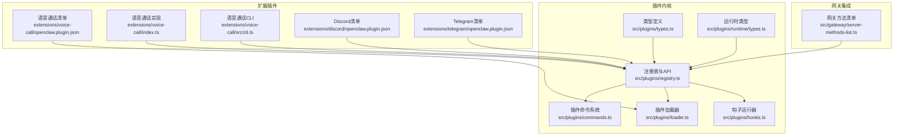
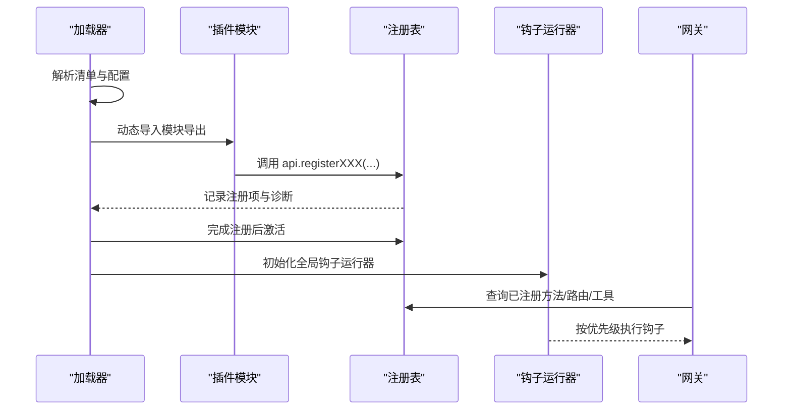
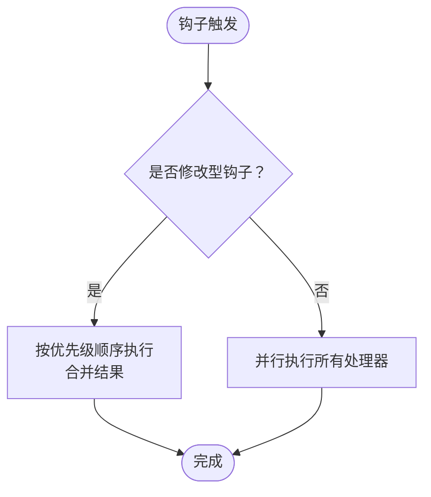
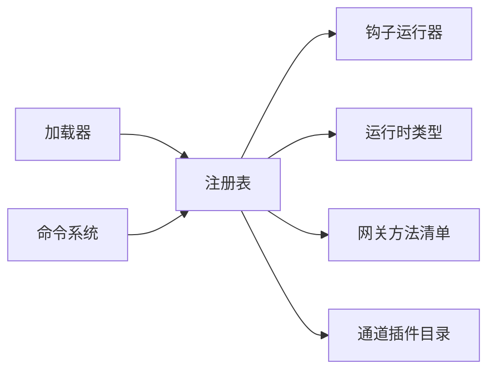

# 插件接口规范

## 目录
1. [简介](#简介)
2. [项目结构](#项目结构)
3. [核心组件](#核心组件)
4. [架构总览](#架构总览)
5. [详细组件分析](#详细组件分析)
6. [依赖关系分析](#依赖关系分析)
7. [性能考量](#性能考量)
8. [故障排查指南](#故障排查指南)
9. [结论](#结论)
10. [附录](#附录)

## 简介
本规范面向 OpenClaw 插件开发者，系统性阐述插件 API 接口定义、类型系统与契约约束，覆盖工具接口、钩子接口、HTTP 接口、CLI 接口与服务接口；并说明插件上下文对象、工具工厂函数与生命周期回调接口；解释插件间通信接口、事件总线与消息传递机制。文档同时提供接口示例路径、参数与返回值约定、编码规范与接口演进最佳实践，帮助开发者高质量实现与维护插件。

## 项目结构
OpenClaw 插件体系由“插件定义与注册”“运行时能力”“生命周期钩子”“加载与诊断”“命令与路由”等模块构成，并通过扩展目录提供具体插件实现与清单。

## 核心组件
- 插件 API 与类型系统：定义插件上下文、工具、钩子、HTTP、CLI、服务、命令等接口契约与数据结构。
- 注册表与 API 工厂：集中管理插件注册项，生成插件可用的 API 对象，统一注册入口。
- 生命周期钩子：提供消息、会话、工具调用、代理启动/结束、压缩前后、网关启停等钩子，支持顺序合并与并发执行。
- 运行时能力：封装配置读写、媒体处理、TTS、通道能力、日志、状态目录等运行期能力。
- 加载与诊断：解析清单、校验配置、加载模块导出、注册并记录诊断信息。
- 命令系统：解析与匹配插件命令，支持授权与参数清洗。

## 架构总览
OpenClaw 插件通过“清单 + 模块导出”的方式被加载，注册到全局注册表中，随后初始化全局钩子运行器。插件可注册工具、钩子、HTTP 处理器/路由、通道、网关方法、CLI、服务与命令。运行时提供统一的能力访问入口，确保插件在安全沙箱与策略约束下工作。

## 详细组件分析

### 插件 API 与上下文对象
- OpenClawPluginApi：插件获得的唯一上下文，包含 id/name/version/description/source、配置对象、运行时能力、日志器以及各类注册方法。
- OpenClawPluginToolContext：工具执行上下文，携带会话、代理、通道等信息。
- OpenClawPluginConfigSchema：插件配置的 JSON Schema 校验接口，支持 safeParse/parse/validate/uiHints/jsonSchema。
- OpenClawPluginModule：插件模块导出形式，接受默认导出或具名导出，均以 api 为入参。

### 工具接口与工厂函数
- 工具注册：支持直接注册工具或通过工厂函数批量/按上下文动态生成工具。
- 可选工具：通过选项标记 optional，需在允许列表中显式启用。
- 类型与参数：使用 TypeBox 等库定义参数 Schema，确保 LLM 能正确理解工具签名。
- 执行结果：返回标准化内容结构，便于下游渲染与处理。

### 钩子接口与生命周期回调
- 钩子类型：before_agent_start、agent_end、before_compaction、after_compaction、message_received、message_sending、message_sent、before_tool_call、after_tool_call、tool_result_persist、session_start、session_end、gateway_start、gateway_stop。
- 执行模型：
  - 并发执行：void 钩子（如 message_received/sent、session_start/end、gateway_start/stop）并行触发，提升吞吐。
  - 顺序合并：修改型钩子（如 before_agent_start、message_sending、before_tool_call、tool_result_persist）按优先级顺序执行，结果可合并或替换。
- 同步钩子：tool_result_persist 明确为同步钩子，禁止异步返回，保证热路径性能与一致性。

### HTTP 接口与路由
- HTTP 处理器：注册全局 HTTP 处理器，返回布尔值表示是否消费请求。
- HTTP 路由：注册特定路径路由处理器，路径需规范化，重复注册会被诊断为错误。
- 路由冲突：若路径重复，注册将失败并记录诊断信息。

### CLI 接口与命令
- CLI 注册器：通过 `OpenClawPluginCliRegistrar` 在命令行程序中注册子命令与选项。
- 插件命令：注册独立命令，先于内置命令与代理调用处理，适合状态切换、查询类指令。
- 命令匹配：基于斜杠前缀与空格分隔，支持参数清洗与长度限制，防止注入攻击。

### 网关 RPC 方法
- 网关方法注册：插件可通过 `registerGatewayMethod` 注册自定义 RPC 方法，方法名不可与核心方法重复。
- 方法清单：网关方法集合由核心方法与各插件注册方法合并而成。

### 服务接口
- 服务注册：`OpenClawPluginService` 包含 id/start/stop，用于在插件生命周期内启动/停止后台服务。
- 服务管理：注册后由插件系统负责生命周期管理，确保资源正确释放。

### 通道与提供商
- 通道注册：插件可注册 `ChannelPlugin`，声明别名、文档路径、能力与配置解析。
- 提供商注册：`ProviderPlugin` 定义提供商标识、认证方式、模型配置与凭证格式化/刷新。

### 插件清单与严格配置验证
- 清单要求：每个插件必须提供 `openclaw.plugin.json`，包含 id 与 configSchema；可选字段包括 kind、channels、providers、skills、name、description、uiHints、version。
- 验证行为：未知 `channels.*` 键、未知插件 id 引用、缺失/损坏清单均视为错误；禁用插件保留配置并发出警告。

### 运行时能力与契约
- 运行时能力：封装配置读写、系统事件、命令执行、媒体加载/保存、TTS、通道能力（文本切分、提及、群组策略、去抖动、命令授权）、会话记录、日志与状态目录等。
- 日志与状态：提供子日志器与状态目录解析，便于插件进行细粒度日志与本地持久化。

### 插件间通信与事件总线
- 事件总线：通过全局钩子运行器实现跨插件事件传播，插件可订阅消息发送/接收、工具调用前后、会话开始/结束、代理启动/结束、压缩前后、网关启停等事件。
- 通信模式：消息钩子采用并行广播，工具钩子采用顺序合并，确保可观测性与可控性。

### 示例：语音通话插件
- 网关 RPC：注册 `voicecall.initiate`/`continue`/`speak`/`end`/`status` 等方法，参数与返回值遵循统一约定。
- 工具：注册 `voice_call` 工具，支持发起/继续/对用户说话/结束/查询状态等动作。
- CLI：提供 `voicecall` 子命令，支持启动、继续、说话、结束、状态查询、日志跟踪等。
- 清单：提供完整的 JSON Schema 与 UI 提示，覆盖提供商、端口、路径、隧道、流式通话、TTS 等配置项。

## 依赖关系分析
- 组件耦合：注册表聚合所有注册项，钩子运行器依赖注册表；加载器驱动注册与诊断；运行时类型为 API 提供能力。
- 外部集成：网关方法清单与通道插件目录影响可用方法与通道能力；CLI 选项解析依赖通道插件目录与插件注册表。

## 性能考量
- 钩子执行模型：消息钩子并行执行，工具钩子顺序执行，兼顾吞吐与一致性；`tool_result_persist` 明确为同步钩子，避免异步开销。
- 路由与处理器：HTTP 路由重复注册将失败，避免冲突带来的额外查找成本。
- 日志与状态：子日志器与状态目录分离，减少全局锁竞争与 IO 抖动。

## 故障排查指南
- 注册诊断：加载器在注册阶段记录诊断信息，包括异步注册忽略、内存槽位未匹配、重复路由、重复网关方法、通道/提供商缺失 id 等。
- 配置校验：清单缺失/无效、未知插件 id、未知通道键均会导致错误；禁用插件保留配置并告警。
- 命令匹配：命令未匹配常见于参数提供但命令不接受参数，或命令不存在；检查命令定义与参数清洗逻辑。

## 结论
OpenClaw 插件接口规范以强类型契约与严格的注册/校验流程为基础，结合灵活的钩子执行模型与统一的运行时能力，为插件生态提供了高扩展性与可维护性。遵循本文档的接口定义、参数与返回值约定、编码规范与演进建议，可确保插件在安全性、性能与可观测性方面达到生产级别标准。

## 附录

### 编码规范与最佳实践
- 清单与配置
  - 必须提供 `openclaw.plugin.json`，包含 id 与 configSchema；必要时提供 uiHints 与版本信息。
  - 使用 JSON Schema 严格约束配置，避免运行期异常。
- 工具与钩子
  - 工具命名避免与核心工具冲突；可选工具需在允许列表中启用。
  - 钩子优先级明确，修改型钩子应谨慎合并，避免副作用叠加。
- HTTP 与 CLI
  - 路由路径需规范化且唯一；CLI 命令先于内置命令处理，注意权限与参数清洗。
- 网关 RPC
  - 方法名不可与核心方法重复；参数与返回值保持一致的结构化约定。
- 运行时与日志
  - 使用运行时提供的能力接口；合理使用子日志器与状态目录，避免全局状态污染。

### 接口演进最佳实践
- 版本与兼容
  - 在清单中声明版本；新增字段尽量向后兼容，避免破坏性变更。
- 清单演进
  - 新增字段先在 configSchema 中声明，再在代码中使用；保持 uiHints 与 Schema 同步。
- 钩子演进
  - 修改型钩子的合并策略需清晰文档化；避免引入阻塞或异步副作用。
- 测试与诊断
  - 为关键路径提供单元测试与集成测试；利用诊断信息快速定位问题。