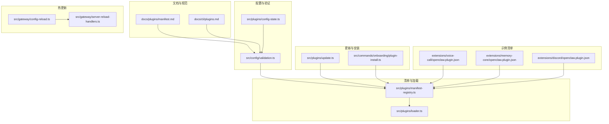
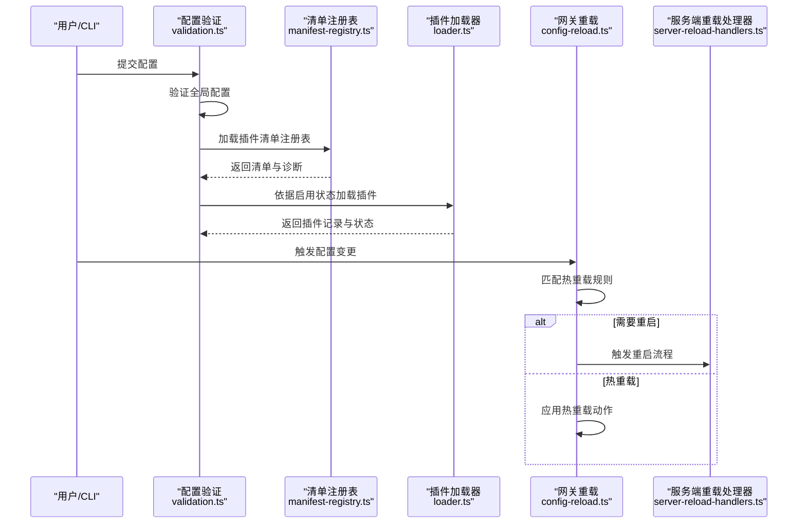
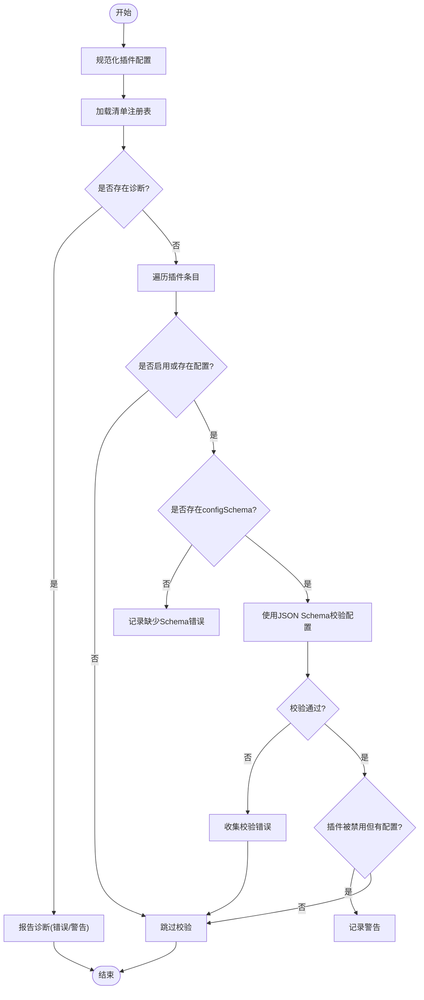
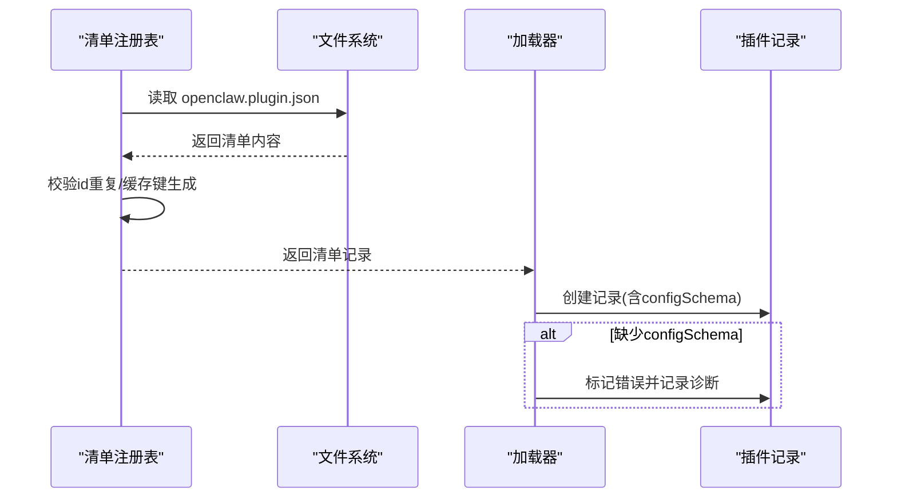
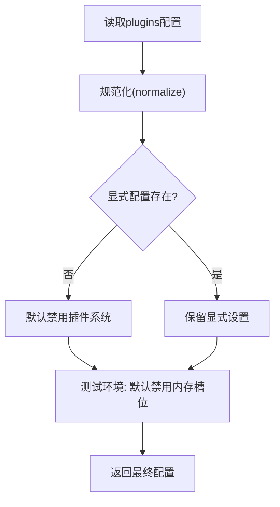
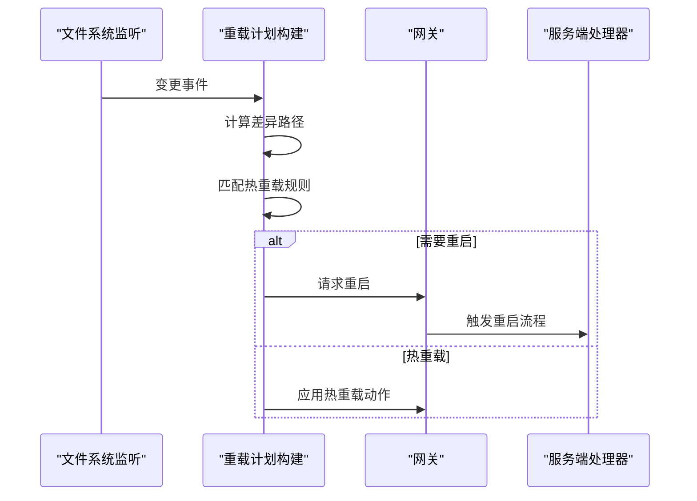
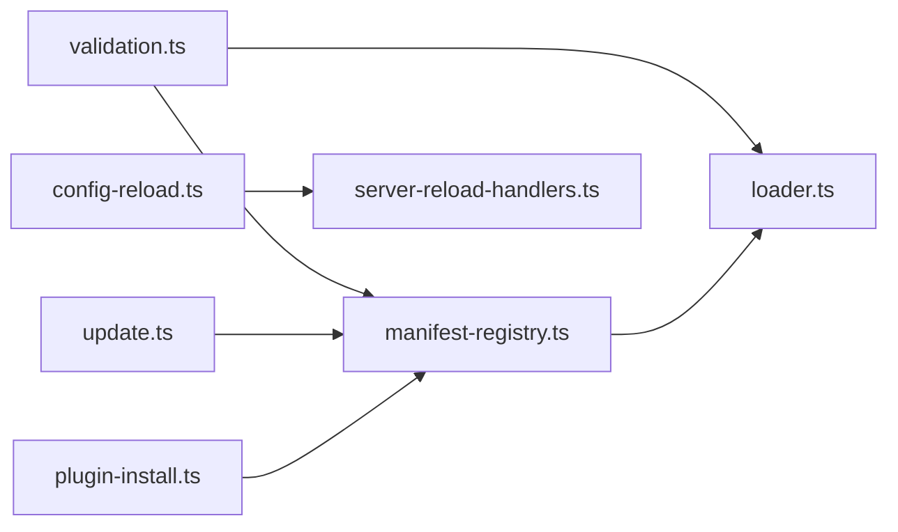

# 插件清单与配置

## 目录
1. [简介](#简介)
2. [项目结构](#项目结构)
3. [核心组件](#核心组件)
4. [架构总览](#架构总览)
5. [详细组件分析](#详细组件分析)
6. [依赖关系分析](#依赖关系分析)
7. [性能考量](#性能考量)
8. [故障排查指南](#故障排查指南)
9. [结论](#结论)
10. [附录](#附录)

## 简介
本文件面向 OpenClaw 插件作者与维护者，系统性阐述“插件清单与配置”体系：清单文件格式、元数据字段、JSON Schema 验证、插件配置模式与默认值、版本与依赖、热更新与持久化、以及最佳实践与常见问题。内容基于仓库中的清单规范文档与核心实现代码，帮助你编写合规、可维护且可热更新的插件。

## 项目结构
围绕插件清单与配置的关键目录与文件：
- 文档规范：docs/plugins/manifest.md、docs/cli/plugins.md
- 核心验证与加载：src/config/validation.ts、src/plugins/loader.ts、src/plugins/manifest-registry.ts
- 配置规范化与默认值：src/plugins/config-state.ts
- 热更新与重载：src/gateway/config-reload.ts、src/gateway/server-reload-handlers.ts
- 插件更新与安装：src/plugins/update.ts、src/commands/onboarding/plugin-install.ts
- 示例清单：extensions/*/openclaw.plugin.json

## 核心组件
- 插件清单（`openclaw.plugin.json`）
  - 必填字段：`id`、`configSchema`
  - 可选字段：`kind`、`channels`、`providers`、`skills`、`name`、`description`、`uiHints`、`version`
  - 清单用于“发现 + 配置验证”，不执行插件代码
- 配置验证管线
  - 先验证全局配置，再验证插件条目与清单
  - 对未知插件 `id`、未知通道键、缺失/损坏清单/Schema 均报错
- 清单注册表
  - 扫描候选插件根目录，解析 `openclaw.plugin.json`
  - 支持缓存与重复 `id` 警告
- 加载器
  - 构建插件记录，按启用状态决定加载或标记错误
  - 将清单中的 `configSchema` 注入到运行时记录
- 配置状态与默认值
  - 规范化 `plugins.*` 结构，计算启用状态与内存槽位
  - 测试环境下的默认内存槽位处理
- 热更新与重载
  - 基于变更路径匹配热重载规则，分“重启”“热重载”两类
  - 通道插件可声明 `configPrefixes`/`noopPrefixes`
- 更新与安装
  - 支持 npm 安装/更新、本地链接、更新通道切换
  - 安装时合并 `load.paths`，避免重复

## 架构总览
下图展示了从配置读取到插件加载与热更新的整体流程。

## 详细组件分析

### 组件A：插件清单与 JSON Schema 验证
- 清单字段与约束
  - `id`：插件唯一标识，必须存在于已发现清单中
  - `configSchema`：必填 JSON Schema，用于配置校验
  - 可选：`kind`、`channels`、`providers`、`skills`、`name`、`description`、`uiHints`、`version`
- 验证行为
  - 未知 `channels.*` 键为错误
  - `plugins.entries.`、`plugins.allow`、`plugins.deny`、`plugins.slots.*` 必须引用“可发现”的插件 `id`
  - 缺失/损坏清单或 Schema 会导致验证失败
  - 插件被禁用但仍有配置时，记录警告
- 配置校验流程
  - 读取并规范化 `plugins` 配置
  - 构建清单注册表
  - 对每个启用或存在配置的插件条目，使用其 `configSchema` 校验
  - 若校验失败，收集错误；若 Schema 缺失，收集错误

### 组件B：清单注册表与加载器
- 清单注册表
  - 扫描候选插件根目录，解析 `openclaw.plugin.json`
  - 记录插件 `id`、名称、描述、版本、类型、通道/提供商/技能、Schema 与 UI 提示
  - 支持缓存与重复 `id` 警告
- 加载器
  - 基于启用状态创建插件记录
  - 若缺少 `configSchema`，标记错误并记录诊断
  - 将清单中的 `configSchema` 注入运行时记录

### 组件C：配置模式、默认值与用户配置管理
- 配置模式
  - `plugins.entries.`: { `enabled`?, `config`? }
  - `plugins.allow`/`deny`: 白名单/黑名单
  - `plugins.load.paths`: 额外加载路径
  - `plugins.slots.memory`: 内存插件槽位选择
- 默认值与测试环境
  - 未显式配置时，默认禁用插件系统
  - 测试环境自动禁用内存槽位，除非显式指定
- 用户配置管理
  - 安装插件时合并 `load.paths`，避免重复
  - CLI 支持安装、启用/禁用、更新等操作

### 组件D：热更新、状态同步与持久化
- 热更新规则
  - 基于变更路径匹配规则，支持“热重载”“无操作”“重启”
  - 通道插件可通过 `reload.configPrefixes`/`noopPrefixes` 声明
- 状态同步
  - 重载计划构建后，根据模式执行重启或热重载
  - 服务端处理器负责心跳、钩子、通道等子系统的更新
- 持久化
  - 配置变更由监听器触发，先快照对比差异，再应用策略
  - 无效配置将被跳过并记录原因

### 组件E：插件版本兼容性、依赖与冲突
- 版本与兼容
  - 清单包含 `version` 字段（信息性），用于识别与更新
  - 更新流程支持检查/更新 npm 插件版本
- 依赖与冲突
  - 清单可声明 `channels`/`providers`/`skills`，用于发现与路由
  - 未知插件 `id` 或未知通道键为错误
  - 重复 `id` 产生警告，后者可能被覆盖

## 依赖关系分析
- 配置验证依赖清单注册表与 JSON Schema 校验器
- 加载器依赖清单注册表与启用状态解析
- 热更新依赖通道插件声明的前缀规则
- 更新与安装依赖 npm 解析与路径合并

## 性能考量
- 清单缓存
  - 通过环境变量控制缓存 TTL，默认毫秒级缓存，避免频繁扫描
- 加载缓存
  - 插件加载结果按工作区与配置构建缓存键，命中则直接复用
- 热重载去抖
  - 配置重载监听使用去抖与写入完成检测，减少频繁重启

## 故障排查指南
- 常见错误
  - 缺失 `openclaw.plugin.json` 或 JSON Schema 不合法：验证失败
  - 未知插件 `id` 或未知通道键：验证失败
  - 插件被禁用但仍存在配置：记录警告
- 排查步骤
  - 使用 CLI `doctor` 命令查看插件诊断
  - 检查清单字段完整性与 Schema 合法性
  - 确认 `plugins.entries.` 引用的 `id` 存在于清单中
  - 若使用本地开发，确认通过 `--link` 添加到 `plugins.load.paths` 并避免重复

## 结论
OpenClaw 的插件系统以“清单优先”的设计为核心：通过 `openclaw.plugin.json` 提供严格的 JSON Schema 验证与发现能力，结合配置规范化、启用状态解析与热重载机制，实现了安全、可控且可演进的插件生态。遵循本文档的清单字段与验证规则，配合合理的默认值与热更新策略，可显著提升插件质量与运维效率。

## 附录

### A. 清单字段定义与示例
- 字段概览
  - `id`、`configSchema`（必填）
  - `kind`、`channels`、`providers`、`skills`、`name`、`description`、`uiHints`、`version`（可选）
- 示例清单
  - 语音通话插件：包含大量嵌套配置与 `uiHints`
  - 内存核心插件：最小化清单
  - Discord 插件：声明通道 `id`

### B. 配置示例与字段约束
- 常见配置模式
  - 禁用插件系统：`plugins.enabled=false`
  - 白名单/黑名单：`plugins.allow`/`plugins.deny`
  - 自定义加载路径：`plugins.load.paths`
  - 插件条目：`plugins.entries.`={ `enabled`?, `config`? }
- 约束与规则
  - 未知 `id`/通道键为错误
  - 缺失/损坏清单/Schema 为错误
  - 禁用但有配置为警告

### C. 最佳实践
- 清单编写
  - 始终提供 JSON Schema，即使为空对象
  - 使用 `uiHints` 提升配置体验
  - 明确声明 `channels`/`providers`/`skills`
- 配置管理
  - 使用 `allow`/`deny` 控制插件集合
  - 通过 `slots.memory` 精准绑定内存插件
  - 本地开发使用 `--link` 并合并 `load.paths`
- 热更新
  - 通道插件声明 `reload.configPrefixes`/`noopPrefixes`
  - 遵循“先校验，后应用”的变更流程