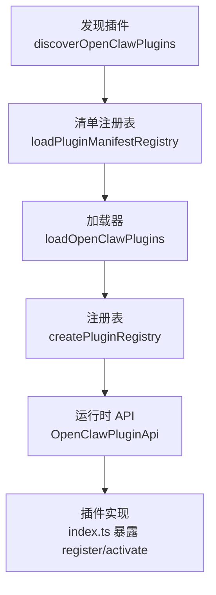
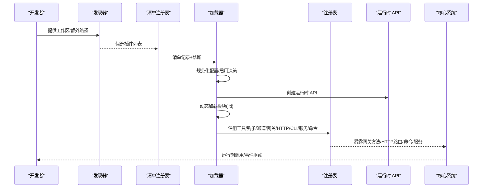
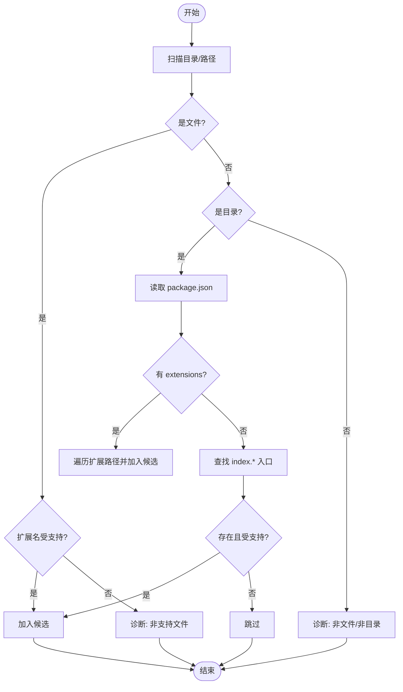
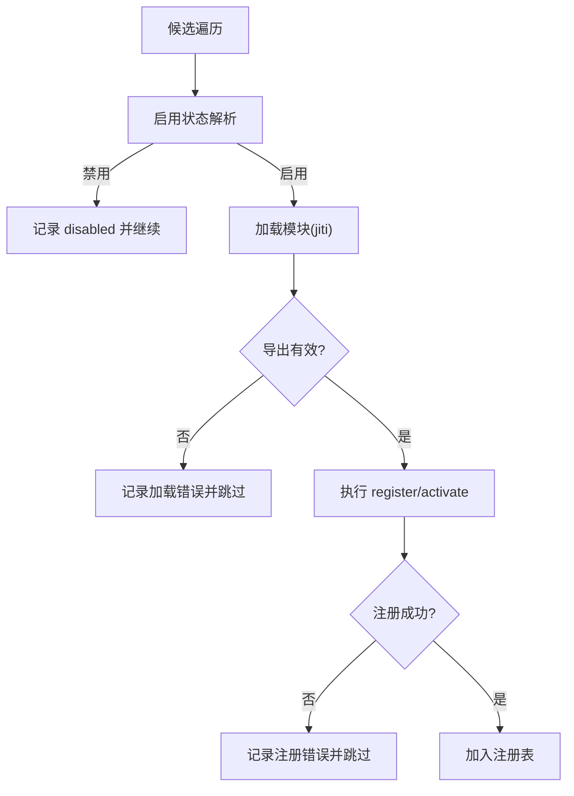
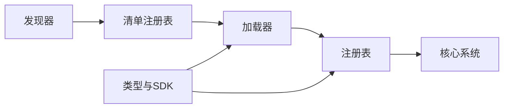

# 插件系统架构

## 目录
1. [引言](#引言)
2. [项目结构](#项目结构)
3. [核心组件](#核心组件)
4. [架构总览](#架构总览)
5. [详细组件分析](#详细组件分析)
6. [依赖关系分析](#依赖关系分析)
7. [性能考量](#性能考量)
8. [故障排查指南](#故障排查指南)
9. [结论](#结论)
10. [附录](#附录)

## 引言
本文件面向插件开发者与维护者，系统化阐述 OpenClaw 插件系统的架构设计与实现细节，覆盖插件注册机制、动态加载策略、生命周期管理、清单格式与依赖解析、版本兼容性检查、与核心系统的交互接口、事件通信与资源共享、安全模型与权限控制，并提供可操作的开发示例与最佳实践。

## 项目结构
OpenClaw 的插件系统由“发现—清单—加载—注册—运行时”五条主线构成：
- 发现阶段：扫描工作区、全局与打包内置的扩展目录，收集候选插件入口。
- 清单阶段：读取并校验 `openclaw.plugin.json`，构建清单缓存，进行重复 ID 与字段一致性诊断。
- 加载阶段：基于配置决定启用状态，使用 jiti 动态加载模块，校验导出与注册函数，执行注册回调。
- 注册阶段：将工具、钩子、通道、网关方法、HTTP 路由、CLI 命令、服务等注册到统一注册表。
- 运行时阶段：提供插件 SDK 接口，承载日志、状态目录、通道能力等运行时能力。

## 核心组件
- 插件发现器：扫描多源路径，识别入口文件与包元数据，生成候选集合。
- 清单注册表：读取 `openclaw.plugin.json`，构建记录并缓存，进行重复 ID 与字段校验。
- 加载器：合并配置与清单，动态加载模块，执行注册回调，产出最终注册表。
- 注册表：集中管理工具、钩子、通道、网关方法、HTTP 路由、CLI、服务、命令等。
- 类型与 SDK：定义插件 API、钩子、工具、通道、提供方等类型，提供运行时能力封装。
- 配置状态：规范化配置，解析启用/禁用、白名单/黑名单、槽位选择（如 memory）。

## 架构总览
下图展示了从发现到注册的端到端流程，以及与核心系统的集成点（网关方法、HTTP 路由、命令系统）。

## 详细组件分析

### 组件一：插件发现（Discovery）
职责
- 扫描工作区、全局、打包内置三类位置，收集候选入口。
- 支持 `package.json` 中的 `extensions` 字段声明多个扩展路径。
- 识别 `index.ts/js` 等标准入口，派生 `idHint`，避免重复。

关键点
- 文件后缀过滤与 `.d.ts` 排除。
- 目录递归扫描与错误诊断（不可读、非支持扩展名等）。
- 来源标注（bundled/global/workspace/config），用于后续启用策略。

### 组件二：清单注册表（Manifest Registry）
职责
- 读取 `openclaw.plugin.json`，构建清单记录，缓存 TTL 可配置。
- 校验 `id` 与 `manifest` 的一致性，检测重复 `id` 并发出警告。
- 生成 `schemaCacheKey`，结合清单文件 `mtime` 实现增量缓存。

关键点
- 缓存键由工作区路径与序列化后的配置组成。
- schema 校验在配置读写阶段进行，不依赖运行时执行。
- `uiHints` 与 `configSchema` 透传至注册表，供 UI 与校验使用。

### 组件三：加载器（Loader）
职责
- 合并配置与清单，决定每个插件的启用状态与内存槽位策略。
- 使用 jiti 动态加载模块，解析默认导出或具名导出，执行注册回调。
- 对注册过程中的异常进行捕获与诊断，支持“仅验证模式”。

关键点
- 启用状态解析：全局开关、deny/allow、槽位、显式 `entries` 控制。
- 内存插件槽位：支持“none”禁用、指定 ID 或自动选择首个匹配。
- 配置校验：基于 JSON Schema，失败时记录错误并标记为 `error` 状态。
- 注册回调：同步返回 Promise 将被忽略并记录告警；异步注册不改变加载结果。

### 组件四：注册表（Registry）
职责
- 统一登记各类插件能力：工具、钩子、通道、网关方法、HTTP 路由、CLI、服务、命令。
- 校验冲突（如网关方法、HTTP 路由重复），记录诊断信息。
- 为每个插件生成记录，包含状态、来源、配置 schema、UI 提示等。

关键点
- 工具注册支持必选/可选，名称去重与冲突检测。
- 钩子注册支持事件列表与描述，可选择是否同时注册到内部钩子系统。
- 通道注册要求提供唯一 `id`，支持 Dock 扩展。
- 网关方法与 HTTP 路由注册均做幂等检查。
- CLI 注册支持命令集，便于统一管理。

### 组件五：类型与运行时 SDK
职责
- 定义插件 API、钩子事件、工具工厂、通道适配器、提供方认证等类型。
- 提供运行时能力封装（日志、状态目录、通道能力等），作为插件注入面。
- 暴露空配置 Schema 辅助工具，简化无参数插件的配置声明。

关键点
- `OpenClawPluginApi`：`registerTool`/`registerHook`/`registerChannel`/`registerGatewayMethod`/`registerHttpRoute`/`registerCli`/`registerService`/`registerCommand`/`on` 等。
- `PluginRuntime`：抽象通道文本处理、回复分发、路由、配对、媒体、提及、群组策略、防抖、命令授权等。
- 钩子体系：覆盖代理生命周期、消息流、工具调用、会话、网关启停等。

### 组件六：配置状态与启用策略
职责
- 规范化 `plugins.*` 配置，计算启用/禁用、白名单/黑名单、槽位策略。
- 测试环境默认禁用内存槽位，避免测试干扰。

关键点
- 槽位策略：`memory=null` 禁用；`memory=`插件 id 则仅允许该插件；未设置则自动选择首个匹配。
- 显式 `entries.enabled` 优先级高于默认策略。
- bundled 插件默认按需启用，可通过 `allow` 列表放行。

## 依赖关系分析
- 发现器依赖文件系统与包元数据解析，输出候选集合。
- 清单注册表依赖发现器输出与清单文件读取，输出清单记录。
- 加载器依赖清单注册表与配置状态，动态加载模块并注册能力。
- 注册表依赖运行时 API 与核心系统（网关、HTTP、命令），统一暴露能力。
- 类型与 SDK 为上述各层提供契约与运行时封装。

## 性能考量
- 清单缓存：基于文件 `mtime` 的 `schemaCacheKey` 与可配置 TTL，减少重复解析开销。
- 注册表缓存：加载器支持按工作区与配置构建缓存键，命中则直接复用。
- 动态加载：使用 jiti 支持多种扩展名与别名映射，减少编译链路。
- 启用决策：在加载前完成，避免无效模块加载与注册成本。
- 诊断聚合：将错误与警告统一收集，便于一次性定位问题。

## 故障排查指南
常见问题与定位思路
- 插件未加载
  - 检查 `openclaw.plugin.json` 是否存在且包含必需字段（`id`、`configSchema`）。
  - 确认插件入口扩展名受支持，且不在 `deny` 列表中。
  - 查看诊断输出，确认是否存在“路径不存在/非支持文件”等错误。
- 配置校验失败
  - 检查 `configSchema` 是否符合 JSON Schema 规范。
  - 若插件已禁用但仍保留配置，将产生警告；可在 Doctor 中查看。
- 注册失败
  - 确认导出包含 `register` 或 `activate` 函数。
  - 捕获的异常会被记录为错误状态与诊断消息。
- 冲突与重复
  - 网关方法或 HTTP 路由重复将报错；工具/命令名称冲突将被跳过。
  - 重复插件 `id` 会触发警告，后者可能被前者覆盖。
- 内存插件槽位
  - `memory=null` 表示禁用；`memory=`某插件 id 仅允许该插件；否则自动选择首个匹配。
  - 若槽位未命中或未标记为 `memory`，将产生告警。

## 结论
OpenClaw 插件系统通过“发现—清单—加载—注册—运行时”的清晰分层，实现了强约束的清单校验、灵活的启用策略与完善的资源注册。其类型与 SDK 为插件提供了统一的运行时能力抽象，配合严格的配置校验与诊断机制，既保障了安全性与稳定性，也为开发者提供了良好的扩展体验。

## 附录

### 插件清单格式与校验
- 必填字段：`id`、`configSchema`。
- 可选字段：`kind`、`channels`、`providers`、`skills`、`name`、`description`、`uiHints`、`version`。
- 校验规则：未知 `channels.*` 键为错误；`plugins.entries`/`plugins.allow`/`plugins.deny`/`plugins.slots.*` 必须引用可发现的插件 `id`；缺失或损坏的清单导致验证失败；禁用插件保留配置并告警。

### 插件开发示例

示例一：Discord 通道插件
- 清单：`openclaw.plugin.json` 包含 `id`、`channels`、`configSchema`。
- 入口：`index.ts` 导出插件对象，`register` 中设置运行时并注册通道。
- 运行时：通过 `api.runtime` 访问通道能力（文本、回复、路由、配对、媒体、提及、群组策略、防抖、命令授权等）。

示例二：Memory 核心插件
- 清单：`openclaw.plugin.json` 标记 `kind` 为 `memory`。
- 入口：`index.ts` 在 `register` 中注册内存搜索与获取工具，并注册 CLI 子命令。
- 运行时：通过 `api.runtime.tools` 创建工具与 CLI 注册。

示例三：Signal 运行时注入
- 通过 `setSignalRuntime` 注入运行时，`getSignalRuntime` 获取并校验初始化状态。
- 适用于需要跨模块共享运行时的场景。

### 插件开发指南与最佳实践
- 清单优先：始终提供 `openclaw.plugin.json`，包含严格 JSON Schema。
- 工具设计：必要时使用 `optional` 工具并通过 `allowlist` 控制启用。
- 钩子与事件：遵循类型定义，合理设置优先级与事件列表。
- 通道适配：确保通道 `id` 唯一，提供必要的适配器与 Dock 扩展。
- 网关与 HTTP：避免与核心方法与路由冲突，做好路径规范化。
- CLI：提供清晰的命令集，便于统一管理与测试。
- 安全与权限：遵循最小权限原则，避免越权访问核心资源。