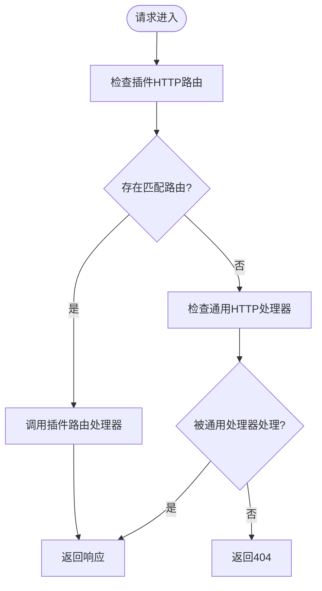

# 插件通信机制

## 目录
1. [引言](#引言)
2. [项目结构](#项目结构)
3. [核心组件](#核心组件)
4. [架构总览](#架构总览)
5. [详细组件分析](#详细组件分析)
6. [依赖关系分析](#依赖关系分析)
7. [性能考量](#性能考量)
8. [故障排查指南](#故障排查指南)
9. [结论](#结论)
10. [附录](#附录)

## 引言
本文件系统化梳理 OpenClaw 的插件通信机制，覆盖插件间通信协议、消息路由与事件分发、HTTP 服务注册与 RESTful 路由、RPC 调用与异步通信、插件与核心系统的双向通信与状态同步、数据共享与一致性保障，并提供可操作的性能优化与故障恢复策略。目标读者包括希望扩展或集成 OpenClaw 的开发者与平台工程师。

## 项目结构
OpenClaw 将“插件”作为可装载的扩展单元，通过统一的插件 SDK 暴露注册接口；核心网关负责承载 RPC 协议、事件广播与节点订阅；通道插件（如 Discord、Slack、iMessage）通过 SDK 注册为渠道适配器；浏览器端与移动端通过 WebSocket/IPC 与网关交互。


## 核心组件
- 插件 SDK：统一暴露注册 API（工具、钩子、HTTP、通道、网关方法、CLI、服务、命令等），并提供运行时、日志、路径解析等能力。
- 插件注册表：集中管理插件记录、工具、钩子、通道、提供者、网关处理器、HTTP路由与处理器、CLI、服务、命令与诊断信息。
- 网关方法与事件：定义核心 RPC 方法清单与事件集合，节点相关方法支持配对、列表、调用、结果回传与事件广播。
- 节点订阅管理：维护节点到会话的订阅映射，支持按会话或全部订阅节点广播事件。
- HTTP 路由：插件可注册全局 HTTP 路由或特定路径路由，网关按优先级匹配并执行。
- 客户端适配：浏览器路由分发器、Android/iOS 会话处理、iMessage 子进程 RPC 客户端。

## 架构总览
OpenClaw 采用“插件即服务”的架构：插件通过 SDK 注册能力；网关统一编排 RPC、事件与 HTTP；通道插件桥接外部平台；客户端通过 WebSocket/IPC 与网关交互。节点（移动/桌面设备）以“节点”身份接入，支持配对、命令调用与事件订阅。


## 详细组件分析

### 插件注册与生命周期
- 插件通过 SDK 提供的 API 注册各类能力：工具、钩子、HTTP 处理器/路由、通道、网关方法、CLI、服务、命令。
- 注册表负责去重、冲突检测与诊断收集；支持按插件维度统计工具数、钩子数、HTTP 路由数等。
- 生命周期钩子允许插件在网关启动/停止、会话开始/结束、消息收发、工具调用前后等时机介入。


### HTTP 服务注册与 RESTful 路由
- 插件可通过注册函数声明 HTTP 路由（含路径归一化），网关在收到请求后优先匹配插件路由，再回退到通用 HTTP 处理器。
- 路由注册具备幂等性与冲突检测，重复路径会记录诊断信息。
- 浏览器端也提供路由分发器，支持 GET/POST/DELETE 并进行路径正则匹配。



### 网关 RPC 与事件分发
- 网关方法清单包含基础方法与各通道插件扩展的方法，事件集合涵盖连接挑战、心跳、节点配对/调用、语音唤醒变更等。
- 节点相关 RPC 支持配对请求/列表/批准/拒绝/验证、重命名、列举、描述、调用与结果回传；调用前进行命令白名单校验。
- 事件分发通过订阅管理器按会话或全部订阅节点广播，支持丢弃过慢事件以保证实时性。


### 通道插件与客户端适配
- 通道插件（Discord、Slack、iMessage）通过入口文件注册自身并设置运行时，随后在网关中以通道形式参与消息编排与事件处理。
- Android/iOS 客户端负责解析帧、处理连接挑战、接收/派发事件、执行节点调用并回传结果。
- iMessage 子进程 RPC 客户端负责超时管理、响应解析与挂起队列清理。

```mermaid
sequenceDiagram
participant AND as "Android/iOS 客户端"
participant GW as "网关"
participant IM as "iMessage子进程"
participant PL as "iMessage插件"
AND->>GW : "`connect.challenge` 请求"
GW-->>AND : "返回`nonce`"
AND->>GW : "`node.invoke.request` {`id`,`nodeId`,`command`,`params`}"
GW->>PL : "触发插件处理"
PL->>IM : "IPC调用"
IM-->>PL : "执行结果"
PL-->>GW : "`node.invoke.result`"
GW-->>AND : "`node.invoke.result`"
```

## 依赖关系分析
- 插件 SDK 依赖插件类型与运行时定义，向插件暴露统一 API。
- 插件注册表依赖插件类型、钩子系统与命令系统，聚合所有注册项。
- 网关方法依赖协议校验与上下文类型，节点 RPC 依赖节点注册表与订阅管理。
- HTTP 路由依赖路径归一化与网关请求处理器，浏览器路由分发器独立于网关但遵循相同路由语义。


## 性能考量
- 事件广播优化：使用“丢弃过慢”策略避免阻塞；订阅管理按会话批量发送，减少重复序列化。
- 路由匹配优先级：插件路由优先于通用处理器，降低通用层开销。
- 节点调用白名单：在网关侧快速拒绝非法命令，减少无效 IPC/子进程调用。
- 超时与去抖：客户端侧为 RPC 设置超时并清理挂起队列，避免资源泄漏。
- 路径归一化：统一路径格式，减少匹配失败与重复注册带来的额外检查。

[本节为通用指导，无需列出具体文件来源]

## 故障排查指南
- HTTP 路由冲突：若出现“路由已注册”或“路径缺失”，检查插件是否重复注册相同路径或未提供有效路径。
- RPC 参数校验失败：依据协议校验器输出定位字段与错误位置，修正请求参数结构。
- 节点未连接：当节点调用返回“未连接”，确认节点已通过配对流程并保持连接。
- 事件未送达：检查订阅关系与会话键，确保节点已订阅对应会话。
- 客户端超时：检查网络延迟与命令执行耗时，适当提高超时阈值或拆分任务。

## 结论
OpenClaw 的插件通信机制以“协议+路由+事件+订阅”为核心，结合 SDK 的统一注册与网关的集中编排，实现了跨平台、多通道、可扩展的插件生态。通过严格的参数校验、白名单控制与事件广播策略，系统在保证安全性的同时兼顾了性能与可观测性。建议在扩展新插件时严格遵循注册流程与路径规范，并充分利用订阅与钩子机制实现高效的状态同步与事件驱动。

## 附录
- 插件入口示例：Discord、Slack、iMessage 插件均通过入口文件注册并设置运行时，随后在网关中以通道形式参与。
- 客户端示例：Android/iOS 会话处理与 iMessage 子进程 RPC 客户端展示了帧解析、事件派发与调用回传的完整链路。