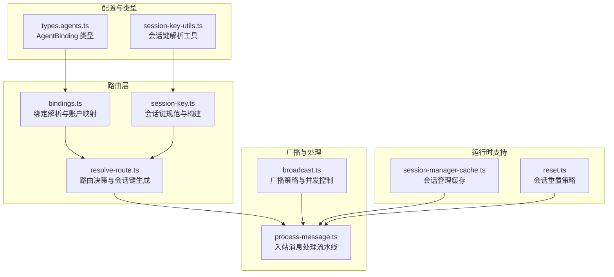
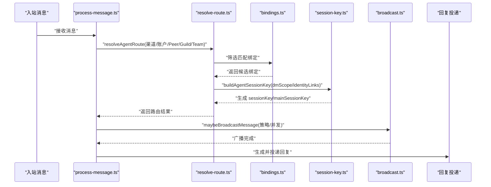
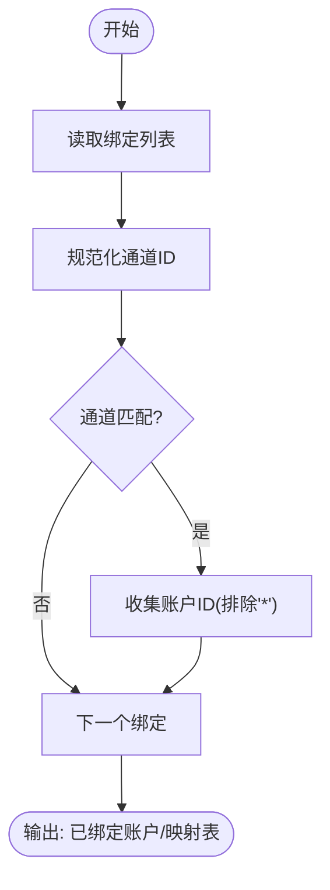
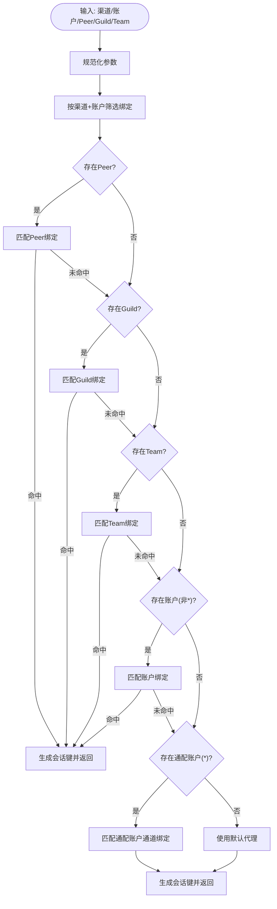
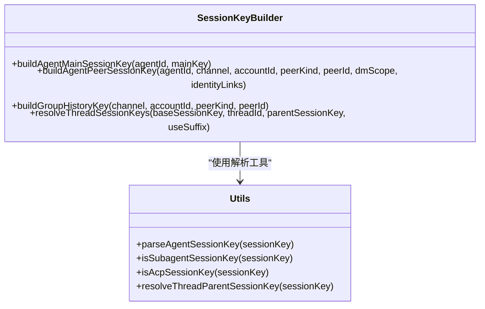
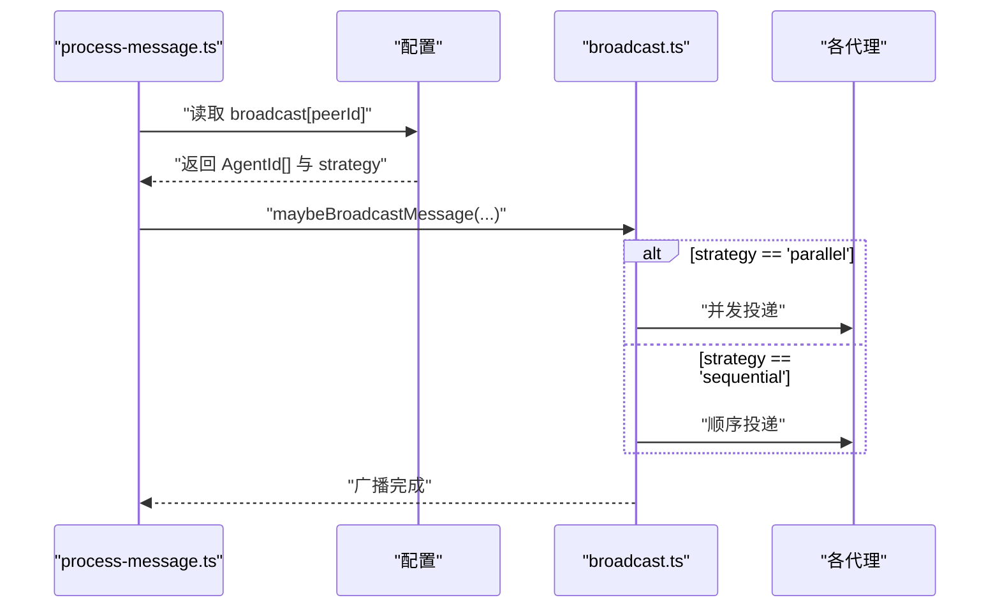
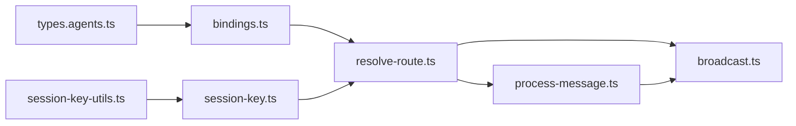

# 消息路由机制

## 目录
1. [引言](#引言)
2. [项目结构](#项目结构)
3. [核心组件](#核心组件)
4. [架构总览](#架构总览)
5. [详细组件分析](#详细组件分析)
6. [依赖关系分析](#依赖关系分析)
7. [性能考量](#性能考量)
8. [故障排查指南](#故障排查指南)
9. [结论](#结论)
10. [附录：配置与调试指南](#附录配置与调试指南)

## 引言
本文件系统性阐述 OpenClaw 的消息路由机制，覆盖消息分发策略、目标选择与路径计算算法；详解会话键解析、绑定规则与路由决策；说明广播、点对点与组播处理；并给出路由缓存、负载均衡与故障转移策略建议。文档同时提供可操作的配置指南与调试技巧，帮助读者在实际部署中快速落地与排障。

## 项目结构
OpenClaw 的消息路由由“绑定规则 + 路由决策 + 会话键生成”三部分组成，并与广播处理、会话管理、缓存与重置策略协同工作。关键文件分布如下：
- 路由核心：src/routing/*.ts（绑定、路由、会话键）
- 配置类型：src/config/types.agents.ts（AgentBinding 定义）
- 会话工具：src/sessions/session-key-utils.ts（会话键解析）
- 广播处理：src/web/auto-reply/monitor/broadcast.ts（广播入口与策略）
- 端到端测试：src/routing/resolve-route.test.ts（路由行为验证）
- CLI 广播命令：src/cli/program/message/register.broadcast.ts（广播命令注册）

## 核心组件
- 绑定规则（`bindings.ts`）：从配置中提取并规范化绑定项，按通道/账户/群组等维度建立匹配集合，支持默认账户与通配账户的回退。
- 路由决策（`resolve-route.ts`）：根据输入上下文（渠道、账户、DM/群组/频道、公会/团队、线程父 Peer）进行优先级匹配，生成 agentId、channel、accountId、sessionKey、mainSessionKey 及命中来源。
- 会话键（`session-key.ts`）：统一规范 agentId、mainKey、dmScope、identityLinks 等，生成稳定的会话键；支持线程键派生与主键解析。
- 广播处理（`broadcast.ts`）：基于配置中的广播映射与策略，将同一入站消息并发或串行投递给多个代理，保持组历史一致性。
- 会话工具（`session-key-utils.ts`）：解析 `agent:` 前缀会话键、识别子代理与 ACP 键、解析线程父键。
- 测试用例（`resolve-route.test.ts`）：覆盖 DM 隔离策略、身份链接合并、线程父继承、默认代理回退等关键场景。

## 架构总览
下图展示了从入站消息到路由决策、会话键生成、广播处理与消息回复的整体流程。

## 详细组件分析

### 组件A：绑定规则与账户映射（`bindings.ts`）
- 功能要点
  - 列出配置中的绑定列表，过滤非法条目。
  - 规范化通道 ID，支持回退到小写/去空白。
  - 提供“已绑定账户列表”“默认代理绑定账户”“通道-代理-账户映射表”的查询能力。
  - 支持“任意账户”通配符匹配作为通道级回退。
- 关键算法
  - 绑定筛选：按通道与账户精确匹配，账户为空或“*”时跳过。
  - 映射构建：以 `channelId -> agentId -> accountId` 列表建立多级索引。
  - 优选账户：若存在绑定账户，优先使用第一个；否则回退默认账户。
- 复杂度
  - 绑定遍历 O(B)，映射查询近似 O(1)；整体线性于绑定数量。

### 组件B：路由决策与路径计算（`resolve-route.ts`）
- 决策优先级
  - 直接 Peer 匹配（DM/群组/频道）优先。
  - 线程父 Peer 继承：当直接 Peer 不匹配时，尝试父 Peer 绑定。
  - 公会/团队匹配次之。
  - 账户级匹配（非通配）。
  - 通配账户（*）通道级回退。
  - 默认代理回退。
- 会话键生成
  - 支持多种 DM 隔离策略：main、per-peer、per-channel-peer、per-account-channel-peer。
  - 支持 identityLinks 将不同平台的同一个人合并到一个 canonical ID 下。
- 返回值
  - agentId、channel、accountId、sessionKey、mainSessionKey、matchedBy（用于日志/调试）。

### 组件C：会话键解析与构建（`session-key.ts`）
- 规范化与安全
  - agentId/accountId/mainKey 使用正则校验与清洗，确保路径与 shell 友好。
- 会话键格式
  - 主键：`agent:{agentId}:{mainKey}`
  - DM 键：`agent:{agentId}:[{channel}:][{accountId}:]dm:{peerId}`
  - 群组/频道键：`agent:{agentId}:{channel}:{kind}:{peerId}`
- 线程键
  - 在基础键后追加 `:thread:{threadId}`，或可选不追加后缀。
- 身份链接
  - identityLinks 将跨平台 ID 合并为 canonical ID，影响 DM 隔离粒度。

### 组件D：广播消息处理（`broadcast.ts`）
- 配置与策略
  - `broadcast[peerId] -> AgentId[]` 映射；strategy 支持 parallel/sequential。
  - 仅当 peerId 存在且映射为数组时触发广播。
- 并发模型
  - parallel：Promise.allSettled 并行执行，避免单点失败阻塞。
  - sequential：逐个执行，适合资源受限或强一致场景。
- 组历史一致性
  - 广播完成后清空组历史，保证后续消息不会重复叠加历史。

### 组件E：入站消息处理流水线（`process-message.ts`）
- 关键步骤
  - 解析会话存储路径，读取上次更新时间，构建入站信封与组合正文。
  - 组消息聚合：将组历史拼接到当前消息，形成上下文。
  - 抖动抑制：通过组合正文的去重键避免重复回复。
  - ACK 反应：在门禁通过后立即发送 ACK。
  - 广播：调用广播模块按策略投递至多个代理。
- 与路由的关系
  - 使用 resolveAgentRoute 的结果作为路由上下文，贯穿整个处理链路。

## 依赖关系分析
- 绑定规则依赖配置类型（AgentBinding）与会话键规范化函数。
- 路由决策依赖绑定规则、会话键构建器与默认代理解析。
- 广播处理依赖路由结果与会话键构建器，同时受配置策略影响。
- 会话工具为会话键解析与线程父键解析提供底层支持。

## 性能考量
- 路由决策复杂度
  - 绑定筛选与匹配为线性扫描，典型绑定数较少时开销可忽略。
  - 建议：将高频匹配项前置，减少不必要的遍历。
- 会话键构建
  - 字符串拼接与正则清洗成本低；identityLinks 查找需注意映射规模。
- 广播并发
  - parallel 模式提升吞吐但增加资源占用；sequential 更稳定但延迟更高。
  - 建议：根据下游代理能力与资源限制选择策略；必要时引入批处理或限流。
- 缓存与预热
  - 会话管理缓存可降低频繁加载开销；合理设置 TTL。
  - 会话重置策略避免长时间占用资源；结合 idle 或定时重置。
- 线程与历史
  - 组历史聚合可能带来额外内存压力；广播后及时清空可缓解峰值。

## 故障排查指南
- 路由未命中绑定
  - 检查通道/账户是否大小写/空白问题；确认是否存在“*”通配回退。
  - 使用 matchedBy 字段定位命中分支，参考测试用例断言。
- DM 隔离异常
  - 核对 dmScope 设置与 identityLinks；验证 peerId 是否被正确归一化。
- 广播无效
  - 确认 `broadcast[peerId]` 是否为数组；strategy 是否合法。
  - 检查代理列表是否存在于 `agents.list` 中。
- 会话键解析失败
  - 确保会话键以 `agent:` 开头；检查子代理/ACP 前缀是否正确。
- 日志与可观测性
  - 使用 process-message 中的日志记录与 verbose 输出辅助定位。
  - 对广播失败项单独记录错误信息，便于追踪。

## 结论
OpenClaw 的消息路由以“绑定规则 + 路由决策 + 会话键”为核心，具备清晰的优先级与可扩展的隔离策略。广播模块提供了灵活的并发控制与组历史一致性保障。通过合理的配置与缓存/重置策略，可在保证稳定性的同时获得良好的吞吐表现。

## 附录：配置与调试指南

### 配置要点
- 绑定规则（AgentBinding）
  - 字段：agentId、match.channel、match.accountId、match.peer(kind/id)、match.guildId、match.teamId。
  - accountId 为空表示仅匹配默认账户；accountId="*" 表示通道级通配回退。
- DM 隔离策略（session.dmScope）
  - main：共享主会话键
  - per-peer：按发送者隔离
  - per-channel-peer：按渠道+发送者隔离
  - per-account-channel-peer：按账户+渠道+发送者隔离
- 身份链接（session.identityLinks）
  - 将跨平台 ID 映射到同一 canonical ID，实现跨渠道会话合并。
- 广播策略（broadcast）
  - `broadcast[peerId] -> AgentId[]`；strategy ∈ {"parallel","sequential"}。
  - CLI 命令：`broadcast --targets <target...> [--message|--media]`。

### 调试技巧
- 使用 `resolve-route.test.ts` 中的断言样例对照预期行为。
- 在 process-message 中开启 verbose 输出，观察组合正文与历史聚合。
- 广播失败项单独记录错误，便于定位具体代理与消息上下文。
- 对高并发场景，先用 sequential 验证正确性，再切换 parallel 并逐步扩大并发度。