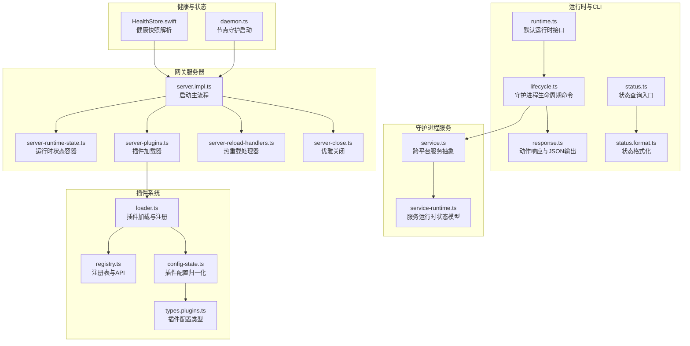
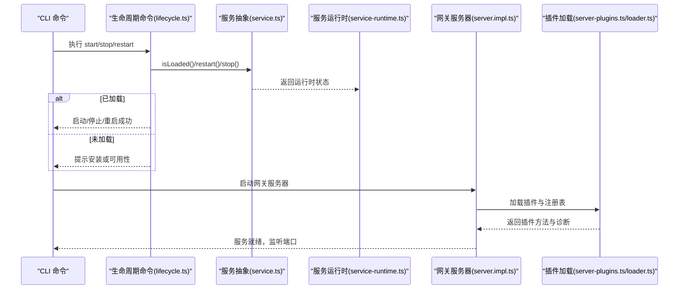
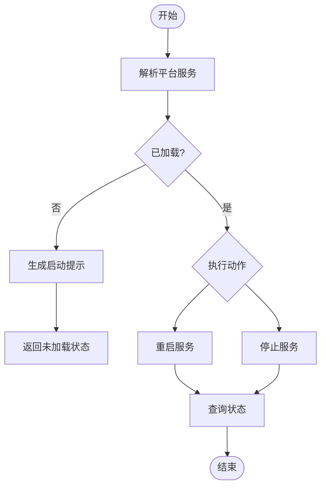
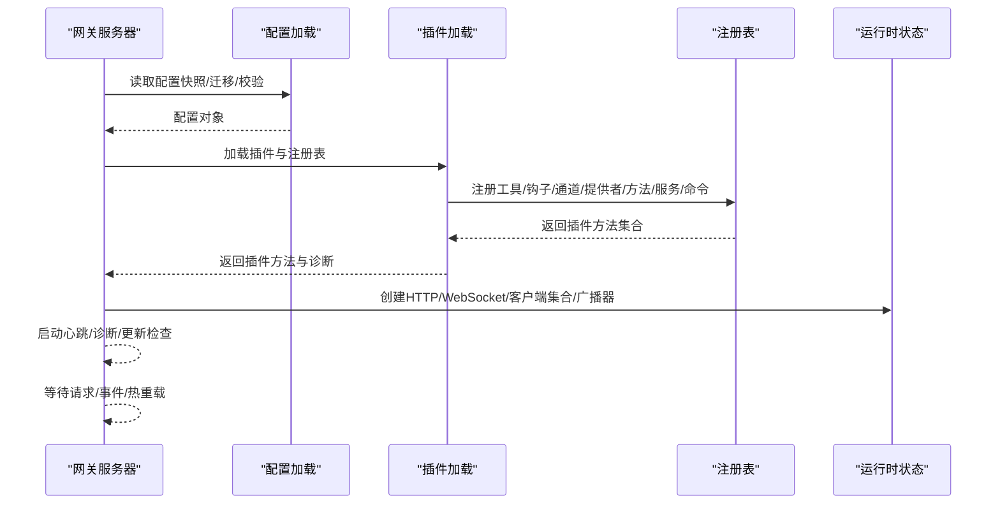
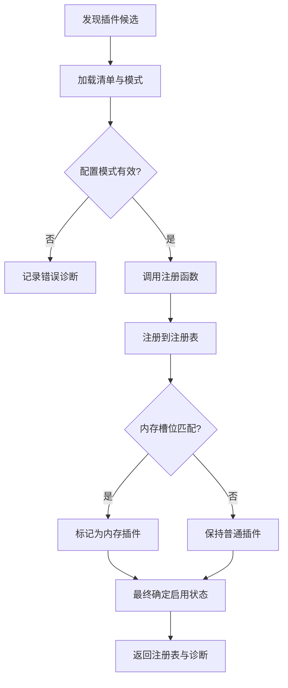
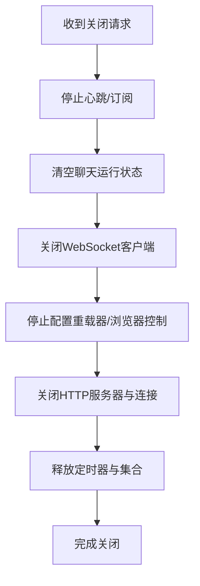
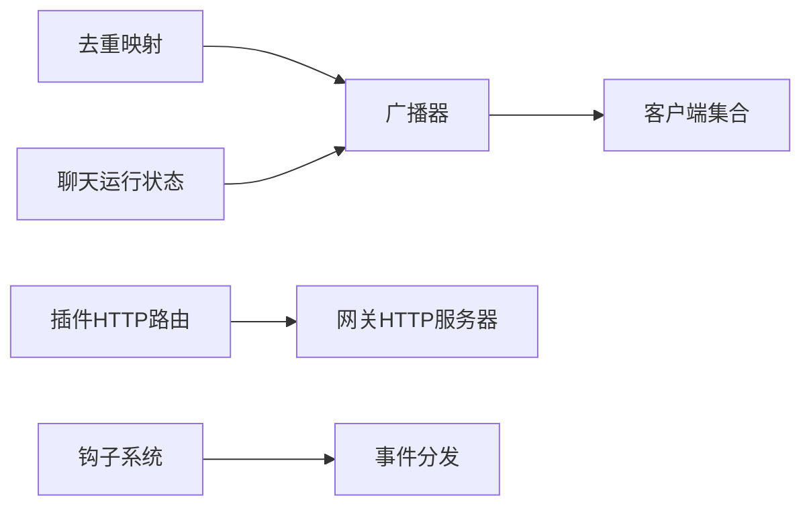
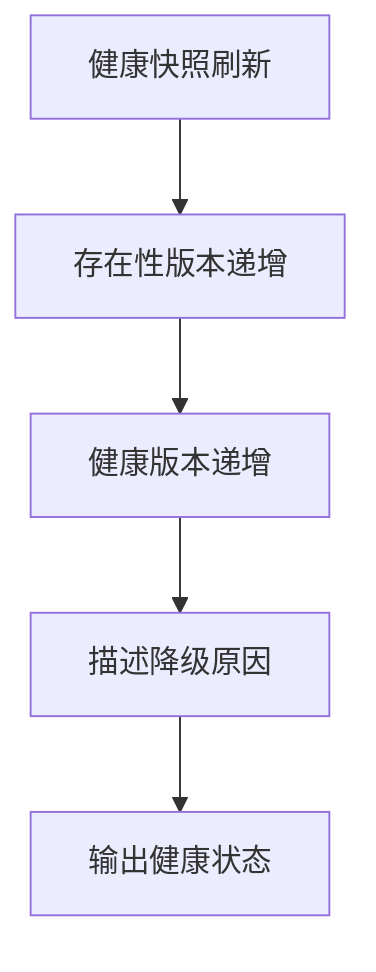
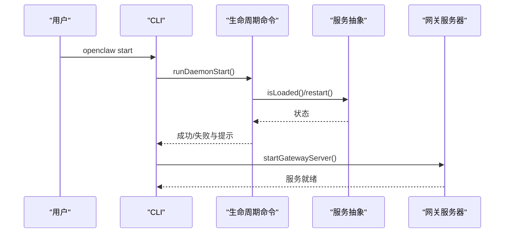
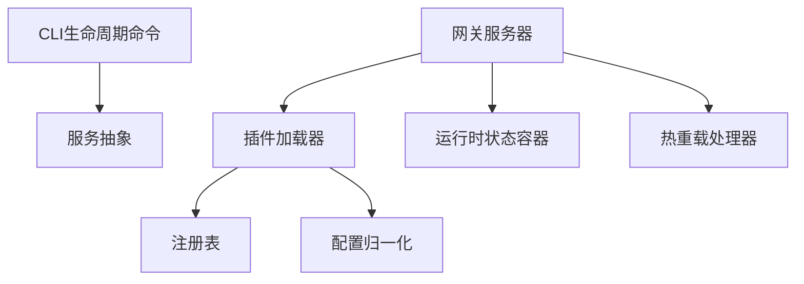

# 组件生命周期管理

## 目录
1. [简介](#简介)
2. [项目结构](#项目结构)
3. [核心组件](#核心组件)
4. [架构总览](#架构总览)
5. [详细组件分析](#详细组件分析)
6. [依赖关系分析](#依赖关系分析)
7. [性能考量](#性能考量)
8. [故障排查指南](#故障排查指南)
9. [结论](#结论)
10. [附录](#附录)

## 简介
本文件系统性阐述 OpenClaw 的组件生命周期管理，覆盖组件初始化流程、启动顺序与依赖关系、运行时状态与健康检查、故障恢复机制、优雅关闭与资源清理、组件间通信与事件协调、状态同步机制，并提供可操作的最佳实践与运维建议。目标是帮助开发者与运维人员在不同平台（macOS、Linux、Windows）上稳定地部署、启动、监控与维护 OpenClaw 组件。

## 项目结构
OpenClaw 的生命周期管理由多层模块协同完成：
- 运行时环境与日志：统一的运行时接口与日志封装，确保 CLI 与服务端一致的行为。
- 守护进程服务抽象：跨平台的服务安装、卸载、启动、停止与状态读取。
- 网关服务器：负责加载插件、建立 HTTP/WebSocket 服务、广播事件、热重载与优雅关闭。
- 插件系统：插件发现、注册、配置校验、运行时 API、钩子与工具注册。
- CLI 生命周期命令：安装、卸载、启动、停止、重启与状态查询。
- 健康检查与状态格式化：运行时状态聚合、健康快照解析与输出。

## 核心组件
- 运行时环境与日志：提供统一的日志与退出接口，保证 CLI 与服务端行为一致。
- 守护进程服务抽象：根据平台选择 LaunchAgent/systemd/计划任务，提供安装、卸载、启动、停止与状态读取。
- 网关服务器：负责配置迁移与校验、插件加载、HTTP/WebSocket 服务、事件广播、心跳与诊断、热重载与优雅关闭。
- 插件系统：插件发现、注册、配置校验、运行时 API、钩子与工具注册，支持内存插件槽位控制。
- CLI 生命周期命令：安装、卸载、启动、停止、重启与状态查询，支持 JSON 输出与提示信息。
- 健康检查与状态：运行时状态聚合、健康快照解析与输出，支持 macOS 平台的健康状态描述。

## 架构总览
下图展示了从 CLI 到守护进程服务再到网关服务器的启动链路，以及插件加载与热重载的关键路径。

## 详细组件分析

### 守护进程服务生命周期（跨平台）
- 服务抽象：根据平台返回不同的实现（macOS LaunchAgent、Linux systemd、Windows 计划任务），统一提供安装、卸载、启动、停止与状态读取。
- 运行时状态：包含运行状态、子状态、PID、最近退出原因等字段，用于 CLI 状态查询与格式化。
- CLI 命令：支持 start/stop/restart/uninstall/status，JSON 输出与提示信息，失败时退出码非零。

### 网关服务器启动与初始化
- 配置迁移与校验：读取配置快照，必要时迁移旧配置并写回；校验配置有效性，错误时抛出异常。
- 插件自动启用：应用插件自动启用策略，必要时写回配置变更。
- 插件加载：调用插件加载器，构建注册表，合并基础方法与插件方法，输出诊断信息。
- 运行时状态容器：创建 HTTP 服务器、WebSocket 服务器、客户端集合、聊天运行状态、去重与广播器等。
- 心跳与诊断：启动心跳运行器、诊断心跳、更新检查等后台任务。
- 热重载：根据计划更新配置、钩子配置、目录缓存等，支持按需重启心跳等子系统。

### 插件系统与内存槽位管理
- 插件发现与加载：扫描候选插件、加载清单、校验配置模式、调用注册函数、记录诊断。
- 注册表与 API：提供工具、钩子、通道、提供者、网关方法、CLI、服务、命令的注册能力。
- 配置归一化与启用策略：支持允许/禁止列表、显式启用/禁用、默认捆绑插件策略、内存槽位决策。
- 内存插件槽位：支持“none”禁用内存插件，或指定唯一内存插件 ID，避免重复选择。

### 优雅关闭与资源清理
- 关闭流程：清理心跳与订阅、清空聊天运行状态、关闭所有 WebSocket 客户端、停止配置重载器与浏览器控制、关闭 HTTP 服务器与连接池。
- 资源清理：释放定时器、清理集合、关闭句柄，确保无悬挂连接与资源泄漏。
- 重启策略：通过信号策略控制是否允许外部重启，配合热重载实现平滑切换。

### 组件间通信、事件协调与状态同步
- 广播与去重：通过广播器向所有客户端发送事件，使用去重映射避免重复消息。
- 聊天运行状态：维护会话级运行序列、缓冲区与增量发送时间戳，支持中止控制器。
- 插件 HTTP 路由：插件可注册 HTTP 路由与处理器，统一由网关路由分发。
- 钩子系统：插件可注册钩子事件，内部钩子系统按事件名分发，支持优先级与元数据。

### 健康检查与故障恢复
- 健康快照：服务端维护健康版本与存在性版本，支持刷新与增量更新。
- macOS 健康状态：解析健康快照，容忍日志前缀与后缀，提取 JSON 片段进行解码。
- 故障恢复：CLI 在启动失败时输出提示与建议；服务端在关闭时清理资源，避免残留连接影响重启。

### 生命周期示例：启动流程、状态监控与故障处理
- 启动流程：CLI 调用生命周期命令，服务抽象检测已加载状态，执行重启；网关服务器启动后加载插件、创建运行时状态、启动后台任务。
- 状态监控：CLI 查询服务状态，格式化输出 PID、状态、子状态与最后运行结果；支持 JSON 输出便于自动化集成。
- 故障处理：启动失败时输出错误与提示；关闭时捕获异常并继续清理，确保服务可再次启动。

## 依赖关系分析
- 组件耦合：CLI 生命周期命令依赖服务抽象；网关服务器依赖插件加载器与运行时状态；插件加载器依赖注册表与配置归一化。
- 外部依赖：跨平台服务管理（launchd/systemd/计划任务）、HTTP/WebSocket 服务器、心跳与诊断服务、热重载与配置重载器。
- 循环依赖：当前设计通过模块导出与职责分离避免循环依赖，插件注册表仅在加载阶段参与。

## 性能考量
- 插件加载缓存：基于工作空间与插件配置构建缓存键，避免重复加载与解析。
- 广播与去重：使用去重映射与增量发送时间戳减少网络负载与重复渲染。
- HTTP 服务器绑定：支持多主机绑定与回退处理，提升启动成功率与可用性。
- 心跳与诊断：后台任务独立运行，避免阻塞主请求处理。

## 故障排查指南
- CLI 启动失败：检查服务是否已加载、平台可用性（systemd 可用性提示）、输出 JSON 以获取详细错误与提示。
- 网关启动失败：查看配置迁移与校验错误、插件诊断输出、端口占用与 TLS 配置问题。
- 优雅关闭异常：确认心跳与订阅取消、客户端关闭、HTTP 服务器关闭回调无异常。
- 健康状态异常：解析健康快照，关注降级原因与最后运行时间，结合日志定位问题。

## 结论
OpenClaw 的组件生命周期管理通过统一的运行时接口、跨平台的服务抽象、完善的插件系统与热重载机制，实现了在多平台上的稳定启动、运行、监控与优雅关闭。结合健康检查与状态格式化，能够为运维与开发提供清晰的可观测性与可操作性。遵循本文最佳实践与运维建议，可显著降低部署与维护成本，提升系统可靠性。

## 附录
- 最佳实践
  - 使用 CLI 生命周期命令进行安装、启动、停止与重启，避免直接操作底层服务。
  - 在生产环境启用健康检查与诊断心跳，定期观察健康快照与状态输出。
  - 合理配置插件允许/禁止列表与内存槽位，避免冲突与资源浪费。
  - 在热重载场景下，确保插件注册表与配置归一化正确，减少重启频率。
- 运维建议
  - 定期检查服务运行时状态（PID、状态、子状态、最后运行结果）。
  - 对于 Linux 环境，确认 systemd 可用性与权限，必要时使用提示信息进行修复。
  - 在关闭服务前，确保无活跃客户端与未完成的聊天运行，避免资源泄漏。