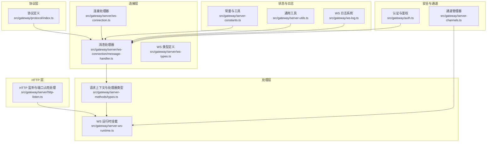
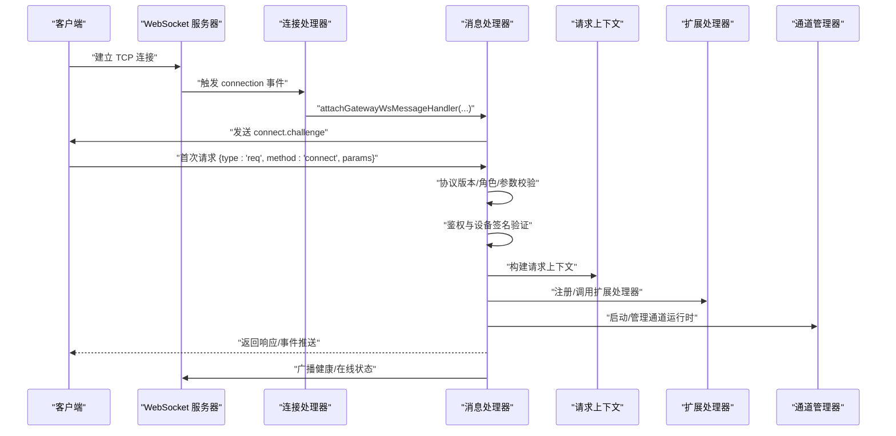
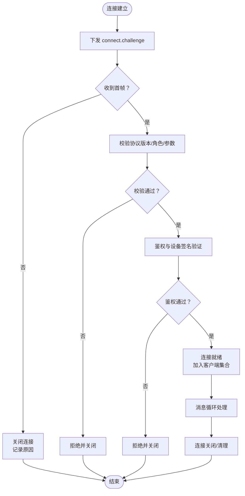
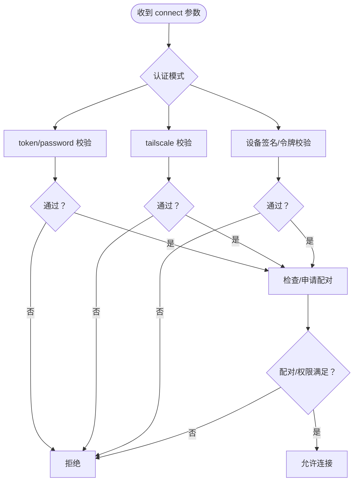
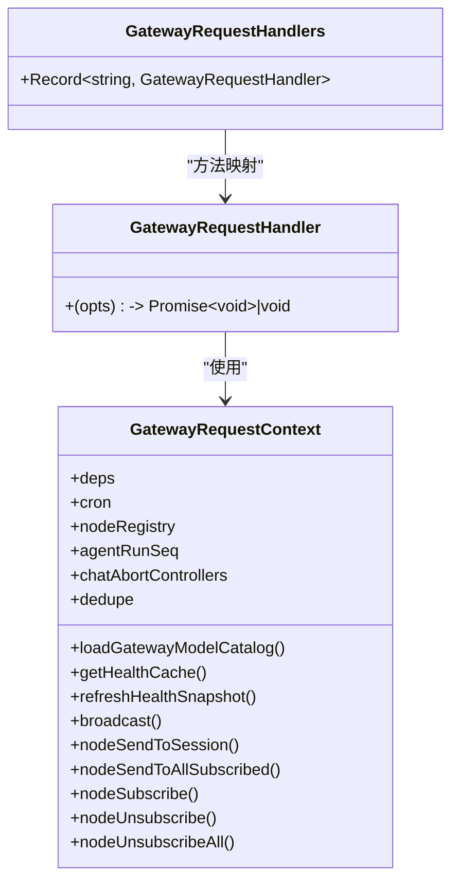
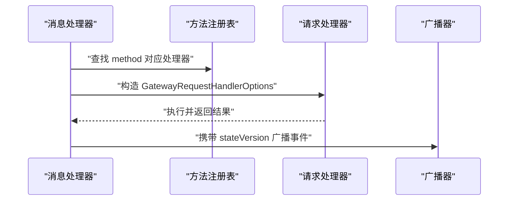
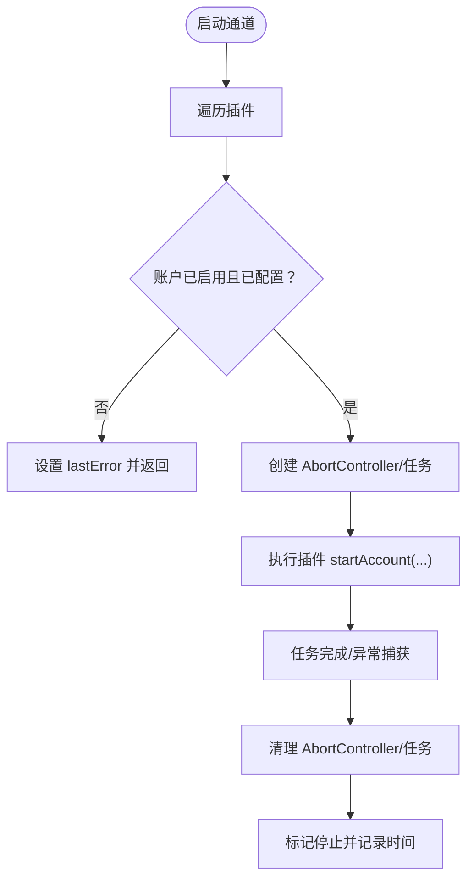
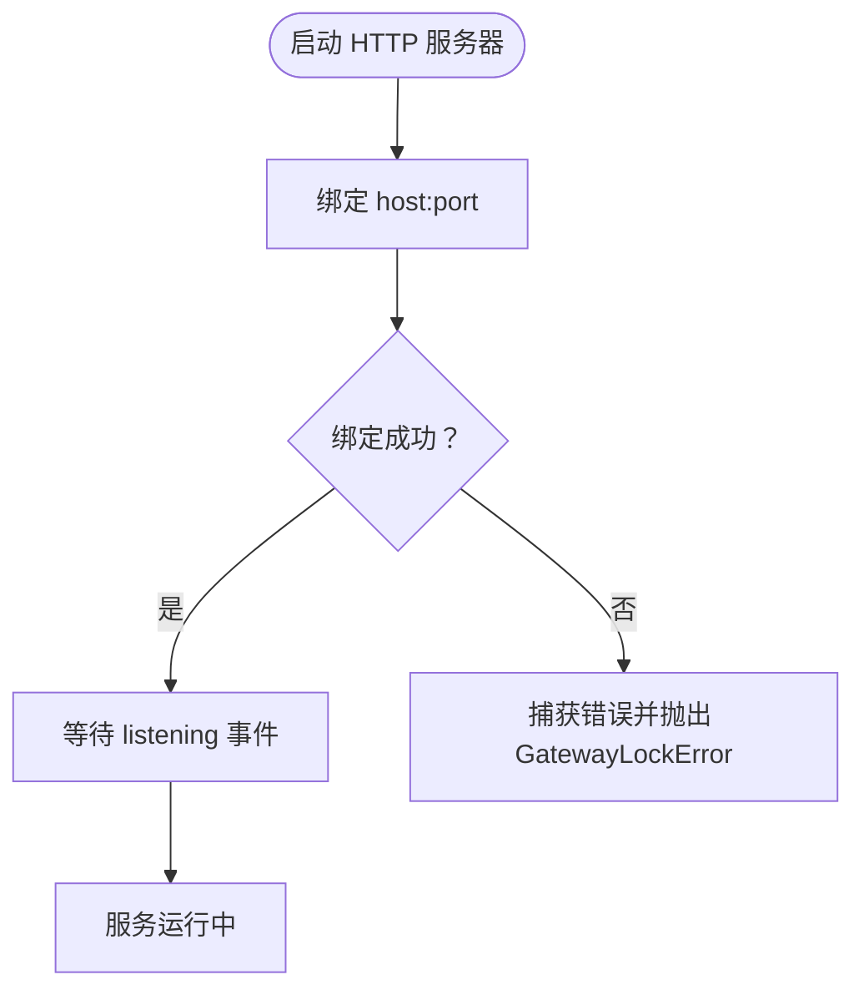
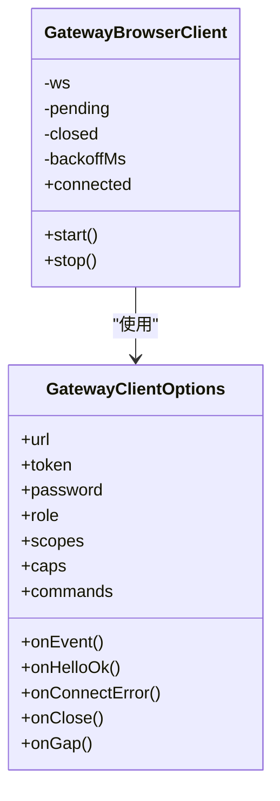
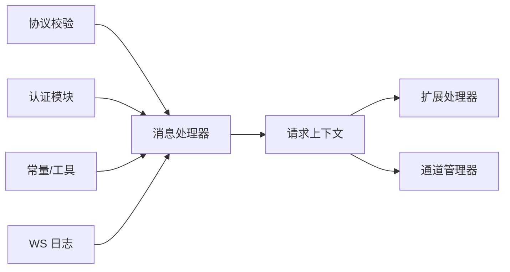

# 网关架构设计

## 目录
1. [引言](#引言)
2. [项目结构](#项目结构)
3. [核心组件](#核心组件)
4. [架构总览](#架构总览)
5. [详细组件分析](#详细组件分析)
6. [依赖关系分析](#依赖关系分析)
7. [性能考量](#性能考量)
8. [故障排查指南](#故障排查指南)
9. [结论](#结论)
10. [附录](#附录)

## 引言
本文件面向有经验的开发者，系统化梳理 OpenClaw 网关的架构设计与实现细节，重点覆盖：
- WebSocket 服务器的核心架构、握手与认证流程、消息路由与广播机制
- 网关启动流程、组件初始化顺序与生命周期管理
- HTTP API 与 WebSocket API 的设计原则、端点规范与请求处理流程
- 插件系统架构、方法注册机制与动态加载策略
- 状态管理、错误处理与恢复机制
- 结合源码路径给出可定位到具体实现的参考位置，便于深入研究与二次开发

## 项目结构
OpenClaw 网关位于 `src/gateway` 目录下，围绕“协议定义—连接管理—请求处理—状态广播—通道管理—安全认证”等模块组织。整体采用分层设计：协议层负责帧格式与校验；连接层负责握手、鉴权与消息分发；处理层负责业务方法与上下文；状态层负责健康与在线状态；通道层负责多渠道适配。

## 核心组件
- 协议与帧模型：统一的请求/响应/事件帧结构与 JSON Schema 校验，确保跨客户端一致性与安全性。
- 连接与握手：基于 ws 的连接建立、握手挑战、超时控制与关闭原因记录。
- 认证与鉴权：支持 token/password/tailscale/device-token 等多种方式，严格校验设备签名与角色权限。
- 请求处理：集中式请求处理器与上下文注入，支持扩展处理器注册。
- 广播与状态：健康与在线状态版本号管理，事件广播与去重。
- 通道管理：按插件维度管理各渠道运行时，支持启停与状态快照。
- 日志与监控：细粒度 WS 日志、慢请求统计与敏感信息脱敏。

## 架构总览
下图展示了从客户端发起连接到请求处理与事件广播的全链路：

## 详细组件分析

### WebSocket 服务器与连接管理
- 连接建立与握手
  - 在 connection 事件中生成连接 ID，下发 `connect.challenge`，设置握手超时定时器。
  - 首次消息必须是 `method="connect"` 的请求帧，否则直接关闭并记录原因。
- 关闭与清理
  - 记录关闭原因、时长、最后帧元数据；清理客户端集合、节点订阅、在线状态版本号。
- Canvas 主机地址解析
  - 基于 Host/X-Forwarded-* 解析画布主机 URL，支持端口覆盖与回退策略。

### 认证与鉴权机制
- 支持模式
  - `token`/`password`：基于配置的静态密钥进行安全比对（恒等时间比较）。
  - `tailscale`：在非本地请求场景下，通过代理头与 Whois 校验用户身份。
  - `device-token`：设备令牌与角色/作用域校验。
- 设备签名与时间窗口
  - 校验设备公钥、签名有效性、nonce 匹配与时间戳偏差限制。
- 配对与升级
  - 未配对设备触发配对请求；角色/作用域升级需要重新配对。
- 本地直连与代理检测
  - 对本地直连与受信代理头进行区分，避免代理绕过导致的误判。

### 请求处理与上下文
- 请求上下文
  - 提供依赖注入、健康缓存、广播、节点注册与订阅、聊天去重、向通道发送等能力。
- 扩展处理器
  - 通过 `GatewayRequestHandlers` 注册自定义方法，统一由 `handleGatewayRequest` 分发。
- 节点侧消息路由
  - 通过 `nodeSendToSession`/`nodeSendToAllSubscribed` 实现节点事件的定向/广播推送。

### 协议设计与消息路由
- 帧类型与校验
  - `RequestFrame`/`ResponseFrame`/`EventFrame` 使用 Ajv 校验，提供统一的错误格式化与提示。
- 方法注册与路由
  - 通过 `attachGatewayWsHandlers` 将方法列表与事件集注入连接处理器，消息处理器据此分发。
- 广播与状态版本
  - 健康与在线状态版本号递增，广播时携带 `stateVersion`，接收端可做去重与顺序校验。

### 通道管理与动态加载
- 生命周期
  - `startChannels`/`startChannel`/`stopChannel` 提供按插件维度的启停与状态跟踪。
  - 运行时快照聚合各账户状态，支持默认账户与禁用/未配置场景的兜底。
- 动态加载
  - 通过插件入口获取默认运行时、账户配置与启停钩子，结合 `AbortController` 实现可控取消。
- 错误处理
  - 捕获任务异常并写入 `lastError`，最终统一清理资源并标记停止。

### HTTP API 与监听绑定
- 监听绑定
  - `listenGatewayHttpServer` 封装 `http.Server` 的 listen 调用，捕获 `EADDRINUSE` 等错误并转换为 `GatewayLockError`。
- 端口占用保护
  - 通过错误码判断是否已有实例占用端口，避免重复启动。

### 客户端连接与浏览器端实现
- 客户端选项
  - 支持 `url`/`token`/`password`/`role`/`scopes`/`caps`/`commands` 等参数，回调包括 `onEvent`/`onHelloOk`/`onConnectError`/`onClose`/`onGap`。
- 浏览器端
  - `GatewayBrowserClient` 内置重连退避、连接状态管理与 pending 请求队列，提供 `start`/`stop`/`connected` 等接口。

## 依赖关系分析
- 松耦合与高内聚
  - 协议层仅暴露 Schema 与校验函数，不依赖连接/处理细节。
  - 连接层专注握手与消息分发，通过上下文与扩展处理器解耦业务逻辑。
  - 通道层独立于连接层，通过插件接口与运行时环境协作。
- 关键依赖链
  - 协议校验 → 消息处理器 → 请求上下文 → 扩展处理器 → 通道管理器
  - 认证模块贯穿连接与消息阶段，确保端到端安全。

## 性能考量
- 连接限流与背压
  - `MAX_BUFFERED_BYTES` 限制单连接发送缓冲，避免内存膨胀。
  - `MAX_PAYLOAD_BYTES` 限制单帧大小，防止恶意/异常负载。
- 握手与心跳
  - `DEFAULT_HANDSHAKE_TIMEOUT_MS` 控制握手超时，`TICK_INTERVAL_MS` 用于周期性心跳与健康刷新。
- 日志与可观测性
  - WS 日志在 `verbose`/`auto`/`compact` 三种风格间切换，慢请求阈值可配置，减少高频噪声。
- 通道并发
  - 通道启动采用 `Promise.all` 并行化，结合 `AbortController` 实现可控取消，降低启动/停止时延。

## 故障排查指南
- 常见错误与恢复
  - 握手失败：检查 `connect` 参数、协议版本范围、角色与作用域；查看 `connect.challenge` 是否正确响应。
  - 认证失败：核对 `token`/`password`/`tailscale`/`device-token` 配置与设备签名；确认受信代理头设置。
  - 端口占用：`listenGatewayHttpServer` 抛出 `GatewayLockError`，需释放端口或调整绑定地址。
  - 节点断开：关注 `presence` 版本号递增与广播，确认节点注册与订阅清理。
- 日志定位
  - 使用 `ws-log` 的 `formatForLog` 与 `summarizeAgentEventForWsLog`，提取关键字段如 `connId`/`id`/`method`/`event`/`seq` 等。
  - 在 `verbose`/`auto`/`compact` 模式下观察慢请求与解析错误，辅助定位性能瓶颈。

## 结论
OpenClaw 网关以协议为中心、以连接为入口、以上下文为中枢、以通道为扩展点，形成清晰的分层架构。通过严格的认证与鉴权、完善的握手与广播机制、以及可插拔的通道与扩展处理器，实现了高可用、可观测、易扩展的网关平台。建议在生产环境中：
- 明确认证策略与代理头配置，避免本地直连误判；
- 合理设置握手与心跳参数，平衡延迟与稳定性；
- 利用通道快照与广播版本号，保障事件一致性；
- 通过日志与慢请求统计持续优化性能与用户体验。

## 附录
- 启动与配置加载示例（路径参考）
  - 启动 HTTP 服务器并绑定端口：`src/gateway/server/http-listen.ts`
  - 挂载 WebSocket 处理器与广播：`src/gateway/server-ws-runtime.ts`
  - 连接与握手主流程：`src/gateway/server/ws-connection.ts`
  - 首帧校验与鉴权：`src/gateway/server/ws-connection/message-handler.ts`
  - 协议校验与错误格式化：`src/gateway/protocol/index.ts`
  - 通道启停与状态快照：`src/gateway/server-channels.ts`
  - 常量与工具函数：`src/gateway/server-constants.ts`
  - 通用错误格式化：`src/gateway/server-utils.ts`
  - WS 日志系统：`src/gateway/ws-log.ts`