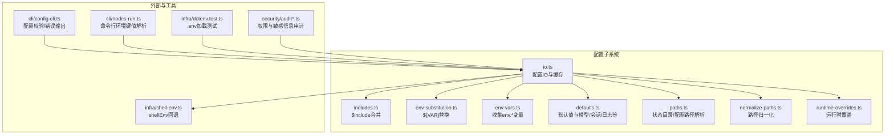
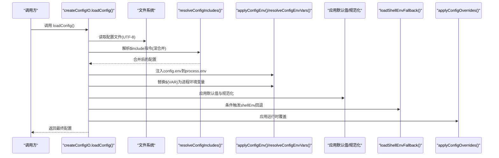
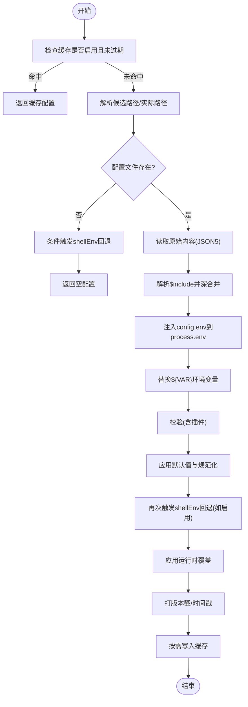
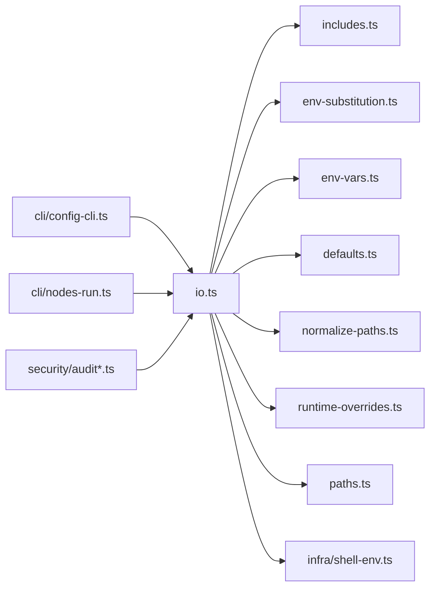
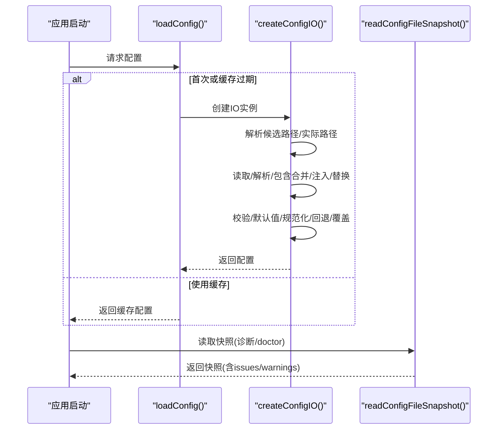

# 运行时配置管理

## 目录
1. [简介](#简介)
2. [项目结构](#项目结构)
3. [核心组件](#核心组件)
4. [架构总览](#架构总览)
5. [详细组件分析](#详细组件分析)
6. [依赖关系分析](#依赖关系分析)
7. [性能考量](#性能考量)
8. [故障排查指南](#故障排查指南)
9. [结论](#结论)
10. [附录](#附录)

## 简介
本文件系统化阐述 OpenClaw 的运行时配置管理：从配置文件加载、解析与合并，到环境变量注入、命令行参数覆盖与动态更新；从安全与权限控制，到对系统行为的影响范围、生效时间与作用域；再到缓存机制、性能优化与内存管理，并提供示例、最佳实践、调试与监控方法，以及面向开发者的扩展接口与自定义方案。

## 项目结构
运行时配置管理主要位于 `src/config` 目录，围绕“配置文件 IO”“环境变量替换”“包含文件合并”“默认值应用”“路径归一化”“运行时覆盖”等模块协作完成。同时，CLI 工具与安全审计模块参与配置的读写、校验与安全检查。

## 核心组件
- 配置 IO 与缓存：负责解析候选路径、读取/写入配置、快照、备份轮换、缓存与错误处理。
- 包含文件合并：支持 `$include` 指令，递归解析与深度限制，深合并策略。
- 环境变量替换：在配置中以 `${VAR}` 形式引用进程环境变量，支持转义与缺失检测。
- 默认值与规范化：为模型、代理、会话、日志、上下文修剪等填充默认值；对路径进行归一化。
- 运行时覆盖：通过路径表达式设置或移除覆盖项，实现命令行/脚本驱动的动态更新。
- 路径解析：解析状态目录、配置文件路径、OAuth 目录与端口等。
- 安全审计：检查配置文件及其包含文件的权限与可读性，提示风险与修复建议。
- CLI 集成：配置校验失败时输出详细错误；节点运行支持命令行环境键值对。

## 架构总览
下图展示配置加载与生效的关键流程：从候选路径解析、文件读取、包含合并、环境变量注入与替换、默认值应用、路径归一化、shellEnv 回退、运行时覆盖，最终得到可用配置对象。

## 详细组件分析

### 配置加载与缓存（IO）
- 加载时机：首次调用 `loadConfig()` 或 `readConfigFileSnapshot()` 时执行；若启用缓存且未过期则直接返回缓存。
- 优先级与候选路径：根据 `OPENCLAW_CONFIG_PATH` 与 `OPENCLAW_STATE_DIR` 决定候选路径，优先选择已存在的配置文件，否则回退到规范路径。
- 缓存策略：可通过 `OPENCLAW_CONFIG_CACHE_MS` 控制缓存时长，默认 200ms；设置 `OPENCLAW_DISABLE_CONFIG_CACHE` 可禁用缓存。
- 错误处理：包含 JSON5 解析失败、包含解析失败、环境变量替换失败、验证失败等，均转换为结构化错误并记录。
- 备份与原子写入：写入采用临时文件 + 原子重命名策略，Windows 下回退为复制+chmod+删除临时文件；并维护固定数量的 .bak 备份。

### 包含文件合并（`$include`）
- 支持单文件与数组多文件合并；当存在其他键时，要求包含内容为对象，否则抛出错误。
- 深合并规则：数组拼接、对象递归合并、其他类型以源值覆盖。
- 循环包含检测与最大深度限制，防止栈溢出与恶意配置。
- 绝对/相对路径解析基于配置文件所在目录，避免跨目录越权。

### 环境变量注入与替换
- 注入：`config.env` 中的键值会写入 `process.env`（仅在未被 shell 设置时）。
- 替换：支持 `${VAR}` 语法，仅匹配大写/下划线命名模式；未设置或为空字符串时报错；支持 `$${}` 转义。
- 顺序：先注入再替换，使 `${VAR}` 可引用 `config.env` 中定义的变量。

### 默认值与规范化
- 默认值：为消息、会话、代理并发、日志脱敏、上下文修剪、心跳周期、模型成本/窗口/最大输出等填充默认值。
- 规范化：对路径字段（含 `~` 展开）进行统一归一化，确保跨平台一致性。
- 特定逻辑：根据认证模式自动调整模型参数（如缓存保留策略），主模型别名映射等。

### 运行时覆盖（动态更新）
- 覆盖机制：通过路径表达式设置或移除配置项，采用深合并策略覆盖原配置。
- 接口：`setConfigOverride(path, value)`、`unsetConfigOverride(path)`、`getConfigOverrides()`、`resetConfigOverrides()`。
- 生效：`applyConfigOverrides` 在最终阶段合并到配置树上，影响后续所有使用配置的模块。

### 命令行参数与环境注入
- CLI 环境键值：`nodes-run` 提供解析命令行传入的环境键值对（`KEY=VALUE` 列表），用于临时注入。
- `.env` 行为：测试显示 shell 已设置的环境变量不会被 `.env` 文件覆盖，体现“shell 优先”的原则。

### 安全与权限控制
- 配置文件权限：检测世界可写/组可写、世界可读/组可读等风险，给出严重/警告等级与修复建议。
- 包含文件：对 `include` 的文件同样进行权限检查，防止他人篡改有效配置。
- shellEnv 回退：受开关与超时控制，避免长时间等待或不受信任来源污染。

## 依赖关系分析
- 模块耦合：`io.ts` 是中枢，依赖 `includes`、`env-substitution`、`env-vars`、`defaults`、`normalize-paths`、`runtime-overrides`、`paths`、`shell-env`。
- 外部依赖：JSON5 解析、文件系统、操作系统路径与用户目录。
- CLI/安全：CLI 工具负责错误输出与交互；安全模块负责权限与敏感信息审计。

## 性能考量
- 缓存：默认短缓存（200ms）提升频繁读取性能；可通过环境变量禁用或调整。
- I/O：写入采用临时文件 + 原子重命名，减少竞态；Windows 下回退策略保证可靠性。
- 合并：`$include` 深合并与默认值应用在加载阶段一次性完成，避免运行时重复计算。
- 字符串替换：仅在包含 `${}` 的字符串上进行扫描与替换，复杂度线性于文本长度。

## 故障排查指南
- 配置无效：使用 `doctor` 或 `readConfigFileSnapshot` 获取详细错误列表；根据路径定位问题。
- 环境变量缺失：查看 `MissingEnvVarError` 报错，确认是否在 shell、`config.env` 或 `.env` 中正确设置。
- 包含循环/深度超限：检查 `$include` 链路，避免循环与过深嵌套。
- 权限问题：关注安全审计报告中的“可写/可读”风险，按建议调整文件权限。
- 动态覆盖无效：确认覆盖路径表达式正确，且在最终配置生成前设置。

## 结论
OpenClaw 的运行时配置管理以“可组合、可覆盖、可审计”为核心设计：通过 `$include` 实现模块化与复用，通过 `${VAR}` 与 `config.env` 实现灵活注入，通过默认值与路径归一化保障一致性，通过缓存与原子写入提升性能与可靠性，通过安全审计与权限控制强化安全性。动态覆盖与 CLI 集成使得配置可在不同生命周期阶段被安全地修改与验证。

## 附录

### 配置加载与生效时序（代码级）

### 最佳实践
- 将敏感信息放入 `config.env` 并通过 `${VAR}` 引用，避免硬编码。
- 使用 `$include` 将通用配置拆分为多个文件，保持主配置简洁。
- 在 CI/CD 中通过 `OPENCLAW_CONFIG_CACHE_MS` 调整缓存时长，平衡性能与变更频率。
- 定期运行安全审计，确保配置文件与包含文件权限最小化。
- 使用运行时覆盖仅在必要时临时调整，避免长期覆盖导致配置漂移。

### 扩展接口与自定义方案
- 自定义包含解析器：实现 `IncludeResolver` 接口，注入自定义读取/解析逻辑。
- 自定义默认值策略：在 `defaults.ts` 附近扩展默认值函数，遵循现有合并与规范化流程。
- 自定义覆盖路径：通过 `setConfigOverride`/`unsetConfigOverride` 注入业务特定的覆盖项。
- 自定义环境变量注入：在 `config.env` 中声明变量，或在应用启动前注入 `process.env`。