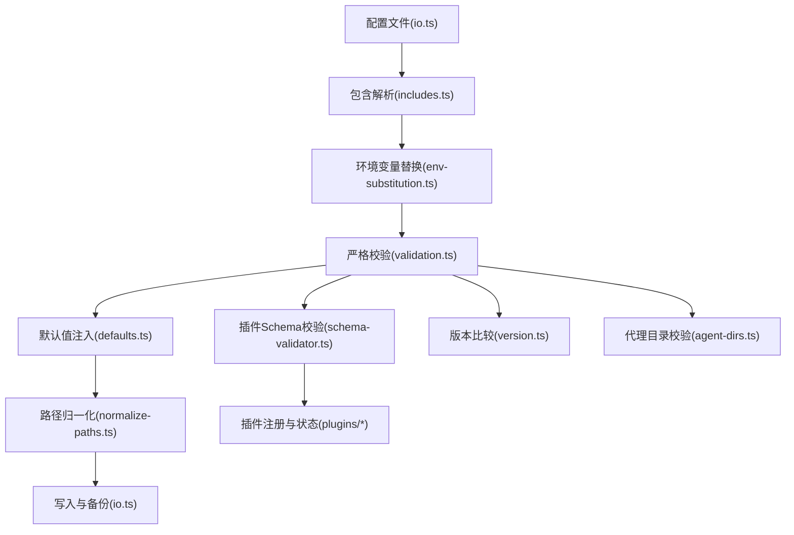
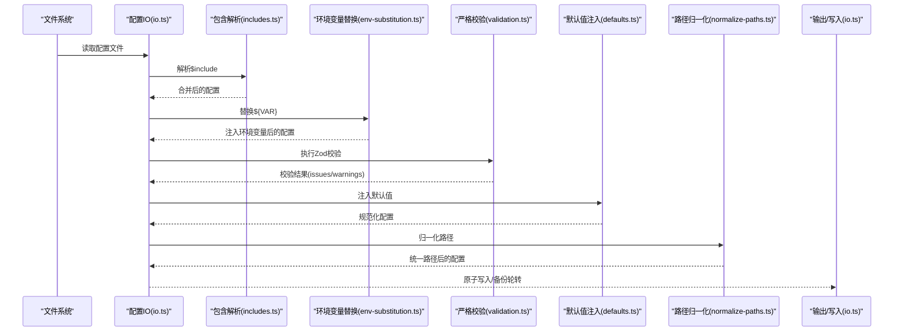
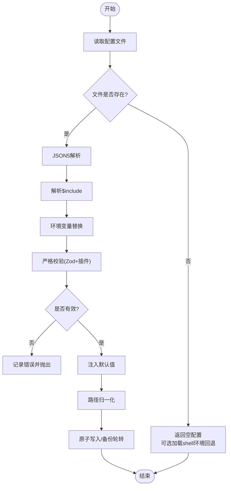
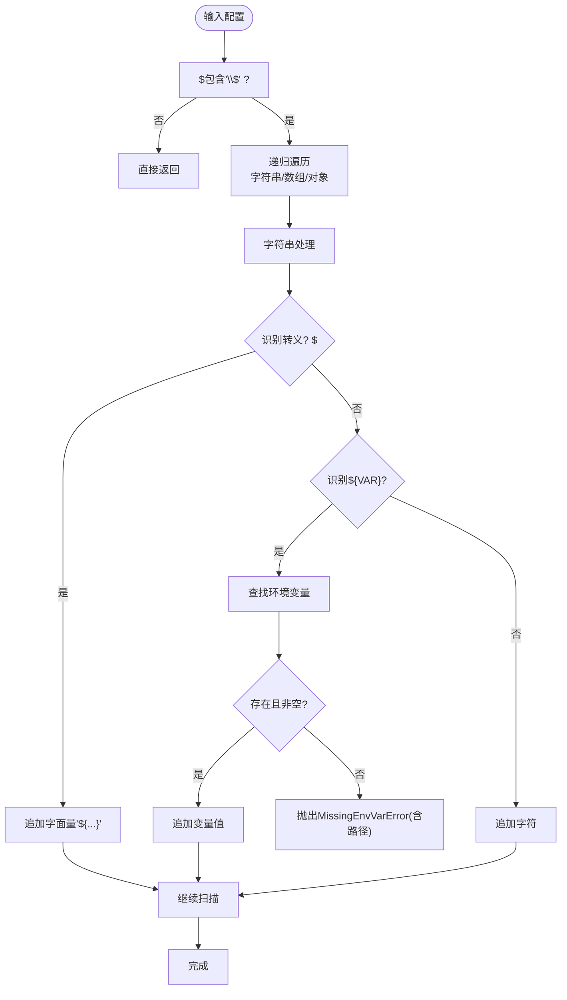
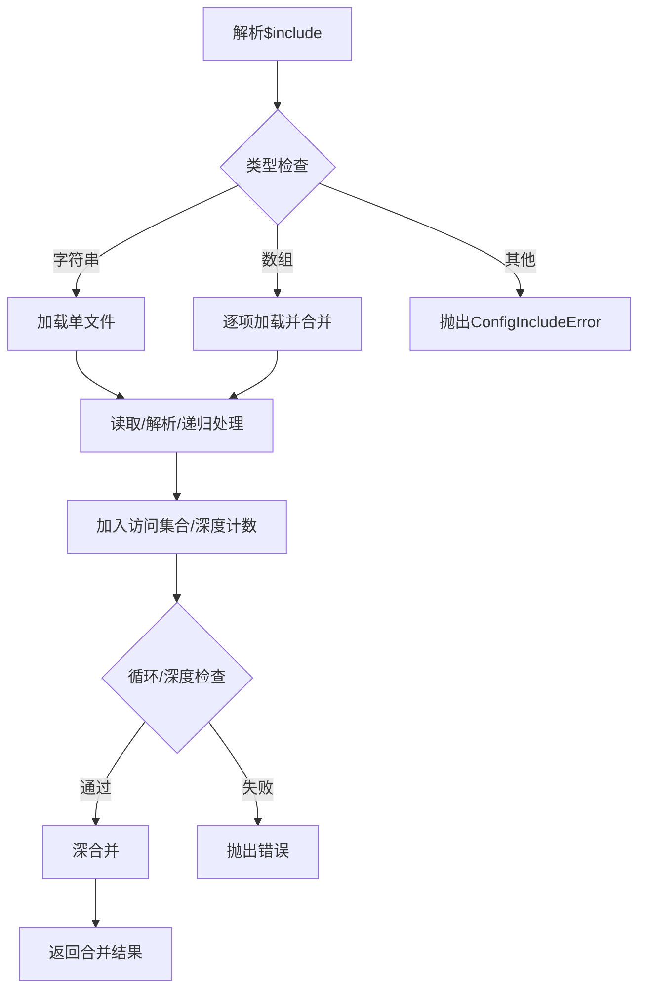
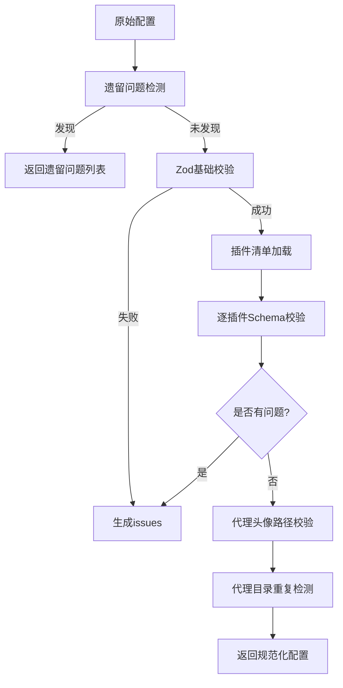
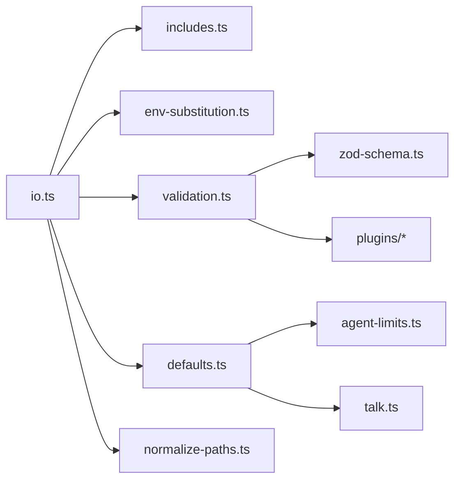

# 配置文件结构设计

## 目录
1. [引言](#引言)
2. [项目结构](#项目结构)
3. [核心组件](#核心组件)
4. [架构总览](#架构总览)
5. [详细组件分析](#详细组件分析)
6. [依赖关系分析](#依赖关系分析)
7. [性能考虑](#性能考虑)
8. [故障排除指南](#故障排除指南)
9. [结论](#结论)
10. [附录](#附录)

## 引言
本文件系统性阐述 OpenClaw 配置文件的结构设计与实现细节，覆盖层次化结构、字段定义、数据类型约束、模块划分、相互依赖关系、默认值处理、环境变量替换、路径解析、版本管理与向后兼容、迁移策略、验证规则、错误处理与调试技巧，并提供面向开发者与运维人员的实用指南。

## 项目结构
OpenClaw 的配置系统围绕 `src/config` 目录构建，采用“分层职责 + 类型安全 + 可扩展 Schema”的设计模式：
- 输入解析与预处理：JSON5 解析、`$include` 合并与环境变量替换
- 校验与规范化：严格 Zod Schema 校验、插件 Schema 校验、默认值注入、路径归一化
- 运行时集成：会话与代理目录校验、运行时覆盖、版本戳与未来版本警告
- 输出与持久化：原子写入、备份轮转、快照读取

## 核心组件
- 配置输入输出与缓存：负责解析 JSON5、`$include` 合并、环境变量替换、严格校验、默认值注入、路径归一化、原子写入与备份轮转、快照读取与缓存控制
- 环境变量替换：支持 `${VAR_NAME}` 语法，大小写限制，转义 `$`，缺失即抛错并携带路径上下文
- 包含机制：`$include` 支持字符串或数组，递归合并，循环检测与深度限制
- 校验体系：基础 Zod 校验 + 插件自定义 Schema 校验，未知键拒绝，插件缺失/禁用但配置存在给出警告
- 默认值注入：模型、代理、会话、日志、上下文修剪、压缩等多维度默认值
- 版本管理：配置 `meta` 字段记录最后触达版本与时间，比较版本以提示“来自未来版本”
- 路径与运行时：路径归一化、运行时覆盖、代理目录重复检测
- 类型系统：统一的 `OpenClawConfig` 类型与各子系统类型定义

## 架构总览
配置生命周期从磁盘到内存再到运行时的关键流程如下：

## 详细组件分析

### 组件A：配置加载与写入管线
- 职责：解析 JSON5、`$include` 合并、环境变量替换、严格校验、默认值注入、路径归一化、原子写入与备份轮转、快照读取
- 关键点：
  - 缓存控制：通过环境变量控制缓存时长与禁用
  - 失败处理：捕获异常并返回空配置或抛出 `INVALID_CONFIG` 错误
  - 写入策略：临时文件 + 原子重命名，Windows 兼容回退
  - 快照：包含原始内容、解析结果、校验问题、警告与遗留问题

### 组件B：环境变量替换
- 语法：`${VAR_NAME}`，仅匹配全大写、下划线、数字，支持转义 `$${VAR}` 输出字面量 `${VAR}`
- 行为：缺失或空字符串视为错误，错误包含变量名与配置路径上下文
- 适用范围：字符串、数组、对象深层遍历，保持原类型不变

### 组件C：包含机制(`$include`)
- 支持：单个文件路径或文件路径数组，按顺序合并
- 安全：循环包含检测、最大嵌套深度限制、绝对/相对路径解析
- 合并：深合并策略，后包含覆盖先包含

### 组件D：严格校验与插件Schema
- 基础校验：`OpenClawSchema.safeParse`，未知键直接失败
- 插件校验：加载插件清单，逐插件执行 `validateJsonSchemaValue`，缺失 Schema 报错，禁用但有配置给出警告
- 通道与心跳目标：通道 ID 校验，心跳目标标准化与合法性检查
- 代理头像路径：工作区相对路径、HTTP/HTTPS、data URI 三类允许，否则报错

### 组件E：默认值注入与路径归一化
- 默认值注入：模型、代理并发、会话、日志、上下文修剪、压缩、Talk API Key 等
- 路径归一化：统一路径分隔符、相对路径解析、工作区边界检查
- 运行时覆盖：支持命令行或环境变量对配置进行覆盖

### 组件F：版本管理与向后兼容
- 版本比较：支持 `v1.2.3`、`1.2.3`、`v1.2.3-4` 等格式，逐段比较
- 来自未来版本警告：当配置 `meta.lastTouchedVersion` 新于当前版本时发出警告
- 兼容策略：严格校验拒绝未知键，遗留迁移集中管理，doctor 建议修复

## 依赖关系分析
- 模块耦合：
  - `io.ts` 作为门面，协调 `includes`、`env-substitution`、`validation`、`defaults`、`normalize-paths`
  - `validation.ts` 依赖 `zod-schema` 与插件 Schema 校验器
  - `defaults.ts` 依赖 `agent-limits`、`talk` 等子系统默认值
- 外部依赖：
  - JSON5 解析、文件系统、进程环境
  - 插件清单与 manifest 注册表
- 循环依赖：
  - 通过函数式接口避免直接循环导入，如 `schema-validator.ts` 对 `validateJsonSchemaValue` 的调用

## 性能考虑
- 缓存：配置路径解析与配置内容可缓存，受环境变量控制，减少频繁 IO
- 原子写入：临时文件 + 重命名，避免部分写入；Windows 下回退复制+chmod+删除临时文件
- 深度优先合并：`$include` 递归合并，注意避免过深嵌套导致性能下降
- 校验优化：AJV 缓存编译后的 Schema，减少重复校验成本
- 路径归一化：批量处理路径，避免重复解析

## 故障排除指南
- 环境变量缺失：
  - 症状：抛出 `MissingEnvVarError`，包含变量名与配置路径
  - 排查：确认环境变量设置、转义语法、大小写规范
- `$include` 循环或深度超限：
  - 症状：抛出包含错误
  - 排查：检查包含链路、相对路径解析、避免循环引用
- 配置无效：
  - 症状：`INVALID_CONFIG` 错误，打印具体路径与消息
  - 排查：根据 issues 列表定位字段，参考 UI 提示与帮助文本
- 代理目录重复：
  - 症状：`DuplicateAgentDirError`
  - 排查：确保每个代理的工作区目录唯一
- 来自未来版本：
  - 症状：警告提示配置由更高版本写入
  - 排查：升级 OpenClaw 或使用 doctor 修复

## 结论
OpenClaw 的配置系统通过严格的类型约束、可扩展的插件 Schema、完善的默认值注入与路径归一化、健壮的环境变量替换与包含机制，以及版本感知与向后兼容策略，实现了高可靠性与可维护性的配置管理。建议在生产环境中启用 doctor 并定期检查配置有效性，合理使用环境变量与 `$include` 进行模块化配置管理。

## 附录

### 字段与类型概览
- 核心字段组：
  - `meta`：`lastTouchedVersion`、`lastTouchedAt`
  - `update`：`channel`、`checkOnStart`
  - `diagnostics`：`flags`、`otel`、`cacheTrace`
  - `gateway`：`auth`、`remote`、`controlUi`、`http.endpoints`、`reload`、`nodes`
  - `nodeHost`：`browserProxy`
  - `agents`：`defaults`、`list[]`
  - `tools`：`media`、`web`、`exec`、`message`、`profile`、`alsoAllow`、`byProvider`
  - `models`：`providers`、`catalog`
  - `messages`：`ackReaction`、`ackReactionScope`、`inbound.debounceMs`
  - `session`：`dmScope`、`agentToAgent.maxPingPongTurns`
  - `commands`：`native`、`nativeSkills`、`text`、`bash`、`config`、`debug`、`restart`、`useAccessGroups`
  - `ui`：`seamColor`、`assistant.*`
  - `browser`：`evaluateEnabled`、`snapshotDefaults`、`remoteCdpTimeoutMs`
  - `skills`：`load.watch`、`load.watchDebounceMs`
  - `channels.*`：各频道配置与策略
  - `plugins`：`enabled`、`allow`、`deny`、`load.paths`、`slots`、`entries`、`installs`
  - `auth`：`profiles`、`order`、`cooldowns`
  - `talk`：`apiKey`
- 类型系统：`OpenClawConfig` 与各子系统类型定义，确保字段与默认值一致性

### 最佳实践
- 使用 `$include` 将大型配置拆分为模块，避免单一文件过大
- 通过环境变量集中管理密钥与敏感信息，配合 UI 的敏感字段标记
- 定期运行 doctor 检测遗留问题与潜在风险
- 为插件配置提供 Schema，便于 UI 生成表单与实时校验
- 合理设置 `session.dmScope` 与跨上下文发送策略，平衡隐私与协作
- 使用 `meta.lastTouchedVersion` 与 `lastTouchedAt` 追踪配置变更历史