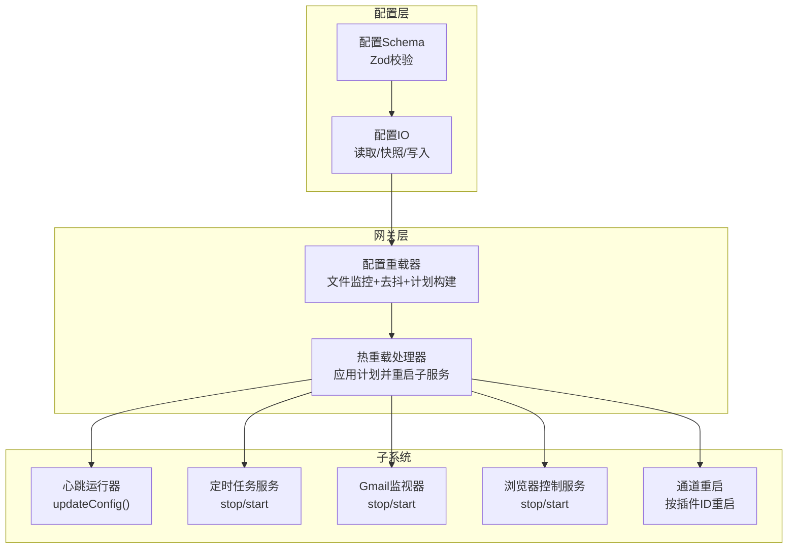
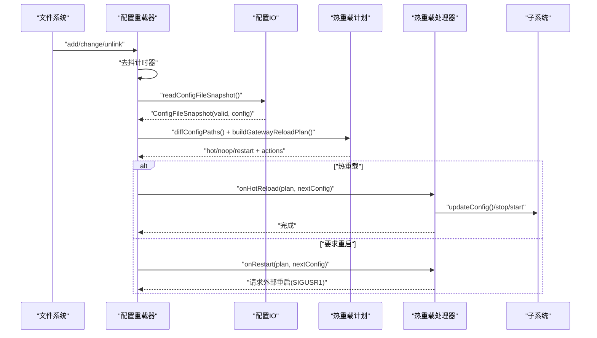
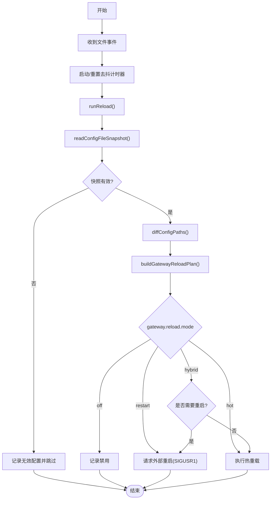
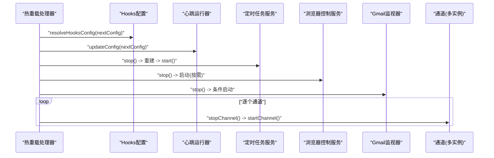
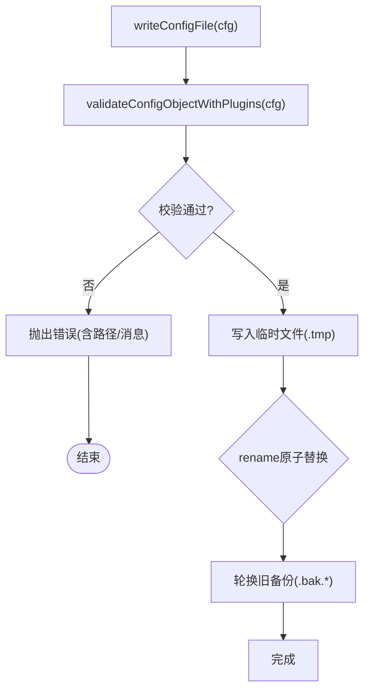
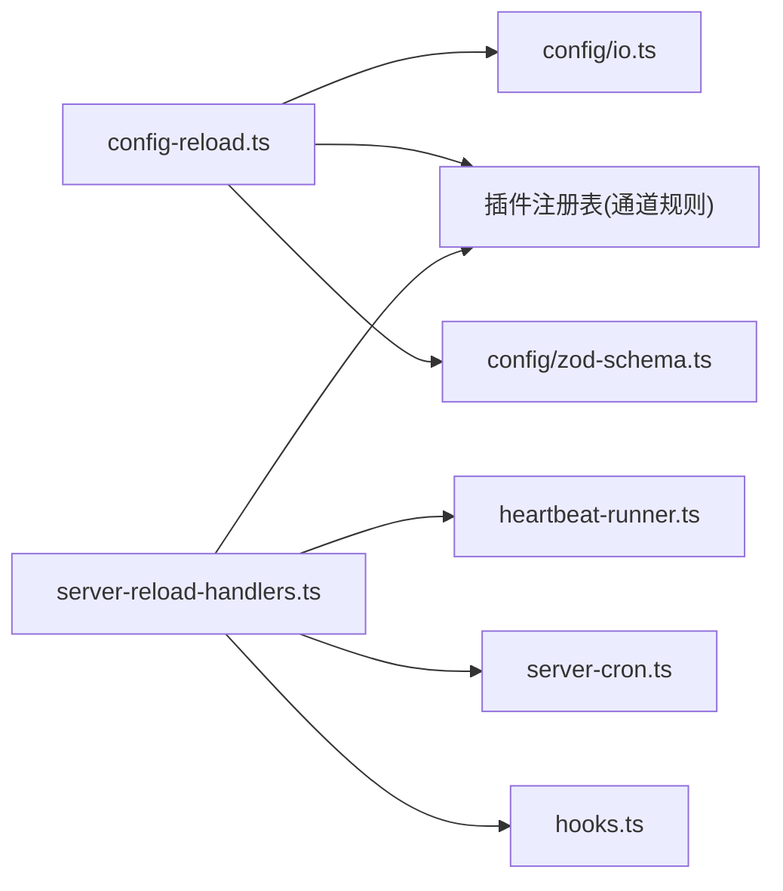

# 配置热重载机制

## 目录
1. [简介](#简介)
2. [项目结构](#项目结构)
3. [核心组件](#核心组件)
4. [架构总览](#架构总览)
5. [详细组件分析](#详细组件分析)
6. [依赖分析](#依赖分析)
7. [性能考量](#性能考量)
8. [故障排查指南](#故障排查指南)
9. [结论](#结论)
10. [附录](#附录)

## 简介
本文件系统化阐述 OpenClaw 的配置热重载机制，覆盖触发条件、检测机制、更新流程、监听方式、文件系统监控、事件处理、原子性与一致性保障、回滚策略、组件影响范围与更新顺序、依赖关系、性能与并发控制、配置示例、最佳实践、故障恢复、调试工具与监控指标，以及面向运维的操作指南与应急处理方案。

## 项目结构
OpenClaw 将“配置热重载”能力集中在网关层（gateway）与配置 IO 层（config/io.ts），通过文件系统监控与规则驱动的热重载计划，实现最小化停机与无感更新。

## 核心组件
- 配置重载器：负责文件监控、去抖、快照读取、差异计算、热重载计划构建与执行。
- 热重载处理器：根据计划应用变更，重启或更新子系统，记录日志。
- 配置IO：提供快照读取、写入、缓存与备份轮换，确保读取一致性与可回滚。
- 子系统适配器：心跳、定时任务、Gmail监视器、浏览器控制、通道等支持“热重载/重启”。

## 架构总览
热重载从文件系统事件触发，经由重载器进行去抖与快照对比，生成“热重载计划”，再由处理器按计划调用相应子系统的更新/重启逻辑，最终完成配置生效。

## 详细组件分析

### 组件A：配置重载器（文件监控与计划）
- 触发条件
  - 文件新增、修改、删除事件触发去抖计时器。
  - 去抖默认 300ms，可通过 `gateway.reload.debounceMs` 调整。
- 检测机制
  - 使用 chokidar 监控 watchPath，awaitWriteFinish 防止中途写入。
  - 读取最新快照，若无效则跳过本次重载并记录问题。
- 更新流程
  - 计算当前配置与新配置的差异路径集合。
  - 基于规则匹配构建热重载计划：hot/noop/restart。
  - 根据模式（off/restart/hot/hybrid）决定走热重载还是请求外部重启。
- 并发与一致性
  - 运行状态 running/pending 防止并发重载；pending 在去抖结束后再次调度。
  - 快照读取与计划构建在单线程串行化执行，避免竞态。
- 错误处理
  - 监听错误时关闭 watcher 并记录告警，避免持续失败。
  - 失败时记录错误日志，不影响后续重试。

### 组件B：热重载处理器（应用计划与子系统更新）
- 动作映射
  - reload-hooks：重新解析 hooks 配置。
  - restart-heartbeat：调用心跳运行器 `updateConfig(nextConfig)`。
  - restart-cron：停止旧 cron，重建并启动新 cron。
  - restart-browser-control：停止旧浏览器控制服务，按需启动新服务。
  - restart-gmail-watcher：停止旧监视器，按条件启动新监视器。
  - restart-channel:*：按通道 ID 停止并重启对应通道。
- 并发与顺序
  - hooks 与 heartbeat 更新优先级高，先于其他动作。
  - cron 与浏览器控制服务按需重建。
  - 通道重启按计划逐个执行，避免并发冲突。
- 环境变量与开关
  - 支持 `OPENCLAW_SKIP_CHANNELS`、`OPENCLAW_SKIP_PROVIDERS`、`OPENCLAW_SKIP_GMAIL_WATCHER` 等环境变量控制跳过某些重启。
- 日志与可观测性
  - 对热重载与动态读取分别输出 info/warn 级别日志，便于审计。

### 组件C：配置IO（快照、写入与备份）
- 快照读取
  - 提供 `readConfigFileSnapshot()`，返回包含 raw、parsed、valid、config、hash、issues、warnings、legacyIssues 的快照对象。
  - 解析前先处理 `$include` 与 env 变量替换，再进行 Zod 校验与默认值填充。
- 写入与原子性
  - 写入采用“临时文件 + 原子 rename”策略；Windows 下回退到 copy+chmod+unlink。
  - 写入前进行完整校验，失败抛错；成功后保留固定数量的 .bak 备份。
- 缓存与一致性
  - 支持可配置的短时缓存（`OPENCLAW_CONFIG_CACHE_MS`），减少频繁读取。
  - 写入后清空缓存，确保后续读取到最新配置。
- 版本与兼容
  - 写入时打上版本戳与时间戳，用于未来兼容性提示。

### 组件D：配置Schema（热重载规则与默认值）
- 热重载模式
  - `gateway.reload.mode` 支持 off/restart/hot/hybrid，默认 hybrid。
  - `debounceMs` 默认 300ms，可按需调整。
- 热重载规则
  - 基础规则：如 `hooks.*`、`browser.*`、`cron.*`、`heartbeat.*` 等路径映射到 hot/noop/restart。
  - 通道规则：插件通过 `reload.configPrefixes`/`noopPrefixes` 注入热重载前缀。
  - 尾规则：`gateway.*`、`discovery.*`、`canvasHost.*` 等默认 restart。
- 兼容性
  - Zod Schema 对配置结构进行严格约束，配合 hooks、gateway、cron、browser 等子段落定义。

### 组件E：子系统适配器（心跳、定时、Gmail、浏览器、通道）
- 心跳运行器
  - 支持 `updateConfig(nextConfig)`，在不重启的情况下更新心跳间隔、提示词、目标等。
- 定时任务服务
  - `stop()` 后重建并 `start()`，确保新配置生效。
- Gmail 监视器
  - `stopGmailWatcher()` 后按条件启动，支持跳过环境变量。
- 浏览器控制服务
  - 按需停止旧实例并启动新实例。
- 通道重启
  - 通过插件 ID 逐个停止并启动，避免全局重启。

## 依赖分析
- 配置重载器依赖
  - chokidar：文件系统监控。
  - 配置IO：快照读取与写入。
  - 插件注册表：动态注入通道热重载规则。
- 热重载处理器依赖
  - 子系统接口：心跳、定时、Gmail、浏览器、通道。
  - 环境变量：控制跳过重启。
- Schema 与验证
  - Zod Schema 为热重载规则与配置项提供类型安全与默认值。

## 性能考量
- 去抖与批处理
  - 默认 300ms 去抖，降低频繁变更导致的抖动与资源浪费。
- 快照与缓存
  - 读取快照包含解析、include 处理、env 替换、校验与默认值填充，建议合理设置缓存以减少重复开销。
- 写入原子性
  - 原子 rename 或 Windows 回退策略，避免部分写入引发的不一致。
- 并发控制
  - 单次运行标志 running/pending，防止并发重载；通道重启串行执行，避免竞争。
- I/O 与磁盘
  - 备份轮换与临时文件写入对磁盘有一定压力，建议在高频率变更场景下评估磁盘性能。

## 故障排查指南
- 常见问题
  - 无效配置：快照 valid=false 时会记录 issues 列表，检查路径与消息。
  - 监控错误：watcher error 会关闭监控并记录告警，检查权限与路径。
  - 热重载未生效：确认 `gateway.reload.mode` 是否为 hot/hybrid，且变更路径命中 hot/noop 规则。
  - 子系统未重启：检查 `OPENCLAW_SKIP_*` 环境变量是否阻止了特定重启。
- 调试步骤
  - 查看重载器日志：config change detected / config hot reload applied。
  - 查看处理器日志：hooks config reload failed / server failed to start / gmail watcher not started。
  - 校验写入：确认 .bak 备份是否存在，临时文件是否被清理。
- 回滚策略
  - 通过 .bak.* 备份进行手动回滚；必要时使用写入失败的回退逻辑（Windows 下 copy+chmod）。

## 结论
OpenClaw 的配置热重载通过“文件监控 + 去抖 + 快照对比 + 规则驱动计划”的闭环，实现了对关键子系统的最小化停机更新。配合严格的校验、原子写入与备份轮换，既保证了变更的原子性与一致性，也提供了可控的回滚与可观测性。运维可在 hybrid 模式下获得最大灵活性，在需要强一致性的场景下切换至 restart 模式以确保完全重启。

## 附录

### 配置示例与最佳实践
- 示例：启用热重载并设置去抖
  - `gateway.reload.mode`: "hybrid" 或 "hot"
  - `gateway.reload.debounceMs`: 300
- 最佳实践
  - 将高频变更拆分到 `hooks.*`、`browser.*`、`cron.*` 等热路径，避免触发 restart。
  - 在生产环境优先使用 hybrid 模式，仅在必要时降级为 restart。
  - 变更前保留 .bak 备份，测试后再上线。
  - 使用环境变量 `OPENCLAW_SKIP_CHANNELS`/`OPENCLAW_SKIP_PROVIDERS` 控制重启范围。

### 运维操作指南与应急处理
- 正常流程
  - 修改配置文件 → 等待去抖 → 观察日志 → 确认热重载生效。
- 应急处理
  - 若热重载失败：检查 invalid config issues，修正后重试。
  - 若 watcher 出错：修复权限/路径后重启进程以重建监控。
  - 强制重启：将 `gateway.reload.mode` 设为 "restart"，或发送 SIGUSR1。