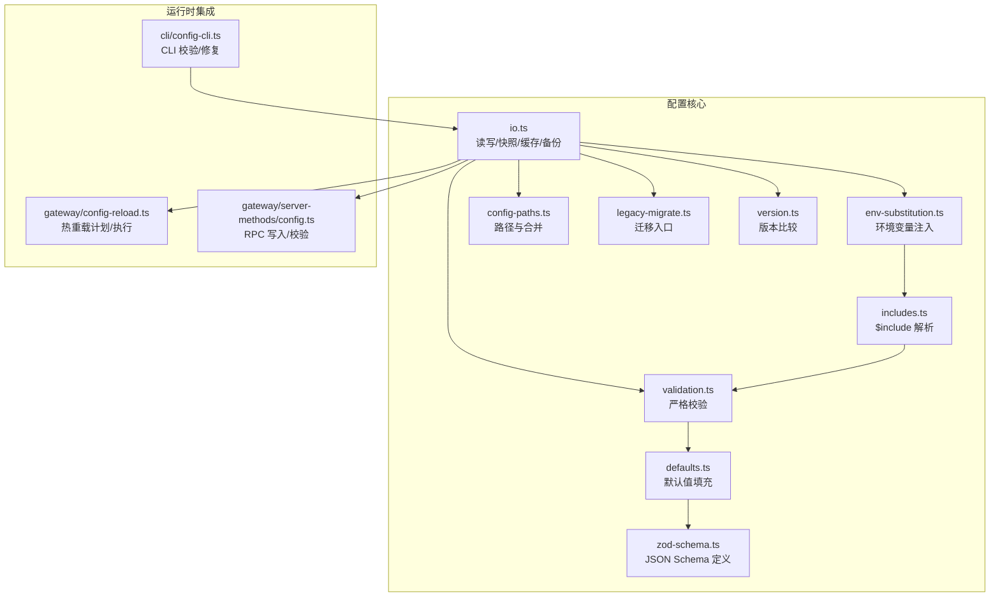
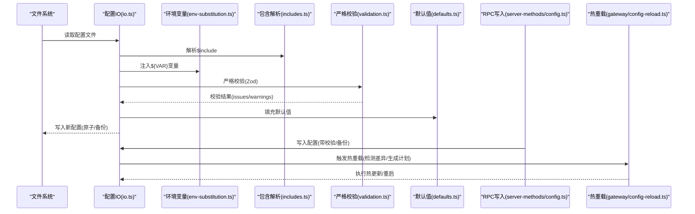
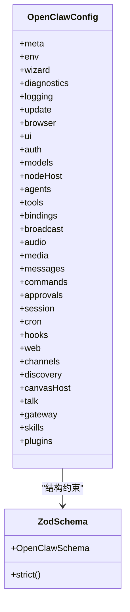
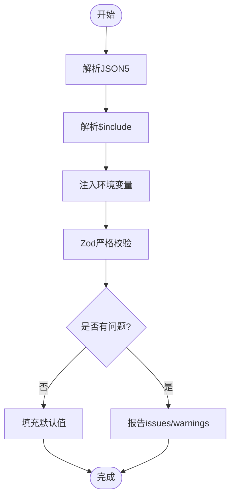
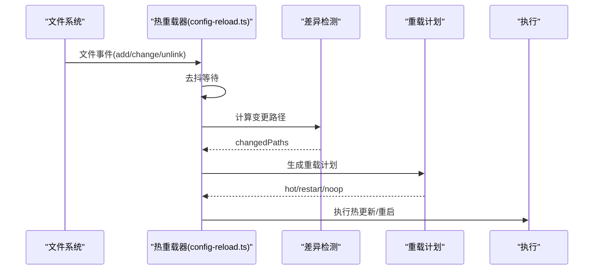
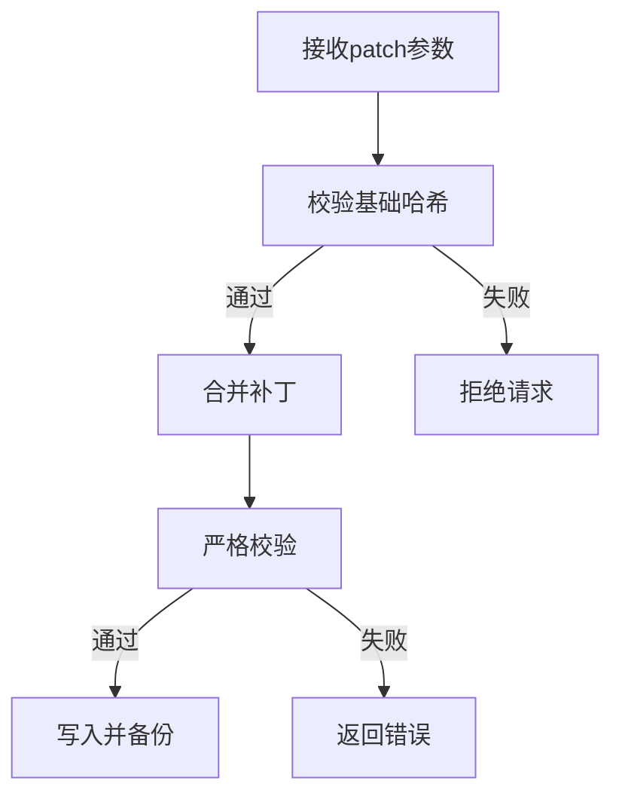
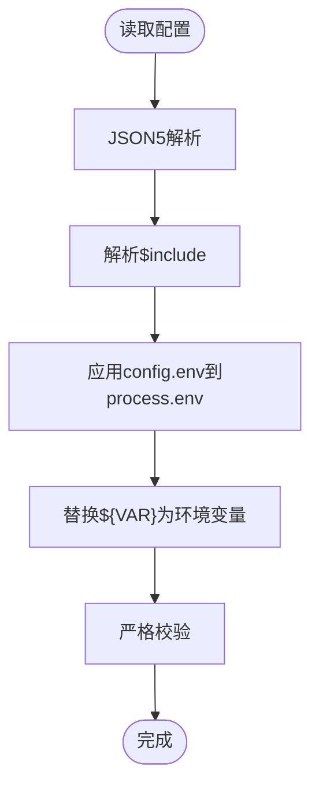
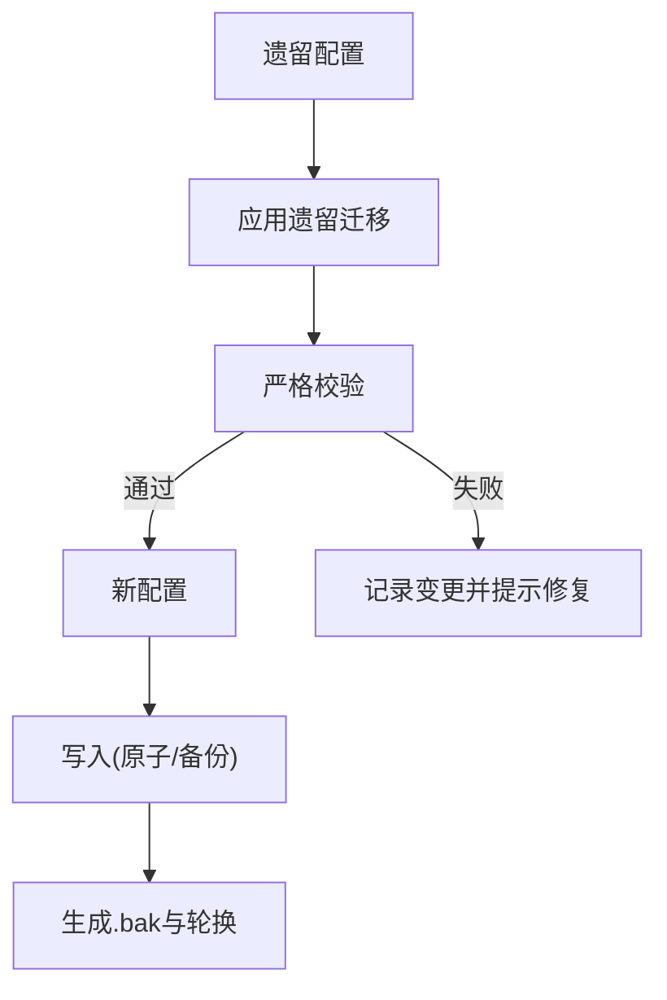
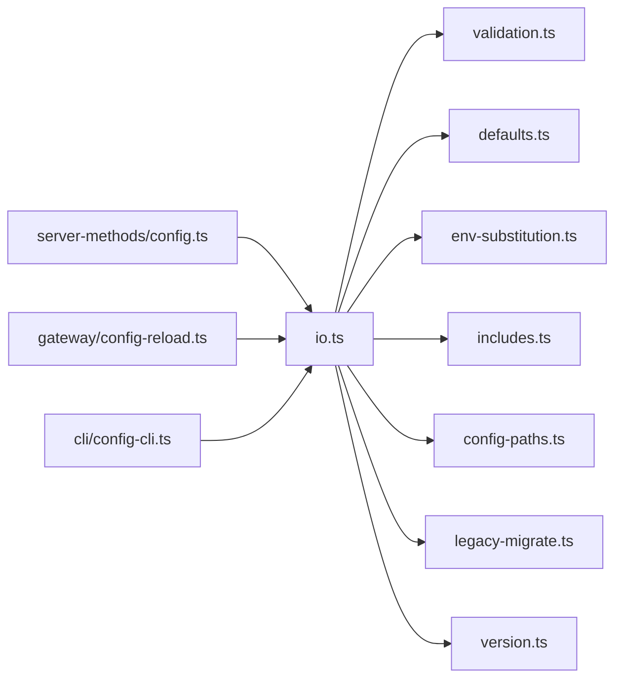

# 配置管理机制

## 目录
1. [简介](#简介)
2. [项目结构](#项目结构)
3. [核心组件](#核心组件)
4. [架构总览](#架构总览)
5. [详细组件分析](#详细组件分析)
6. [依赖关系分析](#依赖关系分析)
7. [性能考虑](#性能考虑)
8. [故障排除指南](#故障排除指南)
9. [结论](#结论)
10. [附录](#附录)

## 简介
本文件系统性阐述 OpenClaw 的配置管理机制，涵盖配置文件结构设计、严格验证与默认值处理、层次化管理与继承覆盖策略、热重载与动态更新、加密存储与敏感信息保护、配置迁移与版本兼容性、模板与环境变量注入、以及外部配置源集成。文档同时提供面向运维与开发者的最佳实践与排障指南。

## 项目结构
OpenClaw 的配置管理主要位于 `src/config` 目录，围绕“解析-校验-默认值-写入-备份”的闭环展开，并通过 `src/gateway/config-reload.ts` 提供热重载能力，配合 CLI 与网关 RPC 支持配置的读取、修改与持久化。

## 核心组件
- 配置 IO 层：负责配置文件的读取、解析、校验、默认值填充、写入、备份与缓存。
- 严格验证层：基于 Zod Schema 的严格模式，拒绝未知字段，确保配置结构与语义正确。
- 默认值层：针对模型、代理、会话、日志等维度进行默认值填充与优化。
- 环境变量注入：支持 `${VAR}` 语法与转义，运行时注入 process.env。
- 热重载引擎：基于 chokidar 监控配置文件变化，生成重载计划并执行热更新或重启。
- 迁移与版本：提供遗留配置迁移入口与版本比较工具，保障向后兼容与回滚。

## 架构总览
下图展示了配置从磁盘到运行时的完整流转：解析、注入、校验、默认值、写入、备份与热重载。

## 详细组件分析

### 配置文件结构与层次化管理
- 结构设计：采用分层配置模型，顶层包含 `meta`、`env`、`wizard`、`diagnostics`、`logging`、`update`、`browser`、`ui`、`auth`、`models`、`nodeHost`、`agents`、`tools`、`bindings`、`broadcast`、`audio`、`media`、`messages`、`commands`、`approvals`、`session`、`cron`、`hooks`、`web`、`channels`、`discovery`、`canvasHost`、`talk`、`gateway`、`skills`、`plugins` 等域。
- 严格模式：Zod Schema 使用 `.strict()` 限制未知字段，避免遗留键自动通过。
- 继承与覆盖：通过 `merge-config.ts` 与 `merge-patch.ts` 实现配置片段的合并与补丁，支持数组与对象的递归合并与覆盖策略。
- 路径与定位：`config-paths.ts` 提供路径解析与安全校验，防止越权访问。

### 验证规则与默认值处理
- 严格验证：`validation.ts` 对配置进行 Zod 校验，并额外检查代理头像路径合法性、重复代理工作空间目录、心跳目标有效性、插件存在性与 schema 缺失问题等。
- 默认值填充：`defaults.ts` 针对模型、代理并发、日志、上下文修剪、压缩模式等进行默认值填充与优化，保证最小可用配置集。
- 版本提示：当配置来自未来版本时，会发出警告，避免功能不兼容。

### 热重载机制与动态更新
- 变更检测：`diffConfigPaths` 递归对比前后配置，识别变更路径集合。
- 重载策略：根据配置前缀匹配规则，区分“热更新”、“重启”和“忽略”，并生成重载计划。
- 执行流程：`startGatewayConfigReloader` 基于 chokidar 监听配置文件变化，去抖后计算差异并执行热更新或重启。
- RPC 写入：网关 RPC 接口在写入前进行校验与备份，确保一致性与可回滚。

### 配置变更监听与覆盖策略
- 监听策略：基于 chokidar 的文件监控，支持轮询模式以适配测试环境。
- 覆盖策略：通过 `merge-patch.ts` 与 `merge-config.ts` 实现增量覆盖，数组采用替换策略，对象递归合并。
- 基线校验：RPC 写入前要求客户端提供“基础哈希”，若配置自上次读取后发生过变更则拒绝，确保并发安全。

### 环境变量注入与外部配置源
- 环境变量注入：支持 `${VAR}` 语法，仅匹配大写变量名，缺失时抛出明确错误；支持转义 `$${VAR}` 输出字面量。
- 外部配置源：通过 `$include` 引用外部 JSON/JSON5 文件，实现配置拆分与复用。
- Shell 环境回退：在无配置文件时，可从 Shell 环境加载预期变量，便于容器/CI 场景。

### 加密存储、敏感信息保护与访问控制
- 敏感字段识别：UI 提示与 Schema 标记敏感字段（如 token、password、api_key），便于界面保护与日志脱敏。
- 日志脱敏：默认启用工具摘要脱敏，支持自定义脱敏模式与正则。
- 磁盘安全：官方文档建议对状态目录设置严格权限，推荐使用全盘加密与专用用户。
- 平台密钥链：iOS 端使用 Keychain 存储敏感字符串，提供加载与保存接口。

### 配置迁移、版本兼容性与回滚策略
- 迁移入口：`legacy-migrate.ts` 将遗留迁移应用到配置，随后进行严格校验，若仍无效则记录变更并提示手动修复。
- 版本比较：`version.ts` 提供版本解析与比较，用于判断配置是否来自未来版本并给出警告。
- 回滚策略：写入时先创建临时文件，再原子重命名；若目标存在则旋转备份并生成 `.bak`，支持快速回滚。

### 配置模板与最佳实践
- 模板建议：参考各渠道文档中的最小配置示例，结合自身环境选择合适的认证方式与 DM 策略。
- 最佳实践：
  - 使用严格模式，避免未知字段导致的隐性行为。
  - 将敏感信息放入环境变量并通过 `${VAR}` 注入。
  - 启用日志脱敏与定期清理会话记录。
  - 通过 RPC 或 CLI 修改配置时，先获取基础哈希并进行校验。
  - 在生产环境使用原子写入与备份，确保可回滚。

## 依赖关系分析
配置管理模块之间的耦合度低，职责清晰：IO 层负责文件与缓存，验证层独立于具体领域，热重载层与 RPC 层通过统一的快照接口交互。

## 性能考虑
- 配置缓存：IO 层支持可配置的缓存时间，减少频繁读取开销。
- 去抖策略：热重载器对文件事件进行去抖，降低高频变更带来的抖动。
- 原子写入：写入采用临时文件 + 原子重命名，避免部分写入风险。
- 轮询模式：测试环境下启用轮询，确保稳定性。

## 故障排除指南
- 配置无效：使用 `openclaw doctor` 修复，查看 issues 列表逐项修正。
- 环境变量缺失：检查 `${VAR}` 是否在环境中设置，注意大小写与转义。
- 热重载未生效：确认 `gateway.reload.mode` 设置与变更路径是否命中“热更新”规则。
- 写入冲突：RPC 写入前需提供基础哈希，若提示“配置自上次加载后已更改”，请先重新获取快照。
- 权限问题：确保状态目录与文件权限为 `700/600`，必要时启用全盘加密。

## 结论
OpenClaw 的配置管理以严格验证为核心，结合默认值填充、环境变量注入、热重载与原子写入备份，形成高可靠、可演进的配置体系。通过清晰的层次化结构与严格的覆盖策略，既保证了易用性，也确保了安全性与可维护性。建议在生产环境中遵循本文档的最佳实践，配合日志脱敏与定期审计，持续提升系统的稳定性与安全性。

## 附录
- 关键实现路径参考：
  - 配置加载与写入：[src/config/io.ts](file://src/config/io.ts#L212-L321), [src/config/io.ts](file://src/config/io.ts#L480-L537)
  - 严格校验与插件校验：[src/config/validation.ts](file://src/config/validation.ts#L136-L361)
  - 默认值填充：[src/config/defaults.ts](file://src/config/defaults.ts#L172-L470)
  - 环境变量注入：[src/config/env-substitution.ts](file://src/config/env-substitution.ts#L1-L134)
  - 热重载计划与执行：[src/gateway/config-reload.ts](file://src/gateway/config-reload.ts#L138-L356)
  - RPC 写入与基线校验：[src/gateway/server-methods/config.ts](file://src/gateway/server-methods/config.ts#L173-L198), [src/gateway/server-methods/config.ts](file://src/gateway/server-methods/config.ts#L332-L362)
  - 迁移与版本比较：[src/config/legacy-migrate.ts](file://src/config/legacy-migrate.ts#L1-L20), [src/config/version.ts](file://src/config/version.ts#L1-L50)