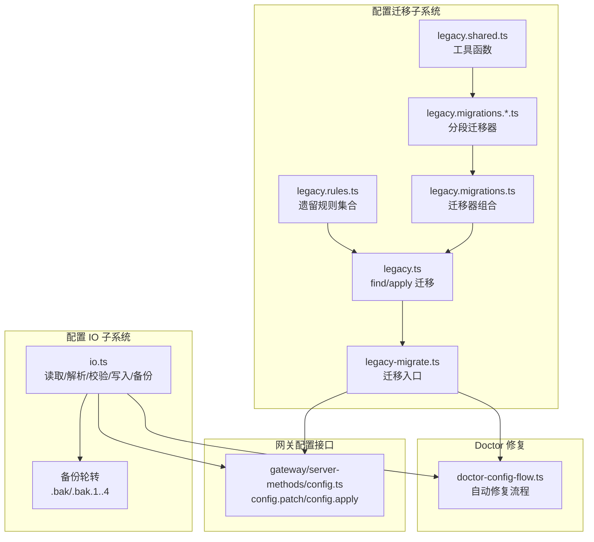
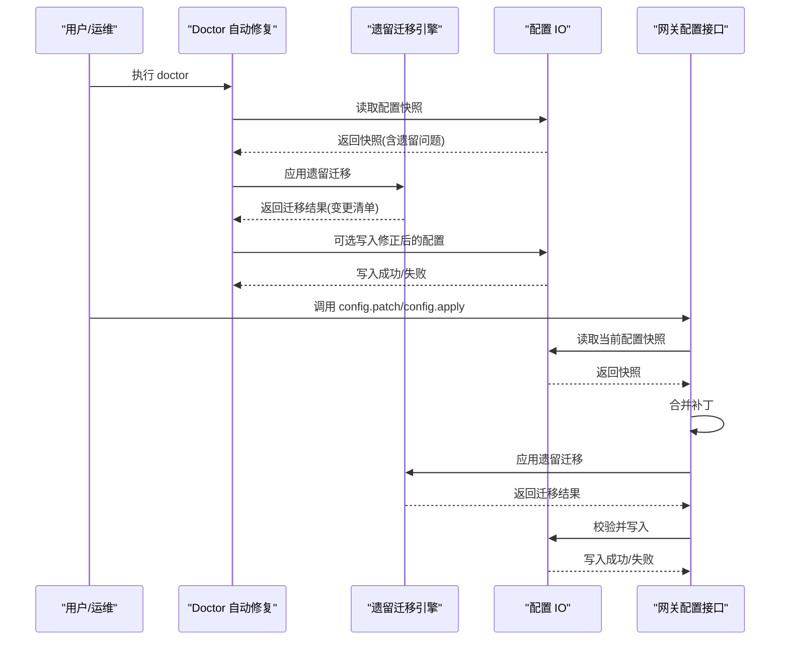
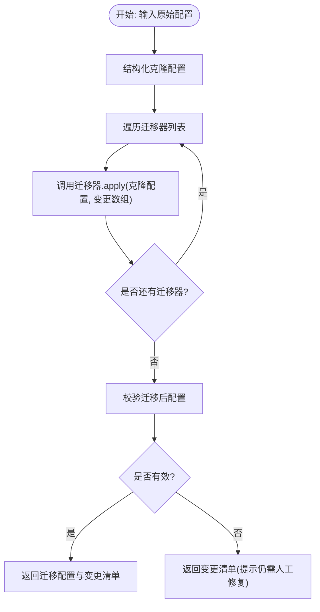
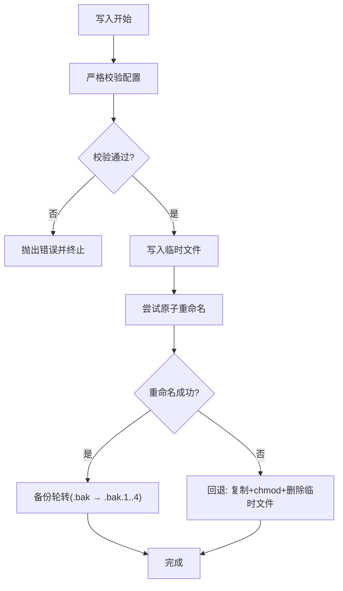
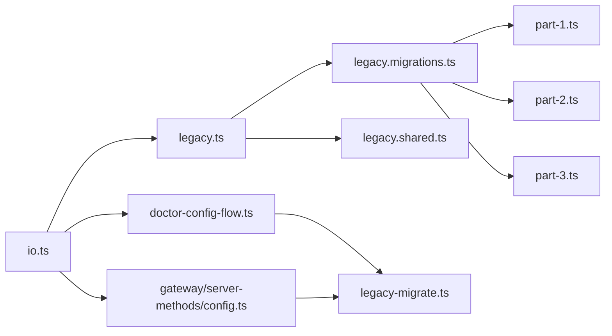

# 配置迁移策略

## 目录
1. [引言](#引言)
2. [项目结构](#项目结构)
3. [核心组件](#核心组件)
4. [架构总览](#架构总览)
5. [详细组件分析](#详细组件分析)
6. [依赖关系分析](#依赖关系分析)
7. [性能考量](#性能考量)
8. [故障排查指南](#故障排查指南)
9. [结论](#结论)
10. [附录](#附录)

## 引言
本文件系统化阐述 OpenClaw 的配置迁移策略，覆盖设计理念、迁移算法、版本管理、遗留配置检测、迁移规则与转换逻辑、幂等性与回滚保障、用户数据影响评估与备份策略、自动化与手动干预流程、迁移脚本示例、测试与验证方法、监控与日志、以及面向运维的操作手册与应急预案。目标是帮助运维与开发团队在升级、迁移或修复配置时，安全、可追溯、可回滚地完成变更。

## 项目结构
OpenClaw 的配置迁移能力由“遗留配置检测与迁移 + 配置读写与备份 + Doctor 自动修复 + 网关配置接口”四部分协同实现：
- 遗留配置检测与迁移：定义规则与迁移器，按顺序执行，生成变更清单
- 配置读写与备份：读取/解析/校验/默认值注入/路径规范化/写入与多级备份
- Doctor 自动修复：扫描并应用遗留迁移、标准化配置、插件自动启用、清理未知键
- 网关配置接口：提供配置补丁与应用接口，内置遗留迁移与校验

## 核心组件
- 遗留规则与迁移器
  - 规则集合：定义哪些旧字段存在、如何提示迁移
  - 迁移器：按序执行，修改原始配置树，收集变更说明
  - 工具函数：类型检查、记录合并、默认代理、代理列表映射、代理 ID 解析与确保
- 配置 IO
  - 解析 JSON5、处理 `$include`、环境变量替换、校验与默认值注入、路径规范化、写入与原子重命名、多级备份轮转
- Doctor 自动修复
  - 识别遗留配置、应用迁移、标准化值、插件自动启用、清理未知键、交互确认与写入
- 网关配置接口
  - 提供 `config.patch` 与 `config.apply`，内部先合并补丁，再应用遗留迁移，最后校验并写入

## 架构总览
配置迁移贯穿“读取—迁移—校验—写入”的闭环，同时在 Doctor 与网关接口中分别体现自动化与受控应用两种路径。

## 详细组件分析

### 遗留配置检测与迁移引擎
- 设计理念
  - 将“遗留键识别”与“迁移动作”解耦：规则用于发现，迁移器负责转换
  - 迁移器以纯函数形式存在，输入输出均为配置树，便于组合与测试
- 迁移算法
  - 顺序执行：按分段迁移器数组依次应用，累计变更说明
  - 结构化克隆：每次应用前复制输入配置，避免副作用
  - 变更收集：每个迁移器在必要时向变更数组追加描述
- 版本管理
  - 通过迁移器 `id` 与 `describe` 字段标识版本语义，便于审计与回溯
- 幂等性
  - 若某迁移条件已满足（如目标键已存在），迁移器会跳过，保证重复执行无副作用
- 回滚机制
  - 通过写入前的多级备份轮转实现，见“备份策略”
- 错误恢复
  - 迁移后若仍不合法，返回变更清单但不写入，提示人工修复

### 迁移规则与转换逻辑
- 分段迁移器
  - part-1：频道匹配键迁移、消息队列键迁移、`provider` 到 `channel` 的迁移、路由层键迁移等
  - part-2：模型配置迁移、路由 `agents` 与默认代理迁移、路由配置迁移、音频转录迁移等
  - part-3：认证模式迁移、工具别名迁移、TTS 开关迁移、`agent` 默认项迁移、身份迁移等
- 转换逻辑要点
  - 记录合并：优先保留目标已有设置，避免覆盖
  - 键名迁移：从旧键复制到新键，删除旧键
  - 值域映射：如音频转录 CLI 映射为新结构
  - 默认代理解析：根据 `agents.list` 或 `routing.defaultAgentId` 推断默认代理 ID

### 配置 IO 与备份策略
- 读取流程
  - 支持 JSON5 解析、`$include` 解析、环境变量注入与替换、严格校验、默认值注入、路径规范化、告警与未来版本警告
- 写入流程
  - 校验通过后写入临时文件，再尝试原子重命名；Windows 下回退为复制+chmod+删除临时文件
  - 写入前进行多级备份轮转（`.bak` → `.bak.1` → … → `.bak.4`；超过上限删除最高级）
- 备份策略
  - 保持最多 5 个历史备份，确保可回滚
  - 写入失败时保留现有配置，避免破坏

### Doctor 自动修复流程
- 自动迁移遗留配置
  - 读取配置快照，若存在遗留问题，应用迁移并输出变更清单
- 标准化与清理
  - 标准化遗留配置值、插件自动启用、清理未知键
- 交互确认与写入
  - 非交互模式下仅报告；交互模式下询问是否应用并写入

### 网关配置接口中的迁移
- `config.patch`
  - 先解析补丁为 JSON5，合并到当前配置
  - 应用遗留迁移，再严格校验，通过后写入
- `config.apply`
  - 直接解析并严格校验，通过后写入

## 依赖关系分析
- 组件耦合
  - 遗留迁移引擎独立于 IO 与网关接口，通过统一的 `applyLegacyMigrations` 与 `migrateLegacyConfig` 调用
  - Doctor 与网关接口均复用 IO 的读取与写入能力
- 外部依赖
  - JSON5 解析、文件系统操作、进程环境变量
- 潜在循环
  - 未发现直接循环依赖；迁移器仅作用于配置树，不反向依赖上层模块

## 性能考量
- 迁移复杂度
  - 迁移器按配置树深度线性扫描，整体复杂度 O(N)，其中 N 为配置节点数
  - 多次遍历（规则检查、迁移器链）叠加常数因子，通常可接受
- IO 性能
  - 写入采用临时文件+原子重命名，减少锁竞争与部分写风险
  - 备份轮转为顺序重命名，时间复杂度 O(B)，B 为备份层级数（固定小常数）
- 缓存
  - 配置读取支持短时缓存，降低频繁读取开销

[本节为通用指导，无需具体文件分析]

## 故障排查指南
- 常见问题
  - 配置无效：检查 Doctor 输出的遗留问题与校验错误，按提示修复
  - 写入失败：查看 IO 层错误码（如 EPERM/EEXIST），确认权限与平台差异
  - 未来版本警告：提示配置由更高版本写入，建议同步升级
- 诊断步骤
  - 运行 Doctor 获取完整诊断与建议
  - 查看状态命令中的配置问题汇总
  - 检查备份文件是否存在与内容
- 回滚
  - 使用 `.bak/.bak.1..4` 进行手工回滚
  - 如需自动回滚，可在写入失败时保留现有配置

## 结论
OpenClaw 的配置迁移策略以“规则驱动 + 迁移器链 + 严格校验 + 多级备份”为核心，既保证了自动化修复与兼容性，又提供了可观测性与可回滚能力。通过 Doctor 与网关接口的双重入口，运维可以在不同场景下安全地应用迁移与修复。

[本节为总结，无需具体文件分析]

## 附录

### 迁移脚本示例（概念性）
- 自动迁移遗留配置
  - 读取配置快照 → 应用遗留迁移 → 校验 → 写入（可选）
- 手动干预
  - Doctor 交互确认 → 用户选择是否写入 → 执行写入
- 强制迁移
  - 在非交互模式下，Doctor 仅报告不写入；如需强制，结合脚本在受控环境中执行

[本节为概念性说明，无需具体文件分析]

### 迁移测试与验证
- 单元测试
  - 备份轮转测试：验证最多保留 5 个备份
- 集成测试
  - Doctor 自动修复流程：覆盖遗留迁移、标准化、未知键清理
- 验证方法
  - 对比迁移前后配置树结构与变更清单
  - 通过状态命令与 Doctor 输出核验配置有效性

### 监控指标、日志与故障诊断
- 指标
  - 配置读取/写入耗时、失败次数、备份轮转次数
- 日志
  - 配置警告（如未来版本、未知键）、迁移变更清单、写入回退路径
- 诊断
  - Doctor 输出、状态命令汇总、备份文件检查

### 运维操作手册与应急预案
- 迁移指南
  - 机器间迁移：迁移状态目录与工作区，运行 Doctor，重启服务
- 更新与回滚
  - 推荐重新运行安装器，执行 Doctor，健康检查
  - 回滚：全局安装可固定版本，源码安装可切换到指定提交
- 应急预案
  - 写入失败：检查权限与磁盘空间，回退到最近备份
  - 配置损坏：使用 `.bak.*` 文件恢复，必要时清空配置重建