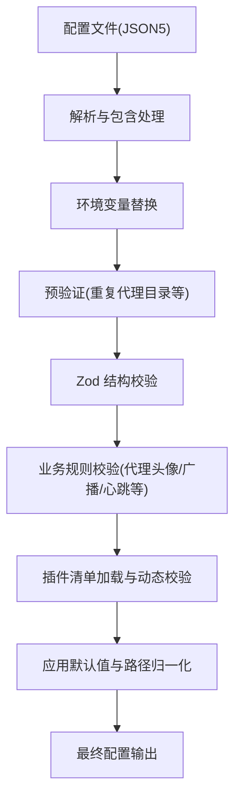
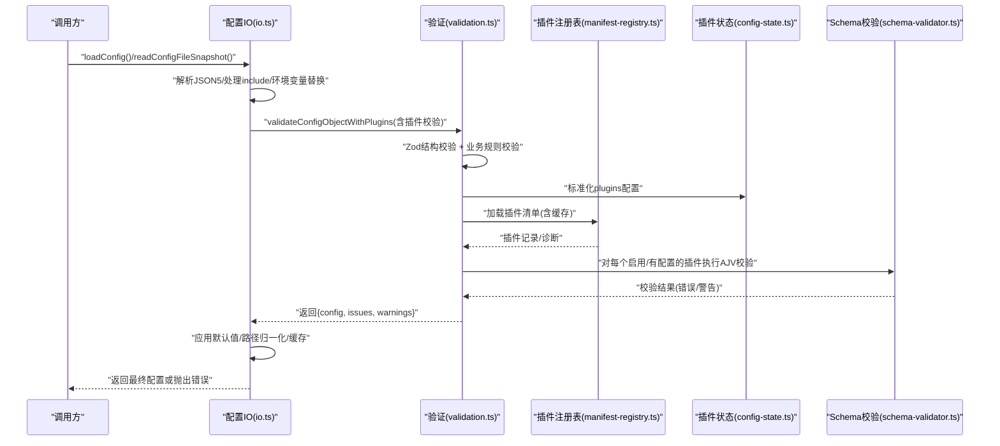
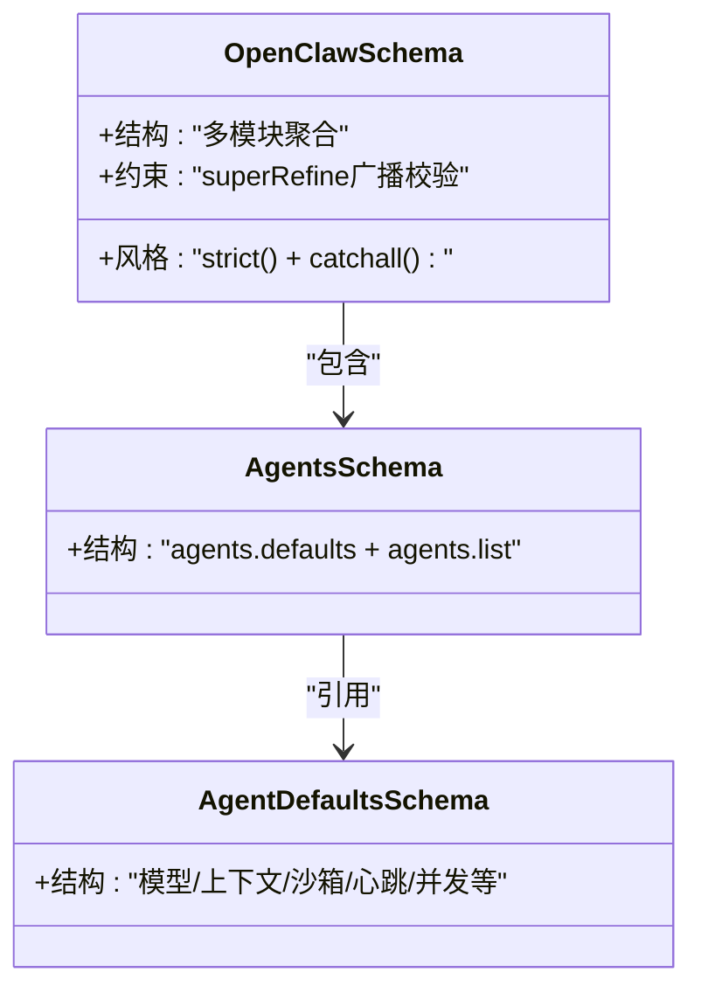
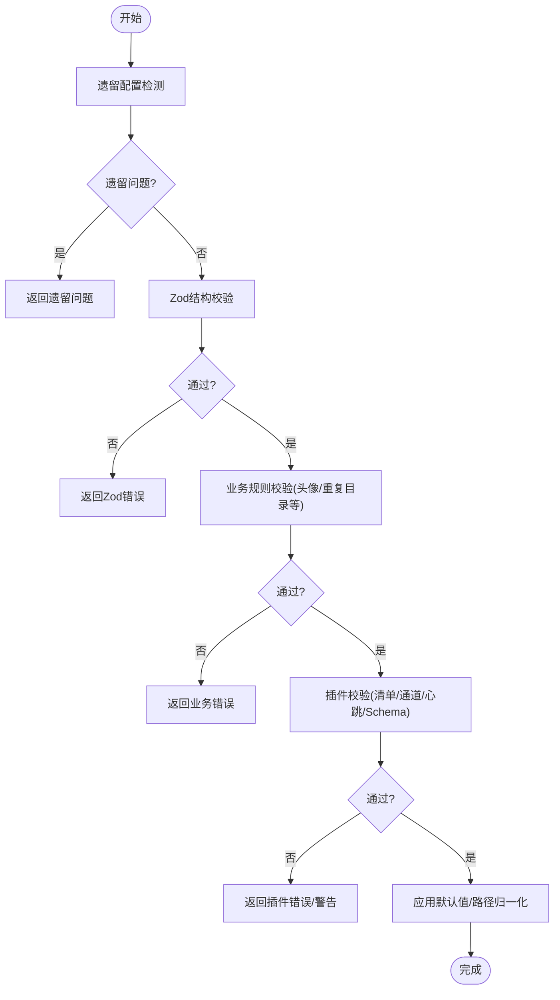
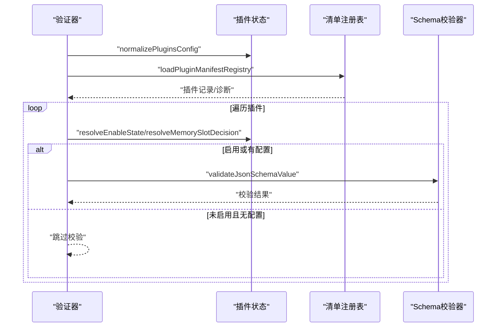
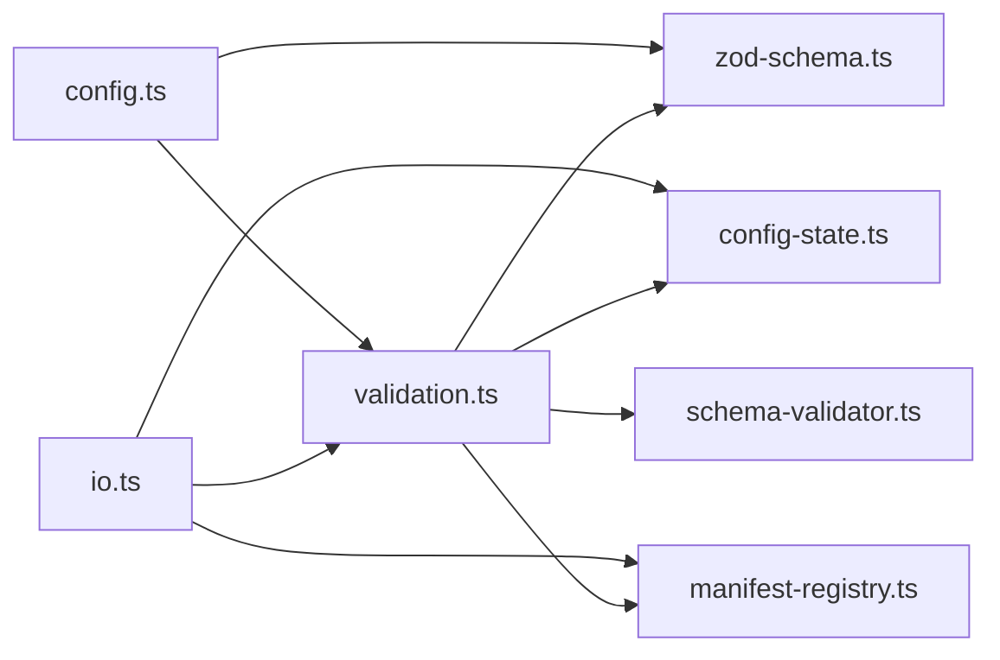

# 配置验证机制

## 目录
1. [简介](#简介)
2. [项目结构](#项目结构)
3. [核心组件](#核心组件)
4. [架构总览](#架构总览)
5. [详细组件分析](#详细组件分析)
6. [依赖关系分析](#依赖关系分析)
7. [性能考量](#性能考量)
8. [故障排除指南](#故障排除指南)
9. [结论](#结论)
10. [附录](#附录)

## 简介
本文件系统性阐述 OpenClaw 的配置验证机制，覆盖架构设计、验证规则与错误处理策略、Zod 模式验证、类型安全与运行时检查、层次化处理、插件验证集成与动态验证、验证失败处理流程、错误信息生成与用户反馈、性能优化与缓存策略、批量验证、自定义验证器与扩展机制，以及调试工具、日志记录与故障排除方法。目标是帮助开发者在不深入源码的前提下，快速理解并扩展配置验证体系。

## 项目结构
OpenClaw 的配置验证围绕“配置读取/写入”和“验证流水线”两条主线展开：
- 配置 IO：负责解析 JSON5、处理 include/env 变量替换、路径归一化、默认值注入、缓存与备份等。
- 验证流水线：先进行 Zod 结构校验，再执行业务规则校验（如代理头像路径、心跳目标、插件清单与配置 Schema 校验）。

## 核心组件
- Zod 模式定义：集中于 `zod-schema.ts`，按功能模块拆分（代理、通道、会话、钩子、网关等），并在根级 schema 中通过 superRefine 执行跨字段约束。
- 配置验证器：`validation.ts` 提供 `validateConfigObject` 与 `validateConfigObjectWithPlugins`，分别用于基础结构校验与插件集成校验。
- 插件配置状态：`config-state.ts` 将 plugins 配置标准化，便于启用/禁用决策与内存槽位选择。
- 插件清单注册表：`manifest-registry.ts` 加载插件清单，构建插件记录并缓存，支持 schema 缓存键与诊断收集。
- 插件 Schema 校验器：`schema-validator.ts` 使用 AJV 对插件配置进行 JSON Schema 校验，并缓存编译后的校验器。
- 配置 IO：`io.ts` 负责配置的读取、快照、写入、缓存与错误处理，串联所有验证步骤。

## 架构总览
下图展示从配置文件到最终可用配置的关键调用链与职责划分：

## 详细组件分析

### Zod 模式验证与类型安全
- 分层模式组织：`zod-schema.ts` 作为根模式，聚合各子模块模式；例如代理相关模式位于 `zod-schema.agents.ts`，代理默认值位于 `zod-schema.agent-defaults.ts`。
- 严格模式与 catchall：根模式使用 strict() 限制未知字段，同时对 env 等部分使用 catchall 允许扩展。
- 跨字段约束：通过 superRefine 在根级对广播目标与代理列表进行一致性校验，确保广播引用的代理 ID 存在于 `agents.list`。
- 类型安全：所有模式均导出 Zod 类型，配合 TypeScript 实现编译期类型检查与运行时校验。

### 配置验证流水线与错误处理
- 基础校验：`validateConfigObject` 先检测遗留配置问题，再执行 Zod safeParse，最后进行业务规则校验（如代理头像路径合法性、重复代理目录）。
- 插件校验：`validateConfigObjectWithPlugins` 在基础校验之上，加载插件清单、校验未知通道/心跳目标、校验插件 entries/allow/deny/slots 中的 ID 是否存在，并对启用或有配置的插件执行 JSON Schema 校验。
- 错误与警告：统一以 `ConfigValidationIssue` 形式返回，包含 path 与 message；写入配置时若失败直接抛错，读取快照时将 issues/warnings 透传给调用方。

### 插件验证集成与动态验证
- 清单加载与缓存：`manifest-registry.ts` 支持基于工作区与 plugins 配置的缓存键，避免重复扫描；对重复 ID、ID 不匹配等发出诊断。
- 启用/禁用与内存槽位：`config-state.ts` 标准化 plugins 配置，结合 `resolveEnableState` 与 `resolveMemorySlotDecision` 决定插件是否启用及是否占用内存槽位。
- 动态 Schema 校验：`schema-validator.ts` 使用 AJV 对插件配置进行 JSON Schema 校验，支持缓存编译后的校验器，提升批量校验性能。

### 运行时检查与类型安全
- 运行时检查：代理头像路径合法性检查、心跳目标合法性检查、未知通道/心跳目标检查、广播目标一致性检查等。
- 类型安全：Zod 模式与 TypeScript 类型强绑定，确保编译期与运行时双重保障；根级 schema 的 strict() 限制未知字段，减少运行时歧义。

### 配置 IO 与用户反馈
- 读取流程：解析 JSON5 -> 处理 include -> 应用 `config.env` -> 环境变量替换 -> 预验证重复目录 -> 结构校验 -> 插件校验 -> 应用默认值/路径归一化 -> 缓存。
- 写入流程：先结构校验与插件校验，失败则抛错；成功后写入临时文件并原子重命名，同时维护备份。
- 用户反馈：issues/warnings 以路径+消息形式输出；对无效配置抛出带 details 的错误；对未来版本配置给出警告。

### 验证失败处理流程
- 读取失败：记录详细问题列表，阻止继续执行；对重复代理目录抛出特定错误类型。
- 写入失败：直接抛出错误，错误信息包含首个问题的路径与消息。
- 快照模式：将 issues/warnings 与 legacyIssues 一并返回，便于 UI 或 CLI 展示。

### 验证规则示例与扩展点
- 代理头像路径：仅允许工作区内相对路径、HTTP(S) URL 或 data URI；禁止波浪号开头与非 Windows 绝对路径方案。
- 心跳目标：允许 `"last"`/`"none"`、已知通道、规范化后的聊天通道 ID，以及插件声明的通道。
- 广播一致性：广播目标必须存在于 `agents.list`。
- 插件校验：未知插件 ID、未知通道、未知心跳目标、插件 Schema 缺失或校验失败均产生错误；未启用但存在配置产生警告。

## 依赖关系分析
- `validation.ts` 依赖 `zod-schema.ts`、plugins 配置状态与清单注册表、插件 Schema 校验器。
- `io.ts` 串联解析、包含、环境变量替换、预验证、结构校验、插件校验与默认值应用。
- `config.ts` 作为导出入口，统一暴露验证函数与模式。

## 性能考量
- 编译器缓存：AJV 校验器按 schema 缓存，避免重复编译；插件清单注册表按工作区与 plugins 配置构建缓存键，支持 TTL 控制。
- 配置缓存：配置读取支持按环境变量控制的缓存 TTL，减少重复 IO。
- 批量校验：对多个插件的同一 schema，复用已编译校验器，降低开销。
- 早停策略：遇到遗留配置或 Zod 失败立即返回，避免后续昂贵操作。

## 故障排除指南
- 常见错误定位
  - JSON5 解析失败：检查配置语法与注释使用。
  - include 解析失败：确认被包含文件路径正确。
  - 环境变量替换失败：确认所需环境变量已设置或已在 `config.env` 中声明。
  - 未知插件 ID/通道/心跳目标：核对 `plugins.entries`/`allow`/`deny`/`slots` 与插件清单。
  - 插件 Schema 校验失败：根据返回的路径与消息修正配置。
- 日志与输出
  - 读取配置失败：错误对象带有 `code=INVALID_CONFIG` 与 details 字段，包含逐条问题。
  - 写入配置失败：抛出错误，消息包含首个问题的路径与描述。
  - 快照模式：issues/warnings/legacyIssues 三类信息完整返回。
- 调试建议
  - 使用 `readConfigFileSnapshot` 获取结构化错误与诊断。
  - 逐步缩小范围：先验证基础结构，再开启插件校验。
  - 检查 `OPENCLAW_*` 环境变量与缓存开关。

## 结论
OpenClaw 的配置验证机制通过 Zod 模式与业务规则相结合，实现了强类型安全与灵活的运行时检查；借助插件清单与 JSON Schema 的动态校验，既保证了扩展性又维持了稳定性。IO 层将解析、校验、默认值与缓存整合，形成清晰的流水线；错误处理与用户反馈完善，便于定位问题与修复。整体设计兼顾可维护性与性能，适合在复杂场景下持续演进。

## 附录

### 关键数据模型与类型
- 配置验证问题：包含 path 与 message 字段，用于精确定位与展示。
- 插件记录：包含 id、kind、channels、providers、skills、origin、manifestPath、schemaCacheKey、configSchema 等。
- 正常化插件配置：包含 enabled、allow、deny、loadPaths、slots、entries 等。