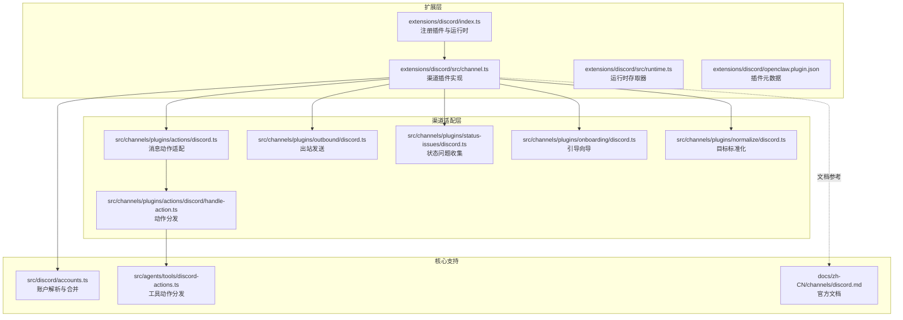
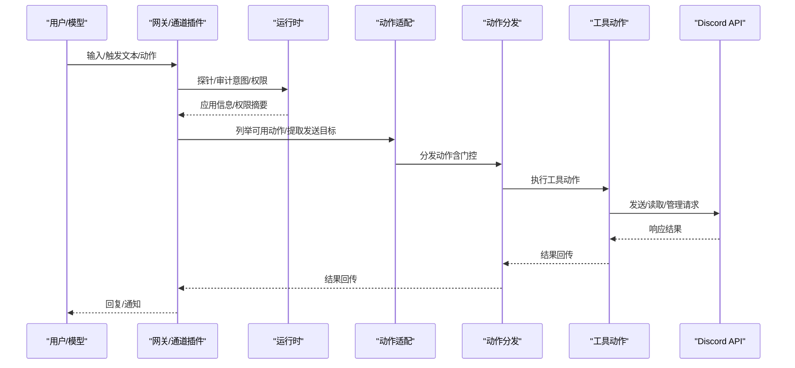
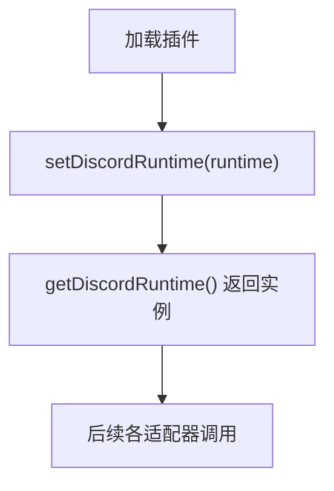
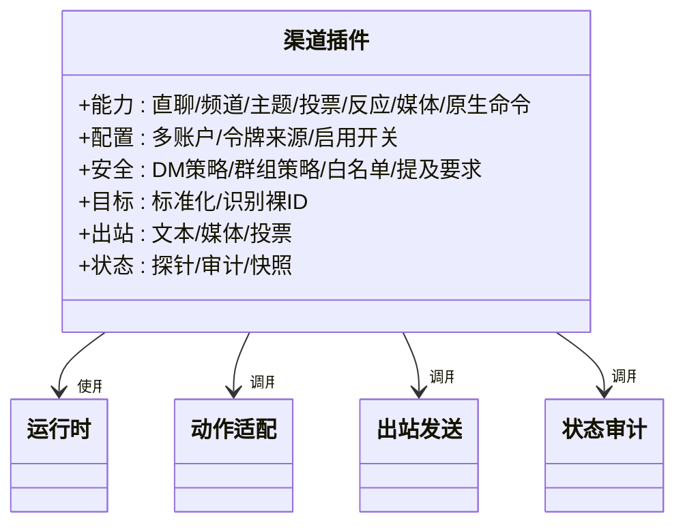
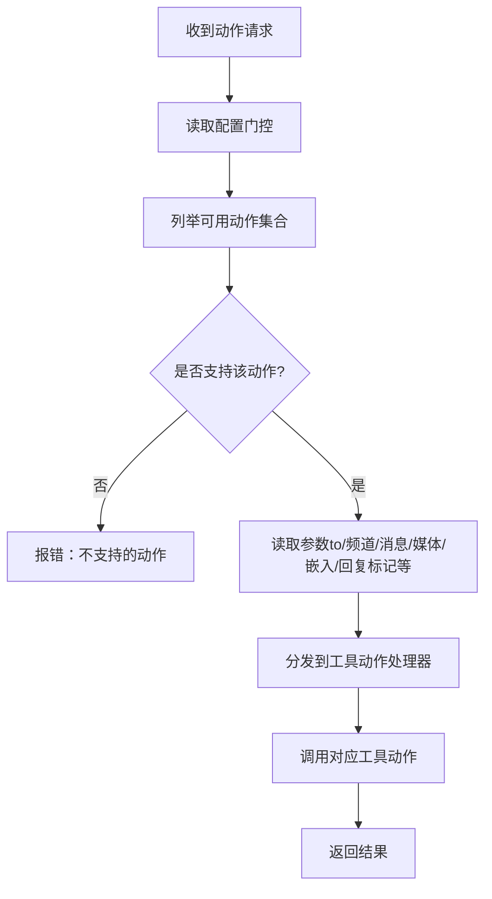
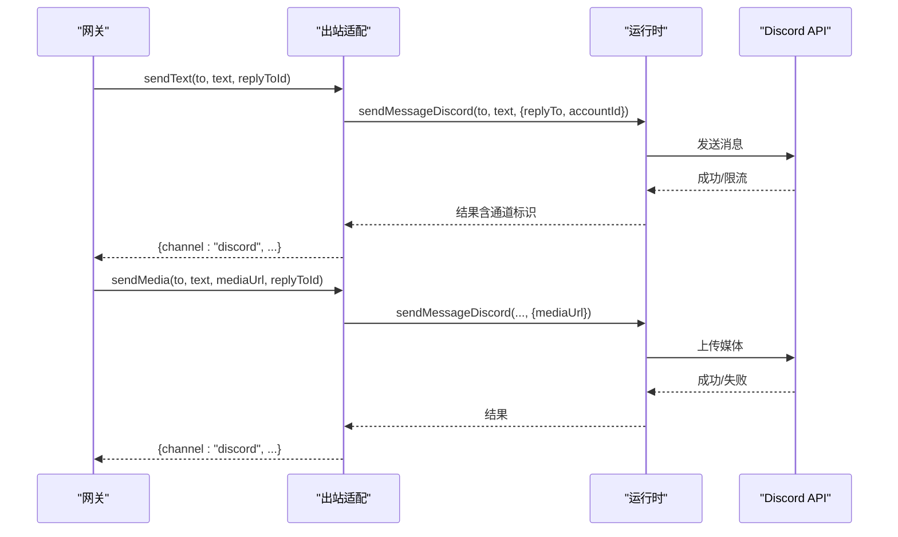
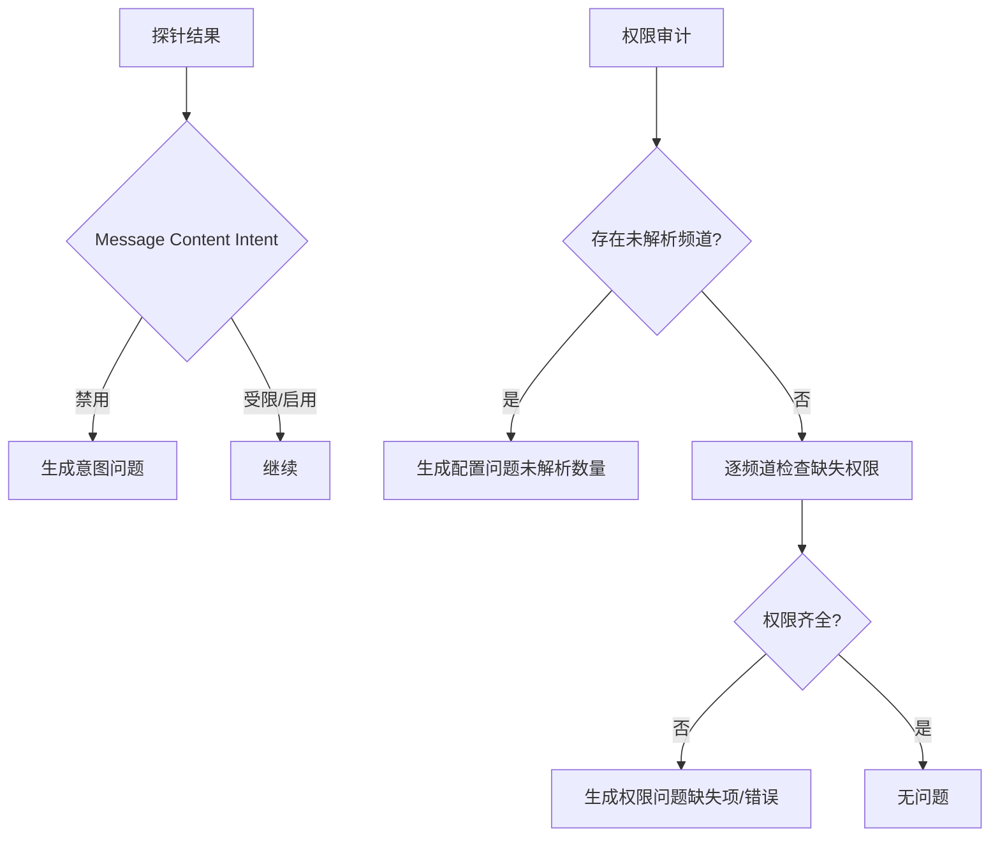
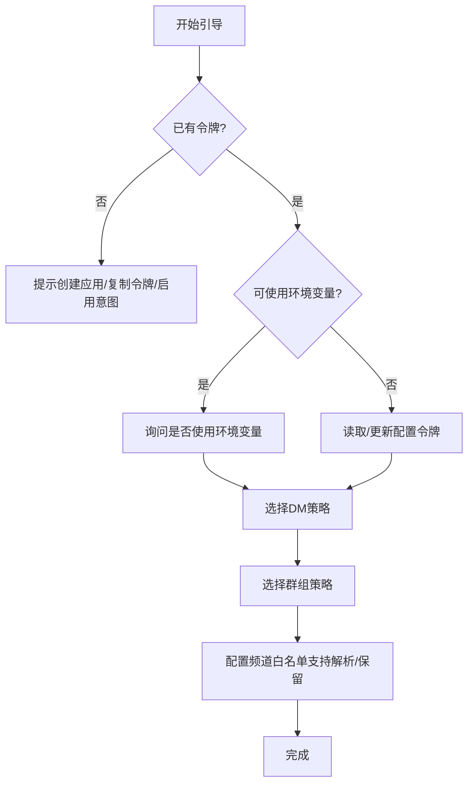
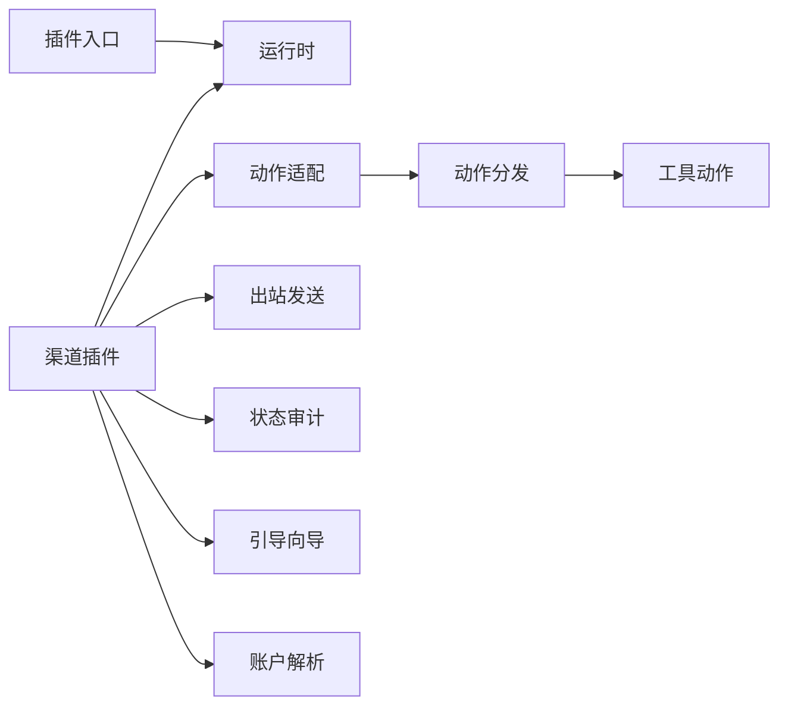

# Discord 渠道

## 目录
1. [简介](#简介)
2. [项目结构](#项目结构)
3. [核心组件](#核心组件)
4. [架构总览](#架构总览)
5. [详细组件分析](#详细组件分析)
6. [依赖关系分析](#依赖关系分析)
7. [性能考量](#性能考量)
8. [故障排查指南](#故障排查指南)
9. [结论](#结论)
10. [附录：配置参数与最佳实践](#附录配置参数与最佳实践)

## 简介
本文件面向使用 OpenClaw 的 Discord 渠道插件的开发者与运维人员，系统性阐述插件如何通过机器人令牌接入 Discord Bot API，如何进行服务器权限配置与频道路由，以及消息处理流程（文本、嵌入、媒体）与 Discord 特有功能（角色权限、语音状态、活动状态等）。同时提供配置参数清单、开发者门户使用指南、常见问题与排障建议。

## 项目结构
该插件位于扩展目录中，核心入口负责注册渠道并注入运行时；渠道插件定义了能力、安全策略、消息动作、出站发送、状态审计与引导向导等模块化能力。

## 核心组件
- 插件注册与运行时注入：插件入口负责设置运行时并注册渠道。
- 渠道插件：定义能力、配对、安全策略、群组策略、提及处理、线程模式、消息目标解析、目录查询、动作适配、出站发送、状态与审计、网关启动等。
- 动作适配与分发：将消息中的动作请求映射到具体工具动作，并按权限门控执行。
- 出站发送：封装文本、媒体与投票的发送逻辑，支持回复标记与分片。
- 状态与问题收集：从探针与权限审计中提取意图与权限问题，形成可操作的诊断提示。
- 引导向导：帮助用户完成令牌配置、DM 策略、群组策略与频道白名单的配置。
- 账户解析：多账户支持、默认账户、令牌来源优先级与配置合并。

## 架构总览
下图展示从用户输入到消息发送与动作执行的关键交互路径，包括令牌解析、意图检查、权限审计、动作门控与实际调用。

## 详细组件分析

### 插件注册与运行时
- 注册阶段：插件入口设置运行时并注册渠道，确保后续所有 Discord 操作通过统一运行时访问。
- 运行时存取：提供 get/set 访问器，未初始化时抛出错误，避免空引用。

### 渠道插件能力与配置
- 能力声明：支持直接私聊、群组频道与主题（线程），并具备投票、反应、媒体、原生命令等能力。
- 配置模式：构建渠道配置 Schema，支持多账户、默认账户、令牌来源（环境变量/配置）、启用开关、删除账户等。
- 安全策略：DM 策略（配对/允许列表/开放/禁用）、群组策略（开放/允许列表/禁用）、通道白名单、提及要求、执行审批按钮等。
- 目标解析：标准化消息目标（用户/频道/主题），识别裸 ID 并默认归类为频道，保证路由稳定。
- 出站发送：文本（含回复标记）、媒体（含回复标记）、投票（最多选项数限制）。
- 状态与审计：应用信息、意图状态、权限审计（未解析通道数、缺失权限项）、运行时快照（启动/停止时间、错误、最后收发时间）。

### 动作适配与分发
- 动作枚举：根据配置门控动态列出可用动作（反应、贴纸、投票、消息读写删、主题、钉选、搜索、成员/角色/表情/频道/语音/事件、频道管理、权限快照、适度管理等）。
- 工具动作：将消息动作转换为工具动作（如 `sendMessage`/`threadCreate`/`pinMessage` 等），并传递上下文参数（频道/消息/回复标记/媒体/嵌入等）。
- 管理员动作：在特定场景下尝试执行管理员类动作（如频道/角色/适度管理），失败则回退或报错。

### 出站发送与消息处理
- 文本消息：支持回复标记（`replyToId`），按字符上限分片，必要时按换行切分。
- 媒体消息：支持媒体 URL 上传，附带文本说明。
- 投票消息：支持多选项、单选/多选、时长（小时）。
- 目标标准化：将用户/频道/主题目标标准化为稳定路由键，裸数字 ID 默认视为频道。

### 安全与状态审计
- 意图检查：探测 Message Content Intent 状态（启用/受限/禁用），并给出相应提示或修复建议。
- 权限审计：对已配置的数值型频道 ID 进行权限检查，报告缺失权限与匹配来源；若使用名称/别名作为键，会提示无法审计。
- 状态汇总：聚合应用信息、机器人信息、探针结果、审计结果与运行时快照，用于诊断与 UI 展示。

### 引导向导与配置
- 令牌配置：支持环境变量（仅默认账户）与配置两种来源，提供快速确认与覆盖。
- DM 策略：支持配对、允许列表、开放、禁用四种策略，并可配置允许来源。
- 群组策略：支持开放、允许列表、禁用三种策略，结合频道白名单控制。
- 频道白名单：支持按服务器/频道键入，自动解析为数值 ID；保留无法解析条目以便后续审计。
- 用户名解析：在具备成员搜索权限时，将用户名解析为用户 ID；否则仅接受数值 ID 或提及形式。

### 多账户与令牌来源
- 多账户：支持 `channels.discord.accounts` 下的多个账户，每个账户可独立启用、命名与配置令牌。
- 默认账户：当未显式指定账户时，使用默认账户；默认账户可使用环境变量作为令牌来源。
- 令牌来源优先级：配置优先于环境变量（默认账户仅支持环境变量回退）。

## 依赖关系分析
- 插件入口依赖运行时存取器，运行时再被各适配器使用。
- 渠道插件依赖动作适配、出站发送、状态审计与引导向导。
- 动作适配依赖工具动作分发，后者进一步调用底层 Discord API。
- 账户解析为多账户与令牌来源提供基础。

## 性能考量
- 出站分片：文本按字符上限分片，必要时按换行切分，减少单次 API 调用失败影响。
- 重试策略：对外部 API 调用采用指数退避与抖动，遵循 Discord `retry_after`。
- 媒体大小限制：受配置约束，避免超大文件导致内存压力。
- 权限审计：仅针对数值型频道 ID 进行审计，避免因名称/别名导致的无效检查。

## 故障排查指南
- “使用了不允许的意图”：在开发者门户启用 Message Content Intent 与 Server Members Intent，重启网关。
- 机器人连接但不响应：检查频道权限（查看/发送/历史）、提及要求、白名单/黑名单配置。
- DM 不工作：确认 DM 策略未设为禁用，且已批准配对或允许列表已包含发送者。
- 权限审计不可用：使用数值型频道 ID 作为键，避免名称/别名导致无法审计。
- 机器人离线/卡住：确认无其他进程占用会话，必要时强制重启网关。
- 消息丢失：检查重试策略与限流响应，关注分片与回复标记配置。

## 结论
该 Discord 渠道插件通过清晰的模块化设计，实现了从令牌管理、权限审计、消息路由到动作执行的完整链路。配合引导向导与状态问题收集，能够帮助用户快速完成安全、稳定的部署与运维。

## 附录：配置参数与最佳实践

### 关键配置项
- 令牌与来源
  - `channels.discord.enabled`：启用/禁用
  - `channels.discord.token`：机器人令牌（优先于环境变量）
  - `DISCORD_BOT_TOKEN`：环境变量（默认账户可用）
- DM 策略
  - `channels.discord.dm.enabled`：是否启用 DM
  - `channels.discord.dm.policy`：策略（配对/允许列表/开放/禁用）
  - `channels.discord.dm.allowFrom`：允许来源（用户 ID/名称/提及）
  - `channels.discord.dm.groupEnabled`/`groupChannels`：群聊 DM 控制
- 群组策略与白名单
  - `channels.discord.groupPolicy`：开放/允许列表/禁用
  - `channels.discord.guilds`：按服务器/频道配置
  - `channels.discord.requireMention`：提及要求（按服务器/频道）
- 行为与安全
  - `channels.discord.replyToMode`：回复标签行为（关闭/首个/全部）
  - `channels.discord.historyLimit`：群组上下文历史条数
  - `channels.discord.actions`：动作门控（反应/贴纸/投票/消息/主题/钉选/搜索/成员/角色/表情/频道/语音/事件/频道管理/适度管理等）
  - `channels.discord.execApprovals`：执行审批按钮（启用/审批人/过滤）
- 媒体与分片
  - `channels.discord.mediaMaxMb`：媒体最大大小
  - `channels.discord.textChunkLimit`：文本分片字符上限
  - `channels.discord.chunkMode`：分片模式（长度/换行）
  - `channels.discord.maxLinesPerMessage`：每条消息最大行数
- 重试与限流
  - `channels.discord.retry`：重试策略（次数/最小/最大延迟/抖动）

### 开发者门户使用指南
- 创建应用与机器人：在开发者门户创建应用并添加机器人，复制机器人令牌。
- 启用意图：在 Bot → Privileged Gateway Intents 中启用 Message Content Intent 与 Server Members Intent。
- 生成邀请链接：在 OAuth2 → URL Generator 中选择 scopes 与最低权限，生成邀请链接安装到服务器。
- 获取 ID：开启开发者模式后右键复制服务器/频道/用户 ID。
- 配置 OpenClaw：设置 `channels.discord.token` 或 `DISCORD_BOT_TOKEN`，启用所需功能并配置白名单。

### 最佳实践建议
- 优先使用数值型 ID 作为白名单键，便于审计与解析。
- 在共享频道默认启用提及要求，避免噪音与误触发。
- 使用允许列表策略并明确列出用户/频道，必要时开启 Server Members Intent 以支持名称解析。
- 合理设置历史上下文与分片策略，平衡上下文质量与 API 调用成本。
- 对管理员动作（适度管理/频道管理）保持谨慎，默认关闭，按需开启并限定授权范围。