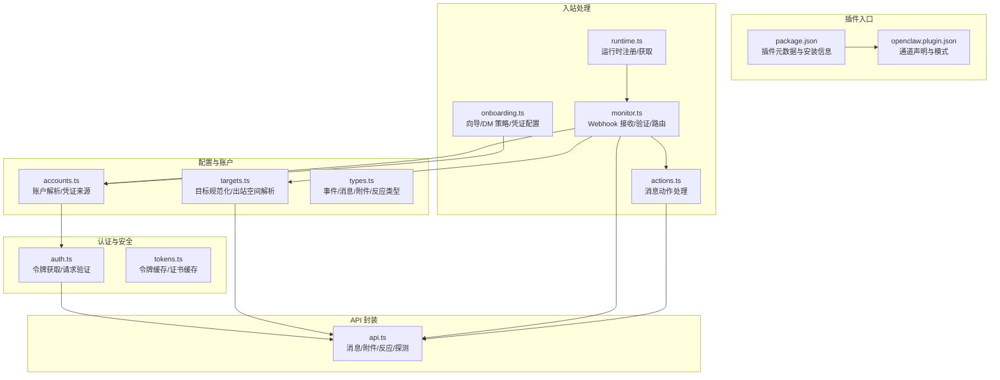
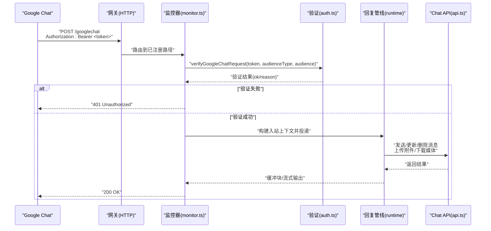
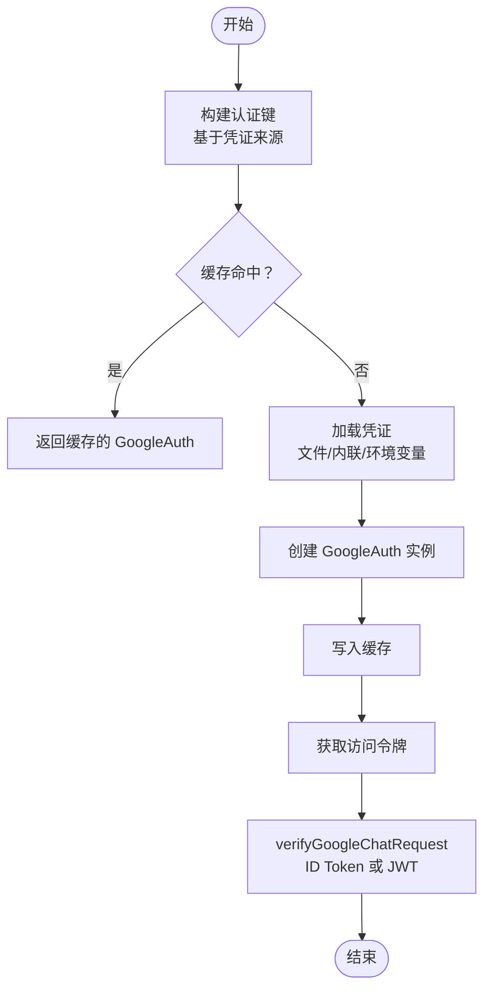
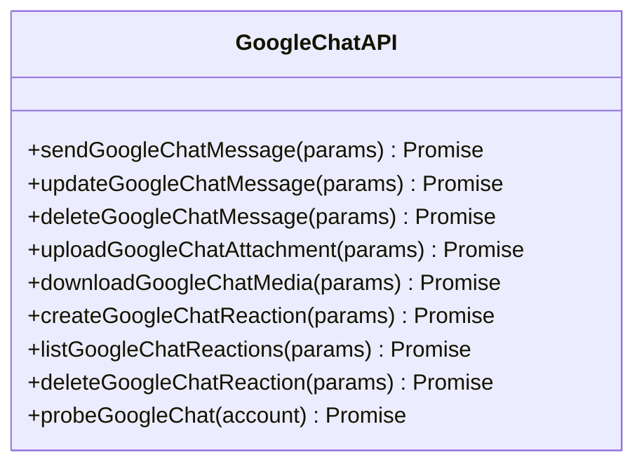
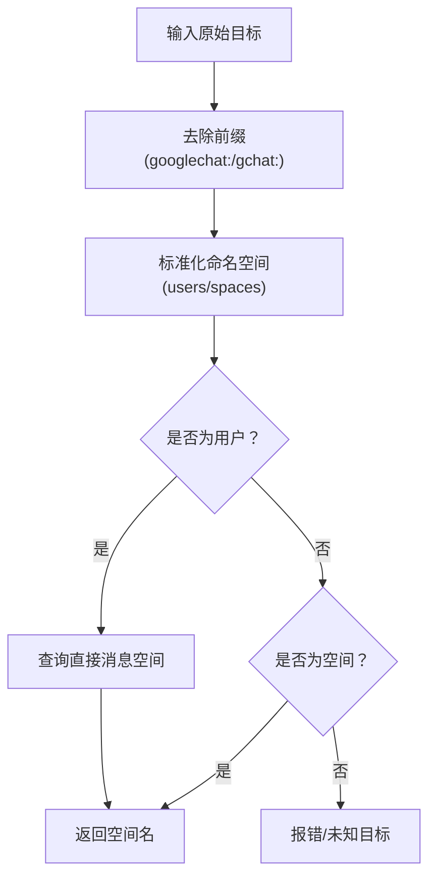
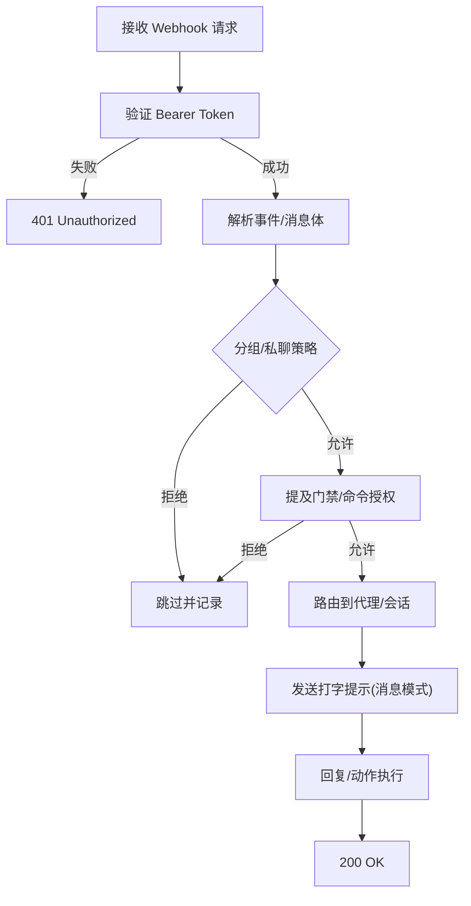
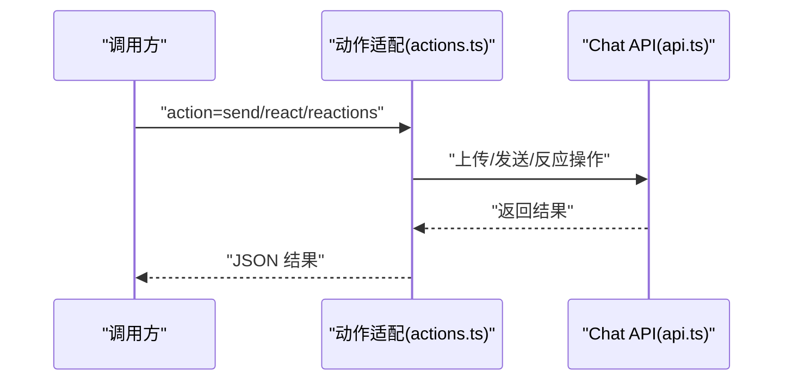
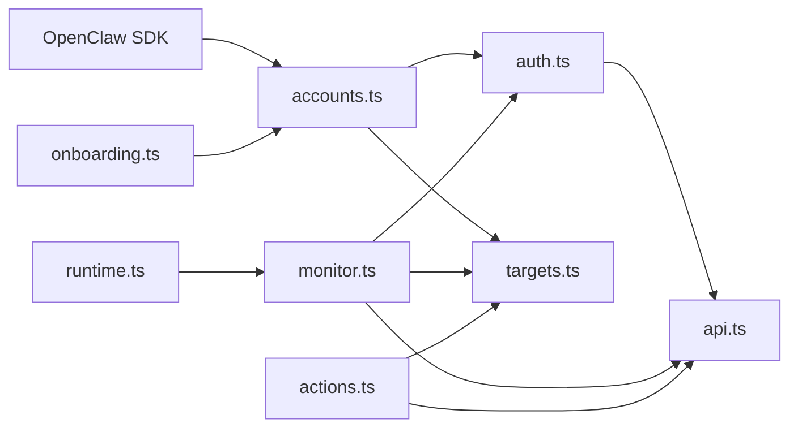

# Google Chat 渠道

## 目录
1. [简介](#简介)
2. [项目结构](#项目结构)
3. [核心组件](#核心组件)
4. [架构总览](#架构总览)
5. [详细组件分析](#详细组件分析)
6. [依赖关系分析](#依赖关系分析)
7. [性能考量](#性能考量)
8. [故障排查指南](#故障排查指南)
9. [结论](#结论)
10. [附录](#附录)

## 简介
本文件为 Google Chat 渠道插件的技术文档，面向在 Google Workspace 环境中集成 Google Chat（Chat API）的应用开发者与运维人员。内容涵盖服务账号认证、Webhook 验证、消息收发与媒体处理、空间消息与直接消息路由、机器人响应机制、用户与组织集成策略、配置示例与最佳实践，以及常见问题排查。

## 项目结构
Google Chat 渠道插件位于扩展目录中，采用模块化设计，核心由以下模块组成：
- 认证与令牌：负责服务账号加载、访问令牌获取与请求验证
- API 封装：封装 Chat API 的消息发送、更新、删除、附件上传、媒体下载、反应操作等
- 账户与目标解析：解析账户配置、规范化目标标识（用户/空间）、解析出站空间
- 入站监控：接收 Google Chat Webhook，校验来源，构建上下文并投递到回复管线
- 动作适配：支持 `reactions`/`reactions-list`/`send` 等动作
- 引导与配置：提供向导式配置、DM 策略、环境变量注入
- 运行时：插件运行时上下文的注册与获取

## 核心组件
- 认证与令牌
  - 支持从文件、内联 JSON 或环境变量加载服务账号
  - 自动缓存 GoogleAuth 实例与访问令牌
  - 支持两种 Webhook 验证方式：ID Token（audience 为 App URL）与 JWT 签名证书（audience 为项目号）
- API 封装
  - 消息发送、更新、删除
  - 附件上传（multipart）、媒体下载（带大小限制）
  - 反应创建/列出/删除
  - 基础连通性探测
- 账户与目标
  - 账户合并默认与账户级配置，解析凭证来源
  - 规范化用户/空间 ID，解析直接消息对应的空间名称
- 入站监控
  - 注册 Webhook 路径，接收 POST 请求，读取并校验 JSON 负载
  - 验证 Bearer Token（支持 Add-ons 场景的系统 ID Token）
  - 构建入站上下文，处理分组/私聊策略、提及门禁、会话键、媒体下载、打字提示
- 动作适配
  - 提供 `send`、`react`、`reactions` 等动作，支持线程回复与媒体附件
- 引导与配置
  - 向导式配置服务账号与 Webhook audience
  - DM 策略选择（开放/允许名单/配对），允许名单支持用户 ID 与邮箱
- 运行时
  - 插件运行时上下文注册与获取，用于媒体保存、会话记录、命令授权等

## 架构总览
下图展示了从 Google Chat 到 OpenClaw 插件的整体流程：Webhook 到达后进行来源验证，随后根据策略与会话键进入回复管线，最终通过 Chat API 发送响应或执行动作。

## 详细组件分析

### 组件一：认证与令牌（auth.ts）
- 服务账号作用域：chat.bot
- 令牌获取：按账户凭证来源（文件/内联/环境变量）构造 GoogleAuth，并获取访问令牌
- 请求验证：
  - App URL 模式：使用 OAuth2Client 验证 ID Token，校验签发者为系统服务账号或 Add-ons 服务账号
  - 项目号模式：拉取 Chat 证书并用 JWT 校验，audience 为项目号
- 缓存策略：认证实例与证书缓存，降低重复开销

### 组件二：API 封装（api.ts）
- 统一封装 Chat API 调用，自动附加 Bearer 令牌与 Content-Type
- 消息：发送、更新、删除
- 附件：multipart 上传、媒体下载（可限制最大字节）
- 反应：创建、列出、删除
- 探测：调用 spaces 列表以验证凭据与权限

### 组件三：账户与目标（accounts.ts、targets.ts）
- 账户解析：合并默认与账户级配置，解析凭证来源（文件/内联/环境变量/无）
- 目标规范化：支持 `googlechat:`/`gchat:` 前缀、`users`/`spaces` 命名空间、邮箱转 `users/`
- 出站空间解析：当目标为用户时，通过查找直接消息空间以获得实际空间名

### 组件四：入站监控与消息处理（monitor.ts）
- Webhook 注册与路由：按路径映射多个目标，支持多账户共存
- 请求读取与校验：限制负载大小、解析 JSON、兼容 Add-ons 的消息格式
- 来源验证：调用 `verifyGoogleChatRequest`，支持 App URL 与项目号两种 audience
- 策略与门禁：
  - 分组消息：支持 allowlist、requireMention、groupUsers 白名单
  - 私聊消息：支持 open/allowlist/pairing 策略，结合配对存储
  - 命令授权：可基于 access groups 与作者器判定
- 会话与上下文：构建会话键、格式化信封、记录会话元数据
- 打字提示：当前实现为消息模式（reaction 模式需用户 OAuth，不适用于服务账号）

### 组件五：消息动作（actions.ts）
- 支持动作：`send`（文本/媒体）、`react`（添加/移除）、`reactions`（列出）
- 附件处理：远程下载、上传、发送消息
- 权限控制：基于账户启用状态与凭证来源检查

### 组件六：引导与配置（onboarding.ts）
- 向导流程：选择凭证来源（文件/内联），配置 `audienceType` 与 `audience`，设置 DM 策略与允许名单
- 环境变量：支持默认账户使用 `GOOGLE_CHAT_SERVICE_ACCOUNT` 或 `GOOGLE_CHAT_SERVICE_ACCOUNT_FILE`
- 状态报告：检测是否已配置服务账号

### 组件七：运行时（runtime.ts）
- 插件运行时上下文注册与获取，供监控器与动作模块使用

## 依赖关系分析
- 外部依赖
  - google-auth-library：服务账号认证、ID Token 验证、JWT 证书校验
  - Node 内置 fetch：HTTP 请求封装
- 内部依赖
  - `accounts.ts` 与 `auth.ts` 协作提供令牌
  - `monitor.ts` 依赖 `accounts`/`targets`/`api`/`auth`
  - `actions.ts` 依赖 `api`/`targets`/`accounts`/`runtime`
  - `onboarding.ts` 依赖 `accounts` 与 SDK 工具

## 性能考量
- 令牌与证书缓存：减少重复认证与证书拉取开销
- 媒体下载限制：通过 `maxBytes` 控制内存占用，避免超大附件导致 OOM
- 分块与流式：文本分块与流式输出，提升长文本响应体验
- 并发与注册：Webhook 路径注册集中管理，避免重复监听

## 故障排查指南
- 405 Method Not Allowed
  - 检查通道配置是否存在、插件是否启用、网关是否重启
  - 使用状态命令确认运行状态
- 验证失败（401 Unauthorized）
  - 确认 `audienceType` 与 `audience` 设置正确
  - 对照 Chat 应用配置中的 Webhook URL 或项目号
- 无消息到达
  - 检查 Chat 应用的事件订阅与可见性设置
  - 使用日志跟踪入站请求
- 提及门禁导致未响应
  - 设置 `botUser` 为应用用户资源名，确保提及识别
- 媒体过大
  - 调整 `mediaMaxMb` 或优化附件尺寸
- 反应功能不可用
  - 当前服务账号模式不支持 reaction 打字提示；可改用消息模式或切换到用户 OAuth（不在本实现范围内）

## 结论
该插件完整实现了 Google Chat（Chat API）的 Webhook 接收、来源验证、消息路由与回复、媒体处理与动作执行能力。通过服务账号认证与严格的策略控制（分组/私聊、提及门禁、配对/白名单），在 Google Workspace 环境中提供了安全可控的消息通道。建议在生产环境中配合反向代理或隧道仅暴露 Webhook 路径，并合理配置 `audience` 与 DM 策略以满足合规与安全要求。

## 附录

### 配置示例与要点
- 服务账号凭证
  - 支持文件路径或内联 JSON 字符串
  - 默认账户可通过环境变量注入
- Webhook audience
  - `app-url`：使用 HTTPS Webhook URL
  - `project-number`：使用 Cloud 项目号
- DM 策略
  - `open`：任何人可发起私聊
  - `allowlist`：仅允许名单用户
  - `pairing`：首次私聊生成配对码，批准后方可通信
- 分组策略
  - `groupPolicy`：`disabled`/`allowlist`，默认 `allowlist`
  - `requireMention`：默认开启，可针对特定空间覆盖
  - `groupUsers`：限定可触发命令的用户列表
- 动作与打字提示
  - `actions.reactions`：启用 `reactions` 动作
  - `typingIndicator`：支持 `none`/`message`，默认 `message`（reaction 模式需用户 OAuth）

### Google Cloud Platform 使用指南与最佳实践
- 仅暴露 Webhook 路径
  - 推荐使用 Tailscale Funnel 仅对外暴露 `/googlechat`
  - 或使用反向代理仅转发 `/googlechat`
- 安全边界
  - Dashboard 与其他端点保持内网访问
  - `audience` 与 `audienceType` 必须与 Chat 应用配置一致
- 日志与可观测性
  - 使用日志跟踪入站请求与错误
  - 使用状态命令检查运行状态与探测结果