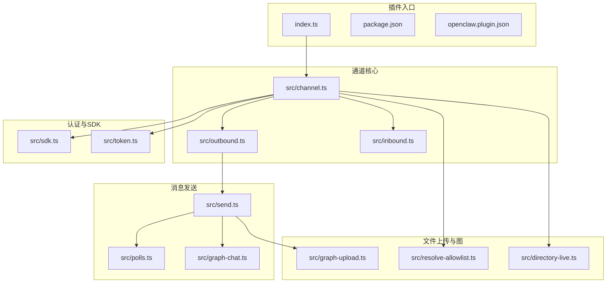
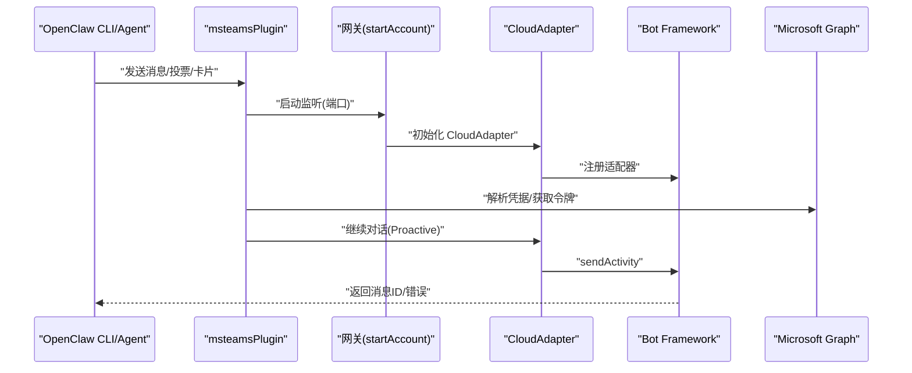
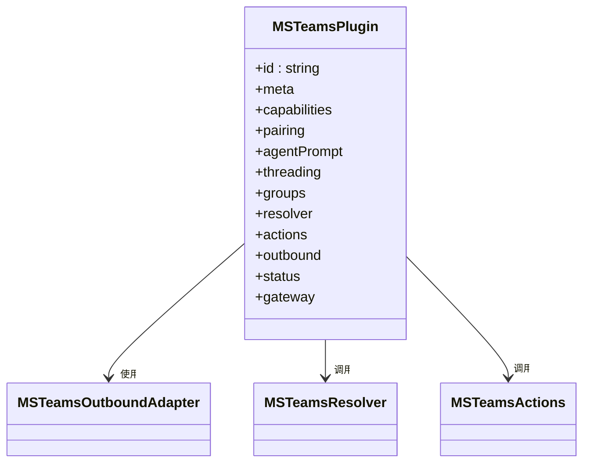
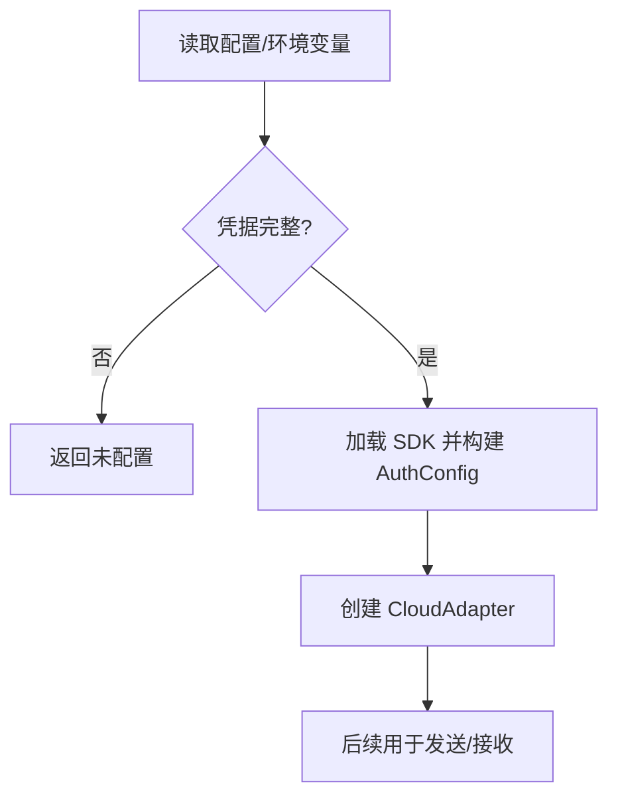
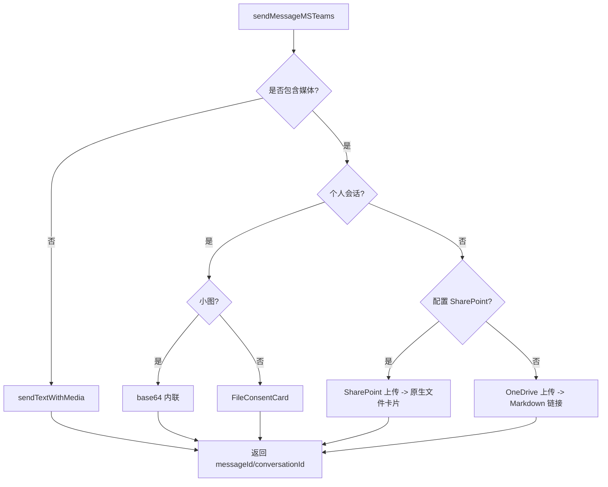
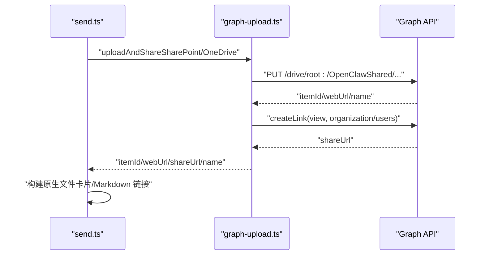
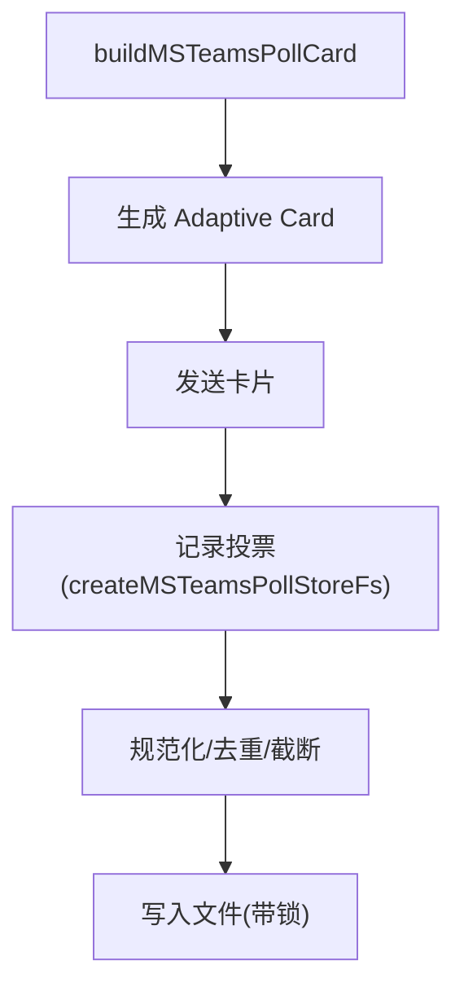
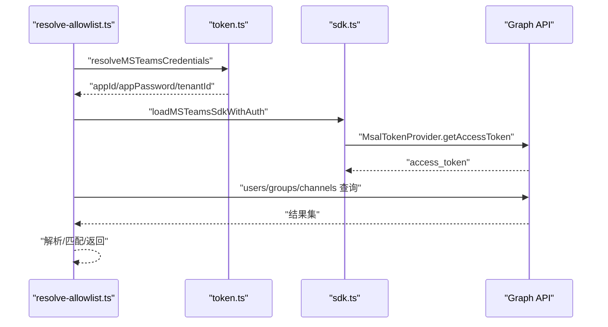
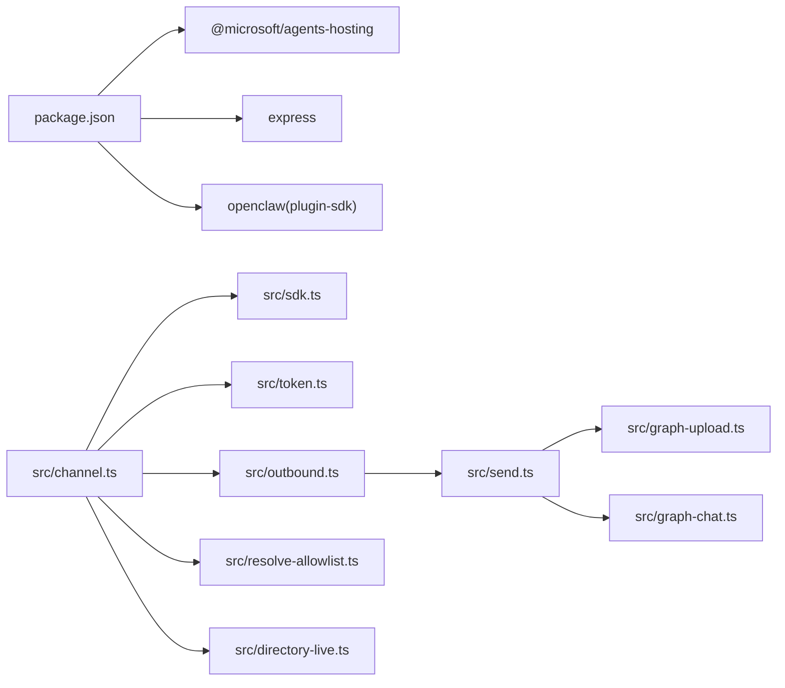

# Microsoft Teams 渠道

## 目录
1. [简介](#简介)
2. [项目结构](#项目结构)
3. [核心组件](#核心组件)
4. [架构总览](#架构总览)
5. [详细组件分析](#详细组件分析)
6. [依赖关系分析](#依赖关系分析)
7. [性能考量](#性能考量)
8. [故障排查指南](#故障排查指南)
9. [结论](#结论)
10. [附录：配置与使用](#附录配置与使用)

## 简介
本文件面向 Microsoft Teams 渠道插件的技术文档，系统性阐述其在 OpenClaw 平台中的实现与集成方式，重点覆盖以下方面：
- Microsoft Graph API 的集成与凭据解析
- 应用注册、OAuth 2.0 令牌获取与权限管理
- Teams 会议/聊天机器人能力与团队频道管理
- Microsoft 365 生态（用户身份与组织权限）集成
- 完整配置参数说明（应用 ID、密钥、租户、Webhook 端口等）
- Teams 开发者平台使用与调试技巧
- 常见问题定位与解决（认证错误、权限不足、消息发送失败）

## 项目结构
该插件位于 `extensions/msteams`，采用模块化设计，围绕“通道适配器 + 发送/接收 + 文件上传 + 图表卡片 + 投票存储 + 允许列表解析 + 目录查询”的职责划分组织代码。

## 核心组件
- 通道插件适配器：定义通道元数据、能力、安全策略、目录、目标解析、动作支持、状态探针与网关启动流程。
- 凭据解析与 SDK 构建：从配置或环境变量解析 `appId`/`appPassword`/`tenantId`，并基于 @microsoft/agents-hosting 构建 CloudAdapter。
- 出站消息适配器：统一文本/媒体/投票发送，按 Teams 限制进行分块与并发控制。
- 入站消息辅助：标准化 Teams 活动字段、提取消息 ID、识别提及与时间戳。
- 发送流程：根据会话类型选择直发或 FileConsentCard；个人会话小图走 base64；群组/频道优先 SharePoint 或 OneDrive 上传后生成原生文件卡片。
- 文件上传与分享：封装 OneDrive/SharePoint 上传、分享链接创建与 per-user 分享。
- 投票卡片：构建 Adaptive Card 投票，本地持久化投票记录。
- 允许列表解析与目录：通过 Microsoft Graph 解析用户/团队/频道 ID，支持 live 目录查询。
- 监控与运行时：网关启动监听 webhook 端口，状态快照与探测。

## 架构总览
下图展示从 OpenClaw 调用到 Teams Bot Framework 的端到端路径，以及与 Microsoft Graph 的交互。

## 详细组件分析

### 通道插件与能力矩阵
- 元信息与别名：通道标识、显示标签、文档路径、排序权重等。
- 能力：支持 direct/channel/thread、投票、媒体、线程。
- 安全：当 `groupPolicy="open"` 时给出风险提示，建议改为 allowlist 并限定 `allowFrom`。
- 目标解析：支持 `user:ID`、`conversation:ID`、团队/频道名称或 ID；自动去除前缀与空格。
- 动作：支持 send 卡片动作（`action=send`），要求提供目标与 card 参数。
- 状态：默认运行快照、探测器、账户快照构建。

### 凭据解析与 OAuth 2.0
- 凭据来源：优先从配置 `channels.msteams.appId`/`appPassword`/`tenantId`，其次从环境变量 `MSTEAMS_APP_ID`/`MSTEAMS_APP_PASSWORD`/`MSTEAMS_TENANT_ID`。
- SDK 构建：加载 @microsoft/agents-hosting，使用 MsalTokenProvider 获取 Graph 令牌。
- 适配器：基于 `clientId`/`clientSecret`/`tenantId` 创建 CloudAdapter。

### 出站消息与发送策略
- 文本分块：按 Markdown 表格模式与最大长度切分，避免超限。
- 媒体发送：
  - 个人会话小图片：base64 内联发送。
  - 个人会话大文件/非图片：发送 FileConsentCard 并返回 `uploadId`。
  - 群组/频道：优先 SharePoint（若配置站点 ID），否则 OneDrive；可生成原生文件卡片或 Markdown 链接。
- 投票：构建 Adaptive Card 投票并持久化记录。
- 错误分类与提示：对发送失败进行分类与格式化提示，便于排障。

### 文件上传与原生文件卡片
- OneDrive：上传到 `/OpenClawShared`，创建组织级分享链接。
- SharePoint：上传到 `/OpenClawShared`，支持 per-user 分享（需 `Chat.Read.All`）。
- 原生文件卡片：基于 driveItem 的 eTag 与 webDavUrl 构造 Teams 文件卡片附件。

### 投票功能与持久化
- 投票卡片：自动生成 `pollId`，支持单选/多选，含提示文案。
- 本地存储：JSON 文件锁保护，带 TTL 与容量裁剪。
- 选票提取：兼容多种嵌套结构，规范化索引映射。

### 允许列表解析与目录查询
- 用户解析：支持 UUID、邮箱或显示名搜索，Graph 查询并返回首个匹配。
- 团队/频道解析：支持 team 名称或 ID、channel 名称或 ID，Graph 查询并返回首个匹配。
- Live 目录：按查询关键字实时搜索用户与团队/频道，支持分页与前缀过滤。

### 入站消息与活动处理
- 提及检测：根据 `activity.entities` 中 mention 类型与被提及 ID 判断是否提及机器人。
- 时间戳解析：支持字符串/Date，校验有效性。
- 消息 ID 提取：从 activity 中解析 `messageId`。
- 会话 ID 规范化：去除多余参数，保留主 ID。

## 依赖关系分析
- 外部 SDK：@microsoft/agents-hosting、@microsoft/agents-hosting-express、@microsoft/agents-hosting-extensions-teams。
- 运行时：Express 作为 webhook 服务器，配合 CloudAdapter。
- 内部依赖：通道适配器依赖凭据解析、SDK 构建、发送模块、投票存储、目录查询与允许列表解析。

## 性能考量
- 发送重试与日志：发送流程内置重试回调与调试日志，便于定位网络抖动与速率限制。
- 文件大小与阈值：个人会话小图走 base64，大文件/非图片走 FileConsentCard；群组/频道优先 SharePoint/OneDrive，减少 Bot Framework 限制带来的失败率。
- 存储锁与裁剪：投票存储使用文件锁与 TTL/容量裁剪，避免无限增长。
- 目录查询：live 查询使用 `$top` 与 `ConsistencyLevel`，平衡准确性与延迟。

## 故障排查指南
- 认证错误
  - 症状：无法获取 Graph 令牌或发送失败。
  - 排查要点：确认 `appId`/`appPassword`/`tenantId` 配置正确且完整；检查环境变量是否一致；确认应用已在 Azure AD 注册并授予所需权限。
- 权限不足
  - 症状：目录查询/上传/分享失败。
  - 排查要点：确保应用具备 `Users.Read`、`Chats.Read`、`Sites.Read.All`、`Files.ReadWrite` 等必要权限；群组/频道 per-user 分享需 `Chat.Read.All`。
- 消息发送失败
  - 症状：文本/媒体/投票发送异常。
  - 排查要点：检查会话类型与阈值（个人会话 4MB、群组/频道 100MB）；确认 webhook 端口开放；查看错误分类与提示信息。
- 会话引用缺失
  - 症状：主动消息无法发送。
  - 排查要点：Bot 必须先收到一次消息才能建立 ConversationReference；检查会话存储与引用构建。

## 结论
该插件以 Bot Framework 为核心，结合 Microsoft Graph 实现了 Teams 的消息、媒体、投票与目录能力。通过严格的凭据解析、灵活的发送策略与完善的错误处理，满足企业级部署与运维需求。建议在生产中启用 allowlist、合理配置 SharePoint 站点与 per-user 分享，并持续监控状态与日志。

## 附录：配置与使用

### 配置参数说明
- 通道启用与禁用：`channels.msteams.enabled`（布尔，默认启用）
- 应用凭据：
  - `appId`：应用 ID（必填）
  - `appPassword`：应用密码（必填）
  - `tenantId`：租户 ID（必填）
- Webhook 端口：`channels.msteams.webhook.port`（默认 3978）
- 媒体大小限制：`channels.msteams.mediaMaxMb`（默认 100MB）
- 组策略与允许列表：
  - `channels.msteams.groupPolicy`：`"open"` 或 `"allowlist"`
  - `channels.msteams.allowFrom`：允许触发的用户/会话白名单
  - `channels.msteams.dms`：直接消息目标映射
  - `channels.msteams.teams`：团队/频道绑定映射
- 环境变量（等效于配置）：
  - `MSTEAMS_APP_ID`
  - `MSTEAMS_APP_PASSWORD`
  - `MSTEAMS_TENANT_ID`

### Teams 开发者平台与调试
- 应用注册：在 Azure AD 中创建应用，配置 Bot 与 API 权限，记录 `appId`/`appPassword`/`tenantId`。
- Webhook 地址：确保公网可达，端口与 `channels.msteams.webhook.port` 一致。
- 调试技巧：
  - 查看发送日志与重试事件
  - 使用 `listMSTeamsConversations` 检查会话引用
  - live 目录查询验证用户/团队/频道解析
  - 投票持久化文件位置与 TTL 清理