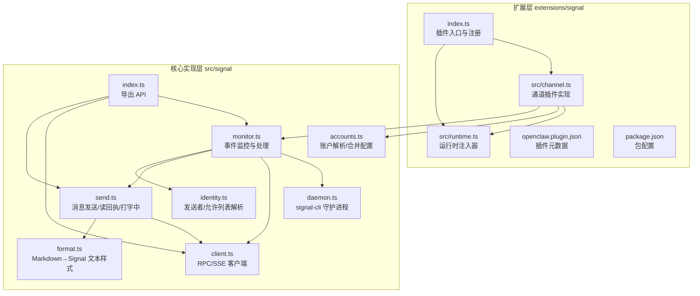
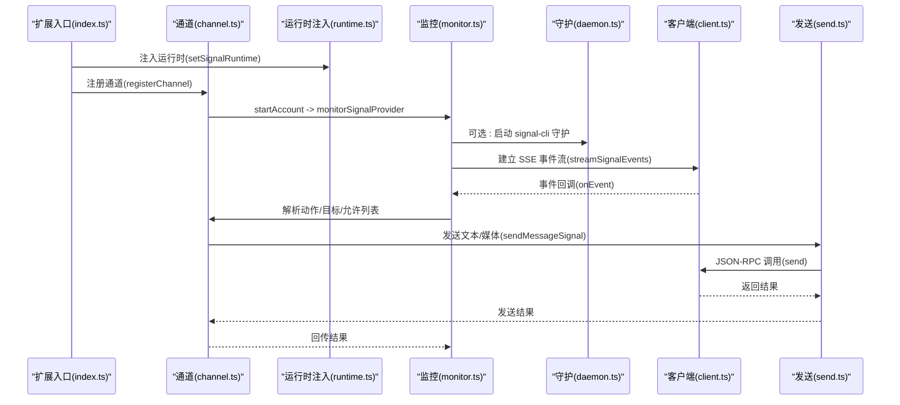
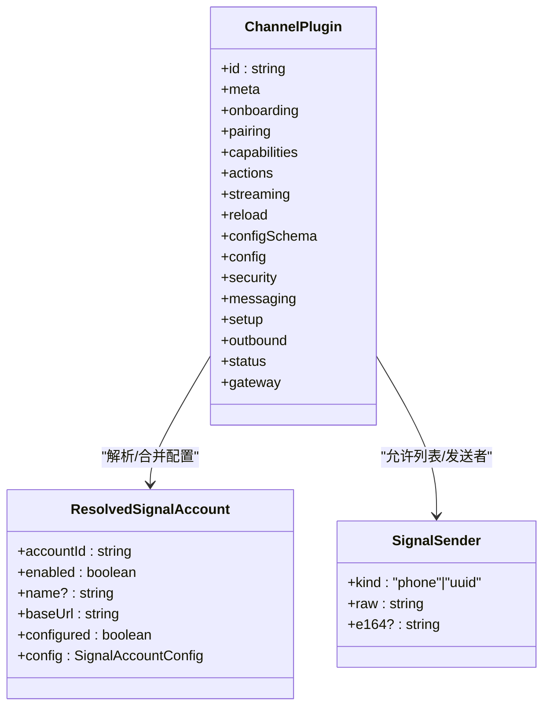
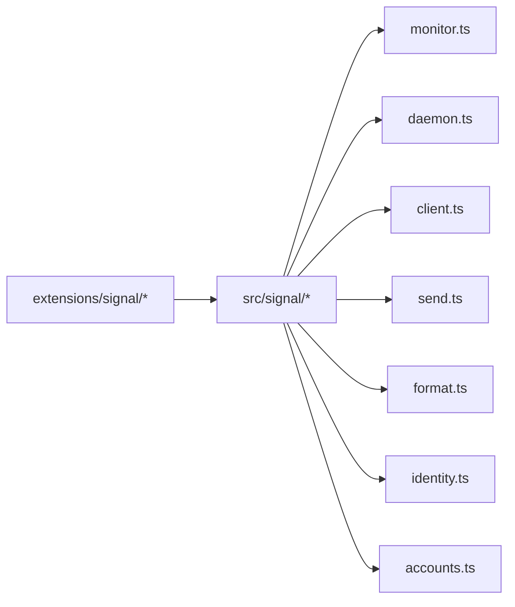

# Signal 渠道

## 目录
1. [简介](#简介)
2. [项目结构](#项目结构)
3. [核心组件](#核心组件)
4. [架构总览](#架构总览)
5. [详细组件分析](#详细组件分析)
6. [依赖关系分析](#依赖关系分析)
7. [性能考量](#性能考量)
8. [故障排查指南](#故障排查指南)
9. [结论](#结论)
10. [附录](#附录)

## 简介
本技术文档面向 Signal 渠道插件，系统性阐述其与 Signal Desktop API 的集成实现，覆盖本地进程管理（signal-cli 守护）、WebSocket 事件流（SSE）接入、消息同步与转发、消息格式转换与样式映射、联系人与允许列表校验、账户绑定与多账号支持、以及配置参数与安装部署要点。文档同时提供常见问题排查建议，帮助快速定位连接失败、消息延迟与认证异常等问题。

## 项目结构
Signal 渠道由两部分组成：
- 扩展层：定义插件入口、通道注册、运行时注入与配置模式，位于 `extensions/signal`。
- 核心实现层：封装与 Signal Desktop 的通信协议（RPC/SSE）、消息发送与接收处理、账户解析与本地守护进程管理，位于 `src/signal`。

## 核心组件
- 插件注册与运行时注入：通过扩展入口将运行时注入到通道模块，并注册 Signal 通道。
- 通道插件（ChannelPlugin）：定义 Signal 的元信息、配对流程、能力声明、消息动作适配、配置模式、安全策略、消息收发、状态采集与网关启动逻辑。
- 核心运行时（`monitorSignalProvider`）：负责启动/等待 signal-cli 守护、建立 SSE 事件流、事件分发与处理、消息投递与媒体拉取、读回执与“正在输入”等。
- RPC/SSE 客户端：封装 Signal Desktop 的 JSON-RPC 接口与 SSE 事件订阅，统一超时与错误处理。
- 发送器：支持文本与媒体发送、Markdown 到 Signal 文本样式的映射、分片发送与附件处理。
- 账户解析：合并全局与账户级配置，解析默认账户、基础 URL、启用状态与配置完整性。
- 身份与允许列表：解析发送者（手机号/UUID），校验允许列表与群组策略，支持反应通知策略。

## 架构总览
下图展示从插件注册到消息收发的端到端路径，包括本地守护进程、SSE 事件流与消息处理管线。

## 详细组件分析

### 插件注册与通道定义
- 插件 ID、名称、描述与空配置模式；注册通道并注入运行时。
- 通道插件暴露：
  - 元信息与配对流程（含批准提示消息）
  - 能力：支持直接消息与群组、媒体、反应
  - 消息动作适配器（可扩展）
  - 配置模式：构建 Signal 配置 Schema，支持账户级与全局配置合并
  - 安全策略：DM 策略、允许列表、组策略警告
  - 消息路由：目标标准化与解析
  - 设置：账户 ID 规范化、应用配置、默认启用
  - 出站：直连交付、文本分片、文本/媒体发送
  - 状态：默认运行态、问题收集、探活、快照构建
  - 网关：按账户启动监控

### 运行时注入与获取
- 单例运行时保存在扩展侧，通道插件通过运行时访问核心 Signal 能力（消息动作、文本分片、探活等）。

### RPC 与 SSE 客户端
- JSON-RPC 请求：构造请求体、超时控制、错误解析。
- SSE 事件流：按 `account` 参数订阅事件，逐行解析事件字段，回调上层处理。
- 健康检查：`/api/v1/check` 探测可用性。

### 本地守护进程管理（signal-cli）
- 支持指定账户、HTTP 监听地址与端口、接收模式、忽略附件/故事、发送已读回执等参数。
- 子进程日志分级输出（区分普通与错误日志），异常捕获与停止信号处理。

### 消息发送与格式化
- 目标解析：支持 `phone`/`group`/`username` 三种形式，带前缀兼容。
- 文本样式：Markdown→Signal 文本样式映射，支持粗体、斜体、删除线、等宽、剧透；自动合并重叠样式并裁剪越界范围。
- 附件处理：下载/保存媒体，按最大字节限制拒绝过大附件；仅附件时自动生成占位文本。
- 分片发送：按配置的文本块大小与分片模式进行拆分，优先按换行或长度。
- 读回执与“正在输入”：支持按会话目标发送回执与停止“正在输入”。

### 事件监控与消息同步
- 启动流程：根据 `autoStart`/`autoDetect` 决定是否启动守护；等待服务就绪；建立 SSE 事件流。
- 事件处理：解析附件、构建历史上下文、分发回复、反应通知、读回执策略、忽略附件/故事等。
- 多账户与策略：合并全局与账户级配置，支持 DM 策略、允许列表、组策略、反应通知模式与白名单。

### 账户解析与配置合并
- 默认账户 ID、账户列表、默认账户解析。
- 合并策略：全局 `channels.signal` 基础配置与账户级 `accounts[accountId]` 覆盖项。
- 基础 URL 解析：`httpUrl` 优先，否则由 `httpHost`/`httpPort` 组合；未配置则视为未配置。

### 身份与允许列表
- 发送者解析：手机号（归一化 E.164）与 UUID 两种来源。
- 允许条目：支持通配符、手机号（前缀 `signal:` 可省略）、UUID（含短横线与紧凑格式）。
- 群组策略：`disabled`/`open`/`allowlist` 三态，结合 `allowFrom` 决策。

### 类关系图（代码级）

## 依赖关系分析
- 扩展层依赖核心层导出的 `monitor`、`probe`、`send`、反应发送等 API。
- 通道插件通过运行时访问核心能力，避免循环初始化。
- 核心层内部模块解耦：`monitor` 作为编排者，`daemon`/`client`/`send`/`format`/`identity` 独立职责清晰。

## 性能考量
- 文本分片与样式映射：在发送前完成 Markdown→Signal 文本样式转换与分片，减少往返与重复计算。
- 附件处理：先下载/保存再上传，避免大对象在内存驻留；按最大字节限制拒绝超限附件。
- SSE 流式处理：逐行解析事件，及时回调处理，降低延迟。
- 守护进程日志分级：仅输出必要日志，避免阻塞事件处理。
- 读回执策略：可选择通过守护或 RPC 发送，按需权衡实时性与资源占用。

## 故障排查指南
- 连接失败
  - 检查 Signal Desktop 是否可达（`/api/v1/check`），确认 `baseUrl` 正确。
  - 若使用 `autoStart`，确认 `signal-cli` 可执行路径与监听地址/端口无冲突。
  - 查看守护进程日志（stderr/stdout 分类输出）。
- 消息延迟
  - 关注 SSE 事件流是否稳定，确认网络与代理设置。
  - 检查文本分片与媒体分发策略，避免过长文本导致多次往返。
- 账户认证问题
  - 确认账户号/UUID 与 `allowFrom` 条目一致（支持 `signal:` 前缀与 UUID 格式）。
  - 若组策略为 `open`，注意潜在的安全风险，建议改为 `allowlist` 并配置 `allowFrom`。
- 媒体发送失败
  - 确认媒体大小不超过配置的 `mediaMaxMb` 限制。
  - 检查 MIME 类型与附件下载/保存流程。

## 结论
Signal 渠道插件通过清晰的扩展层与核心实现层分工，实现了对 Signal Desktop 的完整集成：本地守护进程管理、SSE 事件流、消息格式转换与分发、安全策略与允许列表、多账户支持与状态监控。该设计既保证了可维护性，也为后续功能扩展（如更多消息动作、更细粒度的通知策略）提供了良好基础。

## 附录

### 安装与配置指南
- 安装 `signal-cli` 并确保可执行路径可用（可通过配置项指定）。
- 在配置中设置账户号（手机号或 UUID）、HTTP 监听地址与端口，或提供 `httpUrl`。
- 如需自动启动守护进程，设置 `autoStart`；否则需自行启动 Signal Desktop。
- 配置 `allowFrom` 与 `groupAllowFrom`，结合 `dmPolicy` 与 `groupPolicy` 控制消息来源与群组策略。

### 配置参数说明（关键项）
- 账户配置
  - `account`：账户号（手机号或 UUID）
  - `httpUrl`/`httpHost`/`httpPort`：基础 URL 或主机/端口组合
  - `cliPath`：`signal-cli` 可执行路径
  - `autoStart`：是否自动启动守护
- 安全与策略
  - `dmPolicy`：私聊策略（如 `pairing`）
  - `allowFrom`/`groupAllowFrom`：允许来源列表（支持通配符与 `signal:` 前缀）
  - `groupPolicy`：群组策略（`disabled`/`open`/`allowlist`）
  - `reactionNotifications`/`reactionAllowlist`：反应通知模式与白名单
- 媒体与传输
  - `mediaMaxMb`：媒体大小上限（MB）
  - `ignoreAttachments`/`ignoreStories`：忽略附件/动态
  - `sendReadReceipts`：是否发送已读回执
- 文本与分片
  - 文本样式：Markdown→Signal 样式映射
  - `textChunkLimit`/`chunkMode`：文本分片限制与模式