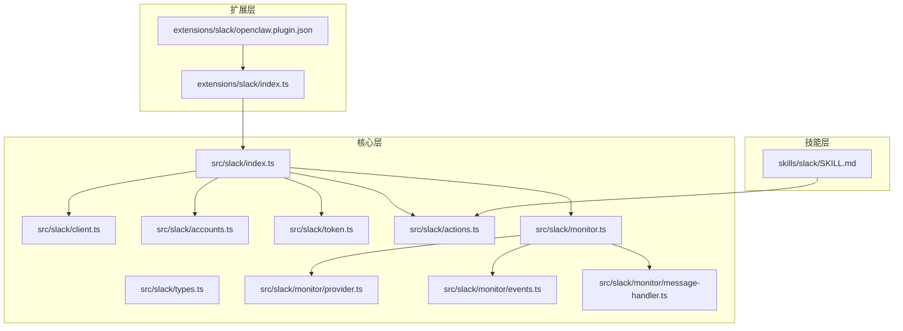

# Slack 渠道

## 目录
1. [简介](#简介)
2. [项目结构](#项目结构)
3. [核心组件](#核心组件)
4. [架构总览](#架构总览)
5. [详细组件分析](#详细组件分析)
6. [依赖关系分析](#依赖关系分析)
7. [性能考量](#性能考量)
8. [故障排查指南](#故障排查指南)
9. [结论](#结论)
10. [附录](#附录)

## 简介
本技术文档面向 Slack 渠道插件与 Slack 集成能力，围绕 OpenClaw 体系中的 Slack 支撑模块进行系统性说明。内容涵盖：
- Slack Bolt 框架集成：Socket Mode 与 HTTP（Webhook）两种模式的启动与事件监听
- OAuth 与令牌管理：Bot Token、App Token、用户 Token 的解析与校验
- 事件处理机制：消息、反应、成员、频道、钉 PIN 等事件的注册与分发
- Slack 特有能力：频道管理、用户权限系统、文件上传处理、线程与回复策略
- 配置示例：工作区绑定、应用权限、消息格式化与去重策略
- 最佳实践与性能优化：重试策略、入站去重、线程解析、令牌安全
- 常见问题排查：认证失败、事件丢失、消息格式问题

## 项目结构
与 Slack 渠道相关的关键位置如下：
- 扩展层（Extension）：定义插件入口与通道注册
- 核心层（Core）：Slack 客户端、账户与令牌解析、动作接口、监控器与事件处理
- 技能层（Skill）：对外暴露的工具与操作清单，用于在会话中调用 Slack 能力

## 核心组件
- 插件入口与注册
  - 扩展插件通过入口文件注册 Slack 渠道，并注入运行时环境
- Slack 动作接口
  - 提供反应、消息发送/编辑/删除、读取历史、成员信息、表情包列表、钉 PIN 等能力
- Slack 监控器（Bolt）
  - 支持 Socket Mode 与 HTTP（Webhook）两种模式；负责事件注册、消息处理、线程解析、入站去重等
- Slack 类型与客户端
  - 定义 Slack 事件类型、Web API 客户端默认重试策略与构造函数
- 账户与令牌
  - 解析账户、合并配置、解析 Bot/App/User Token，并标注来源

## 架构总览
下图展示 Slack 渠道在 OpenClaw 中的整体架构：扩展层负责注册与运行时注入，核心层承载 Bolt 监控器、事件处理与动作接口，技能层提供对外工具。

## 详细组件分析

### 组件一：Slack Bolt 监控器（Socket Mode 与 HTTP）
- 模式选择与启动
  - Socket Mode：使用 Bot Token 与 App Token 启动，自动连接并监听事件
  - HTTP（Webhook）：使用签名密钥与 Webhook 路径，注册 HTTP 处理器
- 令牌与鉴权
  - 解析 Bot Token 与 App Token；若不满足要求则抛出错误
  - 可选用户 Token 用于解析频道/用户映射
- 事件注册
  - 注册消息、反应、成员、频道、钉 PIN 等事件处理器
- 入站消息处理
  - 线程 TS 解析、入站去重、控制命令识别、上下文准备与派发
- 频道与用户映射解析
  - 将配置中的频道/用户别名解析为真实 ID，并输出映射摘要

### 组件二：Slack 动作接口（消息、反应、钉 PIN、成员信息）
- 能力清单
  - 发送/编辑/删除消息、读取历史、反应/移除反应/列出反应、钉 PIN/取消钉 PIN/列出钉住项、成员信息、自定义表情包列表
- 客户端与令牌
  - 自动解析 Bot Token，支持显式传入或按账户配置解析
  - 默认启用重试策略，避免瞬时网络波动导致失败
- 线程与媒体
  - 支持在指定 `thread_ts` 下发送/读取
  - 支持媒体 URL 传递（由上层调用）

### 组件三：账户与令牌解析
- 账户解析
  - 合并全局与账户级配置，支持多账户并存
  - 标注 Bot Token 与 App Token 来源（环境变量/配置）
- 令牌解析
  - 规范化输入，支持空值处理
- 默认账户与启用状态
  - 若未配置账户，默认启用默认账户
  - 账户级 enabled 字段可覆盖全局开关

### 组件四：类型与客户端
- Slack 事件类型
  - 定义消息事件与 @ 提及事件的数据结构，便于统一处理
- WebClient 默认重试
  - 在无显式重试配置时，采用指数退避与随机抖动的重试策略，提升稳定性

### 组件五：扩展插件与技能工具
- 扩展插件
  - 注册 Slack 渠道，注入运行时并导出插件对象
- 插件元数据
  - 插件 ID、通道类型、配置模式等
- 技能工具
  - 对外提供反应、消息、钉 PIN、成员信息、表情包等操作清单与输入规范

## 依赖关系分析
- 组件耦合
  - 扩展插件仅负责注册与运行时注入，核心逻辑集中在 Slack 核心模块
  - 监控器通过事件注册与消息处理器解耦具体业务
- 外部依赖
  - Slack Bolt（@slack/bolt）：Socket Mode 与 HTTP 接收器
  - @slack/web-api：WebClient 与 API 调用
- 关键依赖链
  - monitor/provider.ts -> monitor/events.ts -> monitor/message-handler.ts -> actions.ts
  - accounts.ts 与 token.ts 为上游配置与令牌解析提供基础

## 性能考量
- 重试策略
  - WebClient 默认启用重试，减少瞬时失败对业务的影响
- 入站消息去重
  - 基于发送者、频道、线程与时间戳的复合键进行去重，降低重复处理成本
- 线程解析与批量合并
  - 将同一线程内的多条消息合并后一次性处理，减少上下文准备与派发次数
- 令牌与鉴权缓存
  - 启动阶段进行鉴权测试与 API App ID 校验，避免后续运行期反复校验

## 故障排查指南
- 认证失败
  - 症状：启动时报缺少 Bot Token/App Token，或鉴权测试失败
  - 排查要点：
    - Socket Mode：确认 Bot Token 与 App Token 均已配置且有效
    - HTTP 模式：确认签名密钥与 Webhook 路径正确
- 事件丢失
  - 症状：消息未被处理或处理延迟
  - 排查要点：
    - 检查入站去重策略是否误判（文本为空、非允许 subtype）
    - 确认线程 TS 解析是否正确
- 消息格式问题
  - 症状：Markdown/链接渲染异常或附件显示不完整
  - 排查要点：
    - 确认发送内容符合 Slack 文本规范
    - 对于媒体，确保 URL 可访问且大小未超过限制
- 令牌不匹配
  - 症状：日志提示 Bot Token 与 App Token 的 api_app_id 不一致
  - 排查要点：
    - 确保 Bot Token 与 App Token 属于同一 Slack 应用

## 结论
本插件以 Slack Bolt 为核心，结合账户与令牌解析、事件注册与消息处理器，提供了稳定可靠的 Slack 渠道接入能力。通过默认重试、入站去重与线程解析等机制，兼顾了可用性与性能。配合技能工具与配置示例，开发者可快速完成工作区绑定、权限控制与消息处理的落地实施。

## 附录

### 配置示例与最佳实践
- 工作区绑定与应用权限
  - Socket Mode：配置 Bot Token 与 App Token；HTTP 模式：配置签名密钥与 Webhook 路径
- 频道与用户权限
  - 使用 allowlist 与用户映射解析，支持通配符与归档频道识别
- 消息格式化与线程策略
  - 控制命令识别、线程历史范围、继承父消息属性等
- 文件上传处理
  - 通过媒体 URL 传递与大小限制控制，避免超大文件阻塞

### Slack Bolt 集成要点
- Socket Mode 与 HTTP 的选择
  - Socket Mode：适合长期在线、低延迟场景
  - HTTP：适合 Webhook 回推、部署灵活场景
- 事件订阅与权限范围
  - 根据需要开启消息、反应、成员、频道、钉 PIN 等事件订阅